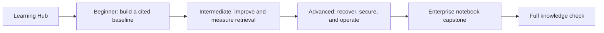

# Course map and repository guide

This file is the canonical map for the repository. The [RAG Learning Hub](https://mahsa-teimourikia.github.io/awsome-rag/) is the best visual entry point; this page is the equivalent route for learners who prefer GitHub and local notebooks.

## The learning flow



Every lesson follows the same loop: **Learn** the concept and trade-offs → **Lab** the notebook and reusable Python → **Checkpoint** with questions and a testable reflection.

## Canonical source of truth

| Learning asset | Canonical location | Purpose |
| --- | --- | --- |
| Structured lesson map | [`LEARNING.md`](LEARNING.md) | Short GitHub-native sequence through all levels |
| Module theory and exercises | [`curriculum/`](curriculum/) | One README per lesson, linked to its notebook and implementation |
| Scenario-first labs | [`notebooks/enterprise/`](notebooks/enterprise/) | Eleven connected NovaTech labs from retrieval to multimodal, secure, production-ready RAG |
| Harborline Support beginner labs | [`notebooks/beginner/`](notebooks/beginner/) | Three connected, self-contained labs for inspectable retrieval, chunking decisions, citations, and abstention |
| Reusable implementations | [`examples/`](examples/) | Credential-free Python modules used by curriculum lessons |
| Enterprise lab library | [`src/enterprise_rag/`](src/enterprise_rag/) | Shared corpus, retrieval, evaluation, and production helpers |
| Evaluation investigation track | [`notebooks/evaluation/`](notebooks/evaluation/) | Twelve Northstar Insurance notebooks that evaluate PolicyAssist from data to production release |
| Adaptive retrieval track | [`notebooks/adaptive-rag/`](notebooks/adaptive-rag/) | Six Northstar Insurance notebooks from retrieval gates to corrective, production-ready routing |
| Design references | [`docs/`](docs/) | What RAG is, technology choices, patterns, evaluation, and templates |
| Interactive assessment | [`quiz/`](quiz/) | Full browser-based knowledge check, published under `/quiz/` |
| Scenario data | [`data/`](data/) | Small deterministic corpus fixtures and labeled evaluation questions |

The Hub registry in [`app/page.tsx`](app/page.tsx) is a navigation index, not a second copy of the curriculum. When adding a lesson, update its module README first, then add the same links and short summary to the registry.

## Paths by level

### Beginner — build one trustworthy assistant

1. [RAG foundations](curriculum/beginner/01-rag-foundations/README.md)
2. [First local baseline](curriculum/beginner/02-first-local-rag/README.md)
3. [Chunking lab](curriculum/beginner/03-chunking-lab/README.md)
4. [Citations and abstention](curriculum/beginner/04-citations-abstention/README.md)
5. [Documentation assistant capstone](use-cases/documentation-assistant/README.md)

Start the practical sequence with the [Harborline Support beginner notebook track](notebooks/README.md#harborline-support--beginner-notebook-track). The three notebooks share a corpus and move from transparent retrieval to chunk-boundary experiments to evidence policy; the documentation assistant is the follow-on capstone.

### Intermediate — improve and measure retrieval

1. [Retrieval strategies](curriculum/intermediate/01-retrieval-strategies/README.md)
2. [Metadata and permissions](curriculum/intermediate/02-metadata-permissions/README.md)
3. [Query rewriting and reranking](curriculum/intermediate/03-query-reranking/README.md)
4. [Evaluation lab](curriculum/intermediate/04-evaluation/README.md)
5. [Research synthesis](curriculum/intermediate/05-research-synthesis/README.md)
6. [Qdrant local](curriculum/intermediate/06-qdrant-local/README.md)
7. [Customer-support use case](use-cases/customer-support/README.md)

### Advanced — design for recovery and operations

1. [Corrective RAG](curriculum/advanced/01-corrective-rag/README.md)
2. [GraphRAG](curriculum/advanced/02-graphrag/README.md)
3. [Agentic RAG](curriculum/advanced/03-agentic-rag/README.md)
4. [Structured and multimodal RAG](curriculum/advanced/04-structured-multimodal/README.md)
5. [Production operations](curriculum/advanced/05-production-operations/README.md)

## The connected scenario track

Use the Enterprise track when you want one business problem to evolve across all labs. The notebooks are the reference for both theory and practice; the Python modules and data are supporting implementation, not prerequisite reading.

| Notebook | Decision taught | Reusable code |
| --- | --- | --- |
| [01](notebooks/enterprise/01_rag_from_scratch.ipynb) | Baseline retrieval, citations, abstention | `src/enterprise_rag/corpus.py` |
| [02](notebooks/enterprise/02_parsing_chunking_context.ipynb) | Parsing, chunk boundaries, context budgets | `src/enterprise_rag/corpus.py` |
| [03](notebooks/enterprise/03_dense_sparse_hybrid.ipynb) | Sparse, dense, and hybrid retrieval | `src/enterprise_rag/retrieval.py` |
| [04](notebooks/enterprise/04_reranking_evidence_selection.ipynb) | Candidate breadth versus evidence precision | `src/enterprise_rag/retrieval.py` |
| [05](notebooks/enterprise/05_query_transformation.ipynb) | Rewriting and decomposition without intent drift | `src/enterprise_rag/advanced.py` |
| [06](notebooks/enterprise/06_graphrag_multihop.ipynb) | Relationship-aware multi-hop retrieval | `src/enterprise_rag/advanced.py` |
| [07](notebooks/enterprise/07_rag_evaluation.ipynb) | Retrieval, grounding, and regression metrics | `src/enterprise_rag/evaluation.py` |
| [08](notebooks/enterprise/08_adaptive_corrective_agentic_rag.ipynb) | Bounded recovery and abstention | `src/enterprise_rag/advanced.py` |
| [09](notebooks/enterprise/09_production_capstone.ipynb) | Freshness, authorization, observability, cost, rollback | `src/enterprise_rag/lab_experiments.py` |
| [10](notebooks/enterprise/10_multimodal_evidence.ipynb) | Typed table aggregates, OCR confidence, visual locators, modality-specific citations | `examples/advanced/structured_rag.py` |
| [11](notebooks/enterprise/11_security_authorization.ipynb) | Pre-retrieval tenant isolation, prompt-injection quarantine, untrusted context, safe abstention | `src/rag_core/security_rag.py` |

## Production RAG Evaluation Lab

The [PolicyAssist RAG Evaluation Lab](notebooks/evaluation/README.md) is a second scenario-first track for learners who want to specialize in evaluation. Start with the [evaluation theory guide](docs/evaluation.md), then investigate one intentionally flawed insurance-policy assistant across dataset design, retrieval, reranking/context, grounded generation, citations, judge calibration, robustness, security, architecture comparison, production tracing, and a release-review capstone.

## Adaptive RAG Lab

The [Adaptive RAG Lab](notebooks/adaptive-rag/README.md) is the bridge from advanced retrieval to agentic RAG. Read the [Adaptive RAG guide](docs/adaptive-rag.md), then build and evaluate retrieval gates, routing, transformations, source selection, adaptive depth, corrective loops, and the production policy boundary using transparent deterministic Python.

## Local workflow

```bash
python -m venv .venv
source .venv/bin/activate
pip install -e '.[dev]'
export PYTHONPATH=.
pytest -q
jupyter lab
```

Open notebooks from the repository root so relative data paths work. The examples are deterministic and do not require API keys. Optional provider integrations belong behind adapters and should document credentials, budgets, and side-effect boundaries.

For the Hub and quiz, run `npm ci && npm run check:pages-links && npm run test:pages`. The deployment workflow publishes the Vite Hub and copies `quiz/` into the `/quiz/` artifact.

For a complete local setup, including `make` targets, Jupyter, Windows commands, optional infrastructure, and the CI-equivalent notebook check, read [local installation and development](docs/local-development.md).

## How to contribute a lesson

1. Add or update the module README and notebook together.
2. Keep theory, diagrams, runnable code, a deliberate failure, an experiment, references, and checkpoint tasks in the notebook.
3. Put reusable code in `examples/` or `src/enterprise_rag/`; do not hide the only implementation in a notebook cell.
4. Add tests for the deterministic behavior and register the lesson in `app/page.tsx`.
5. Run the Python, kernel-based deterministic-notebook execution, notebook JSON, link, quiz, and Pages smoke checks before opening a PR. CI executes the scenario-first tracks with `scripts/execute-notebooks.py`; optional-infrastructure notebooks remain covered by JSON and compile validation.
