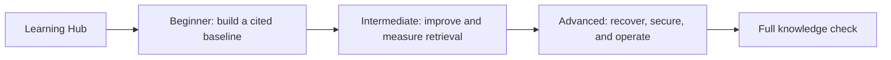

# Course map and repository guide

This file is the canonical map for the repository. The [RAG Learning Hub](https://mahsa-teimourikia.github.io/awsome-rag/) is the best visual entry point; this page is the equivalent route for learners who prefer GitHub and local notebooks.

## The learning flow



Every lesson follows the same loop: **Learn** the concept and trade-offs → **Lab** the notebook and reusable Python → **Checkpoint** with questions and a testable reflection.

## Canonical source of truth

| Learning asset | Canonical location | Purpose |
| --- | --- | --- |
| Structured lesson map | [`LEARNING.md`](LEARNING.md) | Short GitHub-native sequence through all levels |
| Beginner track | [`curriculum/beginner/`](curriculum/beginner/) | Build a baseline with transparent retrieval, citations, and abstention |
| Intermediate track | [`curriculum/intermediate/`](curriculum/intermediate/) | Improve retrieval, evaluate quality, and enforce metadata permissions |
| Advanced track | [`curriculum/advanced/`](curriculum/advanced/) | Build resilient, agentic systems with tools, routing, and operations |
| Interactive assessment | [`quiz/`](quiz/) | Full browser-based knowledge check, published under `/quiz/` |
| Web application | [`app/`](app/) | Next.js source code for the Learning Hub |

The Hub registry in [`app/page.tsx`](app/page.tsx) is a navigation index, not a second copy of the curriculum. When adding a lesson, update its module README first, then add the same links and short summary to the registry.

## Paths by level

### Beginner — build one trustworthy assistant

1. [RAG foundations](curriculum/beginner/01-rag-foundations/README.md)
2. [First local baseline](curriculum/beginner/02-first-local-rag/README.md)
3. [Chunking lab](curriculum/beginner/03-chunking-lab/README.md)
4. [Citations and abstention](curriculum/beginner/04-citations-abstention/README.md)

### Intermediate — improve and measure retrieval

1. [Retrieval strategies](curriculum/intermediate/01-retrieval-strategies/README.md)
2. [Metadata and permissions](curriculum/intermediate/02-metadata-permissions/README.md)
3. [Query rewriting and reranking](curriculum/intermediate/03-query-reranking/README.md)
4. [Evaluation lab](curriculum/intermediate/04-evaluation/README.md)
5. [Research synthesis](curriculum/intermediate/05-research-synthesis/README.md)
6. [Qdrant local](curriculum/intermediate/06-qdrant-local/README.md)

### Advanced — design for recovery and operations

1. [Corrective RAG](curriculum/advanced/01-corrective-rag/README.md)
2. [GraphRAG](curriculum/advanced/02-graphrag/README.md)
3. [Agentic RAG](curriculum/advanced/03-agentic-rag/README.md)
4. [Structured and multimodal RAG](curriculum/advanced/04-structured-multimodal/README.md)
5. [Adaptive RAG](curriculum/advanced/05-adaptive-rag/README.md)
6. [Production operations](curriculum/advanced/06-production-operations/README.md)

## Local workflow

```bash
python -m venv .venv
source .venv/bin/activate
pip install -e '.[dev]'
export PYTHONPATH=.
jupyter lab
```

Open notebooks from the repository root so relative data paths work. The examples are deterministic and do not require API keys. Optional provider integrations belong behind adapters and should document credentials, budgets, and side-effect boundaries.

For the Hub and quiz, run `npm ci && npm run build:pages && npm run check:pages-links`. The deployment workflow publishes the Vite Hub and copies `quiz/` into the `/quiz/` artifact.

For a complete local setup, including Jupyter, Windows commands, optional infrastructure, and the CI-equivalent notebook check, read the Local installation guide at the bottom of the [README.md](README.md).

## How to contribute a lesson

1. Add or update the module README and notebook together in the relevant `curriculum/` tier folder.
2. Keep theory, diagrams, runnable code, a deliberate failure, an experiment, references, and checkpoint tasks in the notebook or accompanying Python scripts.
3. Put reusable code in the same folder as the lesson; do not hide the only implementation in a notebook cell.
4. Add tests for the deterministic behavior and register the lesson in `app/page.tsx` and `quiz/`.
5. Run the Python, kernel-based deterministic-notebook execution, link, quiz, and Pages smoke checks before opening a PR.
