# ✨ Awesome RAG (Retrieval-Augmented Generation) ✨

> A curated, practical guide to learning, building, evaluating, and operating Retrieval-Augmented Generation (RAG) systems.

[](https://awesome.re) [](LICENSE) [](CONTRIBUTING.md)

RAG connects a language model to external knowledge at answer time: retrieve relevant evidence, then generate an answer grounded in that evidence. It is a strong fit when knowledge changes, must be private, needs citations, or is too specialized to assume the model knows it.

This collection emphasizes primary sources, maintained open-source projects, and resources that explain *why* a technique works—not just copy-paste demos.

Open the repository in GitHub Codespaces or use the included [dev container](.devcontainer/devcontainer.json) for a consistent Python and notebook environment. Optional infrastructure, such as Qdrant, is documented in the intermediate lab that uses it.

**Run locally:** follow the [installation and development guide](#local-installation-and-development), or run `make setup-learner`, `make test`, and `make notebook-check` on macOS/Linux.

## Contents

- [RAG explained](#rag-explained)
- [Start here](#start-here)
- [Curriculum roadmap](#curriculum-roadmap)
- [Guided lab tracks](#guided-lab-tracks)
- [Run locally](#run-locally)
- [Practical design guides](#practical-design-guides)
- [A practical RAG architecture](#a-practical-rag-architecture)
- [Appendix: curated references and resources](#appendix-curated-references-and-resources)
- [Official educational resources](#official-educational-resources)
- [Open-source frameworks and libraries](#open-source-frameworks-and-libraries)
- [Retrieval infrastructure](#retrieval-infrastructure)
- [Patterns by use case](#patterns-by-use-case)
- [Evaluation and observability](#evaluation-and-observability)
- [Security and production checklist](#security-and-production-checklist)
- [Research and benchmarks](#research-and-benchmarks)
- [Related awesome lists](#related-awesome-lists)
- [Contributing](#contributing)

## RAG explained

RAG (Retrieval-Augmented Generation) is a system design, not a single database query. At answer time, an application searches an external knowledge source, selects relevant evidence, and places that evidence in the language model's context. The model's learned **parametric memory** supplies language and general knowledge; the retrieved **non-parametric memory** supplies current, private, or auditable facts.

The original formulation was introduced by Lewis et al. in [*Retrieval-Augmented Generation for Knowledge-Intensive NLP Tasks* (2020)](https://arxiv.org/abs/2005.11401). Their work combines a pretrained sequence-to-sequence generator with a dense retriever over Wikipedia. Modern systems extend that idea with lexical or hybrid search, metadata and permission filters, reranking, citations, abstention, and evaluation. RAG can reduce stale-knowledge problems, but it is only as trustworthy as its ingestion, retrieval, authorization, and verification policies.

A typical request follows this loop: ingest and chunk sources, index them for search, retrieve and rerank a small evidence set, generate an answer constrained by that context, and evaluate both retrieval quality and answer groundedness.



<sub>Diagram source: [Mermaid](assets/rag-pipeline.mmd).</sub>

The two quality questions are distinct:

- **Did we retrieve the right evidence?** (retrieval quality)
- **Did the model answer faithfully from that evidence?** (generation quality)

See [RAG foundations](curriculum/beginner/01-rag-foundations/README.md) for the concepts, trade-offs, and a source-by-source explanation.

## Start here

**[Open the RAG Learning Hub →](https://mahsa-teimourikia.github.io/awesome-rag/)**

The Hub is the recommended starting point. Choose a level, select a lesson, and work through its **Learn → Lab → Checkpoint** tabs. Each lesson pairs a concise theory summary and primary references with a notebook, reusable implementation, practical exercises, and an interactive knowledge check.

If you prefer GitHub navigation, use the [curriculum index](curriculum/README.md). Take the [full knowledge check](https://mahsa-teimourikia.github.io/awesome-rag/quiz/) before or after the course to measure broad understanding.

## Curriculum roadmap

Follow the levels in order. Each lesson directory explains the outcome and theory, and contains a notebook for hands-on learning.

| Level | Topic | Lesson & Notebook |
| --- | --- | --- |
| Beginner | RAG foundations | [curriculum/beginner/01-rag-foundations](curriculum/beginner/01-rag-foundations) |
| Beginner | First local RAG | [curriculum/beginner/02-first-local-rag](curriculum/beginner/02-first-local-rag) |
| Beginner | Chunking decisions | [curriculum/beginner/03-chunking-lab](curriculum/beginner/03-chunking-lab) |
| Beginner | Citations and abstention | [curriculum/beginner/04-citations-abstention](curriculum/beginner/04-citations-abstention) |
| Beginner | Enterprise RAG capstone | [curriculum/beginner/05-capstone-enterprise-rag](curriculum/beginner/05-capstone-enterprise-rag) |
| Intermediate | Retrieval strategies | [curriculum/intermediate/01-retrieval-strategies](curriculum/intermediate/01-retrieval-strategies) |
| Intermediate | Metadata and permissions | [curriculum/intermediate/02-metadata-permissions](curriculum/intermediate/02-metadata-permissions) |
| Intermediate | Query planning and reranking | [curriculum/intermediate/03-query-reranking](curriculum/intermediate/03-query-reranking) |
| Intermediate | Evaluation and release gates | [curriculum/intermediate/04-evaluation](curriculum/intermediate/04-evaluation) |
| Intermediate | Research synthesis | [curriculum/intermediate/05-research-synthesis](curriculum/intermediate/05-research-synthesis) |
| Intermediate | Local Qdrant | [curriculum/intermediate/06-qdrant-local](curriculum/intermediate/06-qdrant-local) |
| Advanced | Corrective RAG | [curriculum/advanced/01-corrective-rag](curriculum/advanced/01-corrective-rag) |
| Advanced | GraphRAG | [curriculum/advanced/02-graphrag](curriculum/advanced/02-graphrag) |
| Advanced | Agentic RAG | [curriculum/advanced/03-agentic-rag](curriculum/advanced/03-agentic-rag) |
| Advanced | Structured and multimodal RAG | [curriculum/advanced/04-structured-multimodal](curriculum/advanced/04-structured-multimodal) |
| Advanced | Adaptive RAG | [curriculum/advanced/05-adaptive-rag](curriculum/advanced/05-adaptive-rag) |
| Advanced | Production operations | [curriculum/advanced/06-production-operations](curriculum/advanced/06-production-operations) |

The [RAG Learning Hub](https://mahsa-teimourikia.github.io/awesome-rag/) links these modules.

## Run locally

```bash
make setup-learner
make test
make notebook-check
```

Use `make notebooks` to open JupyterLab, `make pages` to build and smoke-test the Learning Hub plus quiz, and `make help` to list every target. The notebook check executes all credential-free scenario, curriculum, and use-case notebooks; optional integrations remain clearly marked in their lessons.

## Practical design guides

These guides complement the hub with deeper design references and production checklists:

- [Technology decisions](#technology-decisions) — default stack, alternatives, and framework/retrieval-store criteria.
- [Retrieval patterns](curriculum/intermediate/01-retrieval-strategies) — hybrid retrieval, reranking, query transformation, GraphRAG, and use-case trade-offs.
- [Evaluation guide](curriculum/intermediate/04-evaluation) — retrieval metrics, answer-quality checks, golden sets, and regression gates.
- [Adaptive RAG guide](curriculum/advanced/05-adaptive-rag) — move from fixed retrieval to safe, measurable policy selection.


## A practical RAG architecture

| Stage | Responsibility | Common failure | First improvement |
| --- | --- | --- | --- |
| Ingestion | Extract text, metadata, and permissions | Broken PDF/layout extraction | Preserve source, page, section, and timestamps |
| Chunking | Create retrievable units | Chunks split an answer across boundaries | Chunk by document structure; test several sizes |
| Indexing | Make units searchable | Semantic matches miss exact terms | Use hybrid lexical + dense retrieval |
| Retrieval | Find candidate evidence | Vague queries retrieve noise | Rewrite/decompose queries; apply metadata filters |
| Reranking | Order candidates by relevance | Top-k contains weak evidence | Add a cross-encoder or late-interaction reranker |
| Generation | Answer only from supplied context | Hallucinated or unsupported claims | Require citations and an abstention path |
| Evaluation | Measure change over time | Only testing happy-path demos | Keep a labeled, representative golden set |

## Patterns by use case

| Use case | Starting pattern | Why |
| --- | --- | --- |
| Internal documentation assistant | Hybrid retrieval + metadata filters + citations | Documentation includes exact identifiers, versions, and prose |
| Customer support | Query rewriting + reranking + escalation/abstention | Questions are noisy and the cost of a wrong answer is high |
| Legal, policy, or compliance research | Section-aware chunks + source links + strict access control | Provenance and permissions matter as much as fluency |
| Analytics over tables | Text-to-SQL/tool use + schema retrieval | Answers should come from structured data, not only embedded text |
| Codebase assistant | Symbol-aware chunking + lexical search + file/line citations | Identifiers and dependency structure are essential |
| Research synthesis | Multi-query retrieval + deduplication + claim-level citations | One query rarely captures every relevant source |
| Enterprise knowledge graph | GraphRAG / entity retrieval alongside text search | Relationships and global questions exceed isolated-chunk retrieval |

Read [Retrieval strategies](curriculum/intermediate/01-retrieval-strategies) for detailed explanations, decision criteria, and sources.

## Appendix: curated references and resources

The following collections are optional references to deepen the concepts introduced
in the Learning Hub and practical guides.

### Foundations

- [Retrieval-Augmented Generation for Knowledge-Intensive NLP Tasks](https://arxiv.org/abs/2005.11401) — the foundational 2020 paper; explains parametric vs. retrieved knowledge and RAG-Sequence/RAG-Token formulations.
- [Dense Passage Retrieval](https://arxiv.org/abs/2004.04906) — foundational dense retrieval paper; useful for understanding dual encoders and contrastive retrieval training.
- [Sentence Transformers: Semantic Search](https://www.sbert.net/examples/sentence_transformer/applications/semantic-search/README.html) — practical explanation and examples of embedding-based search.
- [Introduction to Information Retrieval](https://nlp.stanford.edu/IR-book/) — free textbook covering BM25, ranking, evaluation metrics, and the information-retrieval basics RAG depends on.

### Build a first system

- [LangChain retrieval docs](https://docs.langchain.com/oss/python/langchain/retrieval) — explains 2-step RAG and agentic RAG patterns with implementation guidance.
- [LlamaIndex starter example](https://docs.llamaindex.ai/en/stable/getting_started/starter_example/) — a concise first local-document Q&A workflow.
- [Haystack RAG pipeline tutorial](https://haystack.deepset.ai/tutorials/27_first_rag_pipeline) — component-oriented RAG tutorial from an open-source framework.
- [Microsoft Azure AI Search RAG overview](https://learn.microsoft.com/en-us/azure/search/retrieval-augmented-generation-overview) — vendor documentation, but an unusually clear explanation of the end-to-end architecture and retrieval options.

### Improve quality

- [Advanced RAG Techniques: an Illustrated Overview](https://arxiv.org/abs/2309.07864) — taxonomy of pre-retrieval, retrieval, post-retrieval, and generation improvements.
- [RAG from scratch](https://github.com/langchain-ai/rag-from-scratch) — Jupyter notebooks covering routing, query construction, indexing, and evaluation patterns.
- [RAG Techniques](https://github.com/NirDiamant/RAG_Techniques) — hands-on notebooks for common advanced patterns; use as an experimentation companion, not a substitute for evaluation.

## Official educational resources

- [OpenAI: File search guide](https://platform.openai.com/docs/guides/tools-file-search) — official guide to hosted retrieval with vector stores and citations.
- [OpenAI cookbook: RAG](https://cookbook.openai.com/examples/file_search/responses) — runnable official examples using file search.
- [LangChain: retrieval](https://docs.langchain.com/oss/python/langchain/retrieval) — official architecture and tutorial material.
- [LlamaIndex: understanding RAG](https://docs.llamaindex.ai/en/stable/understanding/rag/) — official conceptual and implementation guide.
- [Haystack: introduction](https://docs.haystack.deepset.ai/docs/intro) — official overview of pipelines, components, and integrations.
- [Hugging Face course: semantic search](https://huggingface.co/learn/cookbook/en/semantic_search_with_faiss) — practical semantic-search notebook using FAISS.
- [Cohere: RAG best practices](https://docs.cohere.com/docs/rag) — provider documentation with a useful retrieval/reranking focus.
- [Pinecone learn: RAG](https://www.pinecone.io/learn/retrieval-augmented-generation/) — accessible, vendor-neutral conceptual introduction.

## Open-source frameworks and libraries

### End-to-end frameworks

- [LangChain](https://github.com/langchain-ai/langchain) — composable building blocks for loaders, splitters, retrievers, and orchestration.
- [LlamaIndex](https://github.com/run-llama/llama_index) — data framework focused on indexing, retrieval, and agents over private data.
- [Haystack](https://github.com/deepset-ai/haystack) — component/pipeline framework for production search and RAG applications.
- [Semantic Kernel](https://github.com/microsoft/semantic-kernel) — Microsoft SDK for AI orchestration with retrieval connectors and memory abstractions.
- [DSPy](https://github.com/stanfordnlp/dspy) — programming framework for optimizing LM pipelines; valuable for systematic RAG prompting and modules.

### Ingestion and document processing

- [Unstructured](https://github.com/Unstructured-IO/unstructured) — open-source document parsing and chunking for many file types.
- [Docling](https://github.com/docling-project/docling) — document conversion with layout-aware structure, tables, and OCR support.
- [Apache Tika](https://tika.apache.org/) — mature content extraction toolkit for broad document formats.
- [Marker](https://github.com/datalab-to/marker) — PDF-to-markdown/JSON conversion designed to preserve structure.

### Embeddings, rerankers, and retrieval models

- [Sentence Transformers](https://github.com/UKPLab/sentence-transformers) — widely used embedding and cross-encoder toolkit.
- [Hugging Face Text Embeddings Inference](https://github.com/huggingface/text-embeddings-inference) — high-performance embedding and reranking inference server.
- [BGE / FlagEmbedding](https://github.com/FlagOpen/FlagEmbedding) — open embedding, reranking, and retrieval models/tooling.
- [ColBERT](https://github.com/stanford-futuredata/ColBERT) — late-interaction retrieval for high-quality ranking at scale.

## Retrieval infrastructure

### Vector and hybrid search

- [FAISS](https://github.com/facebookresearch/faiss) — efficient dense-vector similarity search library; great for local prototypes and research.
- [Qdrant](https://github.com/qdrant/qdrant) — open-source vector database with filtering and hybrid-search capabilities.
- [Weaviate](https://github.com/weaviate/weaviate) — open-source vector database with hybrid search and modules.
- [Milvus](https://github.com/milvus-io/milvus) — distributed vector database for large-scale similarity search.
- [Chroma](https://github.com/chroma-core/chroma) — developer-friendly open-source embedding database for prototypes and applications.
- [OpenSearch](https://github.com/opensearch-project/OpenSearch) — open-source search engine for lexical, vector, and hybrid search.
- [Vespa](https://github.com/vespa-engine/vespa) — production search platform supporting lexical, vector, hybrid, and learned ranking.

### Graph and structured retrieval

- [Microsoft GraphRAG](https://github.com/microsoft/graphrag) — graph-based retrieval for corpus-level questions and relationship-heavy data.
- [Neo4j GraphRAG](https://github.com/neo4j/neo4j-graphrag-python) — Python package for graph-enhanced RAG over Neo4j.
- [txtai](https://github.com/neuml/txtai) — embeddings database and semantic search workflows with graph support.


## Evaluation and observability

- [Ragas](https://github.com/explodinggradients/ragas) — open-source framework for evaluating RAG pipelines with retrieval and answer-quality metrics.
- [DeepEval](https://github.com/confident-ai/deepeval) — LLM evaluation framework with RAG metrics and test-case workflows.
- [TruLens](https://github.com/truera/trulens) — open-source evaluation and feedback functions for LLM applications.
- [Arize Phoenix](https://github.com/Arize-ai/phoenix) — open-source tracing, evaluation, and experimentation platform for LLM applications.
- [Langfuse](https://github.com/langfuse/langfuse) — open-source observability platform for tracing and evaluating LLM applications.
- [RAGAS documentation](https://docs.ragas.io/en/stable/concepts/metrics/) — definitions and use of metrics such as faithfulness, context precision, and context recall.
- [RAGChecker](https://github.com/amazon-science/RAGChecker) — fine-grained diagnostic framework for RAG evaluation.

See [Evaluation](curriculum/intermediate/04-evaluation) for a concrete evaluation loop and metric selection guidance.

## Security and production checklist

- [ ] Enforce document-level access control *before* retrieval; never rely on the model to hide unauthorized text.
- [ ] Store source identifiers, document versions, and section/page locations with every chunk.
- [ ] Treat retrieved content as untrusted input: it can contain prompt-injection instructions.
- [ ] Use allowlisted tools and validate all tool parameters if RAG is combined with agents.
- [ ] Return traceable citations; support “I don’t have enough evidence” as a valid answer.
- [ ] Create a golden dataset covering fresh, stale, adversarial, permission-boundary, and no-answer queries.
- [ ] Measure retrieval and generation separately; inspect failures, not only aggregate scores.
- [ ] Monitor corpus freshness, indexing failures, latency, empty retrieval, and citation coverage.

Useful guidance: [OWASP Top 10 for LLM Applications](https://genai.owasp.org/llm-top-10/), [NIST AI Risk Management Framework](https://www.nist.gov/itl/ai-risk-management-framework), and [OpenAI safety best practices](https://platform.openai.com/docs/guides/safety-best-practices).

## Research and benchmarks

- [RAG paper](https://arxiv.org/abs/2005.11401) — foundational retrieval-augmented generation work.
- [BEIR](https://github.com/beir-cellar/beir) — heterogeneous benchmark for zero-shot information retrieval.
- [MTEB](https://github.com/embeddings-benchmark/mteb) — benchmark suite for text-embedding models, including retrieval tasks.
- [CRAG](https://github.com/facebookresearch/CRAG) — benchmark for retrieval-augmented generation with a focus on realism and robustness.
- [RAGBench](https://github.com/RAGAI-RAGBench/RAGBench) — benchmark for diagnosing RAG systems under diverse conditions.
- [GraphRAG paper](https://arxiv.org/abs/2404.16130) — explores graph-based retrieval for global sensemaking over private corpora.
- [Corrective Retrieval Augmented Generation](https://arxiv.org/abs/2401.15884) — proposes retrieval-quality assessment and corrective actions.

## Related awesome lists

- [ai-boost/awesome-a2a](https://github.com/ai-boost/awesome-a2a)
- [ai-boost/awesome-prompts](https://github.com/ai-boost/awesome-prompts)
- [ai-boost/awesome-harness-engineering](https://github.com/ai-boost/awesome-harness-engineering)
- [awesome-machine-learning](https://github.com/josephmisiti/awesome-machine-learning)
- [awesome-llm-apps](https://github.com/Shubhamsaboo/awesome-llm-apps)

## Contributing

Contributions are welcome. Please read the [contribution guide](CONTRIBUTING.md) before opening a pull request. Prefer primary sources, active open-source projects, and a short explanation of why each link belongs here.

Community standards and help:

- [Code of Conduct](CODE_OF_CONDUCT.md)
- [Support and issue-routing guide](SUPPORT.md)
- [Security policy and private reporting](SECURITY.md)

## License

This repository is licensed under the [MIT License](LICENSE).


---

# Local installation and development

This course is designed to run without an API key. The deterministic notebooks, examples, tests, Hub, and quiz use fixtures committed to the repository. Optional labs that use Qdrant, embeddings, or provider SDKs document their extra setup where they appear.

## Quick start (macOS, Linux, or Codespaces)

Requirements:

- Python 3.11 or newer;
- Node.js 20 or newer for the Hub and quiz; and
- GNU Make (already present on most macOS/Linux development environments).

```bash
git clone https://github.com/mahsa-teimourikia/awesome-rag.git
cd awesome-rag
make setup-learner
make test
make notebook-check
```

`make setup-learner` creates `.venv` and installs the project’s `learner` extra, including the Jupyter execution runtime. Use `make setup-contributor` to install the `contributor` extra along with node dependencies. `make notebook-check` executes the 32 deterministic beginner, Enterprise, Evaluation, and Adaptive RAG notebooks in real kernels—the same notebook contract used by CI.

## Study in Jupyter

Activate the environment, then launch Jupyter from the repository root so imports and data paths resolve correctly:

```bash
source .venv/bin/activate
PYTHONPATH=. python -m jupyterlab curriculum
```

Start with the [Beginner track](curriculum/beginner), then follow the [course map](COURSE_MAP.md). Notebooks are self-contained: they explain theory, include their exercises, and import reusable deterministic modules rather than requiring a model API.

## Preview the Learning Hub and quiz

Install the Node dependencies and build the same static artifact GitHub Pages deploys:

```bash
npm ci
npm run test:pages
```

The generated site is written to `out/`; the command also checks that the Hub bundle, One+i asset, and `/quiz/` artifact exist. For a development server, use `npm run dev`.

## Manual setup and Windows

If you do not have Make, create and use a virtual environment directly:

```bash
python -m venv .venv
# macOS/Linux
source .venv/bin/activate
# Windows PowerShell
# .\.venv\Scripts\Activate.ps1
python -m pip install --upgrade pip
python -m pip install -e '.[learner]'
PYTHONPATH=. python -m pytest -q
PYTHONPATH=. python scripts/execute-notebooks.py --timeout 90
```

On Windows PowerShell, set the Python path for the current shell with `$env:PYTHONPATH='.'` before running the final two commands.

## Optional infrastructure

The core path does not require a model download, Docker, Qdrant, or an API key. Add optional capabilities only when you reach the related lesson:

- `pip install -e '.[llamaindex]'` for LlamaIndex comparisons;
- `pip install -e '.[qdrant]'` for the Qdrant/Sentence Transformers lab; and
- `docker compose up -d` only when following the local Qdrant service instructions.

Never commit API keys. Put provider credentials in a local environment file ignored by Git, set a budget, and keep side-effecting tools behind explicit approval boundaries.

## Useful checks

| Goal | Command |
| --- | --- |
| Python behavior | `make test` |
| Execute deterministic notebooks | `make notebook-check` |
| Validate Hub resource paths | `make links` |
| Build and smoke-test Hub + quiz | `make pages` |
| Check external curated links | `make external-links` |

The `external-links` target needs network access and is intentionally separate from the deterministic local test path.


---

# Technology decisions

The core curriculum intentionally uses small Python implementations first, then introduces production technologies when the learner understands the failure mode they address. This keeps the learning path coherent while still showing the broader ecosystem.

## Default path

| Need | Default | Why it appears here |
| --- | --- | --- |
| Environment | `uv` + Python 3.11+ | Fast, reproducible project setup |
| Data framework | LlamaIndex | Clear ingestion and retrieval abstractions |
| Workflow/agents | LangGraph | Explicit stateful routing and recovery |
| Vector search | Qdrant | Local Docker path plus metadata filtering |
| Embeddings | Sentence Transformers | Local experimentation and model choice |
| Documents | Docling | Layout-aware PDF and document parsing |
| Schemas | Pydantic | Typed boundaries and validation |
| API | FastAPI | Small production-style service surface |
| Evaluation | Ragas + DeepEval | Retrieval and answer-quality checks |
| Observability | OpenTelemetry + Phoenix/Langfuse | Traces, metrics, and experiment inspection |

## Choosing alternatives

- Choose **LangChain** when a team already uses its integrations or wants broad provider coverage; do not introduce it before learners understand the underlying stages.
- Choose **Haystack** when component pipelines and deployment-oriented abstractions are the main teaching goal.
- Choose **Chroma** for a very small prototype; choose **Qdrant**, **Weaviate**, **Milvus**, or **OpenSearch** when filtering, scale, hybrid search, or operational requirements justify them.
- Choose hosted retrieval when managed operations matter more than local control; still teach permissions, citations, evaluation, and failure behavior around it.
- Choose GraphRAG only when relationships or corpus-level questions justify graph extraction and traversal complexity.

## Selection checklist

Before choosing a library, write down:

1. Corpus size, update frequency, and document modalities.
2. Tenant and document authorization requirements.
3. Exact-term versus semantic retrieval needs.
4. Latency, cost, and deployment constraints.
5. Evaluation data and regression thresholds.
6. Observability, retention, and incident-response requirements.

The most prominent tool is not automatically the best tool. A technology belongs in a production design only when its trade-offs match the use case and can be measured.
