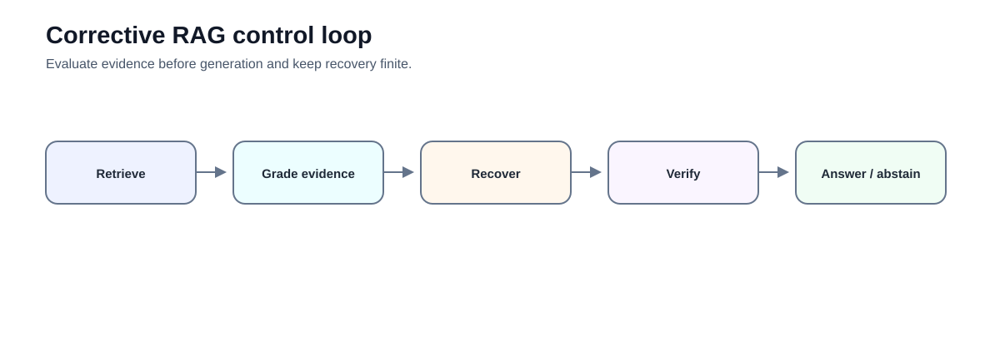
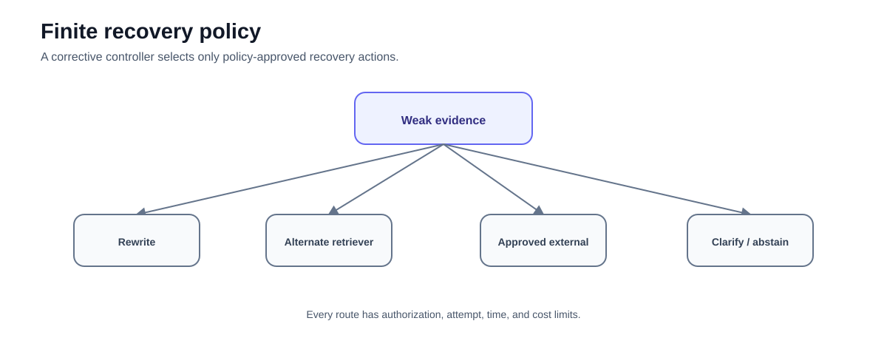
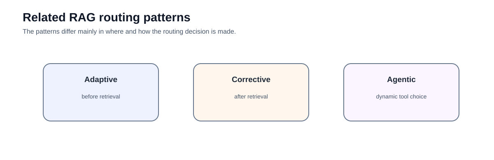

# Advanced 01 — Corrective RAG: Bounded Recovery After Retrieval Failure

**Level:** Advanced<br>
**Estimated time:** 3–4 hours<br>
**Notebook:** [`01_corrective_rag.ipynb`](01_corrective_rag.ipynb)<br>
**Prerequisite:** complete the intermediate retrieval and evaluation track

---

## Why this lesson exists

A fixed RAG pipeline often assumes:

```text
retrieve → generate
```

That assumption fails when retrieval is empty, irrelevant, stale, incomplete, or filtered down by authorization.

**Corrective RAG (CRAG)** adds an explicit evidence-quality decision after retrieval:

```text
retrieve
   ↓
grade evidence
   ↓
accept / recover / abstain
```

The notebook demonstrates this twice:

1. a transparent Python controller; and
2. a LangGraph `StateGraph` with conditional routing.



The important idea is not "always fall back to web search." It is:

> **When evidence is inadequate, choose only from a bounded, policy-approved recovery set.**

---

## Learning objectives

After this lesson you should be able to:

- explain why retrieval quality is a control decision;
- distinguish corrective routing from ordinary reranking;
- define strong, weak, and insufficient evidence states;
- build a finite recovery graph;
- separate internal retrieval failure from source unavailability;
- explain why external search is not a universally safe fallback;
- define retry, latency, and cost budgets;
- preserve route/evidence traces;
- distinguish Corrective RAG from Adaptive RAG and Agentic RAG; and
- evaluate whether correction improves outcomes over a fixed baseline.

---

# Deep dive — Corrective RAG theory and architecture

## The problem CRAG is trying to solve

Vanilla RAG usually treats retrieval as if it were a reliable preprocessing step. In reality, retrieval is a probabilistic subsystem. It can return evidence that is relevant but incomplete, topically similar but factually useless, stale, contradictory, unauthorized, or simply empty. Once weak evidence is placed into the context window, the generator can make the failure harder to see by producing a fluent answer.

Corrective RAG changes the architecture from **retrieve then trust** to **retrieve, assess, then decide**. The original CRAG work introduced a retrieval evaluator that estimates retrieval quality and uses that signal to trigger different retrieval actions. It also proposed knowledge refinement and external retrieval as mechanisms for improving weak evidence. In enterprise systems, the more general lesson is to introduce an explicit evidence-quality control point between retrieval and generation.

A useful abstraction is:

```text
q → R(q) → E(q, D) → policy(E) → {accept, transform, recover, abstain}
```

where:

- `q` is the user query;
- `R` is the retriever;
- `D` is the retrieved evidence set;
- `E` is an evidence evaluator; and
- `policy` converts evidence state into an allowed action.

The evaluator and the policy should be treated as separate concepts. An evaluator may say *weak evidence*; policy decides whether that means query rewrite, another internal retriever, clarification, an approved external source, or abstention.

## Retrieval failure taxonomy

A corrective system is easier to design when failures are classified explicitly.

| Failure | What it looks like | Typical response |
|---|---|---|
| Empty retrieval | no candidates survive filters | rewrite, alternate index, clarify |
| Lexical mismatch | semantic retriever misses exact code/name | BM25/hybrid fallback |
| Semantic mismatch | retrieved passages share vocabulary but not intent | rerank/rewrite |
| Partial coverage | evidence answers only part of a compound question | decompose query, retrieve missing facets |
| Staleness | evidence is relevant but outside freshness policy | fresher approved source |
| Conflict | authoritative sources disagree | surface conflict, prefer policy-defined authority |
| Authorization loss | relevant documents exist but are not accessible | abstain; never widen permissions |
| Corpus gap | authorized corpus does not contain answer | external route if approved, otherwise abstain |

This taxonomy matters because a generic `retry()` often repeats the same failure. Correction should change a variable that plausibly caused the failure.

## Evidence grading

Evidence grading is not the same as asking a model, "Are you confident?" A useful grader examines properties of the retrieved set.

For a query with requirements `r1...rn`, a conceptual evidence score can combine:

```text
coverage(q, D)
relevance(q, D)
authority(D)
freshness(D)
consistency(D)
authorization(D)
```

The exact implementation can be rules, a classifier, an LLM evaluator, or a hybrid. High-risk invariants such as authorization should remain deterministic.

A three-state design is often easier to operate than a continuous score:

```text
STRONG       → generate
WEAK         → bounded recovery
INSUFFICIENT → clarify / abstain
```

Continuous scores can still be recorded for analysis, but operational decisions benefit from explicit states and calibrated thresholds.

## Document-level vs set-level grading

CRAG-style systems can evaluate individual documents and/or the retrieved set as a whole.

**Document-level grading** asks whether each candidate contributes useful evidence. It is useful for pruning irrelevant chunks.

**Set-level grading** asks whether the surviving evidence collectively covers the information need. This is critical for multi-part questions where every individual chunk may be relevant but the set is incomplete.

A production implementation commonly needs both:

```text
retrieve candidates
   ↓
per-document relevance / authority checks
   ↓
prune or rerank
   ↓
set-level coverage / conflict check
   ↓
accept or recover
```

## Knowledge refinement

One idea in the original CRAG design is to decompose retrieved documents into smaller knowledge units, score those units, and recompose useful evidence. The broader engineering pattern is **evidence refinement**: reduce irrelevant context before generation without destroying provenance.

Possible refinement operations include:

- passage extraction;
- sentence selection;
- table row selection;
- metadata filtering;
- deduplication;
- contradiction grouping;
- contextual compression.

Refinement must retain a mapping from the refined evidence back to the original source. A compressed statement with no source locator is weaker operational evidence than the raw passage it replaced.

## Recovery policy design

A recovery graph should be finite and failure-specific. Example:

```text
retrieve
  ↓
grade
  ├─ strong → answer
  ├─ lexical_gap → hybrid retrieve → grade
  ├─ partial → decompose → retrieve missing facet → grade
  ├─ stale → approved fresh source → grade
  └─ insufficient / budget exhausted → abstain
```

Each edge should define:

- trigger condition;
- allowed data sources;
- identity/tenant scope;
- maximum attempts;
- latency budget;
- cost budget;
- evidence requirements;
- terminal behavior.

This turns "self-correction" into a testable state machine rather than an open-ended model behavior.

## CRAG, Self-RAG, Adaptive RAG, and reranking

These techniques solve related but different problems.

| Technique | Primary decision | Typical location |
|---|---|---|
| Reranking | Which retrieved candidates are best? | after candidate retrieval |
| Corrective RAG | Is retrieved evidence sufficient, and how should we recover? | after retrieval |
| Adaptive RAG | Which retrieval strategy should be used? | before/around retrieval |
| Self-RAG | When should retrieval/reflection occur during generation? | generation-time control |
| Agentic RAG | Which tools/steps should be chosen dynamically? | runtime orchestration |

A mature architecture may combine them, but combining controllers increases evaluation and failure complexity.

## Enterprise design pattern

For a regulated internal assistant, a strong pattern is:

```text
identity + policy context
        ↓
authorized retrieval
        ↓
evidence grader
        ↓
policy-controlled recovery
        ↓
evidence ledger
        ↓
generation
        ↓
claim/citation verification
        ↓
answer or abstain
```

The evidence ledger should record source IDs, versions, retrieval route, grader result, recovery attempts, and terminal reason. This is much more useful for audit than a generic "confidence" value.

## Evaluation strategy

Evaluate the controller, not only the final answer. Build cases for each known failure class and measure:

- retrieval sufficiency classification;
- false accepts of weak evidence;
- unnecessary correction of strong evidence;
- recovery success by route;
- answer support after correction;
- abstention precision/recall;
- latency and cost delta;
- unauthorized route attempts.

Always compare against a fixed-RAG baseline. A corrective controller that improves a few difficult questions but doubles cost for all traffic may be the wrong design.

## When not to use Corrective RAG

Do not add a corrective loop when:

- retrieval is already highly reliable for a narrow corpus;
- a deterministic fallback completely handles the known failure;
- latency requirements cannot tolerate another retrieval/evaluation pass;
- the evaluator cannot be calibrated well enough to improve decisions;
- the application should simply abstain on missing evidence.

The goal is not self-correction as a feature. The goal is measurable reduction in evidence failures.

---

# Guided lab — build a bounded evidence-recovery controller

The notebook is a self-contained incident-policy investigation lab. It keeps the evidence-control logic inspectable and uses one controller twice: first as ordinary Python, then as a LangGraph `StateGraph`.

## 1. Scenario and evidence corpus

The lab uses 38 synthetic chunks across internal Acme, Globex, and NovaTech sources plus an allowlisted external-source fixture. The data deliberately includes:

- strong and irrelevant matches;
- exact identifiers that a dense baseline misses;
- vocabulary mismatches;
- multi-facet questions with partial coverage;
- active and superseded versions;
- contradictory authoritative statements;
- internal corpus gaps;
- evidence outside the active tenant's authorization scope; and
- questions that require clarification.

Every chunk has stable document, chunk, source, tenant, classification, status, authority, and coverage metadata. Request-local evidence IDs (`E1`, `E2`, …) make each execution trace readable, while `document_id` and `chunk_id` preserve stable source identity.

## 2. First-stage retrieval is real and local

The notebook implements two credential-free retrievers over the actual corpus:

- a transparent normalized unigram/bigram vector baseline; and
- BM25 lexical retrieval for exact identifiers.

This is an educational local baseline, not a claim that token-feature vectors replace a production embedding model. Its intentional limitations make the recovery routes observable. A deployed system may use an embedding service, sparse/dense hybrid search, late interaction, or a managed retrieval system.

Backend behavior matters. Verify the filtering semantics, ANN recall, indexing strategy, and latency of the store you deploy rather than assuming all vector databases behave identically.

## 3. Grade documents and the evidence set

The typed `EvidenceGrade` contract separates the decision from its explanation:

```python
state: strong | weak | insufficient
failure_types: list[
    lexical_gap | semantic_gap | partial_coverage | stale | conflict |
    corpus_gap | authorization_limited | underspecified
]
covered_requirements: list[str]
missing_requirements: list[str]
```

The lab first labels individual evidence items as relevant, irrelevant, stale, duplicate, or unauthorized. It then grades the set against explicit task requirements. This prevents a compound question from being accepted merely because one retrieved passage is relevant.

Authorization, lifecycle, attempt budgets, and allowed routes are deterministic application controls. The evidence-sufficiency evaluator is replaceable: the default frozen evaluator makes every run repeatable, while an optional `ChatOpenAI.with_structured_output(EvidenceGrade)` path demonstrates a live semantic grader when `CRAG_USE_LIVE_GRADER=1`, `OPENAI_API_KEY`, and `CRAG_MODEL` are configured. A live grader still cannot override deterministic policy.

The 26-case calibration set measures initial grade accuracy, false acceptance, and unnecessary correction. Treat the notebook's frozen labels as teaching fixtures; calibrate real evaluators on reviewed, domain-specific examples.

## 4. Route by diagnosed failure



The `RecoveryPolicy` allowlists routes and limits attempts. The controller maps diagnosed failures to specific changes:

| Diagnosed failure | Bounded route | What changes |
|---|---|---|
| Exact identifier missed | `lexical_fallback` | retrieval method |
| Vocabulary mismatch | `query_rewrite` | retrieval query, not user intent |
| Partial coverage | `targeted_retrieval` | missing requirement/facet |
| Stale evidence | `fresh_source` | lifecycle eligibility |
| Authorized corpus gap | `external_source` | approved source boundary |
| Missing task parameter | `clarification` | information supplied by user |
| Authorization-limited | no recovery | terminal abstention |
| Conflicting evidence | no automatic answer | terminal conflict state |

After every recovery, the controller re-grades the complete evidence set. It never jumps directly from recovery to generation.

## 5. Authorization is invariant across recovery

A failed internal search does not grant authority to widen tenant, classification, network, or tool scope. The lab therefore uses:

```text
same principal
same policy
new allowed retrieval action
```

An authorization-limited case terminates as `insufficient_authorized_evidence`. It does not search another tenant or use an external source to reconstruct restricted facts. The authorization-existence signal in the teaching fixture reveals only that eligible evidence is unavailable; it never exposes the forbidden content.

## 6. External evidence changes the trust boundary

The external route searches a finite allowlisted fixture with explicit authority metadata. This makes source selection, provenance, and re-grading executable without making a network call or pretending a fixed string is web search.

In a deployed system, external retrieval also introduces source-quality, privacy, prompt-injection, egress, retention, and citation risks. "Internal retrieval failed" does **not** imply "search the web." External access must be approved by policy and the returned evidence must pass the same sufficiency checks.

## 7. Enforce budgets and terminal states

The Python runtime increments `attempts`, applies `max_attempts` and `max_rewrites`, and terminates explicitly:

```text
answered
insufficient_evidence
insufficient_authorized_evidence
conflicting_evidence
clarification_required
budget_exhausted
```

Two deliberately unsatisfiable compound cases prove that repeated targeted retrieval stops at the configured budget. This is stronger than carrying an unused retry field: the limit is executed and asserted.

## 8. Preserve an evidence ledger

Each run records:

- original query and query ID;
- initial and final grades;
- failure reasons;
- attempted routes;
- original and rewritten retrieval queries;
- stable source/document/chunk provenance;
- recovered evidence IDs;
- attempt count;
- terminal reason; and
- whether unauthorized evidence entered state.

The original query is never overwritten by a retrieval rewrite. A separate refinement exercise extracts useful spans and retains a parent-evidence link, demonstrating the CRAG decompose-filter-recompose idea without confusing it with reranking.

## 9. Generate only after evidence acceptance

The credential-free generator renders requirement-backed claims with citations so the controller can be tested without hidden model behavior. Application-side checks verify that:

- generation happens only from `strong` evidence;
- citation IDs exist in the ledger; and
- evidence remains authorized.

Replacing the renderer with a live model does not remove these validation responsibilities.

## 10. Reproduce the controller in LangGraph

The second implementation uses the current `StateGraph`, `START`, `END`, and conditional-edge APIs. Graph nodes call the same retriever, evaluator, recovery policy, and terminal logic as the manual runtime; the graph is not a second, looser implementation.

The lab checks parity for strong, lexical-recovery, authorization-limited, and budget-exhaustion cases. This is the key framework lesson: LangGraph packages stateful orchestration, but policy semantics still belong to the application.

## 11. Compare fixed RAG with Corrective RAG

Both systems run on the same 26 cases. The benchmark records:

- initial grade and route accuracy;
- false accepts and unnecessary corrections;
- recovery success by route;
- supported and unsupported answer rates;
- correct and false abstentions;
- attempts, retrieval calls, and grader calls;
- measured local median and p95 execution time; and
- unauthorized route attempts.

The displayed results are computed in the notebook run, not hard-coded benchmark claims. Local timings measure this teaching implementation only; they are not service-level latency projections.

## 12. Failure analysis before optimization

When a route fails, ask which layer failed:

| Layer | Diagnostic question |
|---|---|
| Retriever | Did the right evidence enter the candidate set? |
| Document grader | Were useful and stale candidates labelled correctly? |
| Set grader | Were all requirements and conflicts considered? |
| Policy | Was the selected route permitted and failure-specific? |
| Recovery | Did the action change the variable that caused failure? |
| Budget | Did the controller stop predictably? |
| Generator | Were all claims supported by accepted evidence? |

Do not optimize retrieval recall by allowing weak evidence through the acceptance gate. Authorization and supported-answer constraints are hard invariants; relevance is optimized within them.

## 13. Corrective, Adaptive, Self-RAG, and Agentic RAG



- **Corrective RAG** evaluates retrieved evidence and chooses bounded recovery.
- **Adaptive RAG** selects a retrieval strategy before or around retrieval.
- **Self-RAG** interleaves retrieval and reflection signals with generation.
- **Agentic RAG** gives a runtime broader discretion over tools and multi-step actions.
- **Reranking** reorders candidates; it does not by itself establish set sufficiency.

These approaches can coexist, but every added controller creates new interactions to evaluate.

## 14. Production upgrade path

The notebook deliberately avoids pretending to be a production system. A production implementation would normally add:

1. a calibrated embedding or hybrid retrieval service;
2. service-enforced tenant and classification filters;
3. a versioned evaluator dataset and release gate;
4. durable state/checkpoints for long-running recovery;
5. per-route latency, token, and monetary budgets;
6. approved external-source connectors with content-security controls;
7. structured traces and privacy-aware evidence logging;
8. claim-level citation verification;
9. human escalation for unresolved high-risk conflicts; and
10. rollback/fallback behavior when the evaluator is unavailable.

## Exercises

1. Add a reranker route for relevant-but-poorly-ranked candidates and prove it is distinct from evidence refinement.
2. Replace the local dense baseline with an embedding model and rerun all 26 cases.
3. Add a monetary or token budget alongside `max_attempts`.
4. Add a source-authority policy for resolving one conflict, while preserving a terminal path when authority is tied.
5. Add a third missing facet to a compound request and visualize the requirement coverage after each attempt.
6. Persist the ledger without retaining unnecessary restricted text.
7. Add an evaluator-outage case and choose a fail-closed behavior.
8. Calibrate the optional live evaluator against human labels and report disagreement by failure slice.

## Checkpoint

1. Why is evidence grading different from model confidence?
2. When must a query rewrite preserve the original query separately?
3. Why must recovery return to the grader rather than generation?
4. What makes authorization-limited retrieval different from a corpus gap?
5. Why does conflict require a distinct terminal state?
6. Which controls should remain deterministic even when an LLM grades semantics?
7. How does evidence refinement preserve provenance?
8. What evidence would justify the additional cost of a corrective controller?

---

## What comes next

### [Advanced 02 — GraphRAG](../02-graphrag/README.md)

Move from correcting retrieval failures to retrieving explicit relationships across multiple evidence items.

---

## References

- Yan et al. — [Corrective Retrieval Augmented Generation](https://arxiv.org/abs/2401.15884)
- Asai et al. — [Self-RAG](https://arxiv.org/abs/2310.11511)
- Akarsu et al. — [From BM25 to Corrective RAG: Benchmarking Retrieval Strategies for Text-and-Table Documents](https://arxiv.org/abs/2604.01733)
- LangGraph — [Graph API overview](https://docs.langchain.com/oss/python/langgraph/use-graph-api)
- LangGraph reference — [`StateGraph.add_conditional_edges`](https://reference.langchain.com/python/langgraph/graph/state/StateGraph/add_conditional_edges)
- LangChain — [OpenAI integration and structured output](https://docs.langchain.com/oss/python/integrations/chat/openai)

## Key takeaway

**Corrective RAG is a bounded evidence-recovery controller. If recovery cannot establish sufficient authorized evidence within policy and budget, the correct outcome is abstention—not another guess.**
