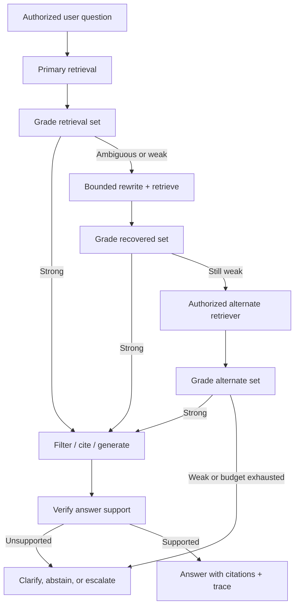
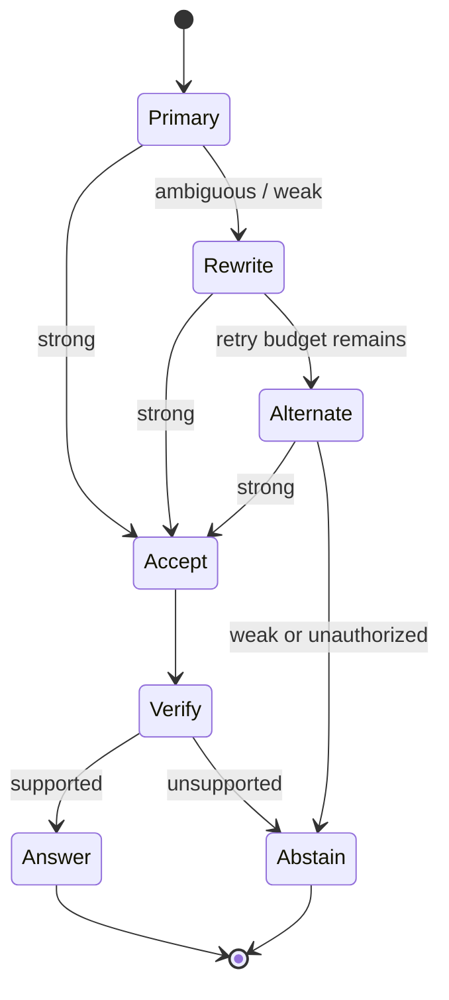
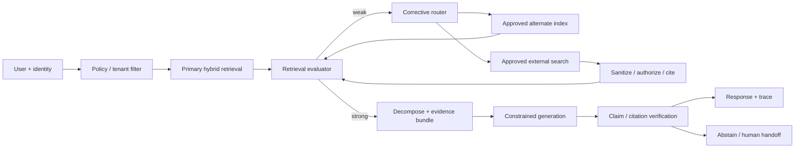

# 01 — Corrective RAG: recover from retrieval failure without guessing

**Level:** Advanced

**Time:** 2–3 hours
**Prerequisites:** complete the [intermediate path](../../intermediate/README.md), especially retrieval, reranking, evaluation, and security.

## Why this module exists

Ordinary RAG assumes the top retrieved passages are useful. In production, that assumption breaks: the query may be underspecified, the corpus may be stale, an exact identifier may defeat semantic search, access filtering may remove the only relevant document, or a plausible-but-wrong passage may outrank the right one. Generating from those passages is not grounded—it is confidently conditioned on poor evidence.

**Corrective RAG (CRAG)** makes retrieval quality an explicit decision point. The original CRAG paper adds a lightweight retrieval evaluator that grades the retrieved knowledge, uses that grade to choose a retrieval action, can supplement limited corpora with web search, and decomposes/recomposes documents to retain salient evidence. It is a plug-in corrective layer around a RAG pipeline, not a guarantee that an answer exists. [Yan et al., 2024](https://arxiv.org/abs/2401.15884)

This training uses a realistic scenario: **Northstar Cloud’s security-support assistant** must answer operational questions about API-key rotation. A mistaken answer could lead to a failed rotation or an insecure shortcut, so the system must return a cited plan only when it has authorized evidence. Otherwise it must ask for clarification or abstain.

## Outcome

By the end, you can design and implement a bounded corrective retrieval controller that:

1. grades retrieval before generation;
2. separates **strong**, **ambiguous**, and **weak** evidence;
3. chooses a constrained recovery route—rewrite, alternate retriever, or approved external search;
4. keeps an auditable trace of every route, score, latency, and terminal decision;
5. applies authorization before retrieval and never treats retrieved text as instructions; and
6. evaluates recovery quality, abstention, cost, and tail latency against a non-corrective baseline.

## Start with the notebook

Open [`corrective_rag.ipynb`](corrective_rag.ipynb). It is the main practical training artifact: concept explanations, diagrams, deterministic implementation, failure fixtures, experiments, and exercises are together in one place. Reusable code lives in [`lab.py`](lab.py).



---

## 1. The mental model: correction is a control policy

A normal retrieval pipeline is usually:

`query → retrieve top-k → generate`

A corrective pipeline adds a controller:

`query → retrieve → evaluate evidence → choose next permitted action → verify → answer or abstain`

The controller must be designed like any other production policy. It needs inputs, thresholds, a bounded action set, a budget, audit logs, and safe terminal states. A score by itself is not a policy: cosine similarity, BM25 score, reranker score, and LLM judge output are different signals with different scales. Calibrate the decision thresholds on held-out data for your corpus and risk level.

| Grade | Interpretation | Typical permitted action | Do not do |
| --- | --- | --- | --- |
| Strong | Evidence covers the question and passes authorization filters. | Generate a cited answer; optionally run answer-support verification. | Treat score as proof without inspecting calibration. |
| Ambiguous | Some relevant evidence exists, but a key term, constraint, or source is missing. | Rewrite, query another representation, widen *within policy*, or rerank. | Append every retrieved passage to the prompt. |
| Weak | No authorized evidence sufficiently supports the task. | Ask a clarifying question, use a pre-approved alternate source, or abstain. | Retry indefinitely or invent a fallback answer. |

### CRAG, Adaptive RAG, and Self-RAG are related but not identical

- **Corrective RAG** focuses on assessing a retrieved set and correcting low-quality evidence with different retrieval actions and document refinement. [CRAG paper](https://arxiv.org/abs/2401.15884)
- **Adaptive RAG** is the broader engineering pattern of routing a request among retrieval strategies based on task complexity, quality, cost, or risk. A CRAG evaluator can be one router input.
- **Self-RAG** trains a model to decide when to retrieve and to critique retrieval/generation with reflection tokens. It is a model-training and decoding approach, rather than simply a controller around an off-the-shelf model. [Asai et al., 2024](https://arxiv.org/abs/2310.11511)
- **Agentic RAG** gives a model more autonomy to plan tools and retrieval routes. Use it only when the value of dynamic planning exceeds the cost and control burden; a finite corrective graph is usually easier to evaluate and secure.

## 2. Step-by-step: build a corrective controller

### Step 1 — define the evidence contract before choosing a score

For the Northstar scenario, an answer about key rotation must contain: an authorized runbook, a staged replacement action, a verification step, and a revocation step. The retrieval evaluator is not deciding whether text “sounds useful”; it is deciding whether candidates support that contract.

```python
required_concepts = {"create", "deploy", "verify", "revoke"}
allowed_sources = {"internal-runbooks"}
max_attempts = 4
```

In a production system, derive this contract from the task schema, user permissions, and a policy version. Do not put it only in a model prompt.

### Step 2 — retrieve broadly, but filter access first

Filtering after retrieval can leak document titles, scores, or snippets into logs and model context. Apply tenant, role, source, retention, and document-status filters at the retrieval boundary. In the example implementation, `authorized()` is deliberately called before every retriever.

```python
permitted = authorized(documents, policy)
candidates = primary_retriever(query, permitted)
```

This small example uses lexical retrieval for inspection. In production, the primary route might be hybrid dense+sparse retrieval, metadata filtering, then a cross-encoder or late-interaction reranker. Qdrant’s [hybrid-search and reranking tutorial](https://qdrant.tech/documentation/advanced-tutorials/reranking-hybrid-search/) is a useful reference for the retrieve-wide/rerank-narrow pattern.

### Step 3 — grade the *set*, not only the top score

Top-1 similarity can be high for a document that matches a noun but lacks the required procedure. A set grader can combine:

```text
retrieval_quality = f(
  query_intent_coverage,
  passage_relevance,
  source_authority,
  freshness,
  diversity / redundancy,
  permission_validity
)
```

The training code uses transparent query-term coverage, intentionally not a probability. That allows learners to observe a threshold changing a route. In a real system, replace or augment it with a calibrated cross-encoder, a small classifier, or a structured LLM judge. Maintain a held-out calibration set, measure false accepts and false abstains, and record the evaluator version in traces.

### Step 4 — recover with a finite route table



Every edge needs a budget and reason. The provided `CorrectionPolicy` exposes `max_rewrites`, `max_attempts`, permitted sources, and thresholds. The reference implementation never spins until it finds a match.

```python
result = corrective_retrieve(
    question,
    corpus,
    policy=CorrectionPolicy(max_rewrites=2, max_attempts=4),
    primary_retriever=hybrid_retriever,
    alternate_retriever=approved_archive_retriever,
)
if not result.answerable:
    return "I do not have enough authorized evidence to answer."
```

### Step 5 — document decomposition and recomposition

The CRAG paper’s decompose-then-recompose idea addresses another common failure: a relevant document can contain a few useful statements wrapped in irrelevant or distracting material. Chunk-level extraction should preserve provenance:

```text
document → candidate spans → relevance/authority filter → compact evidence bundle
         → source document ID + chunk ID + revision + score
```

Do not summarize away the document identity. A generator must be able to cite the source span, and an evaluator must be able to check the claim against the span. For regulated or high-risk domains, preserve a snapshot or content hash so later audits can reconstruct the evidence.

---

## 3. Recovery routes: when each route is appropriate

| Route | Trigger | Example | Guardrails |
| --- | --- | --- | --- |
| Reformulate | Intent is clear but vocabulary differs. | “credential replacement” → “API key rotation runbook.” | Limit variants; do not change user intent or tenant scope. |
| Hybrid / rerank | Exact tokens or semantic nuance may be missed. | Search a key ID with sparse retrieval and procedure wording with dense retrieval. | Tune candidate depth and reranker budget. |
| Alternate internal retriever | A different approved index owns the evidence. | Product runbook index → incident postmortem index. | Explicit source allowlist and access policy per route. |
| Fresh external retrieval | Internal corpus is allowed to be incomplete and policy permits it. | Public SDK documentation version check. | Domain allowlist, SSRF protection, attribution, prompt-injection handling, cache/retention policy. |
| Clarify | The user omitted a critical parameter. | “Rotate a key” without service or environment. | Ask the smallest question that disambiguates. |
| Abstain / escalate | Evidence remains weak or action is high-risk. | No approved runbook for a legacy service. | Make the terminal outcome useful: explain the missing evidence and handoff path. |

External search is not a magic recovery route. It can introduce stale pages, poisoned instructions, conflicting policies, privacy leakage, and unsupported source authority. Treat external text as untrusted data; never let it alter system instructions or tool permissions. For a detailed defense model, use the repository’s [security and authorization lab](../../../labs/security-and-authorization/README.md).

## 4. Evaluation: prove correction helps

Corrective RAG is justified only if it improves a measured objective. Evaluate the same task set with a fixed RAG baseline and a corrective controller. Include easy, ambiguous, stale, access-restricted, adversarial, and no-answer cases.

| Dimension | Useful measures | Why it matters |
| --- | --- | --- |
| Retrieval | Recall@k, nDCG, evidence coverage, authorized-recall | Did recovery find permitted supporting evidence? |
| Routing | grade confusion matrix, false-accept rate, false-abstain rate, route distribution | Is the evaluator calibrated for this corpus? |
| Generation | claim support, citation correctness, answer relevance | Did better retrieval translate into a grounded answer? |
| Operations | p50/p95 latency, attempts/query, reranker cost, cost/success | Correction can improve quality while harming tail latency. |
| Safety | cross-tenant leakage, unauthorized-source attempts, injection-follow rate | A “recovery” route must not widen trust boundaries. |

Use two budgets: a **per-query** cap (attempts, tokens, time) and a **fleet** cap (external search volume, reranker concurrency, cost). Alert on route-distribution shifts: a sudden jump in fallback traffic often indicates broken ingestion, an embedding regression, stale documents, or a changed query mix.

## 5. Production-ready architecture



### Operational checklist

- [ ] Calibrate each threshold on a versioned evaluation set; never copy a threshold across corpora without testing.
- [ ] Log query hash or approved redacted form, route, grades, candidate IDs, policy version, model/retriever versions, latency, and terminal reason.
- [ ] Separate “no result,” “result not authorized,” “insufficient evidence,” and “generation unsupported” in telemetry.
- [ ] Make retries idempotent and bounded. Cache retriever results per request where safe.
- [ ] Apply authorization before retrieval and again before sending selected evidence to a model.
- [ ] Require citations for factual claims and verify citations point to the evidence bundle, not merely to a related document.
- [ ] Test indirect prompt injection in external pages and retrieved documents.
- [ ] Define an operator kill switch for external fallback and a safe degraded mode: internal-only + abstention.

## 6. Technology choices

The course implementation uses Python and deterministic lexical retrieval so the routing behavior is visible. In a production stack, choose components by boundary rather than brand:

| Need | Suitable technologies | Decision notes |
| --- | --- | --- |
| Explicit, resumable corrective graph | [LangGraph](https://langchain-ai.github.io/langgraph/) | Good when state, conditional edges, persistence, and human interrupts must be visible. |
| Composable pipeline routing | [Haystack routers and joiners](https://docs.haystack.deepset.ai/reference/joiners-api) | Useful for typed pipeline components and conditional routing. |
| Retrieval / query engines | [LlamaIndex](https://docs.llamaindex.ai/) or custom adapters | Keep policy and evaluation outside framework-specific prompts. |
| Hybrid retrieval and reranking | [Qdrant hybrid search](https://qdrant.tech/documentation/search/text-search/hybrid-search/) or an equivalent search stack | Prefetch broadly, then rerank a small candidate set; measure p95 latency. |
| Retrieval and answer evaluation | [Ragas](https://docs.ragas.io/) plus task-specific labels | Metrics are diagnostic signals, not automatic approval to deploy. |
| Traces and inspection | [OpenTelemetry](https://opentelemetry.io/) compatible tracing | Trace routes and evidence IDs, with redaction and retention controls. |

## Exercises

1. **Calibrate the route gate.** Add ten labeled Northstar questions. Sweep `strong_threshold` and graph false accepts versus false abstains. Which threshold fits a security-support assistant, and why?
2. **Implement an alternate route.** Add an approved “release notes” corpus. Demonstrate an `ALTERNATE` result, then prove a disallowed source cannot be retrieved.
3. **Add a document-span extractor.** Return spans rather than whole documents. Preserve document ID, revision, and span offsets in the generated citation.
4. **Fault injection.** Remove the key-rotation runbook, add a distractor that mentions “rotate,” and verify the controller abstains rather than using the distractor.
5. **Production review.** Write a runbook for a spike in `alternate` routes. Include dashboards, likely causes, owner, rollback, and customer-impact communication.

## References

- [Corrective Retrieval Augmented Generation — Yan et al.](https://arxiv.org/abs/2401.15884) — primary CRAG paper and the central source for retrieval evaluation, corrective actions, and document decomposition.
- [Official CRAG implementation](https://github.com/HuskyInSalt/CRAG) — research code; evaluate its assumptions before adapting it to a production system.
- [Self-RAG — Asai et al.](https://arxiv.org/abs/2310.11511) — adaptive retrieval and self-reflection through learned reflection tokens.
- [Retrieval-Augmented Generation for Knowledge-Intensive NLP Tasks — Lewis et al.](https://arxiv.org/abs/2005.11401) — foundational RAG formulation.
- [LangGraph’s self-reflective RAG tutorial](https://langchain-ai.github.io/langgraph/tutorials/rag/langgraph_self_rag/) — an implementation-oriented reference for conditional retrieval graphs.
- [Qdrant hybrid search and reranking tutorial](https://qdrant.tech/documentation/advanced-tutorials/reranking-hybrid-search/) — practical hybrid retrieval and reranking design.
- [RAGAS documentation](https://docs.ragas.io/) — evaluation tooling and metric definitions.
