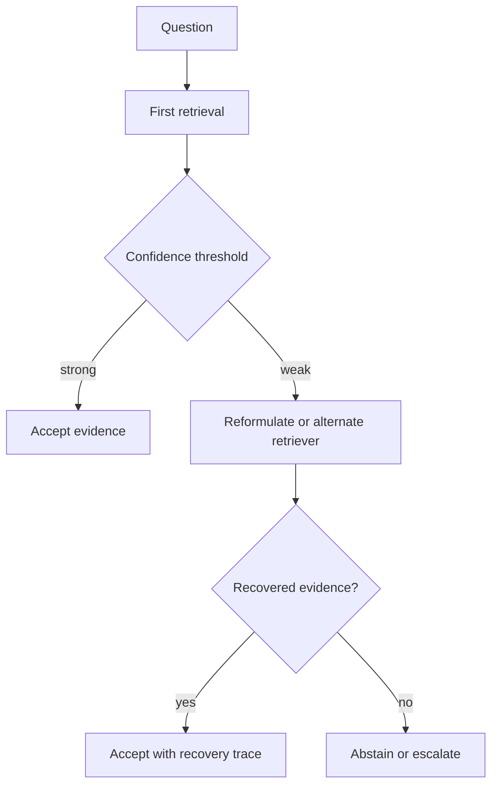

# 01 — Corrective and adaptive RAG

**Level:** Advanced  \
**Time:** 60 minutes  \
**Prerequisites:** complete the [intermediate path](../../intermediate/README.md)

## Outcome

Detect weak retrieval, choose a recovery route, and abstain explicitly when corrective attempts still lack evidence.

## Guided notebook

Open [`corrective_rag.ipynb`](corrective_rag.ipynb). The implementation is [`corrective_rag.py`](../../../examples/advanced/corrective_rag.py).

Corrective RAG is not “keep trying until something matches.” Bound retries, preserve every route and score, prevent unauthorized fallback sources, and make abstention a valid terminal state.

## Exercise

Add a maximum retry budget and a second retriever. Record route, confidence, latency, and final outcome for every query. Test a question that should abstain even after reformulation.
