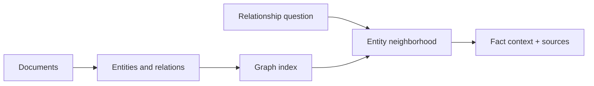

# 02 — GraphRAG and entity-aware retrieval

**Level:** Advanced  \
**Time:** 60 minutes  \
**Prerequisites:** [corrective RAG](../01-corrective-rag/README.md)

## Outcome

Represent entities and relationships explicitly, retrieve a bounded graph neighborhood, and preserve fact-level provenance for relationship-heavy questions.

## Guided notebook

Open [`graph_rag.ipynb`](graph_rag.ipynb). The reusable implementation is [`graph_rag.py`](../../../examples/advanced/graph_rag.py).

Graph retrieval complements, rather than universally replaces, text retrieval. It is useful for relationships, paths, and corpus-level questions; isolated factual passages may still be better served by lexical or dense search. Bound traversal depth and apply the same authorization filters to nodes and edges.

## Exercise

Add a two-hop question, a missing-entity question, and tenant metadata to facts. Test that traversal cannot cross an unauthorized tenant boundary.
