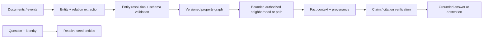
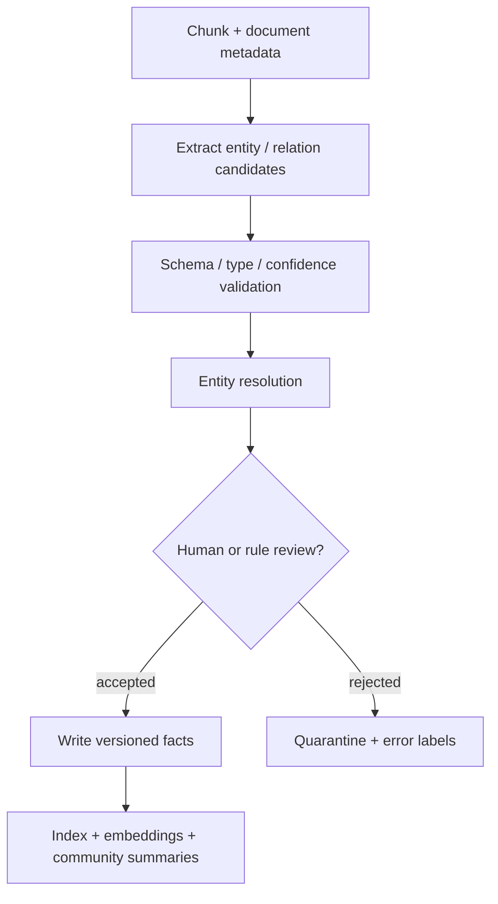
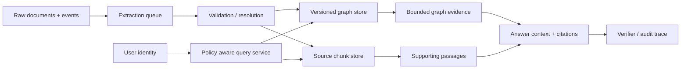

# 02 — GraphRAG: entity-aware retrieval for relationship-heavy questions

**Level:** Advanced

**Time:** 2–3 hours

**Prerequisites:** [Corrective RAG](../01-corrective-rag/README.md), retrieval evaluation, and basic graph concepts.

## Why GraphRAG?

Text retrieval is excellent when a single passage answers a question. It is weaker when the question requires **relationships across documents**: “Which customer-facing service depends on a component affected by this release?”, “What connects this incident to a policy exception?”, or “What themes recur across the corpus?” A GraphRAG system represents entities, relations, provenance, and sometimes community summaries so retrieval can return a bounded subgraph instead of a bag of chunks.

This module uses a Northstar Cloud incident scenario. Checkout conversion drops after a payments deployment. Learners trace the relationship among a deployment, a service, a dependency, affected regions, and an owning team—then decide what evidence is sufficient for an incident recommendation.

Microsoft Research’s GraphRAG work distinguishes **local search** for entity/relationship questions from **global search** over hierarchical community reports for corpus-wide questions. [Edge et al., 2024](https://arxiv.org/abs/2404.16130) The original RAG formulation remains useful; a graph is an additional retrieval index, not a universal replacement for passages. [Lewis et al., 2020](https://arxiv.org/abs/2005.11401)

## Outcome

You will be able to:

1. decide when a graph index is justified rather than using vector search alone;
2. design an entity/relation/provenance schema for an operational question;
3. retrieve tenant-authorized, bounded neighborhoods and paths;
4. linearize graph facts for generation while retaining fact-level citations;
5. evaluate entity resolution, relation quality, path faithfulness, retrieval recall, and operational cost; and
6. operate a graph index with versioning, access controls, freshness controls, and safe failure modes.

## Start with the notebook

[`graph_rag.ipynb`](graph_rag.ipynb) is the practical training artifact. It contains the scenario, diagrams, a deterministic graph implementation, local retrieval, path finding, tenant isolation, failure fixtures, evaluation, and production exercises. Reusable code is in [`graph_rag.py`](../../../examples/advanced/graph_rag.py).



---

## 1. The mental model

A property graph stores nodes and typed edges with properties. For retrieval, a useful minimum fact is:

```text
(subject) -[relation {source, revision, confidence, tenant, timestamps}]-> (object)
```

The metadata is not decoration. A graph fact without source, revision, tenant, extraction confidence, and update policy is difficult to cite, audit, delete, or authorize.

| Question shape | Best first retrieval | Why |
| --- | --- | --- |
| “What is the rotation procedure?” | Chunk/vector/hybrid RAG | A single runbook passage is usually sufficient. |
| “Which service depends on a component changed by this deployment?” | Local GraphRAG | Requires a short evidence path across entities. |
| “What are the recurring failure themes across all incident reports?” | Global/community GraphRAG | Needs corpus-level aggregation, not a local neighborhood. |
| “What did the customer say yesterday?” | Metadata-filtered text retrieval | Graph construction is often unnecessary overhead. |

### Do not confuse GraphRAG with a graph database

A graph database is storage and query infrastructure. GraphRAG is a retrieval-and-generation design that may use a graph database, a graph library, or a graph projected from other stores. The hard engineering work is extraction quality, entity resolution, schema governance, provenance, authorization, and evaluation—not merely writing Cypher.

## 2. Step-by-step: model the incident domain

### Step 1 — start from questions, then design a minimal schema

For the Northstar incident assistant, begin with the questions you must answer:

```text
Deployment → changed → Service
Service → depends_on → Component
Service → serves → Region
Service → owned_by → Team
Incident → affects → Service
```

Avoid creating generic `RELATED_TO` edges because they make graph traversal ambiguous and hard to evaluate. Use a controlled relation vocabulary, direction semantics, cardinality expectations, and an owner for every relation type.

### Step 2 — extract candidates, then resolve and validate

LLM extraction can be useful, but extracted triples are proposals, not facts. A robust pipeline is:



Entity resolution deserves dedicated tests. “Payments API,” “payments-api,” and “Payment Service” may be the same entity; “Atlas” may be a service in one tenant and a product in another. Merge only with evidence, keep canonical IDs and aliases, and preserve original mentions.

### Step 3 — authorize before traversal

Graph edges can leak information even when node text is hidden: an edge can reveal that a customer, project, or incident exists. Apply tenant/role/source filters during seed resolution and every traversal step. The example’s `GraphPolicy` enforces permitted tenants, minimum confidence, hop count, and maximum facts before facts reach model context.

```python
evidence = graph.retrieve(
    question,
    GraphPolicy(max_hops=2, max_facts=12, permitted_tenants=frozenset({"northstar"})),
)
```

### Step 4 — retrieve the smallest sufficient subgraph

Unlimited traversal creates irrelevant context, cost, and accidental leakage. Use task-specific depth limits and fact budgets. A two-hop path may prove `deployment → service → component`; a six-hop exploration should be an explicit investigation workflow with a budget, not the default answer path.

The reference implementation returns `GraphEvidence`: selected facts, resolved seeds, hop bound, truncation state, and a terminal reason. `linearize()` includes fact IDs and source revisions so generation and verification can cite the same evidence.

### Step 5 — separate local, global, and hybrid retrieval

- **Local GraphRAG:** seed on resolved entities; expand a small neighborhood or find paths. Best for specific relationship questions.
- **Global GraphRAG:** retrieve hierarchical community reports and use map-reduce-style synthesis. Best for “what are the major themes?” queries; Microsoft GraphRAG documents this [global-search approach](https://github.com/microsoft/graphrag/blob/main/docs/query/global_search.md).
- **Hybrid GraphRAG:** use vector or lexical retrieval to identify seed entities/documents, then graph expansion to connect evidence. This is often the practical default.

Graph traversal does not remove the need for chunks. Store source chunks or spans beside graph facts, then retrieve both a relationship path and the supporting text for nuanced claims.

## 3. Evaluation: test the graph before the answer

| Layer | What to measure | Failure signal |
| --- | --- | --- |
| Extraction | entity/relation precision and recall, schema violations | Confident but false edges poison every downstream path. |
| Resolution | canonical-ID accuracy, merge/split error rate | A wrong merge creates cross-entity hallucination. |
| Retrieval | seed recall, path recall, subgraph precision, authorized recall | The correct path is absent, too broad, or crosses a tenant. |
| Generation | claim support, citation correctness, path faithfulness | Answer claims a relationship not represented by selected facts. |
| Operations | index freshness, p95 traversal latency, facts/context, cost/query | Graph fan-out grows or stale facts dominate. |
| Security | cross-tenant path attempts, source leakage, injection in source chunks | Authorization after traversal is too late. |

Create fixtures for a known two-hop path, a missing entity, an ambiguous alias, an unauthorized tenant edge, a stale fact, a cycle, and a high-degree hub. Your release gate should require both answer quality and graph safety.

## 4. Production architecture and operations



Production requirements:

- version nodes and facts; support retraction, tombstones, and source re-ingestion;
- record extraction model, prompt, schema, confidence, source span, and ingestion timestamp;
- restrict graph query language access—never expose arbitrary Cypher/Gremlin generated by a model without a constrained API and parameter validation;
- bound hop count, fan-out, result size, and query time; cache safe, identity-scoped results;
- monitor entity/edge growth, community recomputation cost, stale-source rate, extraction rejection rate, and authorization denials;
- keep an explain view: selected seed entities, edges, source citations, filters, truncation, and final answer claims;
- maintain a safe degraded mode: fall back to authorized text retrieval or abstain when the graph index is stale/unavailable.

## 5. Technology choices

| Need | Technology | When to use it |
| --- | --- | --- |
| Corpus-level local/global GraphRAG | [Microsoft GraphRAG](https://microsoft.github.io/graphrag/) | Community reports and global thematic questions; account for indexing cost. |
| Property graph + retrieval adapters | [Neo4j GraphRAG for Python](https://neo4j.com/docs/neo4j-graphrag-python/current/index.html) | When Cypher, a mature graph database, graph/vector retrieval, and operational controls fit your stack. |
| Graph index in an application framework | [LlamaIndex PropertyGraphIndex](https://llamaindex.openml.io/python/framework/module_guides/indexing/lpg_index_guide/) | When you need orchestration around property-graph extraction and custom retrievers. |
| Explicit stateful routing | [LangGraph](https://langchain-ai.github.io/langgraph/) | For bounded investigation, human review, retries, and persistence around graph retrieval. |
| Hybrid retrieval | Graph store plus vector/sparse search | Use text retrieval to find seeds and supporting passages; graph paths explain connections. |

## Exercises

1. Add an `owns` → `operates` → `depends_on` two-hop incident question and prove its exact provenance chain.
2. Add the same entity name in two tenants; confirm resolution and traversal cannot cross the tenant policy.
3. Create a high-degree “platform” node. Add a fan-out budget and show the system reports truncation rather than silently returning arbitrary facts.
4. Build a source-span store and require every generated relationship claim to cite a fact plus a source span.
5. Compare local graph retrieval with hybrid text retrieval on 20 labeled Northstar questions. Which questions truly benefit from a graph?
6. Design a global-search workflow for “What themes explain checkout incidents this quarter?” Include community-refresh policy, cost, and verification steps.

## References

- [From Local to Global: A Graph RAG Approach to Query-Focused Summarization](https://arxiv.org/abs/2404.16130) — primary Microsoft GraphRAG paper.
- [Microsoft GraphRAG documentation](https://microsoft.github.io/graphrag/) and [global search design](https://github.com/microsoft/graphrag/blob/main/docs/query/global_search.md).
- [Neo4j GraphRAG for Python](https://neo4j.com/docs/neo4j-graphrag-python/current/index.html) — maintained implementation and retriever options.
- [LlamaIndex PropertyGraphIndex guide](https://llamaindex.openml.io/python/framework/module_guides/indexing/lpg_index_guide/).
- [Retrieval-Augmented Generation — Lewis et al.](https://arxiv.org/abs/2005.11401).
