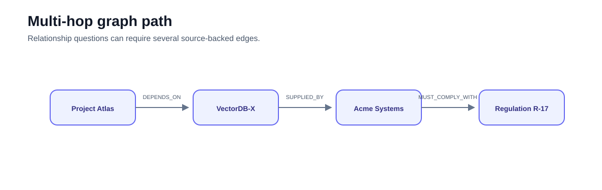
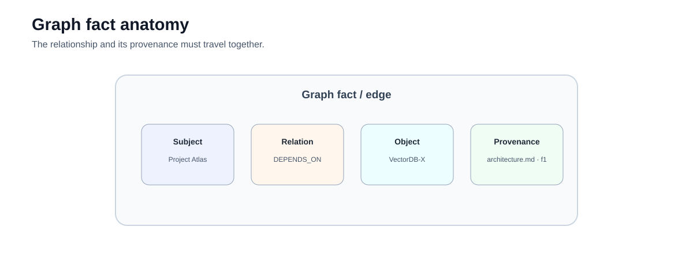
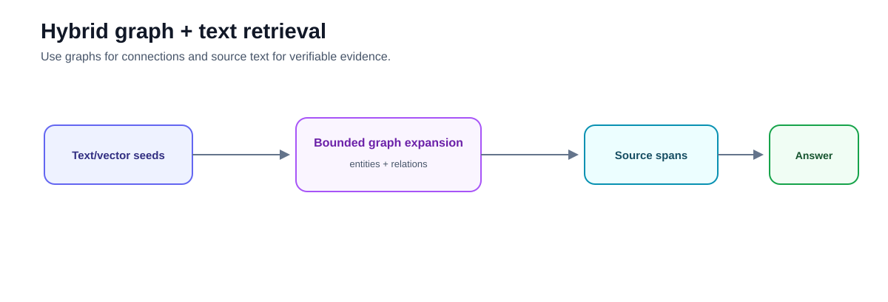

# Advanced 02 — GraphRAG: Relationship Retrieval and Provenance

**Level:** Advanced  
**Estimated time:** 2–3 hours  
**Notebook:** [`02_graphrag.ipynb`](02_graphrag.ipynb)  
**Prerequisite:** Corrective RAG and retrieval evaluation

---

## Why this lesson exists

Text retrieval is strongest when a small number of passages directly contains the answer.

Some questions instead depend on explicit relationships:

```text
Project Atlas
   ↓ depends_on
VectorDB-X
   ↓ supplied_by
Acme Systems
   ↓ must_comply_with
Regulation R-17
```

The notebook demonstrates this with:

1. a manual fact graph containing provenance; and
2. a NetworkX directed graph with a shortest-path query.



Graph-based retrieval can help when the relationship structure itself is the evidence.

It is not a universal replacement for chunk, lexical, or vector retrieval.

---

## Learning objectives

After this lesson you should be able to:

- model relationships as typed graph edges;
- explain why edge provenance matters;
- retrieve a bounded multi-hop path;
- distinguish graph traversal from vector similarity;
- recognize entity-resolution failures;
- preserve edge direction when relation semantics require it;
- explain local vs global GraphRAG at a conceptual level;
- combine graph facts with supporting source text; and
- evaluate path correctness before answer fluency.

---

# 1. What the notebook actually implements

The folder contains only:

```text
README.md
02_graphrag.ipynb
```

There is no `lab.py`, and the notebook is not named `graph_rag.ipynb`.

The manual section defines:

```python
Fact(id, subject, predicate, object, source)
```

which is a good teaching representation because each relationship retains a source.

The NetworkX section then creates a `DiGraph` with relationship labels.

---

# 2. A graph fact needs provenance

A useful relationship record is more than:

```text
A → B
```

Prefer:

```text
fact_id
subject_id
relation_type
object_id
source_document_id
source_span
source_version
tenant
validity
extraction_version
```



Without provenance, a generated relationship claim cannot be reliably audited or retracted.

---

# 3. Entity resolution is a first-class problem

These may refer to the same entity:

```text
Acme Systems
Acme Systems Inc.
ACME
```

Or they may not.

Graph quality depends heavily on:

- canonical IDs;
- aliases;
- tenant scope;
- entity type;
- merge/split decisions.

A wrong merge creates false paths.

A missed merge breaks valid paths.

---

# 4. Direction matters

The notebook finds the shortest path using:

```python
G.to_undirected()
```

This is a useful way to demonstrate connectivity, but it is a **teaching simplification**.

For directional predicates such as:

```text
SUPPLIED_BY
OWNS
DEPENDS_ON
MUST_COMPLY_WITH
```

turning the graph undirected can permit paths that are connected but semantically invalid.

Production traversal should preserve direction rules or explicitly define which relations are safely traversable in reverse.

---

# 5. Notebook provenance limitation

The manual `Fact` objects contain `source`.

The later NetworkX triplets are:

```python
(subject, relation, target)
```

and the edge only stores:

```python
label=relation
```

So the NetworkX section **drops source provenance**.

That is an important limitation.

A better edge would include:

```python
G.add_edge(
    subject,
    target,
    relation=relation,
    source="vendor_list.csv",
    fact_id="f2",
)
```

Then path context can carry citations.

---

# 6. Local GraphRAG

Microsoft GraphRAG's current query engine distinguishes several search modes.

**Local Search** combines knowledge-graph data with related raw text chunks for entity-focused questions.

That general architecture is close to the kind of question in this notebook:

```text
How is Project Atlas connected to R-17?
```

Current Microsoft GraphRAG also provides **Global Search**, **DRIFT Search**, and a basic vector-RAG comparison path.

Those features are not implemented in this notebook.

---

# 7. Global and DRIFT search are different problems

### Global Search

Uses generated community reports in a map-reduce workflow for corpus-level questions such as:

```text
What are the major themes across the dataset?
```

### DRIFT Search

Combines community-level context with iterative local exploration.

Do not present "GraphRAG" as one traversal algorithm.

Different question shapes need different graph retrieval modes.

---

# 8. Hybrid graph + text retrieval

A practical architecture often looks like:

```text
query
  ↓
semantic/lexical seed retrieval
  ↓
resolve entities
  ↓
bounded graph expansion
  ↓
supporting source passages
  ↓
answer with fact + text provenance
```



The graph explains connections.

The source passages provide human-verifiable evidence.

---

# 9. Bound graph traversal

Unbounded graph expansion creates:

- irrelevant context;
- high-degree hub explosions;
- leakage across access boundaries;
- latency;
- difficult citations.

Control:

```text
max hops
max facts
allowed relation types
tenant filter
minimum confidence
time budget
```

---

# 10. Evaluation

Evaluate graph stages separately:

| Stage | Measure |
|---|---|
| Entity extraction | precision / recall |
| Entity resolution | merge/split error |
| Relation extraction | relation correctness |
| Path retrieval | path recall / precision |
| Provenance | source coverage |
| Answer | claim-to-fact support |
| Security | unauthorized node/edge exposure |
| Operations | traversal latency / fan-out |

A fluent multi-hop answer does not prove the graph path is valid.

---

# 11. Exercises

1. Add source metadata to every NetworkX edge.
2. Remove `to_undirected()` and define valid directional traversal.
3. Add aliases for `Acme Systems Inc`.
4. Add a same-named entity in another tenant.
5. Introduce a high-degree hub and enforce a fact budget.
6. Compare graph retrieval to dense text retrieval on relationship vs lookup questions.
7. Produce a cited path where each edge maps back to a source.

---

# 12. Checkpoint

1. When does a graph add value over passage retrieval?
2. Why is relation provenance important?
3. What can go wrong during entity resolution?
4. Why can undirected traversal be semantically unsafe?
5. What provenance does the current NetworkX section lose?
6. What is Microsoft GraphRAG Local Search?
7. How does Global Search differ?
8. Why should graph traversal be bounded?

---

## What comes next

### [Advanced 03 — Agentic RAG](../03-agentic-rag/README.md)

Move from a bounded graph query to runtime tool selection while retaining explicit permission boundaries.

---

## References

- Edge et al. — [From Local to Global: A Graph RAG Approach](https://arxiv.org/abs/2404.16130)
- Microsoft GraphRAG — [Query overview](https://microsoft.github.io/graphrag/query/overview/)
- Microsoft GraphRAG — [Local Search](https://microsoft.github.io/graphrag/query/local_search/)
- Microsoft GraphRAG — [Global Search](https://microsoft.github.io/graphrag/query/global_search/)
- Microsoft GraphRAG — [DRIFT Search](https://microsoft.github.io/graphrag/query/drift_search/)
- NetworkX — [Documentation](https://networkx.org/documentation/stable/)

---

## Key takeaway

**GraphRAG is valuable when relationships are the retrieval problem. A graph path is only trustworthy when its entities, directions, and source-backed edges are trustworthy.**
