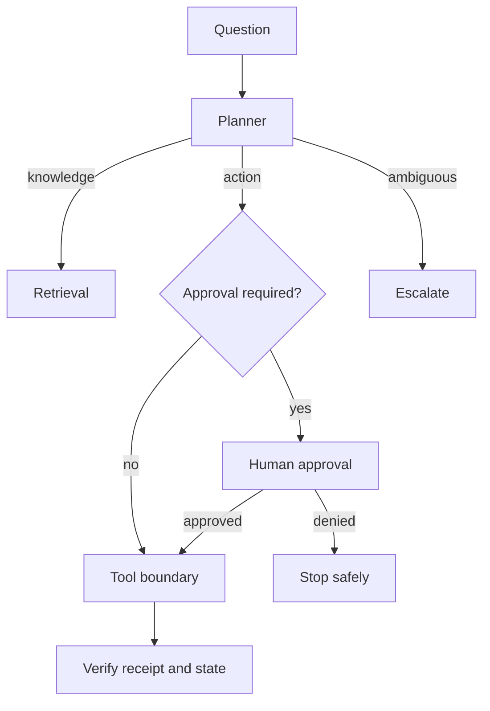

# 03 — Agentic RAG and tool boundaries

**Level:** Advanced  \
**Time:** 60 minutes  \
**Prerequisites:** [GraphRAG](../02-graphrag/README.md)

## Outcome

Route questions between retrieval, tools, and human escalation while keeping state, approval, and trace records explicit.

## Guided notebook

Open [`agentic_rag.ipynb`](agentic_rag.ipynb). The reusable implementation is [`agentic_rag.py`](../../../examples/advanced/agentic_rag.py).

An agent is not authorized merely because a model selected a tool. Enforce identity, allowlists, argument schemas, budgets, approval, idempotency, and post-execution verification outside the model. Keep a trace of route, tool decision, approval, and receipt.

## Exercise

Add a read-only tool that does not require approval and a destructive tool that does. Add a turn budget and a test that a denied approval cannot execute a side effect.
