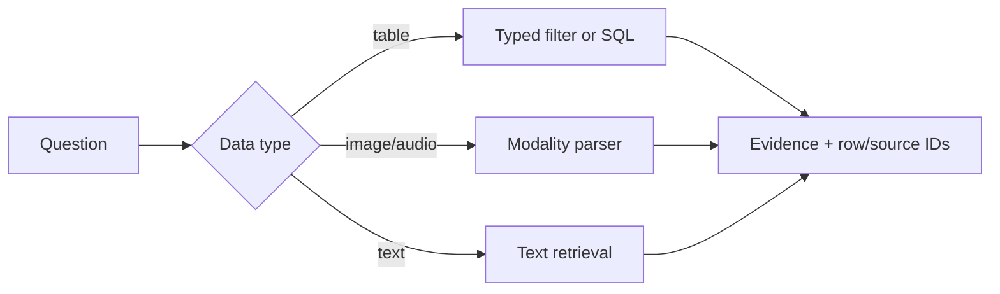

# 04 — Structured and multimodal RAG

**Level:** Advanced  \
**Time:** 60 minutes  \
**Prerequisites:** [agentic RAG](../03-agentic-rag/README.md)

## Outcome

Route table questions to typed filtering and aggregation, preserve row-level provenance, and treat image/audio/OCR assets as modality-specific evidence.

## Guided notebook

Open [`structured_multimodal.ipynb`](structured_multimodal.ipynb). The reusable implementation is [`structured_rag.py`](../../../examples/advanced/structured_rag.py).

For the full scenario-based lab, continue to [NovaTech Multimodal Evidence](../../../notebooks/enterprise/10_multimodal_evidence.ipynb). It combines a typed renewal-risk CSV with a dashboard SVG/OCR fixture, keeps row and visual-region citations separate, gates low-confidence extraction, and includes schema-drift failures.

Do not force numeric aggregation or access-controlled table queries through text similarity alone. Validate schemas, units, permissions, and query results deterministically. Preserve OCR/layout provenance for multimodal sources.

## Exercise

Add a currency or date field and validate it before aggregation. Add an image asset with OCR text and compare its source citation with a plain text document.
