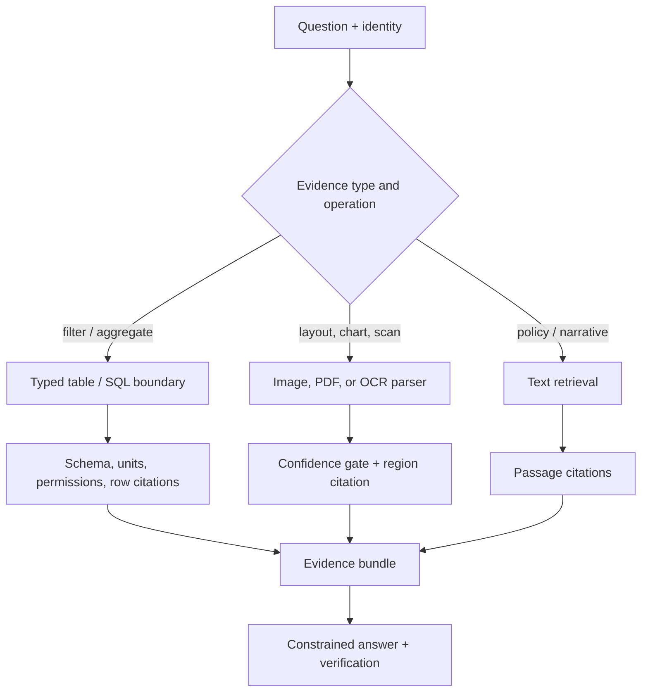

# 04 — Structured and multimodal RAG: tables, images, OCR, and cited evidence

**Level:** Advanced

**Time:** 2–3 hours

**Prerequisites:** [Agentic RAG](../03-agentic-rag/README.md), structured outputs, retrieval evaluation, and basic data validation.

## Why structured and multimodal RAG needs different controls

Not all evidence is prose. A support renewal-risk assistant may need to calculate a total from customer rows, read a chart annotation from a dashboard, inspect an invoice scan, and cite an approved policy paragraph. Text similarity alone cannot safely perform arithmetic, preserve units, validate a date, locate an OCR observation, or enforce row-level access control.

This module uses the **NovaTech renewal-risk investigation**: identify high-risk accounts from a typed CSV, verify a migration warning in a dashboard screenshot/OCR region, and prepare a cited support brief. The result must distinguish **computed table facts**, **visible OCR observations**, and **inferences that require review**.

## Outcome

You will be able to route evidence by modality; validate schemas, units, and permissions; calculate on typed data; preserve row/cell and visual-region provenance; gate uncertain OCR; combine evidence without double-counting; and evaluate multimodal answers for numeric correctness, grounding, citations, and safety.

Open [`structured_multimodal.ipynb`](structured_multimodal.ipynb). It is the complete guided lab. The deterministic reusable functions are in [`structured_rag.py`](../../../examples/advanced/structured_rag.py). For a larger scenario, see [NovaTech Multimodal Evidence](../../../notebooks/enterprise/10_multimodal_evidence.ipynb).



## 1. Step-by-step evidence routing

### Step 1 — classify the operation, not only the modality

| User request | Correct first boundary | Why |
| --- | --- | --- |
| “What is the total renewal risk for Acme?” | Typed filter + aggregation | The answer is a calculation over authorized rows. |
| “Which account has the chart warning?” | Image/OCR region retrieval | The evidence is a visual observation with coordinates. |
| “What does the renewal policy require?” | Text retrieval | A cited paragraph supplies the answer. |
| “Should we contact Acme?” | Combine typed result + visual evidence + policy | The system must state what is computed, observed, and inferred. |

Never use an LLM to silently substitute for a deterministic aggregation. Do math and filters in code/SQL, then provide the result and citations to the model.

### Step 2 — validate data before it becomes evidence

Validate required columns, types, null handling, currency/locale, timestamp timezone, unit conversions, allowed categorical values, and row-level permissions. A valid JSON response is not proof that the underlying data is semantically valid.

```python
errors = validate_table_rows(rows, {"account", "risk_usd", "currency", "as_of"})
if errors:
    raise ValueError(f"schema drift: {errors}")
```

For SQL, use prepared statements, tenant predicates enforced by the database role or view, a query timeout, result limit, and an allowlisted query API. Do not allow a model to compose arbitrary SQL against production data.

### Step 3 — treat OCR and vision as uncertain observations

OCR text must carry asset ID, page, bounding box, extraction engine/version, confidence, and source checksum. A low-confidence token should trigger review, not a fabricated reading. Charts additionally require axis/unit/legend interpretation; a visual estimate is not a financial calculation.

```text
OCR evidence: dashboard.svg, page 1, bbox=(80,290,760,45), confidence=0.98
Table evidence: renewals.csv, row=acme-17, risk_usd=125000, currency=USD
```

### Step 4 — compose an evidence bundle, then verify claims

Keep modality-specific citations separate. A table citation identifies rows/cells; a visual citation identifies page/region; a text citation identifies document/chunk. The answer generator may summarize them together, but a verifier must check that every material claim maps to an evidence object of the right modality.

## 2. Implementation patterns

The reference implementation demonstrates:

- `filter_rows()` and `summarize_rows()` for deterministic typed filtering/aggregation;
- `aggregate_with_citations()` for row-level provenance;
- `validate_table_rows()` for schema drift before aggregation;
- `search_ocr_regions()` with a confidence threshold; and
- `citations_are_known()` to prevent dangling citations.

In production, use typed contracts such as Pydantic/JSON Schema, a governed warehouse or semantic layer for tables, an OCR/document pipeline for visual sources, and a vector/text index for narrative documents. Keep extraction adapters behind a stable evidence model.

## 3. Evaluation and production readiness

| Layer | Measures | Failure to catch |
| --- | --- | --- |
| Structured data | schema-valid rate, numeric accuracy, unit/currency correctness, row-level recall | Correct math over the wrong rows. |
| OCR/vision | field accuracy, region IoU/locator correctness, confidence calibration | A plausible transcription with no recoverable location. |
| Retrieval | modality-route accuracy, source coverage, authorized recall | Querying text when a table calculation is required. |
| Answer | claim support, citation-modality correctness, abstention quality | Mixing observation and inference. |
| Operations | parser latency, OCR cost/page, schema-drift alerts, retry rate | Quiet degradation after a data/source change. |
| Security | tenant leakage, malicious document instructions, file-type/size abuse | Allowing external content to change policy or tool scope. |

Production checklist:

- [ ] Enforce identity and tenant filters at every table, asset, and text boundary.
- [ ] Preserve source snapshot/checksum, revision, and locators for audit/replay.
- [ ] Gate low-confidence OCR and ambiguous chart interpretation for human review.
- [ ] Validate units, locale, timezone, and numeric ranges before arithmetic.
- [ ] Separate deterministic results from model narrative; show assumptions and missing fields.
- [ ] Test scanned PDFs, rotated pages, tables with merged cells, schema drift, prompt injection, and cross-tenant assets.
- [ ] Cache parsers safely and version extraction models/prompts; never cache evidence across identities.

## 4. Technology choices

| Capability | Use when | Technologies to evaluate |
| --- | --- | --- |
| Typed structured outputs | A model must return a validated plan or claim object | JSON Schema / Pydantic and provider structured-output features. |
| Tables and SQL | Exact filtering, aggregation, and permissions matter | Warehouse/SQL views or semantic layer; deterministic query service. |
| OCR/layout | PDFs, forms, and dashboards carry material evidence | Cloud OCR/document AI or local OCR behind a versioned adapter. |
| Vision-language understanding | Images need semantic interpretation beyond OCR | Multimodal model, but retain image/region provenance and review uncertainty. |
| Multimodal retrieval | Text, image, and table sources may all be candidates | Hybrid index with modality-aware metadata and reranking. |

## Exercises

1. Add `currency` and `as_of` fields, reject mixed currencies without an approved conversion rate, and cite every affected row.
2. Add a low-confidence OCR region; prove it cannot support an automated recommendation.
3. Add a chart with an unlabeled axis. What can the system safely say, and what must it ask a human to verify?
4. Add two tenants with the same account name; demonstrate row and asset isolation.
5. Build a claim verifier requiring a table row for numeric claims and a visual locator for dashboard observations.
6. Compare text-only RAG and modality-aware routing over a labeled renewal-risk dataset.

## References

- [RAG foundational paper — Lewis et al.](https://arxiv.org/abs/2005.11401)
- [Pydantic documentation](https://docs.pydantic.dev/) — typed validation boundary.
- [NIST AI Risk Management Framework](https://www.nist.gov/itl/ai-risk-management-framework) — governance and risk framing.
- [NovaTech Multimodal Evidence notebook](../../../notebooks/enterprise/10_multimodal_evidence.ipynb) — repository scenario continuation.
