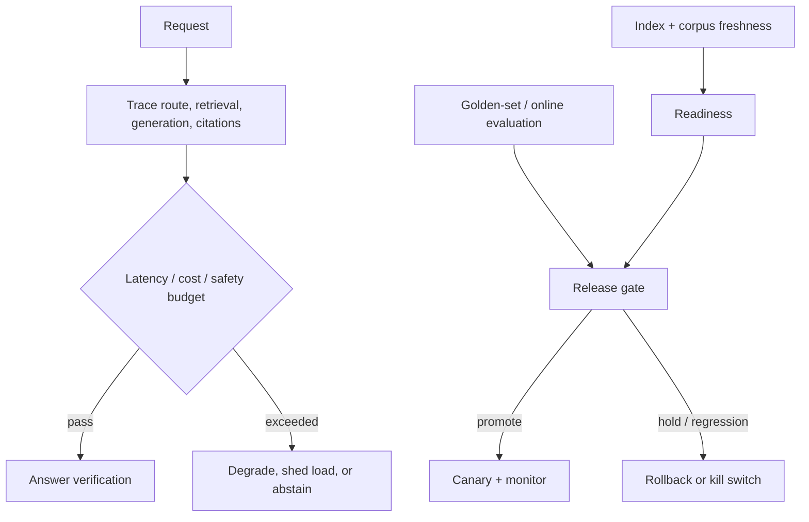

# 05 — Production RAG operations: measure, release, recover, and govern

**Level:** Advanced

**Time:** 2–3 hours

**Prerequisites:** all preceding advanced modules and the [evaluation track](../../../notebooks/evaluation/README.md).

## Why operations is part of RAG quality

A response can be fluent and even grounded while the system is operationally unsafe: the index is stale, a retrieval dependency is timing out, an evaluator is failing open, a new embedding version has degraded recall, a fallback route has multiplied cost, or a trace leaks sensitive text. Production RAG quality is the combination of **answer quality, retrieval quality, safety, latency, cost, freshness, and recoverability**.

This module follows a Northstar Cloud release: a new chunking/reranking configuration looks better in a demo. Learners must decide whether it can be promoted, observe it in a canary, detect a stale index and rising fallback rate, contain the incident, and roll back safely.

## Outcome

Build an operational contract that instruments a request, separates service readiness from corpus freshness, enforces budgets, gates releases on evaluation, detects degradation, supports circuit breaking and kill switches, and preserves redacted traces for incident response.

Open [`production_operations.ipynb`](production_operations.ipynb). Its deterministic examples run without infrastructure. Reusable primitives are in [`operations.py`](../../../examples/advanced/operations.py).



## 1. Step-by-step operational design

### Step 1 — define SLOs and error budgets by user impact

Separate service SLOs from model-quality objectives. Example: p95 retrieval+generation latency < 3 s, p99 < 8 s; 99.9% availability; citation coverage > 95% for factual answer classes; no cross-tenant retrieval; and a golden-set groundedness threshold before release. A lower cost is not a valid trade if it causes unsupported answers.

### Step 2 — trace the trajectory, redact the content

Record trace ID, request class, tenant pseudonym, policy/retriever/index/model versions, route, candidate IDs, source revisions, evaluator results, tool calls, latency by stage, token/cost estimate, cache state, and terminal reason. Do not default to logging raw prompts, secrets, private documents, or full tool output.

### Step 3 — distinguish readiness, freshness, and quality

| Signal | Question answered | Example action |
| --- | --- | --- |
| Readiness | Can dependencies answer requests? | Shed traffic when vector store/evaluator is unavailable. |
| Freshness | Is the corpus/index current enough? | Serve a dated answer, disable fresh-data claims, or abstain. |
| Offline quality | Should this configuration be promoted? | Hold release if golden-set recall/citation metrics regress. |
| Online quality | Is real traffic behaving as expected? | Canary rollback on route, latency, or feedback regression. |

### Step 4 — release with gates and canaries

Version prompts, chunking, corpus snapshot, embedding model, retriever, reranker, evaluator, and policy together. Evaluate a held-out set, run security/adversarial tests, validate readiness, then canary a small identity-safe traffic slice. Define rollback *before* promotion: previous version, owner, trigger, communication path, and cache/index compatibility.

### Step 5 — degrade safely

Examples: disable external retrieval on an outage; switch from expensive reranking to a measured baseline; return read-only results during an action-system incident; or abstain when citation verification is unavailable. Do not silently remove authorization, verification, or safety checks to maintain apparent availability.

## 2. Incident response and observability

```text
Signal -> classify -> contain -> investigate -> recover -> verify -> learn
  |        |            |             |             |          |
  |        |            |             |             |          +-- post-incident regression test
  |        |            |             |             +-- replay golden/adversarial cases
  |        |            |             +-- traces, versions, corpus/index diff
  |        |            +-- circuit breaker / kill switch / rollback
  |        +-- quality, freshness, safety, cost, latency, availability
  +-- alert with trace IDs and tenant-safe context
```

High-signal alerts include: empty-retrieval spikes, stale-index age, route distribution shifts, citation-verification failures, authorization denials, evaluator timeout/fail-open events, p95/p99 latency, cost per supported answer, and cross-tenant policy violations. Alert fatigue is itself an operational risk: pair each alert with an owner, runbook, threshold rationale, and expected mitigation.

## 3. Evaluation-driven release gates

Release gates should include normal, ambiguous, no-answer, stale, access-restricted, adversarial, and multimodal cases. Track retrieval recall/precision, grounded answer/citation correctness, abstention behavior, tool trajectory correctness, latency, cost, and safety. Use statistical confidence where traffic volume supports it; do not promote because one demo looks better.

The reference `release_gate()` is deliberately simple: it holds a deployment when golden-set quality, readiness, freshness, or error rate violate policy. Production gates need richer telemetry but should retain this explainability.

## 4. Security and governance

- Apply identity and tenant checks at retrieval, cache, tool, trace, and evaluation boundaries.
- Redact/sanitize telemetry; define retention and access policies for traces and evaluation sets.
- Use least-privilege credentials, secret rotation, dependency provenance, rate limits, and egress controls.
- Test prompt injection, tool poisoning, malicious documents, schema drift, replay, and cross-tenant access in CI.
- Maintain a kill switch that degrades to a safe mode rather than bypassing verification or authorization.

## Exercises

1. Add separate retrieval and generation stage timing to a trace; identify the dominant p95 component.
2. Create an evaluation regression that improves relevance but violates latency/cost SLO. Should it promote?
3. Simulate an index 30 hours stale for a tenant with a 12-hour freshness policy; design the response copy and route.
4. Add a circuit breaker triggered by three verifier failures; prove a request is served through a safe fallback or abstention path.
5. Write a rollback runbook for an embedding-model change including cache compatibility and corpus reindexing.
6. Build a privacy review for traces: which fields are required for diagnosis and which must be redacted?

## References

- [OpenTelemetry](https://opentelemetry.io/) — interoperable tracing and metrics.
- [NIST AI Risk Management Framework](https://www.nist.gov/itl/ai-risk-management-framework) — governance/risk framing.
- [Ragas documentation](https://docs.ragas.io/) — RAG evaluation tooling.
- [Qdrant production checklist](https://qdrant.tech/documentation/production-checklist/) — operational vector-search considerations.
