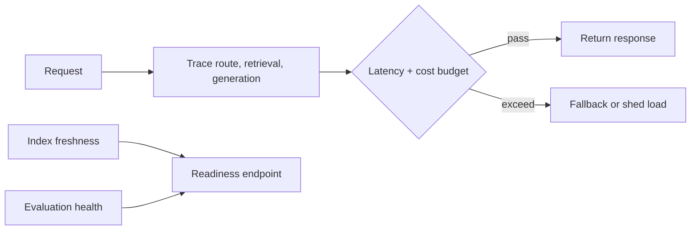

# 05 — Production RAG operations

**Level:** Advanced  \
**Time:** 60 minutes  \
**Prerequisites:** [structured and multimodal RAG](../04-structured-multimodal/README.md)

## Outcome

Instrument a RAG request, enforce latency and cost budgets, detect stale indexes, and expose readiness signals for safe operations.

## Guided notebook

Open [`production_operations.ipynb`](production_operations.ipynb). The reusable implementation is [`operations.py`](../../../examples/advanced/operations.py).

Operational readiness is more than a successful model call. Track retrieval and generation latency separately, cost, empty retrieval, citation coverage, corpus freshness, index failures, evaluator health, and incident traces. Minimize sensitive content in logs and provide a rollback or kill switch.

## Exercise

Add a trace ID, a circuit-breaker state, and a freshness threshold per tenant. Write a regression gate that refuses deployment when a golden-set metric or readiness check fails.
