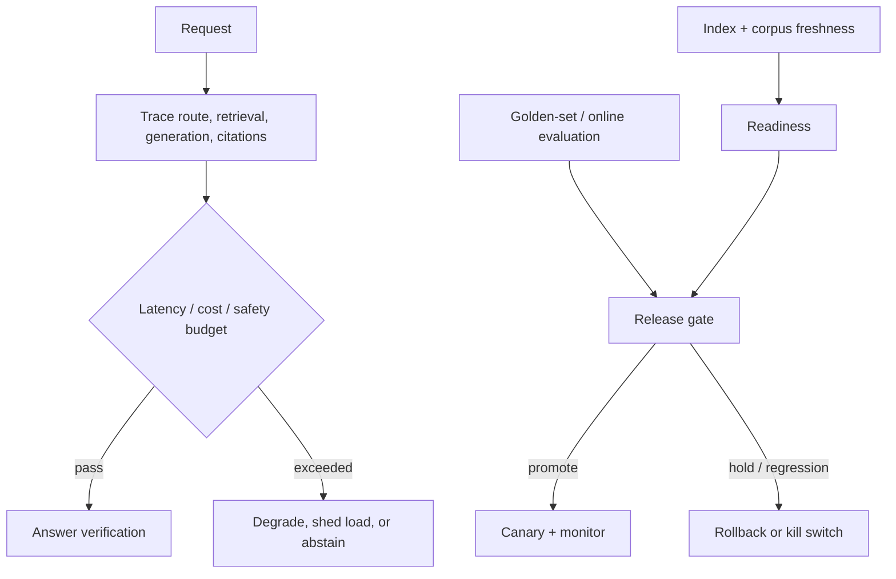

# 05 — Production RAG operations: measure, release, recover, and govern

**Level:** Advanced

**Time:** 2–3 hours

**Prerequisites:** all preceding advanced modules and the [evaluation track](../../../notebooks/evaluation/README.md).

## Why operations is part of RAG quality

A response can be fluent and even grounded while the system is operationally unsafe: the index is stale, a retrieval dependency is timing out, an evaluator is failing open, a new embedding version has degraded recall, a fallback route has multiplied cost, or a trace leaks sensitive text. Production RAG quality is the combination of **answer quality, retrieval quality, safety, latency, cost, freshness, and recoverability**.

This module follows a Northstar Cloud release: a new chunking/reranking configuration looks better in a demo. Learners must decide whether it can be promoted, observe it in a canary, detect a stale index and rising fallback rate, contain the incident, and roll back safely.

## Outcome

Build an operational contract that instruments a request, separates service readiness from corpus freshness, enforces budgets, gates releases on evaluation, detects degradation, supports circuit breaking and kill switches, and preserves redacted traces for incident response.

Open [`production_operations.ipynb`](production_operations.ipynb). Its deterministic examples run without infrastructure. Reusable primitives are in [`lab.py`](lab.py).



## 1. Step-by-step operational design

### Step 1 — define SLOs and error budgets by user impact

Separate service SLOs from model-quality objectives. Example: p95 retrieval+generation latency < 3 s, p99 < 8 s; 99.9% availability; citation coverage > 95% for factual answer classes; no cross-tenant retrieval; and a golden-set groundedness threshold before release. A lower cost is not a valid trade if it causes unsupported answers.

### Step 2 — trace the trajectory, redact the content

Record trace ID, request class, tenant pseudonym, policy/retriever/index/model versions, route, candidate IDs, source revisions, evaluator results, tool calls, latency by stage, token/cost estimate, cache state, and terminal reason. Do not default to logging raw prompts, secrets, private documents, or full tool output.

### Step 3 — distinguish readiness, freshness, and quality

| Signal | Question answered | Example action |
| --- | --- | --- |
| Readiness | Can dependencies answer requests? | Shed traffic when vector store/evaluator is unavailable. |
| Freshness | Is the corpus/index current enough? | Serve a dated answer, disable fresh-data claims, or abstain. |
| Offline quality | Should this configuration be promoted? | Hold release if golden-set recall/citation metrics regress. |
| Online quality | Is real traffic behaving as expected? | Canary rollback on route, latency, or feedback regression. |

### Step 4 — release with gates and canaries

Version prompts, chunking, corpus snapshot, embedding model, retriever, reranker, evaluator, and policy together. Evaluate a held-out set, run security/adversarial tests, validate readiness, then canary a small identity-safe traffic slice. Define rollback *before* promotion: previous version, owner, trigger, communication path, and cache/index compatibility.

### Step 5 — degrade safely

Examples: disable external retrieval on an outage; switch from expensive reranking to a measured baseline; return read-only results during an action-system incident; or abstain when citation verification is unavailable. Do not silently remove authorization, verification, or safety checks to maintain apparent availability.

## 2. Incident response and observability

```text
Signal -> classify -> contain -> investigate -> recover -> verify -> learn
  |        |            |             |             |          |
  |        |            |             |             |          +-- post-incident regression test
  |        |            |             |             +-- replay golden/adversarial cases
  |        |            |             +-- traces, versions, corpus/index diff
  |        |            +-- circuit breaker / kill switch / rollback
  |        +-- quality, freshness, safety, cost, latency, availability
  +-- alert with trace IDs and tenant-safe context
```

High-signal alerts include: empty-retrieval spikes, stale-index age, route distribution shifts, citation-verification failures, authorization denials, evaluator timeout/fail-open events, p95/p99 latency, cost per supported answer, and cross-tenant policy violations. Alert fatigue is itself an operational risk: pair each alert with an owner, runbook, threshold rationale, and expected mitigation.

## 3. Evaluation-driven release gates

Release gates should include normal, ambiguous, no-answer, stale, access-restricted, adversarial, and multimodal cases. Track retrieval recall/precision, grounded answer/citation correctness, abstention behavior, tool trajectory correctness, latency, cost, and safety. Use statistical confidence where traffic volume supports it; do not promote because one demo looks better.

The reference `release_gate()` is deliberately simple: it holds a deployment when golden-set quality, readiness, freshness, or error rate violate policy. Production gates need richer telemetry but should retain this explainability.

### Canary release procedure

Define the canary procedure **before** the first production deployment:

```
1. Prepare release artifacts
   - Version bundle: prompt v, chunking config v, corpus snapshot v,
     embedding model v, retriever config v, policy version
   - Evaluation report: held-out recall, faithfulness, latency, cost
   - Security test report: cross-tenant, injection, stale-source

2. Gate check (all must pass)
   - Golden-set recall ≥ threshold (no regression vs previous version)
   - Citation validity = 100% (deterministic)
   - Authorization isolation = pass (zero cross-tenant leaks)
   - p95 latency ≤ SLO
   - cost per supported answer ≤ budget

3. Canary deployment (1-5% traffic)
   - Route by tenant hash or feature flag (not randomly)
   - Monitor for 30-60 minutes:
     - Retrieval fallback rate
     - Citation failure rate
     - Route distribution shift
     - p95/p99 latency
     - Error rate and timeout rate
   - Define rollback trigger threshold before starting canary

4. Rollback
   - Automated: rollback if any hard gate fires during canary
   - Manual: rollback via kill switch within 5 minutes of detection
   - Cache compatibility: verify old and new versions share key format
   - Index compatibility: verify old vectors remain valid if rollback needed

5. Full promotion
   - Ramp to 100% after canary window passes
   - Keep previous version artifacts for 30-day rollback window
```

### SLO error budgets

An error budget makes the trade-off between reliability and deployment velocity explicit:

```
Availability SLO: 99.9%
Monthly error budget: 0.1% × 30 days × 24 hours = 43.2 minutes/month of allowed downtime

Latency SLO: p95 < 3s
Quality SLO: faithfulness ≥ 0.85 on supported queries

If error budget is >50% consumed:
  → Freeze non-emergency deployments
  → Prioritize reliability improvements

If error budget is <10% consumed:
  → Capacity for faster release cadence
```

Track error budget consumption in real-time. Make it visible to both engineering and product teams.

## 4. Cost accounting

Operational sustainability requires knowing the full cost of each production request.

### Cost components to measure

| Component | How to measure | Typical range |
|---|---|---|
| Embedding inference | token count × cost/token (or inference time for local models) | $0.0001–0.001 per query |
| Vector search | retrieval calls × cost/call (or infra cost / queries) | $0.0001–0.01 per query |
| Reranker | candidate count × cost/candidate | $0.001–0.01 per query |
| LLM generation | input tokens + output tokens × cost/token | $0.005–0.10 per query |
| External tool calls | API calls × cost/call | varies |
| Caching | negative cost (savings from cache hits) | -$0.005 per cache hit |

### Cost per successful supported answer

The key composite metric:

```python
cost_per_success = (
    total_cost_usd
    / (n_queries × faithfulness_rate × citation_valid_rate × grounded_rate)
)
```

A configuration that costs 20% less per query but produces 40% fewer grounded
answers has a *higher* cost per success, not lower. Track this metric alongside
raw cost per query.

### Cost alerting thresholds

| Alert | Trigger | Response |
|---|---|---|
| Cost spike | Cost per query > 2× baseline | Investigate; check fallback loop, reranker fan-out |
| Reranker overload | Reranker candidate count > 2× expected | Check retrieval fan-out; verify budget is enforced |
| LLM token overrun | Output tokens > 3× expected | Check context budget enforcement |
| External API bill | Daily API cost > budget threshold | Rate limit; enable caching; review fallback rate |

## 5. Corpus governance

A corpus is not a static artifact. It requires ongoing governance:

### Corpus lifecycle policies

| Policy | Definition | Example |
|---|---|---|
| Ingestion SLA | How quickly new documents are indexed | < 4 hours for operational runbooks |
| Freshness SLO | Maximum allowed index lag | < 24 hours for policy documents |
| Retention policy | How long documents remain retrievable | 7 years for financial documents; 90 days for operational logs |
| Deletion guarantee | How quickly tombstones propagate | < 1 hour for security-sensitive revocations |
| Reindexing policy | When full reindexing is triggered | New embedding model; new chunking config; corpus correction |

### Corpus quality monitoring

- **Duplicate document rate**: same content from multiple sources
- **Stale document rate**: documents past their `valid_to` date still in index
- **Schema completeness rate**: chunks with all required metadata fields
- **Ingestion error rate**: documents that failed to parse or embed
- **Orphaned chunk rate**: chunks whose parent document was deleted

Alert on anomalies in any of these metrics. A corpus that gradually degrades quality is harder to detect than an outage but causes progressive answer quality degradation.

### Source accountability

Every source in the corpus should have a documented:
- Owner: who is responsible for maintaining it
- Review cadence: how often it is reviewed for accuracy
- Update notification: who is notified when the RAG system ingests a change
- Removal authority: who can request emergency revocation

Without source accountability, the corpus gradually accumulates outdated,
incorrect, and unauthorized content. This is the most common cause of answer quality
degradation in mature production RAG systems.

## 6. Security and governance

- Apply identity and tenant checks at retrieval, cache, tool, trace, and evaluation boundaries.
- Redact/sanitize telemetry; define retention and access policies for traces and evaluation sets.
- Use least-privilege credentials, secret rotation, dependency provenance, rate limits, and egress controls.
- Test prompt injection, tool poisoning, malicious documents, schema drift, replay, and cross-tenant access in CI.
- Maintain a kill switch that degrades to a safe mode rather than bypassing verification or authorization.
- Document source ownership, review cadence, and emergency revocation process for every corpus source.
- Version all evaluation artifacts alongside system artifacts; never evaluate on data used for tuning decisions.

## Exercises

1. Add separate retrieval and generation stage timing to a trace; identify the dominant p95 component.
2. Create an evaluation regression that improves relevance but violates latency/cost SLO. Should it promote?
3. Simulate an index 30 hours stale for a tenant with a 12-hour freshness policy; design the response copy and route.
4. Add a circuit breaker triggered by three verifier failures; prove a request is served through a safe fallback or abstention path.
5. Write a rollback runbook for an embedding-model change including cache compatibility and corpus reindexing.
6. Build a privacy review for traces: which fields are required for diagnosis and which must be redacted?
7. Calculate the error budget for a 99.9% availability SLO. At what point should you freeze deployments?
8. Design corpus governance policies for a corpus containing runbooks (change daily) and legal policies (change quarterly). How do freshness SLOs, retention policies, and reindexing cadence differ?

## References

- [OpenTelemetry](https://opentelemetry.io/) — interoperable tracing and metrics.
- [NIST AI Risk Management Framework](https://www.nist.gov/itl/ai-risk-management-framework) — governance/risk framing.
- [Ragas documentation](https://docs.ragas.io/) — RAG evaluation tooling.
- [Qdrant production checklist](https://qdrant.tech/documentation/production-checklist/) — operational vector-search considerations.
- [Google SRE Book: SLOs and Error Budgets](https://sre.google/sre-book/service-level-objectives/) — SLO methodology.
- [DORA metrics](https://dora.dev/guides/dora-metrics-four-keys/) — deployment frequency, lead time, MTTR, change failure rate.
- [OWASP Top 10 for LLM Applications 2025](https://owasp.org/www-project-top-10-for-large-language-model-applications/assets/PDF/OWASP-Top-10-for-LLMs-v2025.pdf) — LLM security.

