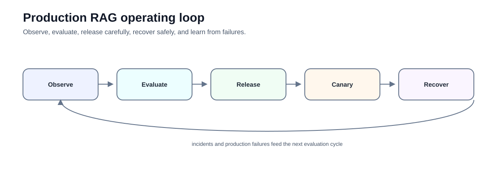
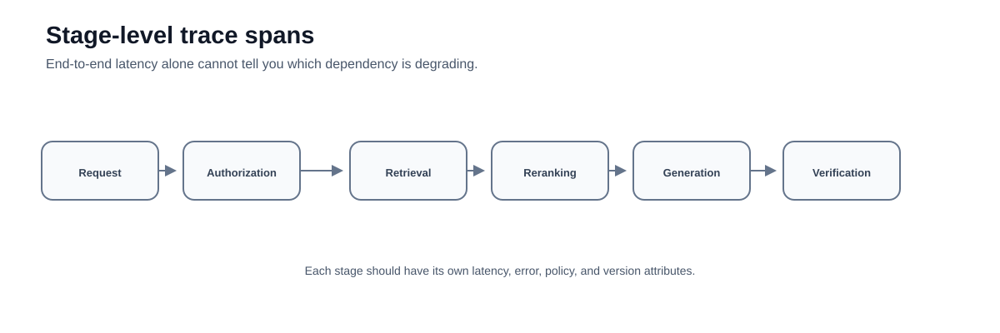
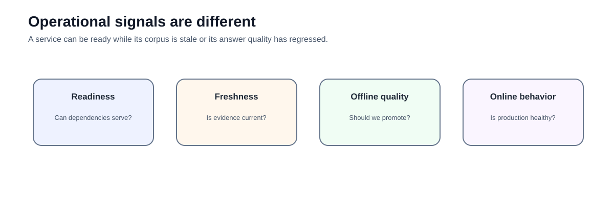

# Advanced 06 — Production RAG Operations: Observe, Release, Degrade, and Recover

**Level:** Advanced  
**Estimated time:** 2–3 hours  
**Notebook:** [`05_production_operations.ipynb`](05_production_operations.ipynb)  
**Prerequisite:** complete the preceding advanced modules

> **Repository note:** this folder is `06-production-operations`, but the existing notebook is named `05_production_operations.ipynb`. This README intentionally links to the real file.

---

## Why this lesson exists

A RAG system can be grounded and still be operationally unsafe.

Examples:

- index freshness is outside policy;
- retrieval latency spikes;
- a new embedding version reduces recall;
- a fallback loop multiplies cost;
- citation verification is unavailable;
- telemetry leaks sensitive text.

Production quality combines:

```text
retrieval quality
answer support
authorization
freshness
latency
cost
observability
recoverability
```



The notebook demonstrates a small subset of this: callback-based LLM timing and simulated cost accounting around a mock LCEL pipeline.

---

## Learning objectives

After this lesson you should be able to:

- separate service reliability from RAG quality;
- define service-level objectives and release thresholds;
- instrument stage-level latency and cost;
- understand what the notebook's callback does and does not measure;
- define release gates and canary rollback criteria;
- distinguish readiness, freshness, and answer quality;
- design safe degraded modes;
- version retrieval/model/prompt/index artifacts together; and
- turn incidents into regression tests.

---

# Deep dive — Production RAG operations

## Production RAG is a distributed evidence system

A production RAG request can cross many components:

```text
API/auth
  ↓
router
  ↓
retriever / database / graph / tools
  ↓
reranker
  ↓
context builder
  ↓
LLM
  ↓
verification
  ↓
response
```

Each component can fail independently. Traditional API health metrics are necessary but insufficient because a system can return HTTP 200 responses while retrieval quality, freshness, or grounding has silently degraded.

Production operations therefore needs both **software reliability telemetry** and **AI/evidence quality telemetry**.

## Observability model

A useful trace hierarchy is:

```text
rag.request
 ├─ auth.check
 ├─ route.select
 ├─ retrieval.search
 │   ├─ sparse.search
 │   └─ vector.search
 ├─ rerank
 ├─ context.build
 ├─ gen_ai.chat
 └─ answer.verify
```

Each span should record low-cardinality operational attributes and stable identifiers for deeper investigation.

Useful attributes include:

```text
trace_id
route
model/version
retriever version
index/corpus version
candidate count
selected evidence IDs
latency
token usage
policy result
terminal reason
```

Avoid turning traces into uncontrolled copies of private prompts and documents.

## OpenTelemetry and GenAI telemetry

OpenTelemetry's GenAI semantic-convention work provides standardized attributes for model operations, token usage, tool calls, and retrieval-related telemetry. Current guidance treats prompt/message content as potentially sensitive and opt-in.

This is a useful direction for vendor-neutral observability: instrument the application once and export traces/metrics through standard telemetry infrastructure rather than coupling operational evidence to one model vendor.

## Four operational planes

A useful production model separates:

### 1. Service reliability

- availability;
- request latency;
- dependency errors;
- saturation;
- timeouts.

### 2. Retrieval/data health

- index freshness;
- ingestion lag;
- embedding failures;
- empty retrieval rate;
- candidate count distribution;
- authorization-filter drop rate.

### 3. AI quality

- retrieval recall on sampled/labelled traffic;
- claim support;
- citation correctness;
- abstention quality;
- route correctness.

### 4. Economics

- tokens/request;
- retrieval/tool cost;
- cost by route;
- cost per successful supported task;
- cache effectiveness.

A dashboard that shows only model latency is not RAG observability.

## SLI, SLO, and release threshold

Traditional service SLOs and model-quality thresholds should be related but not conflated.

Example:

```text
Service SLO:
  99.9% requests complete within availability policy

Latency SLO:
  p95 end-to-end latency < application target

Freshness invariant:
  policy documents indexed within X minutes of publication

Quality release gate:
  Recall@k and citation support must not regress beyond tolerance
```

Quality may be measured offline or through sampled online evaluation rather than every request.

## Freshness architecture

Freshness is a first-class RAG reliability property.

Track:

```text
source_updated_at
ingested_at
embedded_at
index_published_at
query_time
```

This allows calculation of source-to-index lag. Different source classes can have different freshness requirements.

A retriever returning a perfectly relevant but obsolete policy is a production failure.

## Versioning and reproducibility

A RAG answer depends on more than the model name. Treat the deployed configuration as a release bundle:

```text
application version
prompt version
embedding model
chunker/parser version
retriever parameters
reranker model
corpus snapshot
index version
policy version
agent/tool definitions
evaluator version
generation model
```

Attach the bundle ID to traces. When a regression appears, you need to reconstruct exactly which evidence system produced the answer.

## Offline evaluation as CI/CD

A RAG release pipeline should run evaluation before promotion.

```text
change
  ↓
unit/component tests
  ↓
retrieval benchmark
  ↓
end-to-end evaluation
  ↓
safety/authorization tests
  ↓
latency/cost benchmark
  ↓
release decision
```

Hard invariants such as cross-tenant leakage should fail the release immediately. They should not be averaged into a composite quality score.

## Online evaluation

Offline datasets cannot capture every production query. Online quality monitoring can use:

- sampled human review;
- user feedback with careful interpretation;
- automated claim/evidence checks;
- route anomaly detection;
- shadow evaluation;
- production failure clustering.

LLM-as-judge can be useful for scalable signals, but it should be calibrated against human labels and not become the sole arbiter of high-risk correctness.

## Canary and shadow releases

### Canary

Send a small controlled portion of eligible traffic to the candidate release and compare:

- errors;
- latency;
- cost;
- retrieval distributions;
- quality signals.

### Shadow

Run the candidate in parallel without serving its answer. This is useful for comparing retrieval/model changes with low user risk, although it increases infrastructure/model cost and requires careful privacy handling.

## Rollback design

Rollback must consider compatibility between components.

Rolling back only the application while leaving a new incompatible index can fail. Define rollback units for:

```text
code
prompt
model
index
schema
policy
cache
```

Keep the last known-good release bundle and test rollback procedures before incidents.

## Safe degradation

Design degraded modes in advance.

Examples:

```text
reranker unavailable → use authorized base retrieval
external search unavailable → internal-only + freshness warning/abstain
verification unavailable → abstain for high-risk task
agent tool unavailable → read-only answer
fresh index unavailable → refuse freshness-sensitive query
```

Never degrade by bypassing authorization or silently removing safety checks.

## Capacity and latency engineering

End-to-end latency is a sum of stage latencies plus queueing and retries.

Important techniques include:

- parallel independent retrieval;
- bounded candidate counts;
- asynchronous I/O;
- embedding caches;
- response/prompt caching where semantics permit;
- model tiering;
- timeout budgets per dependency;
- backpressure;
- circuit breakers.

Set a latency budget per stage rather than allowing every dependency to consume the full request timeout.

## Cost engineering

Cost includes more than output tokens:

```text
ingestion parsing
embeddings
vector/graph storage
retrieval compute
reranking
LLM input/output
agent loops
tool/API calls
evaluation
observability
```

Measure cost by route and task outcome. Average cost/request can hide a small class of agentic queries that dominate spend.

## Privacy-aware telemetry

Prompts, retrieved documents, tool outputs, and traces may contain sensitive information.

Define:

- what content is logged;
- redaction rules;
- retention period;
- access controls;
- sampling;
- data residency;
- incident access procedures.

Prefer stable evidence IDs and metadata over full raw content when that is sufficient for diagnosis.

## Incident taxonomy

Classify incidents by subsystem:

```text
retrieval relevance
index freshness
authorization
model behavior
citation/provenance
routing
agent/tool execution
latency/availability
cost anomaly
```

The classification determines containment. For example, a stale index may require disabling freshness-sensitive answers, while a tenant-filter defect may require immediate shutdown of the affected route.

## Incident-to-evaluation loop

Every meaningful production failure should become a regression case:

```text
production failure
   ↓
minimal reproducible case
   ↓
root cause
   ↓
fix
   ↓
new automated evaluation/test
   ↓
release gate
```

This is how the evaluation suite evolves from synthetic examples into an operational memory of real failure modes.

## Production readiness review

Before launch, answer:

1. What is the authoritative evidence source for each route?
2. How is authorization enforced before model access?
3. What is the freshness requirement?
4. Which versions are attached to each trace?
5. What are the quality release gates?
6. What happens when each dependency fails?
7. What is the rollback unit?
8. What telemetry may contain sensitive data?
9. What is the cost/latency budget?
10. Who owns incidents and evaluation regressions?

Production RAG maturity is the ability to answer these questions consistently—not the number of frameworks in the stack.

---

# Notebook companion

The sections below connect the theory above to the executable notebook, identify deliberate simplifications, and highlight production gaps.

# 1. What the notebook actually implements

The notebook:

- defines example SLO concepts;
- defines a "cost per grounded answer" idea;
- creates `ProductionMetricsCallback`;
- measures LLM callback latency;
- estimates cost from **character length** using simulated prices;
- runs a mock retrieval + prompt + fake LLM pipeline.

This is useful instrumentation training.

It is not production billing or complete distributed tracing.

---

# 2. Important instrumentation limitation

`mock_retrieve` is a plain Python function.

It does not emit LangChain retriever callback events.

Therefore the custom callback does **not** actually record retrieval latency as a retriever span.

The notebook also accumulates:

```text
total LLM latency
```

rather than true end-to-end latency.

For production, capture explicit spans:

```text
request
 ├─ authorization
 ├─ retrieval
 ├─ reranking
 ├─ context build
 ├─ generation
 └─ verification
```



---

# 3. Cost estimates are simulated

The notebook estimates token cost from character lengths and hard-coded example rates.

Do not use those values for financial planning.

Production accounting should use:

- actual provider usage metadata where available;
- actual local-inference resource accounting;
- current model/provider pricing;
- infrastructure cost allocation;
- external-tool/API costs.

Pricing changes over time.

---

# 4. Define cost per successful supported answer directly

A robust composite metric is:

```python
cost_per_success = total_cost / successful_supported_answers
```

where `successful_supported_answers` is counted from evaluated outcomes.

Avoid multiplying several aggregate rates together and assuming independence:

```text
n × faithfulness_rate × citation_rate × grounded_rate
```

Those metrics may overlap and be statistically dependent.

Count successful cases directly whenever possible.

---

# 5. SLOs are application-specific

The notebook's values such as:

```text
p95 < 3 seconds
99.9% availability
```

are examples.

They are not universal RAG standards.

Set SLOs from:

- user workflow;
- business impact;
- dependency reliability;
- risk class;
- cost envelope.

Also separate:

### Service SLO

```text
availability / latency
```

from:

### Quality release threshold

```text
retrieval recall
citation validity
false-answer rate
```

Model-quality metrics do not behave exactly like traditional service availability SLOs.

---

# 6. Readiness vs freshness vs quality



### Readiness

Can required dependencies serve requests?

### Freshness

Is the corpus/index current enough for this answer class?

### Offline quality

Should this configuration be promoted?

### Online behavior

Is production traffic behaving as expected?

A healthy HTTP endpoint does not mean the knowledge base is current.

---

# 7. Version the release bundle

Track together:

```text
prompt version
chunking version
embedding model
retriever config
reranker config
corpus snapshot
index version
policy version
evaluator version
generation model
```

Without this bundle, rollback and incident reconstruction become guesswork.

---

# 8. Release gate

A useful release gate can combine:

```text
retrieval metric thresholds
citation invariants
abstention behavior
security tests
latency budget
cost budget
freshness
```

Hard safety constraints such as cross-tenant isolation should not be averaged with softer quality metrics.

---

# 9. Canary and rollback

Before a release, define:

```text
canary population
monitoring window
rollback thresholds
previous stable version
cache compatibility
index compatibility
owner
```

Do not invent fixed percentages or monitoring durations as universal rules.

Choose them according to traffic volume and risk.

---

# 10. Safe degradation

When dependencies fail, degrade capability rather than policy.

Possible safe modes:

```text
disable optional reranking
disable external retrieval
serve dated read-only evidence
disable side-effecting tools
abstain when verification unavailable
```

Unsafe degradation:

```text
skip authorization
skip citation validation
silently use stale data
```

---

# 11. Telemetry and privacy

Trace enough to diagnose:

```text
trace ID
route
version bundle
candidate IDs
source versions
latency
token usage
policy result
terminal reason
```

Do not automatically log:

- full private documents;
- secrets;
- raw tool credentials;
- unnecessary user PII;
- hidden model reasoning.

Use redaction and retention policies.

---

# 12. Incident loop

```text
detect
  ↓
classify
  ↓
contain
  ↓
investigate
  ↓
recover
  ↓
verify
  ↓
add regression case
```

Production incidents should improve the evaluation suite.

---

# 13. Exercises

1. Add explicit timers around retrieval and generation.
2. Compute true end-to-end latency.
3. Replace character-based token estimates with a real tokenizer or provider usage record.
4. Define `successful_supported_answer` as a per-case boolean and compute cost per success.
5. Simulate stale-index policy and safe degradation.
6. Define a release bundle with all relevant versions.
7. Create a canary rollback condition.
8. Redesign the trace schema to avoid storing raw sensitive text.

---

# 14. Checkpoint

1. What does the notebook callback actually measure?
2. Why is character count not reliable billing data?
3. How should cost per successful supported answer be calculated?
4. What is the difference between readiness and freshness?
5. Why are example SLO numbers not universal?
6. Which failures should hard-block a release?
7. What should safe degradation preserve?
8. What information is required for rollback?

---

# References

- OpenTelemetry — [Documentation](https://opentelemetry.io/docs/)
- Google SRE — [Service Level Objectives](https://sre.google/sre-book/service-level-objectives/)
- Qdrant — [Production documentation](https://qdrant.tech/documentation/guides/installation/)
- NIST — [AI Risk Management Framework](https://www.nist.gov/itl/ai-risk-management-framework)
- OWASP — [Top 10 for LLM Applications](https://owasp.org/www-project-top-10-for-large-language-model-applications/)

---
- OpenTelemetry — [GenAI observability](https://opentelemetry.io/blog/2026/genai-observability/)
- OpenTelemetry — [Semantic conventions](https://opentelemetry.io/docs/specs/semconv/)

## Key takeaway

**Production RAG is an operated system, not a prompt. Observe every important stage, release versioned artifacts deliberately, and degrade capability without degrading safety.**
