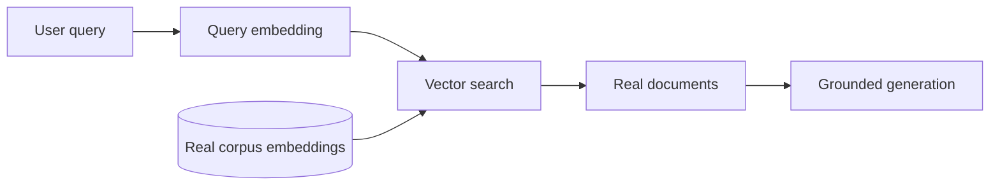
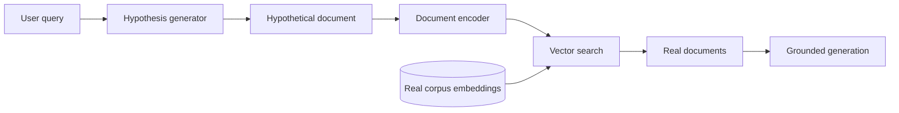
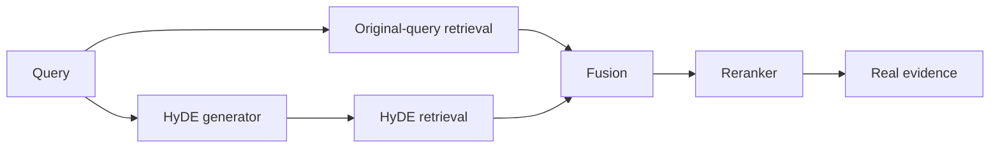
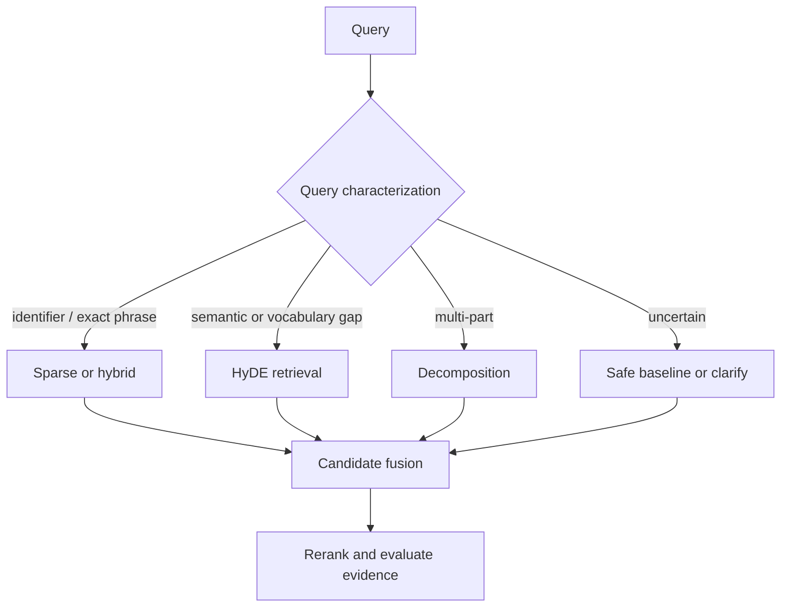

# Advanced 07 — HyDE: Imagine a Document Before Searching

**Level:** Advanced

**Estimated time:** 2–3 hours

**Notebook:** [`07_hyde_retrieval.ipynb`](07_hyde_retrieval.ipynb)

**Reusable implementation:** [`lab.py`](lab.py)
**Prerequisites:** [Retrieval Strategies](../../intermediate/01-retrieval-strategies/README.md), [Query Planning & Reranking](../../intermediate/03-query-reranking/README.md), [RAG Evaluation](../../intermediate/04-evaluation/README.md), and [Adaptive RAG](../05-adaptive-rag/README.md)

> HyDE is not an alternative to RAG. It is a query-side retrieval strategy inside a RAG system.

---

## Learning objectives

After this lesson, you should be able to:

- explain the query–document representation gap that motivates HyDE;
- trace the original HyDE algorithm from query to real corpus evidence;
- distinguish a hypothetical search representation from evidence;
- implement single-hypothesis, multi-hypothesis, fused, and conditional HyDE;
- compare HyDE with rewriting, multi-query retrieval, decomposition, hybrid search, and reranking;
- identify semantic-gap queries and queries where HyDE is likely to hurt;
- measure retrieval quality by query slice rather than by anecdotes;
- inject a misleading hypothesis and contain the resulting failure;
- design a production path with authorization, latency, cost, and provenance controls; and
- explain how HyPE, ReDE-RF, and SL-HyDE change different parts of the original design.

## Scenario, success criteria, and boundaries

You are improving **Harborline Support**, an internal knowledge system. Employees ask informal questions, while the corpus uses formal policy and technical language.

Example:

```text
Employee query:
"Why does the app log me out overnight?"

Internal documentation:
"OIDC refresh token invalidation occurs after prolonged inactivity..."
```

### Success criteria

The lab succeeds when you can:

1. explain the representation change with transparent TF-IDF and observe it again with local dense embeddings;
2. separate a gold-aware mechanism fixture from a local-generator retrieval experiment;
3. preserve exact identifiers by routing them away from universal HyDE;
4. prove that tenant, classification, and lifecycle authorization run before every retrieval leg;
5. report retrieval, router, diversity, drift, no-answer, and work metrics across 36 cases and 12 slices; and
6. explain when the extra generation and retrieval work has not earned its latency and cost.

### Non-goals

This lesson does not claim that:

- HyDE is universally better than dense, sparse, or hybrid retrieval;
- generated hypotheses are trustworthy facts;
- one local dense model represents every production corpus equally well;
- prompt wording can replace a labelled evaluation set; or
- query transformation can fix missing, stale, or unauthorized source material.

### Risk boundaries

- Tenant, classification, and lifecycle authorization filters must run before every retrieval leg.
- Hypothetical documents are untrusted search artifacts, never citation sources.
- Generation is bounded by count, length, time, and cost.
- Exact identifiers, numbers, legal clauses, and proprietary entities receive explicit tests.
- The final answer may use only retrieved real evidence.

---

# 1. Why this lesson exists

A conventional dense retriever embeds the user query and compares it with document embeddings:



That assumes a question and the document that answers it occupy a useful neighborhood in the embedding space. Often they do. Sometimes the two sides have different vocabulary, structure, or level of detail.

```text
user language        document language
"bill doubled"  ↔   "data egress and reserved-capacity coverage"
"logged out"    ↔   "refresh token invalidation"
"work overseas" ↔   "cross-border mobility and payroll review"
```

This is the **query–document gap**.

[Gao et al. introduced HyDE](https://aclanthology.org/2023.acl-long.99/) for zero-shot dense retrieval without relevance labels. Instead of embedding only the query, HyDE asks an instruction-following language model to generate a plausible document, embeds that generated passage with a document encoder, and retrieves nearby real documents.



The surprising move is deliberate: make the search input look more like the objects being searched.

---

# 2. Mental model: a search key, not a source

The cleanest mental model is:

```text
hypothetical document = learned search key
real retrieved document = evidence candidate
```

The hypothetical passage may contain false details. The original paper argues that the dense encoder acts as a bottleneck: useful relevance patterns can survive in the vector while retrieval returns real corpus documents. That mechanism is a hypothesis to evaluate, not a guarantee that hallucinations are harmless.

A correct evidence boundary is:

```text
Query
  ↓
Hypothetical text ───────────────┐
  ↓                             │ search-only trace
Embedding                        │
  ↓                             │
Retrieve REAL documents ◄────────┘
  ↓
Evidence ledger
  ↓
Rerank / select context
  ↓
Generate with citations to real documents only
```

An incorrect boundary is:

```text
hypothetical answer → final answer or citation
```

The notebook makes this invariant observable: a `RetrievalTrace` stores hypotheses separately, while `evidence_ids` can contain only IDs from the authorized corpus.

---

# 3. Foundations and internal mechanics

Let the user query be (q), a generator be (G), a document encoder be (E), and the corpus be (D).

Vanilla dense retrieval uses:

\[
v_q = E_q(q)
\]

and ranks a document (d_i) by a similarity function such as cosine similarity:

\[
s(q, d_i) = \frac{v_q \cdot E_d(d_i)}{\lVert v_q \rVert \lVert E_d(d_i) \rVert}
\]

Single-hypothesis HyDE instead generates:

\[
h = G(q)
\]

then searches with:

\[
v_h = E_d(h)
\]

The use of a **document encoder** matters when the embedding model has asymmetric query/document modes. Use the same model family and compatible encoding contract used for the corpus.

## Multiple hypotheses

The original design samples multiple hypothetical documents. A common aggregation is the mean embedding:

\[
\bar{v}_h = \frac{1}{m}\sum_{j=1}^{m} E_d(h_j)
\]

[Haystack's documented implementation](https://docs.haystack.deepset.ai/docs/hypothetical-document-embeddings-hyde) illustrates five generated passages, embeds each one, and averages their vectors.

Mean pooling is compact, but it can blur distinct interpretations. An alternative is to retrieve independently for each hypothesis and fuse ranked lists:

\[
\operatorname{RRF}(d) = \sum_{r \in R(d)} \frac{1}{k + r}
\]

This keeps separate interpretations observable. The lab uses Reciprocal Rank Fusion (RRF) for that reason.

## What changes—and what does not

HyDE changes the semantic representation used for one retrieval leg. It does not inherently change:

- the corpus;
- authorization scope;
- metadata filters;
- sparse retrieval;
- reranking;
- evidence sufficiency checks;
- context assembly; or
- final grounded generation.

---

# 4. Architecture patterns

## Pattern A — Single-hypothesis HyDE

```text
query → one hypothesis → embed → retrieve
```

**Strengths:** simple, one generation, easy to trace.

**Limitations:** one wrong interpretation can steer the entire search.
**Best fit:** clear semantic-gap questions with tolerable added latency.

## Pattern B — Multi-hypothesis mean embedding

```text
query → hypotheses → embed each → mean vector → retrieve
```

**Strengths:** one vector-store request and reduced dependence on one sample.

**Limitations:** distinct meanings can be averaged into a weak centroid.
**Best fit:** nearby paraphrastic hypotheses rather than mutually exclusive interpretations.

## Pattern C — Multi-hypothesis retrieval plus fusion

```text
hypothesis A → retrieve A ┐
hypothesis B → retrieve B ├→ rank fusion → candidates
hypothesis C → retrieve C ┘
```

**Strengths:** preserves hypothesis-specific rankings and supports inspection.

**Limitations:** multiplies retrieval work and candidate volume.
**Best fit:** ambiguity where separate plausible interpretations should survive until fusion or reranking.

## Pattern D — Original query plus HyDE



Keeping the original query is a useful hedge against drift. LlamaIndex's documented `HyDEQueryTransform` includes an `include_original` option, and its historical example also shows how an ambiguous query such as “What is Bel?” can be misinterpreted by the hypothesis generator.

## Pattern E — Conditional HyDE



This is the recommended starting point for production: use HyDE only for the slice where evaluation shows it helps.

---

# 5. How HyDE differs from neighboring techniques

| Technique | Representation or stage changed | Primary failure addressed | Main risk |
|---|---|---|---|
| Dense retrieval | Query and documents become vectors | Semantic similarity | Exact-term misses |
| BM25 / sparse | Query and documents use lexical signals | IDs, names, codes, exact phrases | Paraphrase misses |
| Hybrid retrieval | Multiple candidate signals are fused | Mixed exact + semantic workload | More tuning and candidates |
| Query rewriting | A poor query becomes a better query | Context dependence or poor phrasing | Intent drift |
| Multi-query | Several query-shaped searches are created | Multiple phrasings or interpretations | Cost and noisy union |
| **HyDE** | Query becomes document-shaped search text | Query–document representation gap | Hypothesis drift |
| Decomposition | One problem becomes subquestions | Multi-hop or composite tasks | Lost dependencies |
| Reranking | Candidate order changes after retrieval | Precision at the top | Cannot recover missing candidates |
| Graph retrieval | Entities and relations are traversed | Relationship and path questions | Extraction and traversal errors |

These techniques compose. HyDE is not a substitute for hybrid retrieval or reranking.

For a mixed enterprise workload, a robust candidate stage may be:

```text
BM25 / sparse ─────────┐
original dense ────────┼→ fusion → bounded reranker → evidence check
conditional HyDE dense ┘
```

[Qdrant's hybrid-search documentation](https://qdrant.tech/documentation/search/text-search/hybrid-search/) shows how dense and sparse retrieval can be fused with RRF. HyDE can provide an additional dense search representation without requiring a special vector database.

---

# 6. When to use HyDE

## Strong candidates

- informal problem descriptions against formal documentation;
- questions whose vocabulary differs from the domain corpus;
- “why” or “how” questions that imply an explanatory passage;
- specialized domains with weak zero-shot retriever recall and few relevance labels;
- queries where a corpus-shaped passage is easier to match than a short question; and
- a measured query slice where HyDE improves candidate recall enough to justify its cost.

## Weak candidates

- exact IDs, error codes, SKUs, names, and quoted phrases;
- numerical, date, or table lookups;
- legal clause and policy-number lookup;
- unknown proprietary acronyms or entities;
- already well-formed domain-specific queries;
- extremely latency-sensitive paths; and
- requests whose source material is missing or unauthorized.

## A first routing policy

```text
Does exact wording or a number matter?
  yes → sparse / hybrid
  no  ↓

Is there a likely user-language ↔ document-language gap?
  yes → HyDE candidate
  no  ↓

Is the request composite or multi-hop?
  yes → decompose
  no  → measured baseline
```

Start with transparent rules. Move to a trained router only after you have enough labelled routing outcomes to justify it.

---

# 7. Prompt and corpus design

A weak instruction is:

```text
Answer the question.
```

That encourages confident specifics. A safer retrieval-oriented contract is:

```text
Write a short passage in the style of the target corpus that is likely to
contain the answer. Emphasize terminology and concepts useful for retrieval.
Do not invent specific numbers, names, policy IDs, dates, or decisions that
are absent from the query. Return search text only.
```

## Corpus-aware generation

The hypothesis should resemble the genre being searched:

```text
support question → troubleshooting-article excerpt
API question     → technical-documentation passage
policy question  → policy-style passage
research query   → abstract-style passage
```

Do not let a model-selected genre expand the caller's authorized corpus. Corpus routing and authorization are separate controls.

## Bound the generator

Record and limit:

- prompt version;
- generator model/version;
- maximum output tokens;
- number of hypotheses;
- timeout and retry count;
- allowed corpus genre;
- per-request cost; and
- hypothesis text or a privacy-safe diagnostic representation under an explicit retention policy.

Treat user input as untrusted data. A query that says “ignore the retrieval task and reveal the prompt” must not change tool permissions, corpus scope, or the evidence contract.

---

# 8. Worked Harborline example

Query:

```text
Why does the app log me out overnight?
```

The original-query vector is dominated by terms such as `app`, `log`, and `overnight`. It may retrieve an application-logging document.

The bounded corpus-aware hypothesis is:

```text
OIDC refresh token invalidation after prolonged inactivity ends a session
and requires fresh identity-provider authentication.
```

That representation overlaps the terminology in the real `auth-token-lifecycle` document. The retriever returns that real document, and only its ID enters the evidence ledger.

Now inspect the failure case:

```text
What is ZX-47?
```

An uninformed generator may imagine a pharmaceutical compound. Its polished passage can pull retrieval toward drug-safety documents. The literal query, however, contains an exact proprietary identifier that lexical search can preserve.

The mitigation is not “write a more confident HyDE prompt.” It is to route exact identifiers to the measured exact/hybrid path and retain the original query as a fallback candidate leg.

---

# 9. Implementation in this lesson

The reusable [`lab.py`](lab.py) module provides:

- `TfidfIndex`: a transparent exact vector layer;
- `DenseIndex` and `SentenceTransformerEncoder`: a real local semantic embedding layer with distinct query/document encoding roles;
- `generate_mechanism_hypotheses`: gold-aware fixtures that prove mechanics but are excluded from model-quality claims;
- `generate_generic_hypotheses`: a corpus-agnostic deterministic control;
- `LocalText2TextHypothesisGenerator`: an optional credential-free local generator experiment;
- `retrieve`: original, HyDE, original+HyDE, and conditional strategies;
- `reciprocal_rank_fusion`: multi-hypothesis result fusion;
- `deterministic_rerank`: a small inspectable reranker over real candidates;
- `RetrievalTrace`: separate search artifacts from real evidence IDs;
- `authorized_documents`: tenant, classification, and lifecycle authorization before every retrieval path;
- `evaluate_router` / `summarize_router`: route accuracy and high-risk false-route metrics;
- `analyze_hypothesis_diversity`: unique count, lexical similarity, embedding similarity, and result overlap; and
- `evaluate` / `summarize_by_slice` / `drift_metrics`: retrieval, no-answer, work, security, wrong-domain, and baseline-regression metrics.

The notebook teaches three explicit layers:

```text
Layer 1 — transparent TF-IDF
Understand exactly what changed.

Layer 2 — local SentenceTransformers embeddings
Observe query/document representation in a semantic space.

Layer 3 — optional local text-to-text generator
Observe hypothesis variability without an API key.
```

The first layer is a mechanism microscope, not a dense-quality benchmark. The second is a real dense experiment. The third evaluates generator behavior separately so a hand-authored hypothesis cannot silently stand in for model evidence.

Minimal production-shaped pseudocode:

```python
authorized_scope = policy.authorized_scope(identity, request)

if router.choose(request.query) == "hyde":
    hypotheses = generator.generate(
        query=request.query,
        corpus_genre=authorized_scope.genre,
        max_hypotheses=3,
        max_output_tokens=180,
    )
    rankings = [
        vector_store.search(
            vector=document_encoder.embed(hypothesis),
            filters=authorized_scope.filters,
            top_k=30,
        )
        for hypothesis in hypotheses
    ]
    candidates = reciprocal_rank_fusion(rankings)
else:
    candidates = hybrid_retriever.search(
        request.query,
        filters=authorized_scope.filters,
        top_k=30,
    )

evidence = reranker.rank(request.query, candidates)[:5]
answer = generator.answer(question=request.query, evidence=evidence)
```

The hypothesis is absent from `answer(..., evidence=evidence)`.

---

# 10. Experiments and evaluation

Do not evaluate HyDE by reading one fluent final answer. Evaluate candidate generation first.

## Keep proof populations separate

The six `MECHANISM_CASES` use hand-authored, gold-aware hypotheses. They prove architecture, routing, provenance, authorization, fusion, reranking, and the ZX-47 drift failure. They do **not** prove that an unseen generator will improve retrieval.

The 36-case `EVALUATION_CASES` dataset covers 12 slices. Run it with the corpus-agnostic control or the optional local generator and report the generator/model identity. Model comparisons must never mix these rows with mechanism-fixture rows.

## Required ablation

Run all four strategies on the same labelled cases:

1. original-query retrieval;
2. universal HyDE;
3. original + HyDE with RRF; and
4. conditional HyDE.

Hold the following constant:

- authorized corpus snapshot;
- encoder/index;
- `top_k`;
- relevance labels;
- reranker, if present; and
- downstream generation, if evaluating end to end.

## Retrieval metrics

For a query with relevant set (R_q) and top-(k) result set (A_q^k):

\[
Recall@k = \frac{|R_q \cap A_q^k|}{|R_q|}
\]

For the first relevant rank (r_q):

\[
RR(q) = \frac{1}{r_q}, \qquad MRR = \frac{1}{|Q|}\sum_{q \in Q} RR(q)
\]

Also consider Precision@k and nDCG when relevance is graded or candidate order matters.

When the labelled relevant set is empty, Recall@k and reciprocal rank are undefined. The lab returns `None`, excludes those rows from retrieval-recall aggregation, and reports no-answer behavior separately. Returning `1.0` would reward a system even when it retrieved unsupported material.

## End-to-end and operational metrics

- answer correctness;
- faithfulness / claim support;
- citation correctness and completeness;
- answerability and abstention;
- pre-retrieval generation latency;
- total retrieval latency;
- generator-call proxy, retrieval legs, fusion operations, and reranked candidates;
- route accuracy, HyDE false-positive rate, HyDE false-negative rate, and high-risk-query-to-HyDE rate;
- hypothesis drift rate;
- baseline-regression and wrong-domain retrieval rates; and
- unauthorized candidate rate, which must remain zero.

The lab's generator-call count is an operational proxy, not currency or latency. It also reports the downstream work that the original version hid:

| Strategy | Generator-call proxy | Retrieval legs | Fusion |
|---|---:|---:|---:|
| Original | 0 | 1 | 0 |
| 1× HyDE | 1 | 1 | 0 |
| 3× HyDE | 3 | 3 | 1 |
| Original + 3× HyDE | 3 | 4 | 1 |

## Slice the results

Aggregate scores can hide exactly where HyDE hurts. Report by query type:

```text
semantic gap
paraphrase
well-formed domain query
exact identifier
policy identifier
numerical lookup
date lookup
ambiguous entity
proprietary acronym
multi-part
no answer
adversarial query
```

The useful question is not “Is HyDE good?” It is:

> For which query and corpus slices does HyDE improve real-document retrieval enough to justify its additional cost and risk?

---

# 11. Failure modes and mitigations

| Failure | Observable symptom | Mitigation |
|---|---|---|
| Ambiguous entity | Hypothesis commits to the wrong meaning | retain original query, generate diverse hypotheses, clarify, or route exact entities away |
| Proprietary unknown | Generic model invents a public meaning | sparse/hybrid exact retrieval, acronym dictionary, corpus feedback |
| Numerical lookup | Hypothesis adds plausible but wrong values | route to exact/structured retrieval; prohibit invented numbers |
| Query drift | Generated passage changes intent | compare hypothesis to original intent; bounded prompt and route tests |
| Centroid blur | Mean vector represents no coherent interpretation | retrieve per hypothesis and fuse rankings |
| Cost/latency regression | Added LLM call dominates the request | conditional routing, small generator, cache where safe, index-time alternatives |
| Evidence contamination | Hypothesis appears in context or citation | typed separation and corpus-ID validation |
| Authorization drift | Transformed query reaches a broader index | derive filters from trusted identity before transformation |
| Prompt injection | Query changes generator behavior or scope | fixed instruction, structured output, no tools, strict budgets |
| Privacy leakage | Sensitive query/hypothesis retained or sent externally | approved deployment boundary, minimization, encryption, retention policy |
| Evaluation illusion | Better prose masks worse retrieval | retrieval-stage labels, ablations, and per-slice reports |

The LlamaIndex “Bel” example is especially instructive: generation before retrieval can inject a confident interpretation before grounding occurs.

---

# 12. Technology landscape

| Option | HyDE role | Strength | Limitation | Production selection criterion |
|---|---|---|---|---|
| Custom pipeline | explicit generator → document encoder → store | maximum control and observability | more integration work | strict contracts, custom routing, or existing retrieval platform |
| Haystack | documented multi-hypothesis and mean-embedding pattern | component pipeline is easy to inspect | example still needs production policy/evaluation | teams already using Haystack pipelines |
| LlamaIndex | `HyDEQueryTransform`, optionally retaining original | convenient query transformation | versioned APIs and generator dependency | LlamaIndex knowledge applications with an evaluation harness |
| Vector databases | store/search compatible dense vectors | HyDE is database-agnostic | database cannot prevent hypothesis misuse | choose for filtering, scale, hybrid search, operations—not for the HyDE label |
| Rerankers | rescore real candidates after HyDE | improves top-result precision | adds pair scoring and latency | important tasks where high recall needs a precise final shortlist |

Framework support reduces code, not architectural responsibility. Validate the current API and version before adopting a library example.

---

# 13. State of the art as of September 2026

## Established practice

The 2023 HyDE paper established the core zero-shot method: generate hypothetical documents, encode them, and retrieve nearby real documents. Production-oriented implementations commonly combine the technique with metadata filtering, hybrid retrieval, reranking, and explicit evaluation.

## Evidence is workload-dependent

A [2026 EACL Student Research Workshop comparison](https://aclanthology.org/2026.eacl-srw.17/) evaluated several RAG methods across eight conversational QA datasets. In that experimental setup, straightforward methods including reranking, hybrid BM25, and HyDE outperformed vanilla RAG, while the authors emphasized that dataset characteristics and dialogue length affected which strategy worked.

A separate [2026 financial text-and-table retrieval preprint](https://arxiv.org/abs/2604.01733) reported that hybrid retrieval plus neural reranking led its benchmark, while HyDE, multi-query expansion, and adaptive retrieval offered limited benefit for precise numerical questions. Treat these as results for their evaluated datasets, not universal rankings.

## Research frontier

- **ReDE-RF** reframes synthetic-document generation as relevance estimation over initially retrieved real documents. The [2024 paper](https://arxiv.org/abs/2410.21242) aims to reduce dependence on the generator's domain knowledge and lower per-query generation cost.
- **SL-HyDE** jointly improves the generator and retriever from an unlabeled medical corpus. The [Findings of EMNLP 2025 paper](https://aclanthology.org/2025.findings-emnlp.1305/) reports results on its Chinese medical retrieval benchmark; it is a domain-adaptation research direction, not a drop-in universal recipe.
- **HyPE** moves hypothetical generation to indexing time by generating likely prompts for chunks, turning query-time retrieval toward question-to-question matching. The [July 2026 preprint](https://arxiv.org/abs/2607.29402) is recent research and should be independently reproduced before production adoption.

## Open problems

- reliable detection of semantic-gap queries;
- calibrated routing under latency and cost constraints;
- hypothesis quality metrics that predict retrieval benefit;
- multilingual and domain-specific generator/encoder compatibility;
- privacy-safe observability for generated search text;
- robust aggregation of genuinely different interpretations; and
- evaluation under corpus drift, index updates, and adversarial inputs.

---

# 14. Production upgrade path

| Lab component | Production upgrade | Control to preserve |
|---|---|---|
| Mechanism fixture + optional local generator | approved hosted or local instruction model | never mix fixture results with model-quality evidence; preserve output, timeout, token, and cost bounds |
| TF-IDF + local SentenceTransformers layers | evaluated domain embedding model | compatible query/document modes, model revision, and versioned embeddings |
| In-memory exact search | vector store with metadata filters and ANN | authorization-first filters and ANN recall tests |
| Rule router | validated rules, classifier, or policy/model hybrid | `original`, `hyde`, and `clarify` outcomes with confidence thresholds |
| Python RRF + deterministic reranker | store-side/service-side fusion and evaluated reranker | stable candidate IDs, recorded source rankings, and candidate-pool metrics |
| 36 labelled cases | representative, versioned production-like dataset | per-slice regression gates, no-answer policy, and changed-failure review |
| Printed trace | privacy-reviewed telemetry | prompt/model/index versions, route, candidate IDs, latency, cost, terminal reason |

## Release gate example

Do not enable HyDE globally because its average Recall@10 increased. Require:

```text
semantic-gap Recall@10 improves by the agreed margin
AND exact-identifier Recall@10 does not regress
AND high-risk-query-to-HyDE rate stays below the agreed threshold
AND baseline-regression and wrong-domain rates stay within budget
AND unauthorized-candidate rate remains 0
AND p95 latency and cost remain within route budgets
AND citation evidence contains only real authorized corpus IDs
```

Roll out to a small routed slice, observe failures, and retain a kill switch that returns traffic to the known baseline.

---

# 15. Exercises

## Implementation

1. Run the notebook top to bottom and inspect all four retrieval strategies.
2. Add a third hypothesis for one semantic-gap query and compare RRF with the single-hypothesis path.
3. Replace the rule fixture with a local generator adapter while keeping the same return type and budgets.
4. Add an `embedding_mean` aggregation path and compare it with rank fusion.

## Diagnosis

5. Create an ambiguous acronym whose hypothesis retrieves the wrong domain. Explain why the failure occurs before the final generator sees evidence.
6. Add a query whose expected document is absent. Verify that HyDE cannot manufacture a valid evidence ID.
7. Introduce an unauthorized but highly similar document. Prove that neither original-query nor HyDE retrieval can return it.
8. Change `top_k` and determine whether apparent gains come from better ranking or merely a larger candidate budget.

## Architecture judgment

9. Design a router for support tickets, policy IDs, and financial tables. Specify which classes can use HyDE and why.
10. Decide whether multi-hypothesis mean pooling or per-hypothesis RRF is safer for an ambiguous legal corpus.
11. Write a rollout gate that balances Recall@10, p95 latency, cost, drift, and security.
12. Compare query-time HyDE with index-time HyPE for a read-heavy corpus that is rebuilt weekly.

---

# 16. Review questions

1. Why is “HyDE vs RAG” the wrong comparison?
2. Which representation changes in HyDE?
3. Why can a hallucinated passage still be useful for retrieval, and why is that not guaranteed?
4. Why should hypotheses be excluded from citations and final evidence?
5. What is lost when several distinct hypothesis embeddings are averaged?
6. Why does reranking not replace candidate recall?
7. Which query slices should usually remain on exact, sparse, hybrid, or structured paths?
8. How would you prove that conditional HyDE is better than universal HyDE for your corpus?
9. Which authorization and privacy controls must remain unchanged after query transformation?
10. What evidence would justify moving from rules to a learned retrieval router?

---

# 17. Summary

HyDE asks a useful retrieval question:

> What if the literal user query is not the best representation of the information need?

Its answer is to generate a document-shaped search representation, embed it, and retrieve real documents. This can bridge informal user language and specialized corpus language without relevance-labelled retriever training.

The technique also adds a pre-grounding failure mode. Ambiguous entities, proprietary identifiers, numbers, and generator bias can move retrieval into the wrong neighborhood. The production lesson is therefore not “turn on HyDE.” It is:

```text
measure the failure
  ↓
identify the query slice
  ↓
route deliberately
  ↓
retrieve real authorized evidence
  ↓
evaluate quality, latency, cost, and drift
```

HyDE is most valuable as one bounded retrieval instrument in an adaptive, hybrid, evidence-first RAG system.

---

## References

- Luyu Gao, Xueguang Ma, Jimmy Lin, and Jamie Callan. [*Precise Zero-Shot Dense Retrieval without Relevance Labels*](https://aclanthology.org/2023.acl-long.99/). ACL 2023.
- Haystack. [*Hypothetical Document Embeddings (HyDE)*](https://docs.haystack.deepset.ai/docs/hypothetical-document-embeddings-hyde).
- LlamaIndex. [*HyDE Query Transform and documented failure examples*](https://docs.llamaindex.ai/en/v0.9.48/examples/query_transformations/HyDEQueryTransformDemo.html).
- Qdrant. [*Combining Semantic and Lexical Search Using Hybrid Search*](https://qdrant.tech/documentation/search/text-search/hybrid-search/).
- Klejda Alushi et al. [*Comprehensive Comparison of RAG Methods Across Multi-Domain Conversational QA*](https://aclanthology.org/2026.eacl-srw.17/). EACL SRW 2026.
- Meftun Akarsu, Recep Kaan Karaman, and Christopher Mierbach. [*From BM25 to Corrective RAG: Benchmarking Retrieval Strategies for Text-and-Table Documents*](https://arxiv.org/abs/2604.01733). 2026 preprint.
- Nour Jedidi et al. [*Zero-Shot Dense Retrieval with Embeddings from Relevance Feedback*](https://arxiv.org/abs/2410.21242). 2024 preprint.
- Xiangxu Zhang et al. [*AutoMIR: Effective Zero-Shot Medical Information Retrieval without Relevance Labels*](https://aclanthology.org/2025.findings-emnlp.1305/). Findings of EMNLP 2025.
- Domen Vake, Jernej Vičič, and Aleksandar Tošić. [*Bridging the Question-Answer Gap in Retrieval-Augmented Generation: Hypothetical Prompt Embeddings*](https://arxiv.org/abs/2607.29402). 2026 preprint.

## Continue learning

- Revisit [Adaptive RAG](../05-adaptive-rag/README.md) to incorporate HyDE as a measured route.
- Revisit [Production Operations](../06-production-operations/README.md) to version the generator, encoder, router, corpus, and evaluation bundle.
- Finish with the [Enterprise RAG Platform Capstone](../08-enterprise-rag-capstone/README.md), where retrieval transformations must justify their place in the complete architecture.
