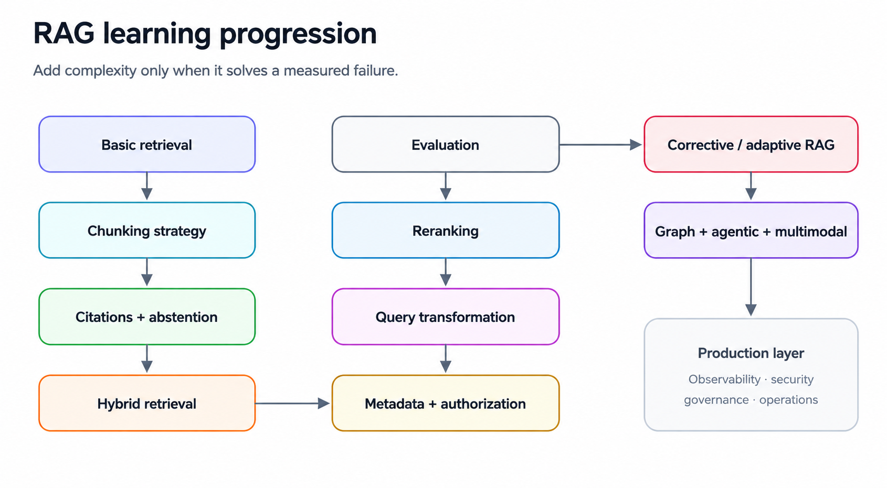
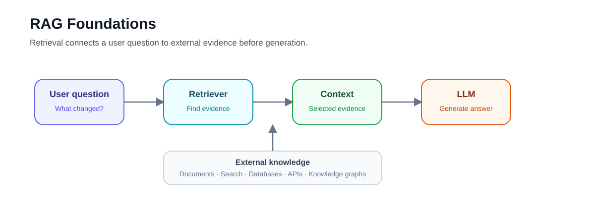
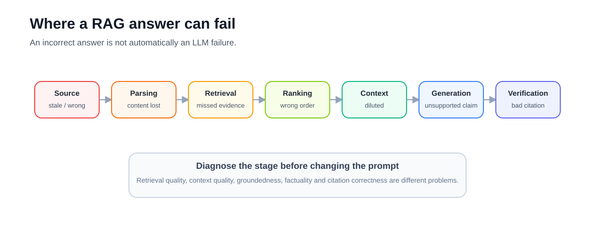
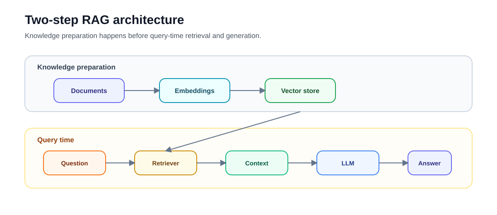

# 01 — RAG Foundations: From Retrieval to Grounded Answers

**Level:** Beginner  
**Estimated time:** 60–90 minutes  
**Scenario:** NovaTech Enterprise Knowledge Assistant  
**Notebook:** [`rag_foundations.ipynb`](rag_foundations.ipynb)


---

## Why this lesson exists

Retrieval-Augmented Generation (RAG) is often introduced as:

> retrieve documents → put them in a prompt → ask an LLM to answer

That description is useful, but incomplete.

A RAG application is better understood as a system that:

1. maintains external knowledge,
2. retrieves evidence relevant to a request,
3. supplies selected evidence to a language model,
4. constrains generation around that evidence, and
5. preserves enough provenance to inspect why an answer was produced.

The purpose of this first lesson is to understand that loop before introducing production concerns such as chunking strategies, hybrid search, reranking, access control, evaluation pipelines, GraphRAG, or agents.

You will build the smallest useful RAG pipeline and inspect what changes when external evidence is introduced.

---

## Learning objectives

After completing this lesson, you should be able to:

- explain Retrieval-Augmented Generation in practical terms;
- distinguish model knowledge from knowledge retrieved at runtime;
- identify the retrieval and generation stages of a RAG pipeline;
- explain the role of documents, embeddings, vector stores, retrievers, prompts, and generators;
- distinguish retrieval relevance from answer correctness;
- explain why RAG can improve grounding without guaranteeing factuality;
- understand why source metadata and provenance matter;
- recognize when an application should abstain rather than manufacture an answer;
- distinguish a simple **2-step RAG pipeline** from more advanced agentic architectures; and
- identify which parts of the notebook are teaching simplifications rather than production implementations.

---

## 1. What is Retrieval-Augmented Generation?

Retrieval-Augmented Generation combines two capabilities:

**Retrieval**

Find information relevant to the current request from an external knowledge source.

**Generation**

Give that information to a language model and ask it to produce an answer based on the retrieved evidence.



The foundational RAG formulation was introduced by Lewis et al. in:

[Retrieval-Augmented Generation for Knowledge-Intensive NLP Tasks](https://arxiv.org/abs/2005.11401)

The paper describes combining a model's learned **parametric memory** with external **non-parametric memory** retrieved at inference time.

Modern RAG systems generalize this idea considerably. External knowledge may come from:

- document collections;
- enterprise search;
- vector databases;
- relational databases;
- APIs;
- knowledge graphs;
- search engines; or
- combinations of several sources.

The central idea remains the same:

> Do not require the model's parameters to contain every fact the application needs.

---

## 2. Why use RAG?

Language models have useful general knowledge and reasoning capabilities, but enterprise applications frequently need information that is:

- private;
- organization-specific;
- frequently updated;
- permission-sensitive;
- too large to place in every prompt; or
- expected to be traceable to a source.

For example, imagine an internal assistant answering:

> What increased by 14% in NovaTech's Q2 financial review?

The answer should come from the company's actual financial document—not from whatever the model happens to remember or infer.

RAG lets the application retrieve that evidence at request time.

---

## 3. RAG does not make an LLM automatically truthful

A common misconception is:

> If I add RAG, hallucinations disappear.

They do not.

A RAG pipeline can still fail because:



This means an incorrect answer is not automatically a **generation failure**.

It may instead be a:

- source problem;
- ingestion problem;
- retrieval problem;
- ranking problem;
- context-selection problem;
- generation problem; or
- verification problem.

Later courses treat these stages independently.

---

## 4. The basic RAG architecture

For this lesson, use the following mental model.



There are two broad phases.

### Knowledge preparation

Documents must be represented in a form that can be searched.

A semantic retrieval system commonly uses:

```text
Document
    ↓
Embedding model
    ↓
Vector
    ↓
Vector store
```

Later lessons will examine document parsing, chunking, metadata, indexing, hybrid retrieval, and vector databases in detail.

### Query-time retrieval

At runtime:

```text
Question
    ↓
Retriever
    ↓
Relevant documents
    ↓
Prompt context
    ↓
LLM
    ↓
Answer
```

This lesson focuses primarily on understanding this second loop.

---

## 5. The core components

### Documents

A document normally contains:

```python
Document(
    page_content="...",
    metadata={
        "source": "...",
        "tenant": "...",
    },
)
```

The content contains retrievable text.

Metadata describes the evidence.

Useful production metadata can include:

- document ID;
- source;
- section;
- page;
- author or owner;
- timestamp;
- version;
- tenant;
- access-control attributes; and
- ingestion version.

Metadata becomes critical later for filtering, citations, freshness, and authorization.

---

### Embeddings

An embedding model converts text into a numerical representation:

```text
"What increased by 14%?"
        ↓
embedding model
        ↓
[0.12, -0.44, 0.83, ...]
```

Documents can be represented similarly.

Retrieval then searches for document representations that are relevant to the query representation.

An important distinction:

> An embedding similarity score measures something about retrieval similarity. It is not the probability that an answer is correct.

The notebook uses a **deterministic teaching retriever** to map questions directly to specific mock documents.

This is a teaching simplification to keep the example deterministic and credential-free. It does not perform actual semantic search.

Real retrieval systems require an embedding model chosen and evaluated for the target corpus and query distribution.

---

### Vector store

A vector store manages vector representations and lets an application perform similarity search.

The notebook uses LangChain's in-memory vector-store abstraction because the goal is to understand the pipeline without introducing infrastructure.

Production systems may instead use technologies such as:

- Qdrant;
- pgvector;
- Elasticsearch / OpenSearch;
- Milvus;
- Weaviate;
- managed cloud retrieval services; or
- another search platform.

Choosing a database is not the first RAG design decision.

The first question is:

> What retrieval behavior does the application need?

---

### Retriever

A retriever accepts a query and returns candidate evidence.

Conceptually:

```python
documents = retriever.invoke(question)
```

The retriever abstraction is broader than a vector database.

Evidence could be retrieved using:

- semantic vector search;
- BM25;
- hybrid search;
- metadata-filtered search;
- a search API;
- a graph;
- a database query; or
- another retrieval mechanism.

Later courses compare these approaches.

---

### Context construction

Retrieved documents must be converted into context for the model.

The notebook uses a simple function:

```python
def format_docs(docs):
    formatted_chunks = []
    for i, d in enumerate(docs, start=1):
        chunk = (
            f"<EVIDENCE id=\"E{i}\">\n"
            f"Title: {d.metadata['title']}\n"
            f"Section: {d.metadata['section']}\n"
            f"Content:\n{d.page_content}\n"
            f"</EVIDENCE>"
        )
        formatted_chunks.append(chunk)
    return "\n\n".join(formatted_chunks)
```

Notice that the source identifiers and metadata are preserved.

There are three concepts to distinguish here:
1. **Factual grounding:** The retrieved text provides the facts to answer the question.
2. **Provenance:** Identifies where the text came from (e.g., `document_id`, `chunk_id`, `source`).
3. **Citation:** A reference in the generated answer (e.g., `[E1]`) mapping a claim back to the evidence.

Not all operational provenance metadata needs to be sent to the LLM. Only **generator-useful metadata** (like title, section, or version) should be placed in the prompt. **Pipeline/operational metadata** (like tenant, ACL, or chunk ID) can be maintained locally and mapped back via the Evidence ID.

That is deliberate.

Without provenance, an application may generate an answer but have no reliable way to explain where its evidence came from.

Production systems normally need stronger provenance than this example, including stable document and chunk identifiers.

---

### Grounded prompt

The notebook tells the model:

```text
Answer the question based ONLY on the following context.

If you cannot answer the question based on the context,
say that you do not know based on the provided evidence.
```

This establishes an important behavioral goal:

```text
Evidence available
        ↓
answer from evidence

Evidence unavailable
        ↓
abstain
```

However, prompt instructions alone do **not** guarantee groundedness.

Models can still ignore instructions or make unsupported claims.

Production systems therefore evaluate groundedness rather than assuming the prompt solved it.

---

## 6. Baseline generation versus RAG

The notebook deliberately demonstrates two cases.

### Case A — generation without retrieved evidence

The application asks the model:

```text
What increased by 14% at NovaTech in Q2 2025?
```

without giving it NovaTech's financial document.

The mock model produces a plausible but incorrect answer.

The point is not that every LLM would produce exactly this failure.

The point is architectural:

> The application has not supplied an authoritative source from which the answer can be derived.

### Case B — generation with retrieved evidence

The RAG pipeline retrieves:

```text
NovaTech's Q2 2025 financial review:
Cloud infrastructure costs increased by 14%
due to the new cluster deployment.
```

and supplies it to the model.

Now the answer can be grounded in supplied evidence.

The difference is:

```text
Question → model

versus

Question → retrieval → evidence → model
```

That additional evidence path is the foundation of RAG.

---

## 7. The notebook architecture

The notebook implements a small **2-step RAG** workflow.

```text
Question
   │
   ├──────────────┐
   │              │
   ↓              │
Retriever         │
   ↓              │
Documents         │
   ↓              │
format_docs       │
   ↓              │
Context ──────────┤
                  ↓
                Prompt
                  ↓
                 LLM
                  ↓
                Answer
```

Retrieval always occurs before generation.

This makes the execution path predictable and is a useful starting architecture for applications such as documentation assistants and enterprise Q&A.

More advanced courses introduce conditional and agentic retrieval.

---

## 8. Teaching implementation versus production implementation

The notebook is intentionally small.

Do not interpret every implementation choice as a production recommendation.

| Notebook | Production concern |
|---|---|
| Three documents | Real ingestion pipeline |
| Teaching retriever | Evaluated embedding model |
| In-memory vector store | Persistent search infrastructure |
| `k=1` retrieval | Tuned candidate retrieval |
| Simple prompt | Versioned generation policy |
| Simple evidence ID mapping | Stable provenance architecture |
| No chunking | Structure-aware chunking |
| No authorization enforcement | Retrieval-time ACL filtering |
| No reranker | Optional reranking stage |
| No evaluation dataset | Versioned regression suite |
| Fake LLM | Production model abstraction |
| One request path | Tracing and observability |

The purpose of the notebook is therefore:

> understand the boundaries of the system before adding complexity.

---

## 9. A crucial distinction: retrieval quality versus generation quality

Suppose the final answer is wrong.

Ask two different questions.

### Question 1 — Did retrieval find the right evidence?

This is a retrieval problem.

Possible metrics later include:

- Recall@k;
- Precision@k;
- MRR;
- nDCG; and
- ranking quality.

### Question 2 — Did the model faithfully use the retrieved evidence?

This is a generation / grounding problem.

Possible checks later include:

- groundedness;
- faithfulness;
- citation correctness;
- completeness;
- answer relevance; and
- factual correctness.

Do not collapse both questions into a single "RAG accuracy" score.

---

## 10. RAG versus adjacent approaches

RAG is not always the correct architecture.

| Need | Likely starting approach |
|---|---|
| Answer questions from evolving documents | RAG |
| Change response style or behavior | Prompting or fine-tuning |
| Fetch exact live account data | API / typed tool |
| Perform calculations | Code or deterministic tool |
| Query structured relational data | SQL / semantic layer |
| Search exact documents without synthesis | Search |
| Small amount of static context | Prompt / long context |
| Combine private documents with synthesis | RAG |

These techniques can also be combined.

For example, an enterprise assistant might use:

```text
RAG → policies and documentation
SQL → customer/account facts
API → operational state
LLM → synthesis and explanation
```

The important design question is not:

> How do I use RAG everywhere?

It is:

> Which source should be authoritative for this question?

---

## 11. Where modern RAG systems go next

A simple 2-step RAG pipeline is only the beginning.


Complexity should be introduced to solve measured failures—not because a technique is fashionable.

---

## 12. Run the notebook

Open:

[`rag_foundations.ipynb`](rag_foundations.ipynb)

The notebook uses LangChain abstractions and local mock components so that the architecture can be explored without API credentials.

Work through the notebook in order.

Pay particular attention to:

```python
Document
```

```python
InMemoryVectorStore
```

```python
retriever
```

```python
format_docs
```

```python
ChatPromptTemplate
```

and the final RAG chain.

For each component ask:

> What responsibility does this component own?

That question becomes increasingly important as the system grows.

---

## 13. Exercises

### Exercise 1 — Inspect retrieval

Before invoking the complete RAG chain, invoke the retriever directly.

Inspect:

- retrieved text;
- source metadata; and
- whether the result actually contains enough evidence to answer the question.

Do not evaluate the generated answer yet.

### Exercise 2 — Ask an unsupported question

Try a question for which none of the NovaTech documents contains an answer.

Examples:

```text
What is NovaTech's annual revenue?
```

or:

```text
Who is NovaTech's CEO?
```

Ask:

1. What does retrieval return?
2. Should the application answer?
3. Is prompt-based abstention sufficient?
4. What would you measure in production?

### Exercise 3 — Change `k`

Change:

```python
search_kwargs={"k": 1}
```

to retrieve more documents.

Observe how additional context changes the evidence supplied to the model.

Consider:

> Why might increasing `k` sometimes make an answer worse rather than better?

### Exercise 4 — Inspect context formatting

Consider these four levels of context formatting:

**A.** Content only
**B.** Content + filename (`policy.md`)
**C.** Content + Evidence ID + Title + Section
**D.** Content + Evidence ID + Title + Section + Version/Date

Ask yourself:
1. Does the factual answer change between these? (Factual grounding)
2. Can the answer be traced to its source? (Provenance & Citation)
3. Can conflicting documents be distinguished? (Generator-visible metadata)
4. Which metadata actually helps the LLM interpret the text, and which only helps operational traceability (like Tenant ID)?

### Exercise 5 — Identify the authoritative source

For each request below, decide whether RAG should be the primary mechanism.

```text
"What is the parental leave policy?"
```

```text
"What is customer 8321's current account balance?"
```

```text
"Calculate the percentage change in infrastructure spend."
```

```text
"What does the incident runbook say about rollback?"
```

The correct answer is not always "retrieve documents."

---

## 14. Common misconceptions

### “A vector database is RAG.”

No.

A vector database is one possible retrieval component.

A RAG system also involves knowledge preparation, retrieval policy, context construction, generation, provenance, evaluation, and operational controls.

### “RAG means semantic/vector search.”

No.

Retrieval may use lexical search, dense retrieval, hybrid retrieval, SQL, graphs, APIs, or other mechanisms.

### “The highest similarity score is the most truthful document.”

No.

Similarity and authority are different properties.

### “If the correct passage was retrieved, the answer must be correct.”

No.

Generation can still misunderstand or overstate evidence.

### “More retrieved context is always better.”

No.

Additional context increases cost and can introduce irrelevant or conflicting evidence.

### “Prompting the model to use only the context guarantees grounding.”

No.

Grounding must be evaluated.

---

## 15. Checkpoint

You should be able to answer these before continuing.

1. What two major capabilities are combined in RAG?
2. Why is retrieved knowledge different from model-parametric knowledge?
3. What role does an embedding model play?
4. What is the difference between a vector store and a retriever?
5. Why should provenance metadata survive retrieval?
6. Why is similarity score not equivalent to answer confidence?
7. What is the difference between retrieval quality and groundedness?
8. Why might retrieving more documents make a system worse?
9. When is a typed API or SQL query preferable to document RAG?
10. What makes this notebook a **2-step RAG** architecture?

---

## 16. What comes next

Continue with:

### [02 — First Local RAG](../02-first-local-rag/README.md)

Move beyond the framework demo and construct a more inspectable local evidence pipeline.

### [03 — Chunking Decisions](../03-chunking-lab/README.md)

Study how document boundaries directly affect retrieval quality.

### [04 — Citations and Abstention](../04-citations-abstention/README.md)

Move from simply retrieving evidence to proving which evidence supports an answer and deciding when the system should decline to answer.

---

## References

### Foundations

- Lewis et al. — [Retrieval-Augmented Generation for Knowledge-Intensive NLP Tasks](https://arxiv.org/abs/2005.11401)
- Karpukhin et al. — [Dense Passage Retrieval for Open-Domain Question Answering](https://arxiv.org/abs/2004.04906)
- Manning, Raghavan & Schütze — [Introduction to Information Retrieval](https://nlp.stanford.edu/IR-book/)

### Current implementation guidance

- LangChain — [Retrieval](https://docs.langchain.com/oss/python/langchain/retrieval)
- LangChain — [Build a semantic search engine](https://docs.langchain.com/oss/python/langchain/knowledge-base)

### Evaluation foundations

- Thakur et al. — [BEIR: A Heterogeneous Benchmark for Zero-shot Evaluation of Information Retrieval Models](https://arxiv.org/abs/2104.08663)

---

## Key takeaway

RAG is not a model feature.

It is an application architecture for connecting generation to external evidence.

The first engineering question is therefore not:

> Which vector database should I use?

It is:

> **What evidence should this system use, how will it retrieve that evidence, and how will I know the resulting answer is actually supported by it?**

---

# Deep Dive — RAG Foundations

The notebook is the practical companion. This chapter establishes the system model you should use throughout the curriculum.

## 1. What RAG actually changes

A language model answers from information encoded in its parameters and the context supplied at inference time. Retrieval-Augmented Generation adds an external evidence-selection step so the application can use information that is private, dynamic, domain-specific, or too large to place permanently in the prompt.

A useful abstraction is:

```text
knowledge sources
      ↓
ingestion / representation
      ↓
retrieval index
      ↓
user query
      ↓
candidate retrieval
      ↓
evidence selection
      ↓
context
      ↓
generation
      ↓
supported answer
```

RAG is therefore not a single model technique. It is an **information-retrieval system connected to a generative system**.

## 2. Parametric knowledge vs retrieved evidence

A model may already “know” something from training, but an enterprise application often needs a stronger contract:

> Answer from the evidence authorized for this request.

This matters for policies, contracts, internal documentation, rapidly changing facts, and auditable decisions. Retrieved evidence gives the application something concrete to inspect, cite, version, authorize, and evaluate.

RAG does not guarantee truth. It creates an architecture in which evidence can be measured.

## 3. The two major pipelines

### Indexing / ingestion

```text
source
  ↓
parse
  ↓
normalize
  ↓
chunk
  ↓
metadata + provenance
  ↓
representation / embedding
  ↓
index
```

### Query

```text
question
  ↓
query representation
  ↓
retrieve
  ↓
rank/select
  ↓
construct context
  ↓
generate
  ↓
verify/cite
```

Debug these separately.

A malformed document during ingestion and a weak query embedding during retrieval can produce the same final symptom—an unsupported answer—but require completely different fixes.

## 4. Retrieval is not generation

A useful failure decomposition is:

```text
Was required evidence in the corpus?
        ↓
Was it represented/indexed correctly?
        ↓
Was it retrieved?
        ↓
Was it selected into context?
        ↓
Did the model use it correctly?
        ↓
Was the final claim supported/cited?
```

Do not label every failure “hallucination.”

## 5. Retrieval units

The object searched by a retriever might be:

- a whole document;
- a paragraph;
- a chunk;
- a table row;
- a graph node;
- a structured record;
- a multimodal region.

The retrieval unit should match the evidence granularity needed by the task.

## 6. Lexical and semantic retrieval

Lexical retrieval emphasizes shared words and exact terms. Semantic retrieval uses learned representations to capture meaning beyond exact token overlap.

Neither dominates every workload.

Identifier-heavy queries often benefit from lexical signals; paraphrases often benefit from dense semantic retrieval. Later courses introduce hybrid retrieval, but the foundation is understanding that retrieval strategy must follow query behavior.

## 7. Embeddings: the right mental model

An embedding maps an input into a numerical representation used for similarity search.

Do not interpret embedding distance as:

```text
probability that this passage answers the question
```

It is a model-dependent similarity signal.

Embedding model, document representation, query wording, distance metric, corpus distribution, and index configuration all affect results.

## 8. Top-k is an engineering budget

Retrievers typically return the top `k` candidates.

Small `k` can miss evidence. Large `k` increases noise, context length, latency, and downstream cost.

There is no universal best value. Tune it with evaluation.

## 9. Context construction

Retrieval results are not automatically a good prompt.

Context construction may need to:

- remove duplicates;
- preserve source IDs;
- order passages;
- add titles/section labels;
- respect token budgets;
- keep related evidence together.

The context passed to the model is itself an engineered artifact.

## 10. Provenance

Each evidence unit should retain enough information to identify its origin:

```text
source_id
document_id
chunk_id
section/page/span
source_version
metadata
```

Without provenance, reliable citation and incident investigation become much harder.

## 11. RAG failure taxonomy

### Corpus failure
Required information does not exist in the authorized knowledge source.

### Parsing failure
The source exists but extraction damaged or omitted it.

### Chunking failure
Evidence was split or grouped poorly.

### Representation failure
The retriever's representation does not capture the query/evidence relationship.

### Candidate-retrieval failure
Relevant evidence is indexed but absent from top-k.

### Ranking/context failure
Evidence is retrieved but excluded, duplicated, or buried.

### Generation failure
The model ignores, misreads, or overextends evidence.

### Verification failure
Unsupported claims or bad citations escape the final control.

This taxonomy is more useful than one generic “RAG quality” score.

## 12. Evaluation starts here

Even a beginner pipeline should measure intermediate artifacts.

For retrieval:

```text
Did expected evidence appear in top-k?
Where was it ranked?
```

For generation:

```text
Are material claims supported by context?
Did the system answer an unanswerable question?
```

Later courses formalize Recall@k, MRR, nDCG, faithfulness, citation quality, and regression testing.

## 13. RAG vs long context vs fine-tuning

These solve different problems.

**Long context** can be effective when the relevant corpus is small enough to supply directly and latency/cost are acceptable.

**Fine-tuning** is useful for changing model behavior, format, or task specialization; it is usually not the right mechanism for frequently changing factual knowledge.

**RAG** is valuable when evidence must be dynamically selected, updated, authorized, inspected, or cited.

Hybrid architectures are common.

## 14. Enterprise architecture concerns

A production RAG system eventually needs:

```text
identity / authorization
data lifecycle
index versioning
provenance
evaluation
observability
latency/cost budgets
security controls
release/rollback
```

The beginner lab intentionally does not implement all of these. It establishes the evidence loop they depend on.

## 15. Design principle

The most important rule for the rest of this curriculum is:

> **Make the simplest RAG system measurable before making it sophisticated.**

If you cannot explain why the baseline failed, adding agents, graphs, query planners, or corrective loops usually makes debugging harder rather than better.

## Further study

- Lewis et al. — *Retrieval-Augmented Generation for Knowledge-Intensive NLP Tasks*
- Karpukhin et al. — *Dense Passage Retrieval*
- BEIR — heterogeneous information-retrieval benchmark
- Current vector-database documentation for dense, sparse, hybrid, and filtered retrieval
