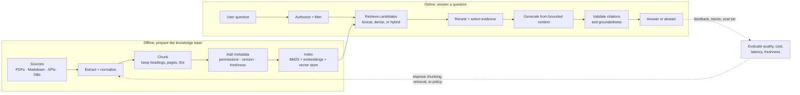

# 01 — RAG foundations: build an evidence system before a chatbot

**Level:** Beginner · **Time:** 2–3 hours · **Scenario:** Harborline Support  
**Prerequisites:** basic Python, a terminal, and comfort reading JSON-like data

## What is Retrieval-Augmented Generation?

Retrieval-Augmented Generation (RAG) is a pattern where an application searches an external knowledge source at runtime and gives the selected evidence to a language model as context for its answer. The model is not retrained for each document update; the application changes the evidence it supplies.

The name comes from Lewis et al.'s 2020 paper, [*Retrieval-Augmented Generation for Knowledge-Intensive NLP Tasks*](https://arxiv.org/abs/2005.11401). It distinguishes the model's learned, **parametric** knowledge (baked into its weights during training) from retrieved, **non-parametric** memory (fetched at runtime). 

RAG is useful when an answer should be based on information that is:
- private, permissioned, or organization-specific;
- recent or frequently changing;
- too long to include in every prompt; or
- auditable with links, pages, sections, or records.

It does not automatically make a system factual. A RAG system can retrieve the wrong text, omit the relevant passage, misread a table, or generate a claim that the evidence does not support. Retrieval and generation must be designed and evaluated as separate components.

## The lifecycle mental model

The lifecycle has two connected loops: an offline indexing loop that prepares evidence, and an online question loop that selects and uses that evidence. The same source identifiers and metadata should survive both loops so every answer can be traced back to the material that supported it.



### What happens at query time?

At query time, the application should preserve the user’s identity and request constraints while it searches. Three planes must remain separate:

| Plane | Responsibility | A common mistake |
|---|---|---|
| **Evidence** | What documents are present, current, allowed, and retrieved? | Treating retrieved text as automatically trustworthy or complete. |
| **Generation** | How is evidence transformed into an answer? | Asking a model to compensate for missing evidence. |
| **Policy** | Who may see what, when to abstain, how much context to use? | Implementing access control or approvals only in a prompt. |

This separation makes failures diagnosable: an incorrect answer may be a retrieval miss, an authorization bug, a context-selection problem, or a generation/verification failure—not simply a “bad prompt.”

## Why this lesson exists

RAG is an information-retrieval system with a generation step attached. It is not "a model that knows your documents." The original RAG paper combined a parametric language model with a retriever for knowledge-intensive NLP tasks. Modern production systems generalize that idea: they ingest changing, permissioned sources; retrieve a small evidence set; and require the answer to stay within that set.

## Learning objectives

After completing this lesson you can:

- explain what RAG is and what it is not, using the evidence/generation/policy framing;
- trace the historical evolution from IR to modern RAG and identify why each step was added;
- distinguish parametric knowledge from non-parametric knowledge;
- choose between RAG, fine-tuning, long-context, tool/API, and search engine architectures;
- trace the offline and online RAG lifecycle and identify a failure at each stage boundary;
- build a deterministic lexical retrieval baseline with stable chunk IDs;
- explain why a similarity score is not a truth or confidence probability;
- decompose end-to-end quality into retrieval quality, context quality, groundedness, and factuality;
- evaluate hit rate, precision, reciprocal rank, and abstention behavior on a tiny golden set; and
- choose the smallest justified upgrade when a measured failure is identified.

## Start with the notebook

Open [`rag_foundations.ipynb`](rag_foundations.ipynb) before building the local assistant. It pairs the lifecycle mental model with a deterministic evidence selection experiment. 

You are building an internal assistant for **Harborline**, a fictional SaaS company. Support staff need grounded answers about production escalation and customer communication. The corpus is intentionally small; that makes every retrieval decision inspectable before the course introduces embeddings, rerankers, vector databases, and agents.

## When RAG is the right architecture (vs adjacent approaches)

| Approach | Changes model weights? | Uses current external data? | Best for |
| --- | --- | --- | --- |
| **Prompting** | No | Only what fits in prompt | Small, static context |
| **RAG** | No | Yes, at runtime | Grounded answers over evolving, permissioned knowledge |
| **Fine-tuning** | Yes | Not by itself | Style, behavior, repeated task format |
| **Tool use / SQL** | No | Yes, by calling a system | Precise actions and structured, live facts |
| **Long-context LLMs** | No | Yes | When the context window easily holds all relevant documents |

These approaches combine well. For example, a support assistant might use RAG for policy text, SQL for account status, and fine-tuning for response style.

Do not use RAG when the answer is a precise calculation, when knowledge is static and small, or when users are just querying a well-indexed corpus with exact terms (a traditional search engine is better).

## The historical evolution of RAG

RAG did not emerge fully formed. Each generation solved a failure mode of the previous one.

```
Information Retrieval (IR)
  ↓ Boolean / TF-IDF keyword search, no language model
  ↓ Problem: keyword mismatch; no synthesis

Dense Retrieval (2019–2020)
  ↓ Neural bi-encoders embed queries and documents into vector space
  ↓ DPR (Karpukhin et al., 2020) shows dense retrieval beats BM25 on open-domain QA
  ↓ Problem: retrieved passages not synthesized; answers still extracted

Original RAG (Lewis et al., 2020)
  ↓ Combines a dense retriever with a seq2seq generator end-to-end
  ↓ Enables knowledge-intensive NLP without retraining the whole model
  ↓ Problem: fixed corpus, no access control, no citation, no abstention

Modular / Advanced RAG (2022–2023)
  ↓ Pipeline components become independent: chunking, embedding, reranking, generation
  ↓ Adds metadata filtering, hybrid retrieval, reranking, query rewriting
  ↓ Problem: system can fail at many stages; no recovery mechanism

Corrective / Adaptive RAG (2023–2024)
  ↓ Adds retrieval quality evaluation and conditional recovery routes
  ↓ Corrective RAG (Yan et al., 2024) grades retrieved evidence; Self-RAG (Asai et al., 2024)
     uses reflection tokens
  ↓ Problem: graph-structured and multi-hop knowledge still hard to retrieve

GraphRAG (2024)
  ↓ Extracts entity/relation graphs; enables multi-hop reasoning and community summaries
  ↓ Microsoft GraphRAG (Edge et al., 2024) shows value for corpus-level queries
  ↓ Problem: graph construction is expensive; does not replace chunk retrieval

Agentic / Multimodal RAG (2024–present)
  ↓ Agent decides which tools and retrieval steps to take at runtime
  ↓ Handles multiple modalities (text, tables, images, OCR)
  ↓ Problem: harder to bound, trace, evaluate, and secure
```

## RAG as a pipeline of contracts

Every stage of a RAG system makes a contract with the next stage. A failure at one stage cannot be corrected by a later stage. Understanding these contracts is the central skill of RAG engineering.

| Contract | Question | Failure if broken |
|---|---|---|
| **Source contract** | Is the source authoritative, current, permitted, and versioned? | Stale or unauthorized content reaches the index |
| **Ingestion contract** | What content and metadata survive parsing? | Tables, headings, permissions, or versions are lost |
| **Chunk contract** | Does the retrieval unit preserve enough meaning to support a claim? | The rule and its exception land in different chunks |
| **Representation contract** | How is content represented for search? | Semantic mismatch; domain shift; identifier loss |
| **Retrieval contract** | What candidate set is returned? | Relevant evidence is absent or below the policy threshold |
| **Reranking contract** | How are candidates reordered? | The most useful evidence ranks below noise |
| **Context contract** | Which evidence enters the model context? | Relevant evidence is truncated; irrelevant evidence dilutes |
| **Generation contract** | What claims may be made from the evidence? | Model overstates or invents facts not in evidence |
| **Citation contract** | How does an answer map to evidence? | Claims are cited but unsupported; or uncited |
| **Policy contract** | When must the system abstain or escalate? | Confident answer despite weak or unauthorized evidence |
| **Evaluation contract** | How is quality measured at each stage? | Wrong stage is blamed; correct stage is not fixed |
| **Production contract** | How is the system versioned, traced, operated, and rolled back? | Regressions are undetected; incidents are unrecoverable |

## End-to-end quality decomposition

"The answer is wrong" is not a diagnosis. A RAG answer that is wrong can fail at any of these layers — and each requires a different fix:

```
Retrieval quality      → Did the system return relevant evidence?
        ↓
Context quality        → Did relevant evidence enter the model context without
                         truncation, duplication, or dilution?
        ↓
Groundedness           → Does every claim in the answer follow from the
                         provided context?
        ↓
Factual correctness    → Is the retrieved source itself correct?
        ↓
Answer relevance       → Does the answer address the actual question?
        ↓
Citation correctness   → Do citations accurately map claims to evidence?
        ↓
Abstention quality     → Does the system correctly decline unanswerable questions
                         without declining answerable ones?
```

## A stage-by-stage failure map

| Stage | Question to ask | Typical failure | First response |
|---|---|---|---|
| Source selection | Is the canonical source present and current? | An obsolete policy is indexed. | Define source ownership, version, and freshness rules. |
| Parsing | Did content survive extraction? | Tables, headings, or permissions disappear. | Validate parsed output before indexing. |
| Chunking | Can one returned unit support a claim? | The rule and its exception land in different chunks. | Preserve structure and measure boundary coverage. |
| Indexing | Can the system retrieve the content it has? | Wrong fields, stale index, mixed tenants. | Record index version and filter before search. |
| Retrieval | Did relevant evidence rank high enough? | Synonym mismatch or keyword-adjacent hit. | Inspect traces; fix data before adding complexity. |
| Context building | Is the usable evidence retained and labelled? | Important evidence is truncated or drowned out. | Enforce a context budget and stable citations. |
| Generation | Does every claim follow from evidence? | The answer overgeneralizes a partial rule. | Constrain output, require citations, test faithfulness. |
| Policy | Is a no-answer safe and useful? | Confident answer despite weak evidence. | Tune abstention and escalation with representative cases. |

## Retrieval is ranking, not certainty

The starter uses lexical overlap so you can see each matching term. For a query term set \(Q\) and chunk term set \(D\), its score is:

\[
score(Q, D) = \frac{|Q \cap D|}{\max(|Q|, 1)}
\]

That score answers only "how much literal vocabulary overlaps?" It does *not* mean "the answer is 70% correct," "the source is authoritative," or "a model will faithfully summarize it." This limitation is intentional. It exposes synonym mismatch, weak headings, and irrelevant keyword matches before those failures are hidden inside an embedding model.

### Common Misconceptions
- **“A vector database is RAG”**: A vector store is one implementation of candidate retrieval. RAG also includes extraction, chunking, permission enforcement, query handling, answer generation, citations, and evaluation. 
- **“Embeddings solve retrieval”**: Embeddings capture semantic similarity but can underperform on exact names, error codes, rare entities, dates, and identifiers. Hybrid retrieval combines dense and lexical signals.
- **“More context is always better”**: Extra context can dilute relevant evidence, increase cost and latency, and make it harder for a model to identify the right passage. 

## RAG latency and cost decomposition

A RAG pipeline has multiple cost centers. Understand the breakdown before choosing where to invest:

| Stage | Latency driver | Cost driver |
|---|---|---|
| Query embedding | Model size; batch size | Token count; inference cost |
| Metadata filter | Index design; filter complexity | Storage read |
| Dense retrieval | ANN index size; dimension; candidate depth | Vector compute |
| Sparse retrieval | Inverted index size; term count | Storage read |
| Reranking | Candidate count × cross-encoder cost | Model inference |
| Context construction | Deduplication; token counting | Negligible |
| LLM generation | Context length + output length | Token cost (often dominates) |
| Citation verification | Number of claims × evidence size | Negligible to model-based |
| Observability | Trace storage | Storage |

## The implementation contract

The baseline notebook has intentionally small, production-relevant contracts:

1. **Stable identity.** `Chunk` preserves `chunk_id`, source filename, section, and ordinal. 
2. **Inspectable ranking.** `RetrievalHit` reports rank, score, and matched terms.
3. **Authorization before ranking.** `retrieve_authorized` demonstrates an allow-list before search. Filtering after context construction risks exposing protected text in logs or prompts.
4. **Bounded context.** `ContextPack` sends text together with retained IDs and citations, and says when lower-ranked evidence was truncated.
5. **Safe terminal behavior.** An answer policy may abstain, request clarification, or escalate. 
6. **Separate evaluation.** Retrieval metrics answer whether evidence was located; later lessons assess citation correctness and answer faithfulness.

## Step-by-step practice plan

### Step 1 — Audit the corpus
Open the Harborline mock documents. Identify the source owner, intended audience, update signal, and one statement that would be harmful if stale.

### Step 2 — Trace a supported question
Ask: "Who may restart production services?" Inspect matched terms, result rank, section, source, context pack, and rendered citation. State what the source does and does *not* authorize.

### Step 3 — Break the lexical baseline on purpose
Ask: "Can support reboot checkout?" Compare it with "Who may restart production services?" If one fails, record whether the cause is vocabulary, chunk boundary, or source wording. Do not call it "hallucination"—the failure occurred before generation.

### Step 4 — Add a visibility boundary
Call `retrieve_authorized` with only one allowed source. Verify an answer can become unavailable without accidentally revealing the excluded source ID or text.

### Step 5 — Tune a decision, not a demo
Run the golden set at multiple `top_k` and `min_score` values. A lower threshold may increase answer coverage while creating unsupported answers; a high threshold may create false abstentions. 

### Step 6 — Choose the next upgrade with evidence

| Observed problem | Smallest useful intervention | Do not jump straight to |
|---|---|---|
| Canonical text is absent/stale | Source governance and re-indexing | A larger model |
| Literal synonyms miss | Curated aliases or hybrid retrieval | Agent loops |
| Rule and exception split | Structure-aware chunking | Bigger context windows |
| Correct chunk ranks too low | Retrieval evaluation, then ranker change | Prompt-only fixes |
| Context contains irrelevant hits | Metadata filters or reranking | More top-k |
| Evidence exists but answer overstates it | Citation/claim checks and abstention | Trusting a similarity score |

## Evaluation: the minimum viable golden set

Every case should include a question, expected evidence IDs, expected terminal behavior, caller role/tenant if relevant, and an explanation of why it matters. Track **Recall@k / hit rate**, **Precision@k**, **MRR**, and **Abstention accuracy**. 

These are not interchangeable with answer correctness. A system can retrieve the right passage yet generate an unsupported sentence; it can also retrieve a wrong passage and produce a plausible answer.

## Technical decisions and production guardrails

- Start with a deterministic test corpus before adding a provider API.
- Treat retrieved documents, tool results, and user uploads as untrusted data; never let content inside them override application instructions.
- Apply authorization and tenant isolation at retrieval time and preserve that decision in traces.
- Set a context budget and measure truncation. More context is not automatically better context.
- Version sources and indexes; record source IDs and retrieval configuration in evaluation results.
- Do not rely on a model to decide whether an irreversible action is allowed.
- Define a useful no-answer response: what was searched, what is missing, and which safe next action a user can take.

## Checkpoint

1. Why can a high retrieval score still produce a bad answer?
2. At which stage should tenant filtering occur, and why is a prompt insufficient?
3. Which metric identifies a false abstention versus a failed retrieval?
4. For the `reboot` failure, what evidence would justify choosing hybrid search rather than changing the source document?
5. Give one case where RAG is the wrong primary architecture and a typed tool is safer.
6. What is the difference between groundedness and factual correctness?
7. A system produces a grounded, cited answer that is factually wrong. At which stage did the failure occur?
8. Name one technique that belongs to each generation of RAG evolution and explain why each was added.

## Continue the beginner path

1. [First local RAG baseline](../02-first-local-rag/README.md) — turn the foundation into a runnable local assistant.
2. [Chunking lab](../03-chunking-lab/README.md) — measure how chunk boundaries change retrieval coverage.
3. [Citations and abstention](../04-citations-abstention/README.md) — audit evidence-backed answers and explicit no-answer behavior.
4. [Documentation assistant capstone](../../../use-cases/documentation-assistant/README.md) — assemble a small useful RAG application.

## References

- Lewis et al., [Retrieval-Augmented Generation for Knowledge-Intensive NLP Tasks](https://arxiv.org/abs/2005.11401) — the foundational RAG paper.
- Karpukhin et al., [Dense Passage Retrieval for Open-Domain Question Answering](https://arxiv.org/abs/2004.04906) — DPR and the dense retrieval foundation.
- Yan et al., [Corrective Retrieval Augmented Generation](https://arxiv.org/abs/2401.15884) — CRAG and retrieval quality evaluation.
- Asai et al., [Self-RAG](https://arxiv.org/abs/2310.11511) — adaptive retrieval and self-critique.
- Edge et al., [From Local to Global: A Graph RAG Approach](https://arxiv.org/abs/2404.16130) — GraphRAG and community summaries.
- Gao et al., [RAG for LLMs: A Survey](https://arxiv.org/abs/2312.10997) — comprehensive systems overview.
- Manning, Raghavan, and Schütze, [Introduction to Information Retrieval](https://nlp.stanford.edu/IR-book/)
- Thakur et al., [BEIR: A Heterogeneous Benchmark for Zero-Shot IR Evaluation](https://arxiv.org/abs/2104.08663)
- NIST, [AI RMF: Generative AI Profile](https://nvlpubs.nist.gov/nistpubs/ai/NIST.AI.600-1.pdf)
- LangChain, [Retrieval Documentation](https://docs.langchain.com/oss/python/langchain/retrieval)
