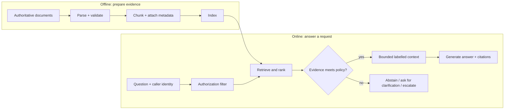

# 01 — RAG foundations: build an evidence system before a chatbot

**Level:** Beginner · **Time:** 2–3 hours · **Scenario:** Harborline Support
**Prerequisites:** basic Python, a terminal, and comfort reading JSON-like data

## Why this lesson exists

Retrieval-augmented generation (RAG) lets an application retrieve external
evidence at answer time and give that evidence to a language model. It is not
"a model that knows your documents," and it is not a promise that every answer
is true. It is an information-retrieval system with a generation step attached.

The original RAG paper combined a parametric language model with a retriever for
knowledge-intensive NLP tasks. Modern production systems generalize that idea:
they ingest changing, permissioned sources; retrieve a small evidence set; and
require the answer to stay within that set. Read Lewis et al.'s
[foundational paper](https://arxiv.org/abs/2005.11401) after this lesson—the
notebook deliberately turns the abstract architecture into observable behavior.

You are building an internal assistant for **Harborline**, a fictional SaaS
company. Support staff need grounded answers about production escalation and
customer communication. The corpus is intentionally small; that makes every
retrieval decision inspectable before the course introduces embeddings,
rerankers, vector databases, and agents.

## What you will be able to do

After completing the notebook you can:

- distinguish model knowledge, retrieved evidence, and application policy;
- trace the offline and online RAG lifecycle and identify a failure at each
  boundary;
- build a deterministic lexical retrieval baseline with stable chunk IDs;
- explain why a similarity score is not a truth or confidence probability;
- build a labelled, bounded evidence package rather than a document dump;
- evaluate hit rate, precision, reciprocal rank, and abstention behavior on a
  tiny golden set; and
- choose the smallest justified upgrade: better data, chunking, lexical search,
  hybrid retrieval, reranking, or a different system entirely.

## Start with the notebook

The guided notebook is the primary lesson. It contains the theory, diagrams,
deterministic implementation, deliberately broken cases, experiments, and
reflection questions in one place:

> **[Open the RAG foundations notebook →](../../../notebooks/beginner/01_first_local_rag.ipynb)**

Run it locally from the repository root:

```bash
make setup
make notebook NOTEBOOK=notebooks/beginner/01_first_local_rag.ipynb
```

The reusable implementation is
[`examples/beginner/first_local_rag.py`](../../../examples/beginner/first_local_rag.py).
It needs no API key, model download, or network access. Its deliberately simple
lexical scorer is a teaching baseline—not a recommended production ranker.

## The mental model: evidence, generation, and policy



Three planes must remain separate:

| Plane | Responsibility | A common mistake |
| --- | --- | --- |
| **Evidence** | What documents are present, current, allowed, and retrieved? | Treating retrieved text as automatically trustworthy or complete. |
| **Generation** | How is evidence transformed into an answer? | Asking a model to compensate for missing evidence. |
| **Policy** | Who may see what, when to abstain, how much context to use? | Implementing access control or approvals only in a prompt. |

If the evidence plane cannot support a claim, polished generation cannot repair
it. When a task needs live structured facts (for example an account balance), a
typed API or SQL query may be safer than document retrieval. When the answer is
stable behavior rather than changing knowledge, fine-tuning may be the right
complement. See [What is RAG?](../../../docs/what-is-rag.md) for the broader
comparison.

## A stage-by-stage failure map

| Stage | Question to ask | Typical failure | First response |
| --- | --- | --- | --- |
| Source selection | Is the canonical source present and current? | An obsolete policy is indexed. | Define source ownership, version, and freshness rules. |
| Parsing | Did content survive extraction? | Tables, headings, or permissions disappear. | Validate parsed output before indexing. |
| Chunking | Can one returned unit support a claim? | The rule and its exception land in different chunks. | Preserve structure and measure boundary coverage. |
| Indexing | Can the system retrieve the content it has? | Wrong fields, stale index, mixed tenants. | Record index version and filter before search. |
| Retrieval | Did relevant evidence rank high enough? | Synonym mismatch or keyword-adjacent hit. | Inspect traces; fix data before adding complexity. |
| Context building | Is the usable evidence retained and labelled? | Important evidence is truncated or drowned out. | Enforce a context budget and stable citations. |
| Generation | Does every claim follow from evidence? | The answer overgeneralizes a partial rule. | Constrain output, require citations, test faithfulness. |
| Policy | Is a no-answer safe and useful? | Confident answer despite weak evidence. | Tune abstention and escalation with representative cases. |

## Retrieval is ranking, not certainty

The starter uses lexical overlap so you can see each matching term. For a query
term set \(Q\) and chunk term set \(D\), its score is:

\[
score(Q, D) = \frac{|Q \cap D|}{\max(|Q|, 1)}
\]

That score answers only “how much literal vocabulary overlaps?” It does *not*
mean “the answer is 70% correct,” “the source is authoritative,” or “a model
will faithfully summarize it.” This limitation is intentional. It exposes
synonym mismatch (`reboot` versus `restart`), weak headings, and irrelevant
keyword matches before those failures are hidden inside an embedding model.

Classical BM25 uses term frequency, inverse document frequency, and document
length normalization; dense retrieval ranks semantic vectors; hybrid retrieval
combines signals; rerankers examine a small candidate set more deeply. Each can
improve a specific measured failure, but none eliminates the need for source
quality, authorization, or answer evaluation. The [Stanford IR book](https://nlp.stanford.edu/IR-book/)
is the foundational reference for lexical ranking; [BEIR](https://arxiv.org/abs/2104.08663)
is a useful reminder to test retrieval across varied tasks rather than a single
friendly demo.

## The implementation contract

The baseline has intentionally small, production-relevant contracts:

1. **Stable identity.** `Chunk` preserves `chunk_id`, source filename, section,
   and ordinal. A production chunk should also carry document version, location,
   owner, timestamps, tenant/ACL attributes, and a content hash.
2. **Inspectable ranking.** `RetrievalHit` reports rank, score, and matched
   terms. A retrieval trace should answer “why did this evidence appear?”
3. **Authorization before ranking.** `retrieve_authorized` demonstrates an
   allow-list before search. Filtering after context construction risks exposing
   protected text in logs or prompts.
4. **Bounded context.** `ContextPack` sends text together with retained IDs and
   citations, and says when lower-ranked evidence was truncated.
5. **Safe terminal behavior.** An answer policy may abstain, request
   clarification, or escalate. “I don’t have enough evidence” is a valid result.
6. **Separate evaluation.** Retrieval metrics answer whether evidence was
   located; later lessons assess citation correctness and answer faithfulness.

## Step-by-step practice plan

### Step 1 — Audit the corpus

Open [`examples/data/beginner-docs`](../../../examples/data/beginner-docs).
For each document, identify the source owner, intended audience, update signal,
and one statement that would be harmful if stale. Add these metadata fields to a
design note before you change the retrieval algorithm.

### Step 2 — Trace a supported question

Ask: “Who may restart production services?” Inspect matched terms, result rank,
section, source, context pack, and rendered citation. State what the source does
and does *not* authorize.

### Step 3 — Break the lexical baseline on purpose

Ask: “Can support reboot checkout?” Compare it with “Who may restart production
services?” If one fails, record whether the cause is vocabulary, chunk boundary,
or source wording. Do not call it “hallucination”—the failure occurred before
generation.

### Step 4 — Add a visibility boundary

Call `retrieve_authorized` with only one allowed source. Verify an answer can
become unavailable without accidentally revealing the excluded source ID or
text. In a real system, bind the filter to authenticated caller claims, not a
model-supplied source name.

### Step 5 — Tune a decision, not a demo

Run the golden set at multiple `top_k` and `min_score` values. A lower threshold
may increase answer coverage while creating unsupported answers; a high threshold
may create false abstentions. Choose a policy based on costs of each error for
Harborline support, then write down the escalation path.

### Step 6 — Choose the next upgrade with evidence

| Observed problem | Smallest useful intervention | Do not jump straight to |
| --- | --- | --- |
| Canonical text is absent/stale | Source governance and re-indexing | A larger model |
| Literal synonyms miss | Curated aliases or hybrid retrieval | Agent loops |
| Rule and exception split | Structure-aware chunking | Bigger context windows |
| Correct chunk ranks too low | Retrieval evaluation, then ranker change | Prompt-only fixes |
| Context contains irrelevant hits | Metadata filters or reranking | More top-k |
| Evidence exists but answer overstates it | Citation/claim checks and abstention | Trusting a similarity score |

## Evaluation: the minimum viable golden set

Every case should include a question, expected evidence IDs, expected terminal
behavior, caller role/tenant if relevant, and an explanation of why it matters.

```python
EvaluationCase(
    question="Who may restart production services?",
    relevant_ids=("harborline-support-7",),
    should_abstain=False,
)
```

At this stage, track:

- **Recall@k / hit rate:** does any expected evidence appear in the top `k`?
- **Precision@k:** how much of the returned evidence is relevant?
- **MRR:** how early does the first relevant piece appear?
- **Abstention accuracy:** does the system correctly withhold an answer when it
  should, without declining supported questions?

These are not interchangeable with answer correctness. A system can retrieve
the right passage yet generate an unsupported sentence; it can also retrieve a
wrong passage and produce a plausible answer. The evaluation track expands this
distinction with claim and citation tests.

## Technical decisions and production guardrails

- Start with a deterministic test corpus before adding a provider API.
- Treat retrieved documents, tool results, and user uploads as untrusted data;
  never let content inside them override application instructions.
- Apply authorization and tenant isolation at retrieval time and preserve that
  decision in traces.
- Set a context budget and measure truncation. More context is not automatically
  better context.
- Version sources and indexes; record source IDs and retrieval configuration in
  evaluation results.
- Do not rely on a model to decide whether an irreversible action is allowed.
- Define a useful no-answer response: what was searched, what is missing, and
  which safe next action a user can take.

NIST’s [Generative AI Profile](https://nvlpubs.nist.gov/nistpubs/ai/NIST.AI.600-1.pdf)
is a broader risk-management reference for governing these decisions in a real
system.

## Checkpoint

Answer these before advancing:

1. Why can a high retrieval score still produce a bad answer?
2. At which stage should tenant filtering occur, and why is a prompt insufficient?
3. Which metric identifies a false abstention versus a failed retrieval?
4. For the `reboot` failure, what evidence would justify choosing hybrid search
   rather than changing the source document?
5. Give one case where RAG is the wrong primary architecture and a typed tool is
   safer.

## Continue the beginner path

1. [First local RAG baseline](../02-first-local-rag/README.md) — turn the
   foundation into a runnable local assistant.
2. [Chunking lab](../03-chunking-lab/README.md) — measure how chunk boundaries
   change retrieval coverage.
3. [Citations and abstention](../04-citations-abstention/README.md) — audit
   evidence-backed answers and explicit no-answer behavior.
4. [Documentation assistant capstone](../../../use-cases/documentation-assistant/README.md)
   — assemble a small useful RAG application.

## References

- Lewis et al., [Retrieval-Augmented Generation for Knowledge-Intensive NLP Tasks](https://arxiv.org/abs/2005.11401)
- Manning, Raghavan, and Schütze, [Introduction to Information Retrieval](https://nlp.stanford.edu/IR-book/)
- Thakur et al., [BEIR: A Heterogeneous Benchmark for Zero-Shot Evaluation of Information Retrieval Models](https://arxiv.org/abs/2104.08663)
- NIST, [AI RMF: Generative AI Profile](https://nvlpubs.nist.gov/nistpubs/ai/NIST.AI.600-1.pdf)
- [What is RAG?](../../../docs/what-is-rag.md) in this repository
