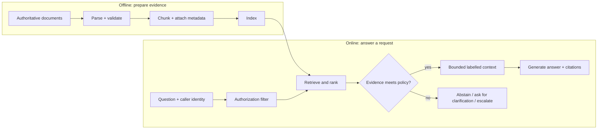

# 01 — RAG foundations: build an evidence system before a chatbot

**Level:** Beginner · **Time:** 2–3 hours · **Scenario:** Harborline Support  
**Prerequisites:** basic Python, a terminal, and comfort reading JSON-like data

## Why this lesson exists

Retrieval-augmented generation (RAG) lets an application retrieve external
evidence at answer time and give that evidence to a language model. It is not
"a model that knows your documents," and it is not a promise that every answer
is true. It is an information-retrieval system with a generation step attached.

The original RAG paper combined a parametric language model with a retriever for
knowledge-intensive NLP tasks. Modern production systems generalize that idea:
they ingest changing, permissioned sources; retrieve a small evidence set; and
require the answer to stay within that set. Read Lewis et al.'s
[foundational paper](https://arxiv.org/abs/2005.11401) after this lesson—the
notebook deliberately turns the abstract architecture into observable behavior.

## Learning objectives

After completing this lesson you can:

- explain what RAG is and what it is not, using the evidence/generation/policy framing;
- trace the historical evolution from IR to modern RAG and identify why each step was added;
- distinguish parametric knowledge (in model weights) from non-parametric knowledge (retrieved at runtime);
- choose between RAG, fine-tuning, long-context, tool/API, and search engine architectures for a given problem;
- trace the offline and online RAG lifecycle and identify a failure at each stage boundary;
- build a deterministic lexical retrieval baseline with stable chunk IDs;
- explain why a similarity score is not a truth or confidence probability;
- decompose end-to-end quality into retrieval quality, context quality, groundedness, and factuality;
- evaluate hit rate, precision, reciprocal rank, and abstention behavior on a tiny golden set; and
- choose the smallest justified upgrade when a measured failure is identified.

## Start with the notebook

Open [`rag_foundations.ipynb`](rag_foundations.ipynb) before building the local
assistant. It pairs the lifecycle mental model with a deterministic evidence
selection experiment. For a deeper conceptual reference, read
[What is RAG?](../../../docs/what-is-rag.md); use the notebook to test the
distinction between retrieval quality, groundedness, citations, and abstention.

You are building an internal assistant for **Harborline**, a fictional SaaS
company. Support staff need grounded answers about production escalation and
customer communication. The corpus is intentionally small; that makes every
retrieval decision inspectable before the course introduces embeddings,
rerankers, vector databases, and agents.

## The historical evolution of RAG

RAG did not emerge fully formed. Each generation solved a failure mode of the previous one.

```
Information Retrieval (IR)
  ↓ Boolean / TF-IDF keyword search, no language model
  ↓ Problem: keyword mismatch; no synthesis

Dense Retrieval (2019–2020)
  ↓ Neural bi-encoders embed queries and documents into vector space
  ↓ DPR (Karpukhin et al., 2020) shows dense retrieval beats BM25 on open-domain QA
  ↓ Problem: retrieved passages not synthesized; answers still extracted

Original RAG (Lewis et al., 2020)
  ↓ Combines a dense retriever with a seq2seq generator end-to-end
  ↓ Enables knowledge-intensive NLP without retraining the whole model
  ↓ Problem: fixed corpus, no access control, no citation, no abstention

Modular / Advanced RAG (2022–2023)
  ↓ Pipeline components become independent: chunking, embedding, reranking, generation
  ↓ Adds metadata filtering, hybrid retrieval, reranking, query rewriting
  ↓ Problem: system can fail at many stages; no recovery mechanism

Corrective / Adaptive RAG (2023–2024)
  ↓ Adds retrieval quality evaluation and conditional recovery routes
  ↓ Corrective RAG (Yan et al., 2024) grades retrieved evidence; Self-RAG (Asai et al., 2024)
     uses reflection tokens
  ↓ Problem: graph-structured and multi-hop knowledge still hard to retrieve

GraphRAG (2024)
  ↓ Extracts entity/relation graphs; enables multi-hop reasoning and community summaries
  ↓ Microsoft GraphRAG (Edge et al., 2024) shows value for corpus-level queries
  ↓ Problem: graph construction is expensive; does not replace chunk retrieval

Agentic / Multimodal RAG (2024–present)
  ↓ Agent decides which tools and retrieval steps to take at runtime
  ↓ Handles multiple modalities (text, tables, images, OCR)
  ↓ Problem: harder to bound, trace, evaluate, and secure
```

**Classification:** the original RAG paper is **FOUNDATIONAL**. Dense retrieval, hybrid
retrieval, and reranking are **PRACTICAL / ESTABLISHED**. Corrective RAG, GraphRAG, and
structured RAG are **PRACTICAL / ESTABLISHED** for specific use cases. Agentic and multimodal
RAG are **EMERGING**. Do not treat a technique as appropriate simply because it is recent.

## Parametric vs non-parametric knowledge

A language model stores knowledge in its weights during training. This is
**parametric knowledge** — it is fixed at inference time. When you ask a model what
the capital of France is, it uses parametric knowledge. When facts change faster
than training cycles, or when knowledge is private, permissioned, domain-specific,
or voluminous, parametric knowledge fails.

**Non-parametric knowledge** is retrieved at inference time from external sources.
RAG is a non-parametric extension: the model's knowledge is augmented with retrieved
evidence rather than baked into weights.

| Knowledge type | Where it lives | Update mechanism | Scale |
|---|---|---|---|
| Parametric | Model weights | Retraining or fine-tuning | Limited by training data |
| Non-parametric (RAG) | External index | Ingestion pipeline | Unbounded, versioned |
| Hybrid | Both | Fine-tune + RAG | Common in production |

Parametric knowledge has one critical advantage: zero retrieval latency. Non-parametric
knowledge has a critical advantage: it can be updated, versioned, audited, and scoped
without touching the model. Production systems often use both.

## The mental model: evidence, generation, and policy



Three planes must remain separate:

| Plane | Responsibility | A common mistake |
|---|---|---|
| **Evidence** | What documents are present, current, allowed, and retrieved? | Treating retrieved text as automatically trustworthy or complete. |
| **Generation** | How is evidence transformed into an answer? | Asking a model to compensate for missing evidence. |
| **Policy** | Who may see what, when to abstain, how much context to use? | Implementing access control or approvals only in a prompt. |

If the evidence plane cannot support a claim, polished generation cannot repair
it. When a task needs live structured facts (for example an account balance), a
typed API or SQL query may be safer than document retrieval. When the answer is
stable behavior rather than changing knowledge, fine-tuning may be the right
complement. See [What is RAG?](../../../docs/what-is-rag.md) for the broader
comparison.

## When RAG is the right architecture

Use RAG when:

- knowledge changes faster than you can retrain or fine-tune;
- knowledge is private, permissioned, or domain-specific;
- answers must be traceable to specific source documents;
- multiple users need access-controlled views of overlapping knowledge; or
- the corpus is too large for a practical context window.

## When RAG is the wrong architecture

| Situation | Better alternative | Why |
|---|---|---|
| The answer is a precise calculation or database lookup | Typed API / SQL tool | Retrieval introduces unnecessary uncertainty for deterministic facts |
| The behavior needs to change, not the knowledge | Fine-tuning | RAG is for changing knowledge, not changing model behavior |
| The context window easily holds all relevant documents | Long-context LLM (GPT-4o, Gemini 1.5 Pro) | Retrieval adds latency and complexity without benefit |
| Users query a well-indexed corpus with exact terms | Search engine + snippet | A full RAG pipeline is over-engineered |
| Knowledge is static and small | Fine-tuning or few-shot prompting | Ingestion + retrieval infrastructure costs more than it saves |
| You need real-time data (stock prices, live sensor readings) | Typed tool / API call | RAG indexes are not real-time |

The architecture choice should be driven by the specific failure of the simpler alternative,
measured on real data. Do not add RAG because it is fashionable.

## RAG as a pipeline of contracts

Every stage of a RAG system makes a contract with the next stage. A failure at one
stage cannot be corrected by a later stage. Understanding these contracts is the
central skill of RAG engineering.

| Contract | Question | Failure if broken |
|---|---|---|
| **Source contract** | Is the source authoritative, current, permitted, and versioned? | Stale or unauthorized content reaches the index |
| **Ingestion contract** | What content and metadata survive parsing? | Tables, headings, permissions, or versions are lost |
| **Chunk contract** | Does the retrieval unit preserve enough meaning to support a claim? | The rule and its exception land in different chunks |
| **Representation contract** | How is content represented for search? | Semantic mismatch; domain shift; identifier loss |
| **Retrieval contract** | What candidate set is returned? | Relevant evidence is absent or below the policy threshold |
| **Reranking contract** | How are candidates reordered? | The most useful evidence ranks below noise |
| **Context contract** | Which evidence enters the model context? | Relevant evidence is truncated; irrelevant evidence dilutes |
| **Generation contract** | What claims may be made from the evidence? | Model overstates or invents facts not in evidence |
| **Citation contract** | How does an answer map to evidence? | Claims are cited but unsupported; or uncited |
| **Policy contract** | When must the system abstain or escalate? | Confident answer despite weak or unauthorized evidence |
| **Evaluation contract** | How is quality measured at each stage? | Wrong stage is blamed; correct stage is not fixed |
| **Production contract** | How is the system versioned, traced, operated, and rolled back? | Regressions are undetected; incidents are unrecoverable |

This vocabulary is used throughout the course. When a failure occurs, identify which
contract was broken before deciding what to change.

## End-to-end quality decomposition

"The answer is wrong" is not a diagnosis. A RAG answer that is wrong can fail at any
of these layers — and each requires a different fix:

```
Retrieval quality      → Did the system return relevant evidence?
        ↓
Context quality        → Did relevant evidence enter the model context without
                         truncation, duplication, or dilution?
        ↓
Groundedness           → Does every claim in the answer follow from the
                         provided context?
        ↓
Factual correctness    → Is the retrieved source itself correct?
        ↓
Answer relevance       → Does the answer address the actual question?
        ↓
Citation correctness   → Do citations accurately map claims to evidence?
        ↓
Abstention quality     → Does the system correctly decline unanswerable questions
                         without declining answerable ones?
```

A system can have perfect retrieval recall and still produce an unsupported answer
(context truncation or generation failure). A system can produce a grounded answer
(faithful to context) that is factually wrong (because the source is wrong). These
layers are not interchangeable. Measure each separately.

## A stage-by-stage failure map

| Stage | Question to ask | Typical failure | First response |
|---|---|---|---|
| Source selection | Is the canonical source present and current? | An obsolete policy is indexed. | Define source ownership, version, and freshness rules. |
| Parsing | Did content survive extraction? | Tables, headings, or permissions disappear. | Validate parsed output before indexing. |
| Chunking | Can one returned unit support a claim? | The rule and its exception land in different chunks. | Preserve structure and measure boundary coverage. |
| Indexing | Can the system retrieve the content it has? | Wrong fields, stale index, mixed tenants. | Record index version and filter before search. |
| Retrieval | Did relevant evidence rank high enough? | Synonym mismatch or keyword-adjacent hit. | Inspect traces; fix data before adding complexity. |
| Context building | Is the usable evidence retained and labelled? | Important evidence is truncated or drowned out. | Enforce a context budget and stable citations. |
| Generation | Does every claim follow from evidence? | The answer overgeneralizes a partial rule. | Constrain output, require citations, test faithfulness. |
| Policy | Is a no-answer safe and useful? | Confident answer despite weak evidence. | Tune abstention and escalation with representative cases. |

## Retrieval is ranking, not certainty

The starter uses lexical overlap so you can see each matching term. For a query
term set \(Q\) and chunk term set \(D\), its score is:

\[
score(Q, D) = \frac{|Q \cap D|}{\max(|Q|, 1)}
\]

That score answers only "how much literal vocabulary overlaps?" It does *not*
mean "the answer is 70% correct," "the source is authoritative," or "a model
will faithfully summarize it." This limitation is intentional. It exposes
synonym mismatch (`reboot` versus `restart`), weak headings, and irrelevant
keyword matches before those failures are hidden inside an embedding model.

Classical BM25 uses term frequency, inverse document frequency, and document
length normalization; dense retrieval ranks semantic vectors; hybrid retrieval
combines signals; rerankers examine a small candidate set more deeply. Each can
improve a specific measured failure, but none eliminates the need for source
quality, authorization, or answer evaluation. The [Stanford IR book](https://nlp.stanford.edu/IR-book/)
is the foundational reference for lexical ranking; [BEIR](https://arxiv.org/abs/2104.08663)
is a useful reminder to test retrieval across varied tasks rather than a single
friendly demo.

## RAG latency and cost decomposition

A RAG pipeline has multiple cost centers. Understand the breakdown before
choosing where to invest:

| Stage | Latency driver | Cost driver |
|---|---|---|
| Query embedding | Model size; batch size | Token count; inference cost |
| Metadata filter | Index design; filter complexity | Storage read |
| Dense retrieval | ANN index size; dimension; candidate depth | Vector compute |
| Sparse retrieval | Inverted index size; term count | Storage read |
| Reranking | Candidate count × cross-encoder cost | Model inference |
| Context construction | Deduplication; token counting | Negligible |
| LLM generation | Context length + output length | Token cost (often dominates) |
| Citation verification | Number of claims × evidence size | Negligible to model-based |
| Observability | Trace storage | Storage |

**Key insight:** LLM generation usually dominates cost. Retrieval latency is usually
dominated by the reranker on large candidate sets. Optimizing the wrong stage is
a common mistake.

## The implementation contract

The baseline has intentionally small, production-relevant contracts:

1. **Stable identity.** `Chunk` preserves `chunk_id`, source filename, section,
   and ordinal. A production chunk should also carry document version, location,
   owner, timestamps, tenant/ACL attributes, and a content hash.
2. **Inspectable ranking.** `RetrievalHit` reports rank, score, and matched
   terms. A retrieval trace should answer "why did this evidence appear?"
3. **Authorization before ranking.** `retrieve_authorized` demonstrates an
   allow-list before search. Filtering after context construction risks exposing
   protected text in logs or prompts.
4. **Bounded context.** `ContextPack` sends text together with retained IDs and
   citations, and says when lower-ranked evidence was truncated.
5. **Safe terminal behavior.** An answer policy may abstain, request
   clarification, or escalate. "I don't have enough evidence" is a valid result.
6. **Separate evaluation.** Retrieval metrics answer whether evidence was
   located; later lessons assess citation correctness and answer faithfulness.

## Step-by-step practice plan

### Step 1 — Audit the corpus

Open [`examples/data/beginner-docs`](../../../examples/data/beginner-docs).
For each document, identify the source owner, intended audience, update signal,
and one statement that would be harmful if stale. Add these metadata fields to a
design note before you change the retrieval algorithm.

### Step 2 — Trace a supported question

Ask: "Who may restart production services?" Inspect matched terms, result rank,
section, source, context pack, and rendered citation. State what the source does
and does *not* authorize.

### Step 3 — Break the lexical baseline on purpose

Ask: "Can support reboot checkout?" Compare it with "Who may restart production
services?" If one fails, record whether the cause is vocabulary, chunk boundary,
or source wording. Do not call it "hallucination"—the failure occurred before
generation.

### Step 4 — Add a visibility boundary

Call `retrieve_authorized` with only one allowed source. Verify an answer can
become unavailable without accidentally revealing the excluded source ID or
text. In a real system, bind the filter to authenticated caller claims, not a
model-supplied source name.

### Step 5 — Tune a decision, not a demo

Run the golden set at multiple `top_k` and `min_score` values. A lower threshold
may increase answer coverage while creating unsupported answers; a high threshold
may create false abstentions. Choose a policy based on costs of each error for
Harborline support, then write down the escalation path.

### Step 6 — Choose the next upgrade with evidence

| Observed problem | Smallest useful intervention | Do not jump straight to |
|---|---|---|
| Canonical text is absent/stale | Source governance and re-indexing | A larger model |
| Literal synonyms miss | Curated aliases or hybrid retrieval | Agent loops |
| Rule and exception split | Structure-aware chunking | Bigger context windows |
| Correct chunk ranks too low | Retrieval evaluation, then ranker change | Prompt-only fixes |
| Context contains irrelevant hits | Metadata filters or reranking | More top-k |
| Evidence exists but answer overstates it | Citation/claim checks and abstention | Trusting a similarity score |

## Evaluation: the minimum viable golden set

Every case should include a question, expected evidence IDs, expected terminal
behavior, caller role/tenant if relevant, and an explanation of why it matters.

```python
EvaluationCase(
    question="Who may restart production services?",
    relevant_ids=("harborline-support-7",),
    should_abstain=False,
)
```

At this stage, track:

- **Recall@k / hit rate:** does any expected evidence appear in the top `k`?
- **Precision@k:** how much of the returned evidence is relevant?
- **MRR:** how early does the first relevant piece appear?
- **Abstention accuracy:** does the system correctly withhold an answer when it
  should, without declining supported questions?

These are not interchangeable with answer correctness. A system can retrieve
the right passage yet generate an unsupported sentence; it can also retrieve a
wrong passage and produce a plausible answer. The evaluation track expands this
distinction with claim and citation tests.

## Technical decisions and production guardrails

- Start with a deterministic test corpus before adding a provider API.
- Treat retrieved documents, tool results, and user uploads as untrusted data;
  never let content inside them override application instructions.
- Apply authorization and tenant isolation at retrieval time and preserve that
  decision in traces.
- Set a context budget and measure truncation. More context is not automatically
  better context.
- Version sources and indexes; record source IDs and retrieval configuration in
  evaluation results.
- Do not rely on a model to decide whether an irreversible action is allowed.
- Define a useful no-answer response: what was searched, what is missing, and
  which safe next action a user can take.

NIST's [Generative AI Profile](https://nvlpubs.nist.gov/nistpubs/ai/NIST.AI.600-1.pdf)
is a broader risk-management reference for governing these decisions in a real
system.

## Checkpoint

Answer these before advancing:

1. Why can a high retrieval score still produce a bad answer?
2. At which stage should tenant filtering occur, and why is a prompt insufficient?
3. Which metric identifies a false abstention versus a failed retrieval?
4. For the `reboot` failure, what evidence would justify choosing hybrid search
   rather than changing the source document?
5. Give one case where RAG is the wrong primary architecture and a typed tool is
   safer.
6. What is the difference between groundedness and factual correctness?
7. A system produces a grounded, cited answer that is factually wrong. At which
   stage did the failure occur?
8. Name one technique that belongs to each generation of RAG evolution and explain
   why each was added.

## Continue the beginner path

1. [First local RAG baseline](../02-first-local-rag/README.md) — turn the
   foundation into a runnable local assistant.
2. [Chunking lab](../03-chunking-lab/README.md) — measure how chunk boundaries
   change retrieval coverage.
3. [Citations and abstention](../04-citations-abstention/README.md) — audit
   evidence-backed answers and explicit no-answer behavior.
4. [Documentation assistant capstone](../../../use-cases/documentation-assistant/README.md)
   — assemble a small useful RAG application.

## References

- Lewis et al., [Retrieval-Augmented Generation for Knowledge-Intensive NLP Tasks](https://arxiv.org/abs/2005.11401) — the foundational RAG paper.
- Karpukhin et al., [Dense Passage Retrieval for Open-Domain Question Answering](https://arxiv.org/abs/2004.04906) — DPR and the dense retrieval foundation.
- Yan et al., [Corrective Retrieval Augmented Generation](https://arxiv.org/abs/2401.15884) — CRAG and retrieval quality evaluation.
- Asai et al., [Self-RAG](https://arxiv.org/abs/2310.11511) — adaptive retrieval and self-critique.
- Edge et al., [From Local to Global: A Graph RAG Approach](https://arxiv.org/abs/2404.16130) — GraphRAG and community summaries.
- Gao et al., [RAG for LLMs: A Survey](https://arxiv.org/abs/2312.10997) — comprehensive systems overview.
- Manning, Raghavan, and Schütze, [Introduction to Information Retrieval](https://nlp.stanford.edu/IR-book/)
- Thakur et al., [BEIR: A Heterogeneous Benchmark for Zero-Shot IR Evaluation](https://arxiv.org/abs/2104.08663)
- NIST, [AI RMF: Generative AI Profile](https://nvlpubs.nist.gov/nistpubs/ai/NIST.AI.600-1.pdf)
- [What is RAG?](../../../docs/what-is-rag.md) in this repository
