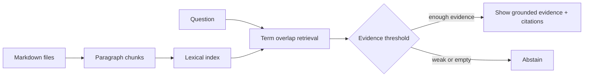

# 02 — First local RAG baseline

**Level:** Beginner  \
**Time:** 30 minutes  \
**Prerequisites:** [RAG foundations](../01-rag-foundations/README.md)

## Outcome

Run a dependency-free retrieval baseline that loads local Markdown documents, creates inspectable chunks, ranks lexical overlap, returns source identifiers, and abstains when evidence is weak.

## Run it

From the repository root:

```bash
python examples/beginner/first_local_rag.py
```

Prefer a narrative walkthrough? Open the guided [`first local RAG notebook`](../../../notebooks/beginner/01_first_local_rag.ipynb).

Try:

```text
Question> What is an abstention?
Question> What is the capital of France?
```

The first query should show evidence and source IDs. The second should use the safe “not enough evidence” response.

## Architecture



## What to inspect

Open [`first_local_rag.py`](../../../examples/beginner/first_local_rag.py). The `Chunk` object keeps a stable ID and source filename. `retrieve` is deliberately simple: it makes ranking behavior visible before introducing embeddings. `answer` separates retrieval from the abstention policy.

## Experiment

Change `top_k` or `min_score`, then ask the same questions. Record which answers gain or lose evidence. Do not change both variables at once.

## Failure modes

- Lexical overlap misses synonyms and paraphrases.
- Paragraph chunks may be too large or too small.
- A high threshold can create false abstentions; a low threshold can admit weak evidence.
- Showing evidence is not the same as proving that a generated answer is faithful.

## Exercise

Add a third document about the same topic using different wording. Explain why the lexical baseline misses it, then write down what an embedding or hybrid retriever should improve. Include one new question and a source citation in the output.

## Next step

Continue to the chunking lab, then replace this baseline with Sentence Transformers and Qdrant in the intermediate path.
