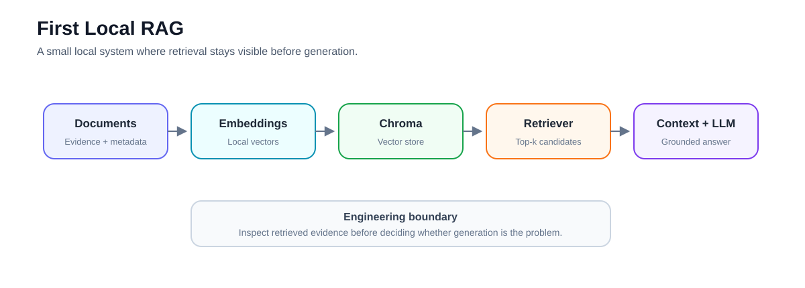
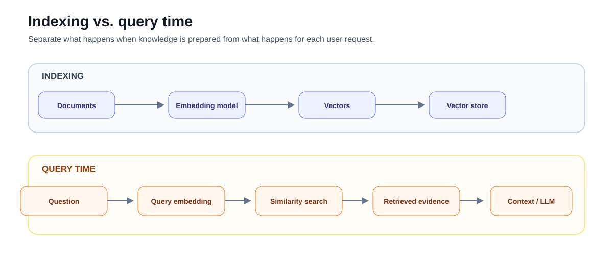
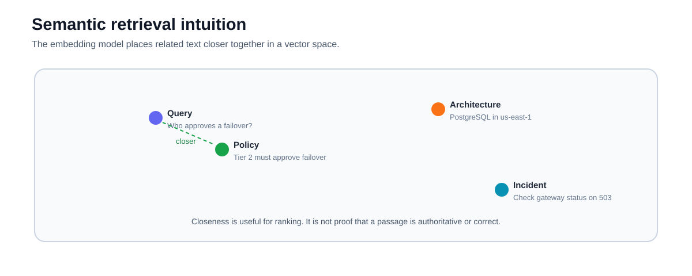
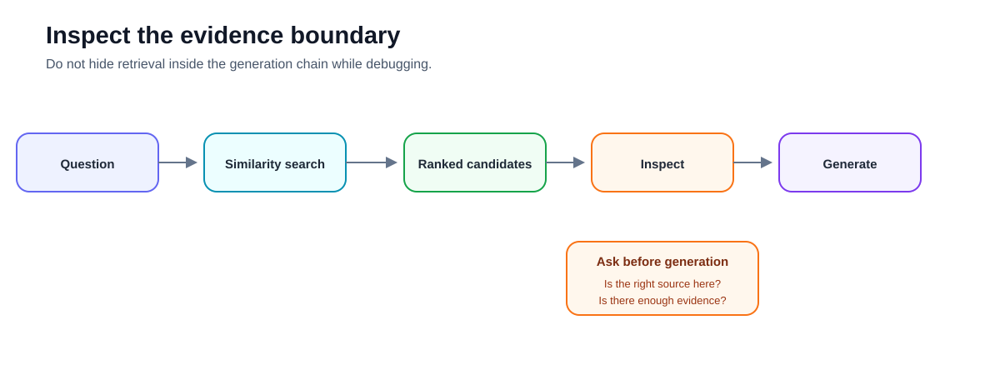
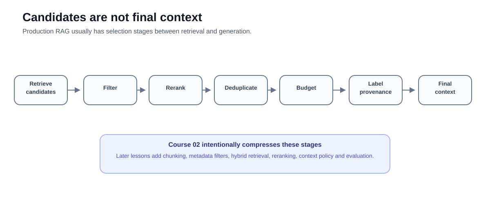
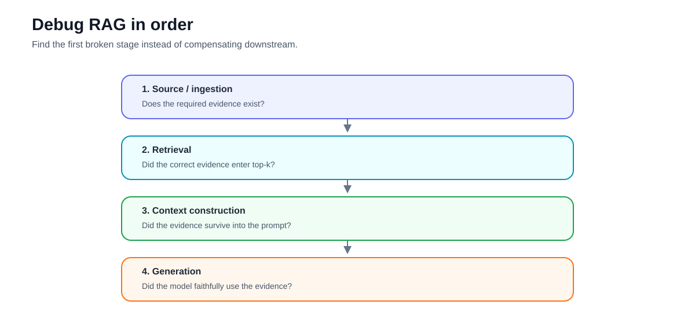

# 02 — First Local RAG: Build an Inspectable Semantic Retrieval Pipeline

**Level:** Beginner  
**Estimated time:** 90–120 minutes  
**Scenario:** Harborline Support Assistant  
**Notebook:** [`02_first_local_rag.ipynb`](02_first_local_rag.ipynb)  
**Prerequisite:** [01 — RAG Foundations](../01-rag-foundations/README.md)

---

## Why this lesson exists

Course 01 introduced the RAG architecture and the separation between **retrieval** and **generation**.

Now we make retrieval real.

In this lesson you build a small local semantic-retrieval pipeline using:

- LangChain `Document` objects;
- a local Hugging Face embedding model;
- Chroma as a local vector store;
- explicit similarity-search inspection;
- source metadata for citations; and
- a mock LLM so the retrieval path remains inspectable without an API key.

The objective is not to build a production chatbot.

It is to understand the first important engineering boundary in RAG:

> **Before asking whether the model produced a good answer, verify that the system retrieved good evidence.**



---

## Learning objectives

After completing this lesson, you should be able to:

- explain how text becomes an embedding and enters a vector store;
- distinguish documents, embeddings, vector stores, and retrievers;
- build a small local semantic-search index;
- inspect retrieval results before generation;
- interpret retrieval scores cautiously and understand that score semantics depend on the vector-store implementation and distance metric;
- preserve source metadata through retrieval and context construction;
- build a simple two-step RAG chain;
- distinguish ingestion, retrieval, and generation failures;
- explain why semantic similarity is not the same as factual correctness or confidence;
- identify the major limitations of a toy local RAG system; and
- know which problems should be solved in later lessons rather than hidden with prompt changes.

---

# 1. From a RAG diagram to a runnable retrieval system

A minimal semantic RAG pipeline has two phases.

### Indexing

```text
Documents
   ↓
Embedding model
   ↓
Vectors
   ↓
Vector store
```

### Query time

```text
Question
   ↓
Query embedding
   ↓
Similarity search
   ↓
Retrieved documents
   ↓
Context
   ↓
LLM
   ↓
Answer
```

The important idea is that retrieval can be inspected independently of generation.



If the correct evidence is not retrieved, changing the answer prompt is usually the wrong first intervention.

---

# 2. The Harborline scenario

Harborline operates a support organization with internal policies and operational documentation.

Our tiny corpus contains three pieces of evidence:

1. an escalation policy describing who can approve a database failover;
2. an incident-response procedure for payment API failures; and
3. architecture documentation describing the payment database.

The question we want to answer is:

> Who is allowed to trigger a DB failover?

The relevant policy says that **Tier 2 must approve any database failover**.

This is intentionally a small corpus. You should be able to inspect every source manually.

That gives us something production systems often lose:

> a known ground truth for understanding what retrieval is doing.

---

# 3. Use current LangChain integrations

The original notebook used:

```python
from langchain_community.vectorstores import Chroma
```

Current LangChain documentation uses the dedicated Chroma integration package:

```bash
pip install -U langchain-core langchain-huggingface langchain-chroma sentence-transformers
```

and:

```python
from langchain_chroma import Chroma
```

The Hugging Face integration remains available through:

```python
from langchain_huggingface import HuggingFaceEmbeddings
```

Keeping provider integrations separate from the core framework reduces coupling and reflects the current LangChain package structure.

> **Notebook note:** if the notebook still contains the older `langchain_community.vectorstores.Chroma` import, update it to `langchain_chroma.Chroma` when refreshing the notebook.

---

# 4. Documents are evidence records, not just strings

The notebook represents each source as a LangChain `Document`:

```python
from langchain_core.documents import Document

Document(
    page_content=(
        "Harborline Support Escalation Policy: "
        "Tier 1 may reboot edge nodes. "
        "Tier 2 must approve any database failover."
    ),
    metadata={
        "source": "escalation_policy.md",
        "section": "permissions",
        "id": "chunk-01",
    },
)
```

There are two distinct parts.

### Content

`page_content` contains the text that can be embedded and retrieved.

### Metadata

`metadata` describes where the evidence came from.

Even this tiny example preserves:

- source;
- section; and
- chunk ID.

A production system usually needs more:

```text
document_id
document_version
chunk_id
source_uri
section / page
updated_at
owner
tenant
ACL attributes
parser_version
embedding_version
index_version
```

Why?

Because retrieval is not enough.

Eventually you need to answer:

> Which exact version of which source supported this answer?

---

# 5. Embeddings

An embedding model maps text into a numerical vector.

Conceptually:

```text
"Who can approve a database failover?"
                 ↓
          embedding model
                 ↓
      [0.14, -0.52, 0.31, ...]
```

Documents are embedded too.

The retrieval system then compares the query representation with document representations.



Documents that the model represents as semantically related should be closer in the embedding space than unrelated documents.

This allows semantic retrieval to match concepts even when the wording differs.

For example:

```text
Query:
"Who can trigger a DB failover?"

Document:
"Tier 2 must approve any database failover."
```

The wording is not identical, but the concepts are closely related.

---

# 6. Semantic search is not keyword search

Lexical retrieval asks questions such as:

> Which documents contain the same terms?

Dense semantic retrieval asks approximately:

> Which documents have representations closest to this query in the embedding space?

This can help with:

- synonyms;
- paraphrases;
- abbreviations;
- conceptual similarity; and
- wording differences.

But semantic search introduces different failure modes.

A passage can be **semantically similar but factually irrelevant**.

For example, a query about authorization might retrieve architecture documentation because both discuss databases.

Therefore:

> Similarity is evidence for ranking—not proof of correctness.

---

# 7. Query/document asymmetry

Information retrieval is often an **asymmetric** task.

The query may be short:

```text
Who can approve a failover?
```

while the document is longer:

```text
Harborline Support Escalation Policy:
Tier 1 may reboot edge nodes.
Tier 2 must approve any database failover.
```

Modern Sentence Transformers exposes:

```python
model.encode_query(...)
model.encode_document(...)
```

for retrieval tasks.

Models that define query/document prompts or routing can use these methods to encode each side appropriately.

Not every embedding model behaves differently for the two methods, but the distinction matters when selecting retrieval models.

The notebook uses LangChain's embedding abstraction, which hides this lower-level detail. Later retrieval lessons should expose model-specific retrieval behavior more directly.

---

# 8. Build the local vector store

For this lesson, Chroma runs locally and can be used without credentials.

A current LangChain-style setup looks like:

```python
from langchain_chroma import Chroma
from langchain_huggingface import HuggingFaceEmbeddings

embeddings = HuggingFaceEmbeddings(
    model_name="sentence-transformers/all-MiniLM-L6-v2"
)

vectorstore = Chroma.from_documents(
    documents=corpus,
    embedding=embeddings,
    collection_name="harborline-course-02",
)
```

Then create a retriever:

```python
retriever = vectorstore.as_retriever(
    search_kwargs={"k": 2}
)
```

For this course, `k=2` means:

> return two candidate documents for each query.

It does **not** mean two documents are necessarily relevant.

---

# 9. Inspect retrieval before generation

This is the most important exercise in the course.

Instead of immediately calling an LLM:

```python
question = "Who is allowed to trigger a DB failover?"

results = vectorstore.similarity_search_with_score(
    question,
    k=2,
)

for doc, score in results:
    print(score)
    print(doc.metadata)
    print(doc.page_content)
```

You should inspect:

- which source ranked first;
- whether the correct evidence appears in the candidate set;
- whether irrelevant evidence was also retrieved;
- which metadata survived retrieval; and
- what the score returned by your vector-store integration actually means.



---

# 10. Be careful with retrieval scores

A common RAG mistake is to treat a retrieval score as:

```text
0.92 = 92% confidence that the answer is correct
```

That interpretation is generally wrong.

Depending on the vector store and configuration, a returned value may represent:

- cosine similarity;
- cosine distance;
- Euclidean distance;
- inner product;
- a transformed relevance score; or
- another backend-specific quantity.

Even when the score is a normalized similarity:

> retrieval similarity is not answer confidence.

The score tells you something about ranking under a particular retrieval representation.

It does not prove that:

- the source is authoritative;
- the source is current;
- the passage answers the question;
- the caller may access the source;
- the generated answer is faithful; or
- the answer is factually correct.

Always check the score semantics of the actual vector-store integration you deploy.

---

# 11. Candidate retrieval versus final context

Retrieval produces **candidates**.

Generation consumes **context**.

These should be treated as different stages.

```text
Query
  ↓
Retrieve candidates
  ↓
Optional filtering
  ↓
Optional reranking
  ↓
Deduplicate
  ↓
Apply context budget
  ↓
Label provenance
  ↓
Final context
```



The notebook is intentionally simpler: it formats the retrieved documents directly.

That is appropriate for three tiny documents.

It is not the architecture you should blindly scale to thousands of chunks.

Later courses introduce the missing stages.

---

# 12. Preserve provenance in the context

The notebook formats documents like this:

```python
def format_docs_with_citations(docs):
    formatted_chunks = []
    for i, d in enumerate(docs, start=1):
        chunk = (
            f"<EVIDENCE id=\"E{i}\">\n"
            f"Title: {d.metadata['title']}\n"
            f"Section: {d.metadata['section']}\n"
            f"Content:\n{d.page_content}\n"
            f"</EVIDENCE>"
        )
        formatted_chunks.append(chunk)
    return "\n\n".join(formatted_chunks)
```

This is simple, but it teaches an important design principle:

> Provenance must survive the retrieval-to-generation boundary.

Without source labels, the generator may receive useful evidence while the application loses the ability to trace that evidence back to its origin.

For production, prefer stable identifiers over display filenames alone.

For example:

```text
[source_id=policy-1842]
[version=2026-08-04]
[chunk_id=policy-1842#permissions-03]
```

The UI can later translate these identifiers into human-friendly citations.

---

# 13. Construct the simple RAG chain

The notebook connects:

```text
Question
   ↓
Retrieve candidates
   ↓
Format evidence context
   ↓
Prompt
   ↓
LLM
   ↓
Answer
```

The prompt tells the generator to answer from the supplied context and include citations.

Conceptually:

```python
prompt = ChatPromptTemplate.from_template(
    """Answer the question using the context below.

Context:
{context}

Question:
{question}
"""
)
```

The notebook uses a fake LLM so that:

- no API key is required;
- the exercise is deterministic; and
- attention stays on retrieval.

This is useful for architecture training.

It does **not** test whether a real model follows grounding or citation instructions.

---

# 14. What the fake LLM does—and does not—prove

The notebook returns a predetermined response:

```text
Based on [Citation: escalation_policy.md],
Tier 2 must approve any database failover.
```

This proves that the application can wire:

```text
retrieval → context → prompt → model interface
```

It does not prove:

- answer correctness under arbitrary questions;
- citation correctness;
- groundedness;
- abstention behavior;
- prompt robustness;
- model reliability; or
- resistance to retrieved prompt injection.

Those require real evaluation.

Do not mistake a deterministic mock response for an evaluated RAG system.

---

# 15. Debug RAG by stage

If an answer is wrong, inspect the system in order.



### Stage 1 — Source / ingestion

Ask:

> Does the required information exist in the indexed corpus?

If no, retrieval cannot recover it.

### Stage 2 — Retrieval

Ask:

> Did the correct evidence appear in the retrieved candidates?

If no, investigate retrieval.

Possible causes include:

- poor chunk boundaries;
- unsuitable embedding model;
- weak query representation;
- insufficient `k`;
- metadata/filtering problems; or
- domain vocabulary mismatch.

### Stage 3 — Context construction

Ask:

> Did the correct evidence survive into the final prompt context?

A correct candidate can still be lost through:

- reranking;
- truncation;
- deduplication;
- filtering; or
- context budgeting.

### Stage 4 — Generation

Ask:

> Given the correct context, did the model produce a supported answer?

Only now should you focus primarily on:

- prompting;
- model choice;
- structured output;
- grounding instructions; or
- generation-time verification.

---

# 16. Failure diagnosis example

Suppose the user asks:

> Who can approve a database failover?

### Failure A

Retrieved documents:

```text
1. architecture.md
2. incident_response.md
```

The escalation policy is missing.

This is a **retrieval failure**.

Changing the generation prompt will not restore missing evidence.

### Failure B

Retrieved documents:

```text
1. escalation_policy.md
2. architecture.md
```

but the final answer says:

> Tier 1 approves database failovers.

This is primarily a **generation/grounding failure**.

The evidence was available.

### Failure C

The escalation policy was never indexed.

This is an **ingestion/source-coverage failure**.

The retriever cannot return evidence that does not exist.

---

# 17. Teaching implementation versus production implementation

This course intentionally keeps the system small.

| Course implementation | Production concern |
|---|---|
| Three manually created documents | Automated ingestion pipeline |
| Pre-written chunks | Parsing + chunking strategy |
| `all-MiniLM-L6-v2` teaching baseline | Embedding model selected through retrieval evaluation |
| Local Chroma | Production vector/search infrastructure |
| `k=2` | Tuned candidate depth |
| Dense retrieval only | Lexical / dense / hybrid retrieval |
| No metadata filtering | Retrieval-time filtering and ACL enforcement |
| No reranker | Optional reranking |
| Direct candidate → context | Context selection and budgeting |
| Filename citation | Stable provenance |
| Fake LLM | Evaluated production model |
| No abstention gate | Explicit no-answer policy |
| No golden dataset | Retrieval + generation evaluation |
| No tracing | Observability |
| No adversarial testing | RAG security testing |

The lesson is successful when you can explain every stage—not when the demo looks sophisticated.

---

# 18. What not to do

### Do not choose an embedding model because it is popular

Evaluate it on your own query/document distribution.

### Do not tune only on a few hand-written examples

A retrieval configuration can look excellent on three questions and fail broadly.

### Do not treat `k` as a quality knob where larger is always better

Higher `k` improves candidate coverage in some cases but also increases noise and downstream cost.

### Do not interpret vector similarity as truth

Similarity and authority are different dimensions.

### Do not let retrieved documents become instructions

Retrieved content is untrusted data. Later security lessons address prompt injection and retrieval poisoning.

### Do not hide retrieval behind one large chain while debugging

Keep the evidence boundary inspectable.

---

# 19. Practical exercises

## Exercise 1 — Inspect the baseline

Run:

```python
results = vectorstore.similarity_search_with_score(
    "Who is allowed to trigger a DB failover?",
    k=2,
)
```

For every result record:

- rank;
- score;
- source;
- section;
- chunk ID; and
- whether it contains answer-supporting evidence.

---

## Exercise 2 — Paraphrase the query

Try:

```text
Which support tier authorizes a database switchover?
```

Compare it with:

```text
Who is allowed to trigger a DB failover?
```

Does semantic retrieval preserve the relevant result?

This is one reason dense retrieval is useful.

---

## Exercise 3 — Introduce a distractor

Add:

```python
Document(
    page_content=(
        "Database Reliability Guide: failover testing is performed "
        "quarterly in staging environments."
    ),
    metadata={
        "source": "reliability.md",
        "section": "testing",
        "id": "chunk-04",
    },
)
```

Rebuild the index.

Ask the failover-authorization question again.

Did the distractor change the ranking?

Why?

---

## Exercise 4 — Change `k`

Compare:

```python
k=1
```

```python
k=2
```

and:

```python
k=4
```

Ask:

- Did recall improve?
- Did irrelevant context increase?
- Which value would you choose based on one example?
- Why is that choice unreliable without an evaluation set?

---

## Exercise 5 — Remove metadata

Remove `source` from one document.

What happens to citation construction?

This demonstrates why provenance is part of the data model—not something to reconstruct after generation.

---

## Exercise 6 — Ask an unsupported question

Try:

```text
How much does Harborline charge enterprise customers?
```

Observe what dense retrieval returns.

Even though the corpus contains no answer, nearest-neighbor search still returns the nearest candidates.

This is fundamental:

> A nearest-neighbor retriever is not automatically a no-answer detector.

Later courses introduce abstention and evaluation.

---

# 20. Checkpoint

Before moving on, you should be able to answer:

1. What is the difference between a document and its embedding?
2. What responsibility belongs to the vector store?
3. What does a retriever return?
4. Why should retrieval be inspected before generation?
5. Why is semantic similarity not factual confidence?
6. What is asymmetric semantic search?
7. Why must provenance metadata survive retrieval?
8. What is the difference between retrieved candidates and final context?
9. If the correct document is absent from the retrieved candidates, which stage should you investigate first?
10. Why does an unsupported query still receive nearest-neighbor results?
11. What does the fake LLM allow us to test?
12. What does the fake LLM **not** allow us to test?

---

# 21. What comes next

### [03 — Chunking Decisions](../03-chunking-lab/README.md)

Course 02 manually provides already-formed documents.

That hides one of the most consequential RAG decisions:

> **What should the retrievable unit actually be?**

The next lesson examines how chunk boundaries affect retrieval quality.

### [04 — Citations and Abstention](../04-citations-abstention/README.md)

After retrieval, the system must decide whether its evidence is sufficient and whether generated claims can be traced to supporting sources.

---

# References

## Semantic retrieval

- Sentence Transformers — [Semantic Search](https://www.sbert.net/examples/sentence_transformer/applications/semantic-search/README.html)
- Sentence Transformers — [Usage](https://www.sbert.net/docs/sentence_transformer/usage/usage.html)
- Sentence Transformers — [Migration Guide: `encode_query` and `encode_document`](https://www.sbert.net/docs/migration_guide.html)

## LangChain

- LangChain — [Chroma integration](https://docs.langchain.com/oss/python/integrations/vectorstores/chroma)
- LangChain — [Build a semantic search engine](https://docs.langchain.com/oss/python/langchain/knowledge-base)

## Retrieval foundations

- Karpukhin et al. — [Dense Passage Retrieval for Open-Domain Question Answering](https://arxiv.org/abs/2004.04906)
- Reimers & Gurevych — [Sentence-BERT](https://arxiv.org/abs/1908.10084)

---

# Key takeaway

The most important output of your first real RAG system is not the generated answer.

It is the ability to inspect:

```text
question
   ↓
retrieved evidence
   ↓
context
   ↓
answer
```

Once that boundary is visible, you can measure and improve each stage independently.

**Retrieve first. Inspect the evidence. Then generate.**

---

# Deep Dive — Building the First Local RAG System

The goal of the first implementation is **inspectability**, not framework sophistication.

A local RAG pipeline should let you see every important artifact from source document to final answer.

## 1. Why start locally

A local, small-corpus implementation removes infrastructure variables while you learn the mechanics.

You should be able to print or inspect:

```text
documents
chunks
metadata
vectors / representations
query
similarity scores
top-k results
constructed context
final answer
```

If a framework hides all of these, it is a poor first learning environment.

## 2. Minimal architecture

```text
documents
   ↓
chunk + metadata
   ↓
embed
   ↓
local index
             query
               ↓
             embed
               ↓
       similarity search
               ↓
        top-k evidence
               ↓
       context construction
               ↓
              LLM
```

Keep indexing and query execution conceptually separate even if one notebook contains both.

## 3. Document objects and provenance

Represent documents explicitly rather than as anonymous strings.

A useful teaching structure is:

```python
{
    "text": "...",
    "document_id": "...",
    "chunk_id": "...",
    "source": "...",
    "section": "...",
}
```

The exact schema can evolve, but source identity should exist from the beginning.

## 4. Embedding pipeline

The document and query must be encoded into compatible representation spaces.

Important questions include:

- Which embedding model?
- What dimensionality?
- Is normalization expected?
- Which distance function does the index use?
- Was the same representation model used for query and corpus?
- How will model upgrades trigger re-indexing?

A local lab can use a simple implementation, but learners should understand these production implications.

## 5. Similarity metrics

Common vector-search metrics include cosine similarity, dot product, and Euclidean distance.

They are not interchangeable without considering model training and normalization.

For normalized vectors:

```text
cosine similarity and dot-product ranking
```

can become closely related, but do not generalize this blindly to every embedding model.

## 6. Exact vs approximate search

A tiny local corpus can use exact similarity search.

Production vector systems usually use approximate nearest-neighbor indexes such as HNSW to reduce search cost.

This introduces another distinction:

```text
ANN recall
```

versus:

```text
semantic relevance
```

The beginner lab should not conflate infrastructure approximation with retrieval quality.

## 7. Candidate inspection

Do not immediately feed retrieved passages into the LLM.

Inspect them first.

For each query, ask:

```text
Did we retrieve the expected passage?
What score did it receive?
What irrelevant passage outranked it?
Was the problem the embedding, chunk, or query?
```

This habit is foundational for production debugging.

## 8. Context construction

A naive implementation may concatenate top-k chunks.

Even here, notice potential problems:

- repeated chunks;
- arbitrary ordering;
- context overflow;
- missing titles;
- lost source IDs.

Later courses improve this, but source labels should be preserved from day one.

## 9. Grounded generation

A basic prompt should establish a bounded evidence contract:

```text
Use the supplied evidence.
Do not invent missing facts.
If the evidence is insufficient, say so.
```

Prompt instructions help but are not a complete safety mechanism. Later courses add explicit abstention and verification.

## 10. Deterministic baseline before frameworks

A valuable first implementation can be built with:

- Python data structures;
- an embedding model;
- NumPy/scikit-learn-style similarity;
- a simple generation call.

Why?

Because learners can see the mechanism.

Afterward, libraries and vector databases can replace components without changing the conceptual architecture.

## 11. What frameworks abstract

RAG frameworks commonly abstract:

```text
document loaders
text splitters
embeddings
vector stores
retrievers
prompt templates
chains / graphs
```

These abstractions are useful in production, but only after you understand the underlying contracts.

## 12. Debugging tree

When an answer is wrong:

```text
1. Is the source in the corpus?
2. Is the correct chunk present?
3. Is metadata/provenance correct?
4. Is the correct chunk retrieved?
5. Is its rank high enough?
6. Did context construction retain it?
7. Did generation use it?
8. Is the claim actually supported?
```

Do not change the prompt before checking retrieval.

## 13. Basic evaluation set

Create a tiny labelled set immediately:

| Query | Expected evidence | Answerable? |
|---|---|---|
| Q1 | chunk A | yes |
| Q2 | chunk C | yes |
| Q3 | none | no |

This is already enough to compare changes to chunking, embeddings, or top-k.

## 14. Reproducibility

Record:

```text
embedding model/version
corpus version
chunking configuration
top-k
generation model
prompt version
```

Otherwise two notebook runs may appear comparable while using different systems.

## 15. When to move beyond the local baseline

Move to a vector database when you need scale, filtering, persistence, ANN indexing, multi-vector search, or operational capabilities.

Move to hybrid retrieval when lexical and dense retrieval show complementary failure patterns.

Move to reranking when candidate recall is good but ordering is weak.

The next architectural step should always correspond to a measured problem.

## Further study

- Dense Passage Retrieval
- HNSW approximate nearest-neighbor search
- Current vector-database semantic-search tutorials
- BEIR retrieval evaluation
