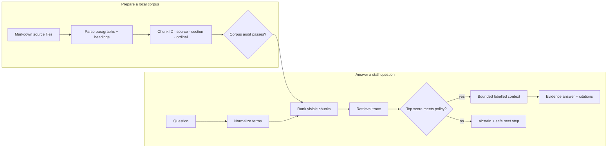

# 02 — First local RAG: turn a corpus into an auditable assistant

**Level:** Beginner · **Time:** 2–3 hours · **Scenario:** Harborline Support
**Prerequisites:** [RAG foundations](../01-rag-foundations/README.md), Python,
and a terminal

## The mission

In the first lesson, RAG was an evidence-system mental model. Here you build
the smallest useful **local** RAG application: it loads a Markdown corpus,
creates stable chunks, ranks evidence, assembles a bounded context, returns
source identifiers, and declines an unsupported question. There is no hosted
model or API key. That is intentional: the retrieval and policy boundary must
be inspectable before a language model can make the output sound persuasive.

Harborline Support needs an assistant that answers questions about customer
communications and production escalation. The assistant may help staff find a
policy; it cannot infer an incident, invent an entitlement, or authorize an
action. This is a realistic constraint: a RAG system is useful when it improves
evidence access, not when it silently becomes the source of truth.

## Outcomes

After this lesson you will be able to:

- construct and audit a tiny document corpus before indexing it;
- explain the practical data contract of a chunk, retrieval hit, context window,
  citation, and abstention decision;
- run an end-to-end local RAG pipeline with a reproducible trace;
- distinguish retrieval score, answer support, source freshness, and caller
  authorization;
- use a golden set to tune `top_k`, context budget, and abstention threshold;
- diagnose failures at the correct stage rather than prompt around them; and
- know when to add BM25, embeddings, vector search, hybrid retrieval, or a
  typed system query.

## Notebook-first learning path

> **[Open the First Local RAG notebook →](../../../notebooks/beginner/01_first_local_rag.ipynb)**

The notebook is the lesson: it combines concepts, executable implementation,
retrieval traces, failure injection, evaluation, and design exercises. Run it
from the repository root:

```bash
make setup
make notebooks
```

Open `notebooks/beginner/01_first_local_rag.ipynb` in JupyterLab. For a command
line experience, run:

```bash
python examples/beginner/first_local_rag.py
```

Try these three requests in order:

```text
Question> Who may restart production services?
Question> How often do enterprise customers receive an update?
Question> What is the capital of France?
```

The first two should return evidence and stable citations. The last should
abstain, even though a general language model may know the answer.

## The runnable architecture



The implementation lives in
[`examples/beginner/first_local_rag.py`](../../../examples/beginner/first_local_rag.py).
It separates four concerns that should not be hidden in a single `ask()` call:

| Component | Responsibility | What to inspect |
| --- | --- | --- |
| `load_chunks` | Load Markdown paragraphs with stable identity. | Heading, source, ordinal, and chunk text. |
| `audit_corpus` | Surface empty or duplicate chunks before search. | Document/chunk counts and audit defects. |
| `retrieve_with_trace` / `retrieve_bm25` | Rank evidence and expose why it matched. | Rank, score, and matching terms. |
| `build_context` / `run_local_rag` | Make a bounded policy decision and return citations. | Retained evidence, threshold, budget, terminal decision. |

## Step-by-step build

### Step 1 — Inspect sources before writing retrieval code

The local corpus is in
[`examples/data/beginner-docs`](../../../examples/data/beginner-docs). Read the
support handbook and knowledge policy first. Ask four data-engineering questions:

1. Which document is canonical for each type of claim?
2. Who owns it and how would you learn it changed?
3. Which audience may view it?
4. What metadata must survive parsing for an answer to be audited later?

The starter `Chunk` stores a source, section, ordinal, and ID. A production
record should commonly add document version/hash, created/updated timestamps,
location, tenant/ACL information, retention state, extraction method, and index
version. These are evidence-system fields—not model prompt decorations.

```python
from pathlib import Path
from examples.beginner.first_local_rag import audit_corpus, load_chunks

chunks = load_chunks(Path("examples/data/beginner-docs"))
audit = audit_corpus(chunks)
assert audit.ready
print(audit)
```

### Step 2 — Make chunking a deliberate choice

The baseline uses Markdown paragraphs because they make every result easy to
inspect. It is a teaching unit, not a universal production chunking strategy.
Chunk boundaries affect whether a returned passage contains the rule, exception,
scope, and citation target needed for an answer. Do not solve a split-rule
failure by simply increasing `top_k`: that can inject more unrelated context.

The next [Chunking lab](../03-chunking-lab/README.md) measures fixed windows,
sentences, and heading-aware units. For now, record the baseline boundaries so
you can compare future changes fairly.

### Step 3 — Retrieve and read the trace

The first ranker is normalized lexical overlap. Its score says how much literal
vocabulary matches, not whether a source is correct or authorized:

\[
overlap(Q, D) = \frac{|Q \cap D|}{\max(|Q|, 1)}
\]

Use the trace to ask: Which terms drove the result? Which important term is
missing? Is the first hit responsive or merely keyword-adjacent? Which heading
or source makes the answer auditable?

```python
from examples.beginner.first_local_rag import retrieve_with_trace

for hit in retrieve_with_trace("Who may restart production services?", chunks):
    print(hit.rank, hit.score, hit.matched_terms, hit.chunk.chunk_id)
```

### Step 4 — Compare rankers, but keep the same contract

BM25 improves on raw overlap by weighting rare terms and normalizing document
length. Dense embeddings can improve semantic matching; Sentence Transformers
documents the important distinction between short-query/long-passage
**asymmetric** retrieval and symmetric similarity. A vector database such as
Qdrant stores vectors alongside payload metadata and can filter during search.
Those are useful upgrades only after the golden set identifies the failure they
address.

```python
from examples.beginner.first_local_rag import retrieve_bm25

bm25_hits = retrieve_bm25("How often do enterprise customers receive an update?", chunks)
print([(hit.chunk.chunk_id, round(hit.score, 3)) for hit in bm25_hits])
```

| Observed failure | Candidate improvement | What still needs testing |
| --- | --- | --- |
| Exact terms retrieve poorly | BM25 / better text normalization | Ranking and source coverage |
| Synonyms or abbreviations miss | Dense or hybrid retrieval | Recall, precision, and domain drift |
| Good candidate is below noisy ones | Rerank a limited candidate set | Latency and ranking improvement |
| Corpus is large | ANN/vector database | Recall-speed trade-off and payload filters |
| Text is stale or wrong | Source governance | No ranker can repair it |
| Account value/action is needed | Authenticated API or SQL | Retrieval is often the wrong tool |

### Step 5 — Build context, not a document dump

The answer component should receive a small, labelled evidence set. Context
budgeting protects latency and cost, keeps citations meaningful, and makes
truncation observable. It is not a license to omit a rule’s exception.

```python
from examples.beginner.first_local_rag import build_context_pack

pack = build_context_pack(retrieve_with_trace("Who may restart production services?", chunks), max_characters=420)
print(pack.text)
print(pack.citations, pack.truncated)
```

In a provider-backed system, pass `pack.text` as untrusted retrieved data with
explicit instructions: answer only from the evidence, cite every factual claim,
and say when the evidence is insufficient. Do not let retrieved documents act
as system instructions.

### Step 6 — Declare a no-answer contract

`run_local_rag` returns `answer` or `abstain`, a retrieval threshold, the
context budget, hits, context, and citations. This makes the decision inspectable
and replaces a vague “the model seemed uncertain” rule.

```python
from examples.beginner.first_local_rag import run_local_rag

result = run_local_rag("What is the capital of France?", chunks, min_score=0.20)
assert result.decision == "abstain"
print(result.answer)
```

For a real support product, define the action after abstention: ask a narrower
question, link a status page, route to an owner, or state that the source corpus
does not contain the answer. Never use an abstention threshold as an access
control mechanism.

### Step 7 — Evaluate before you “upgrade”

Build a golden set of supported, unsupported, paraphrased, ambiguous, stale, and
permission-restricted questions. For each, record expected chunk IDs and terminal
behavior. Then track retrieval hit/recall, Precision@k, MRR, abstention accuracy,
latency, context size, and citation correctness. Retrieval quality and generated
answer faithfulness remain separate metrics.

The [BEIR benchmark](https://arxiv.org/abs/2104.08663) is a useful research
reference for heterogeneous zero-shot retrieval evaluation. It is not a
substitute for a domain-specific Harborline golden set.

## Debugging guide

| Symptom | Likely boundary | What to inspect first | Unsafe shortcut |
| --- | --- | --- | --- |
| No result for an obvious policy | Source/parse/lexical mismatch | Source exists, tokens, chunk text, trace | Let an LLM guess |
| Wrong source ranks first | Retrieval | Terms, BM25/dense candidates, metadata filter | Raise `top_k` blindly |
| Answer loses the exception | Chunk/context | Chunk boundary and budget truncation | Add more unrelated documents |
| Correct citation but outdated policy | Source governance | Version, timestamp, index freshness | Treat citation as freshness proof |
| Restricted text reaches prompt | Authorization | Filter placement and logs | Filter only after generation |
| Helpful-looking answer has no evidence | Generation/policy | Claim-to-citation audit | Lower threshold |

## Exercises

1. **Corpus audit:** add a deliberately empty Markdown paragraph or duplicate
   chunk ID in a fixture; make the audit fail before retrieval runs.
2. **Vocabulary failure:** add a policy that uses a synonym, then compare overlap
   and BM25. Explain why neither may solve a pure synonym mismatch.
3. **Context budget:** set `max_characters` to 180 and identify which evidence
   is retained, which is excluded, and whether the answer is still supportable.
4. **Decision policy:** create five golden cases and choose a threshold that
   balances false answers against false abstentions for incident support.
5. **Production design:** sketch how caller identity, tenant/ACL fields, source
   versions, and retrieval traces would travel through a vector database.

## Production readiness checklist

- [ ] Canonical sources, owners, freshness, and retention are defined.
- [ ] Chunk IDs and source versions survive parsing and retrieval.
- [ ] Caller authorization filters candidates before vector/keyword ranking.
- [ ] Context has a budget, retained IDs, and traceable citations.
- [ ] Abstention has a documented safe next step.
- [ ] A golden set covers happy paths, no-answer cases, failures, and access
      boundaries.
- [ ] Retrieval, answer, and safety metrics are monitored independently.

## Continue

- [Chunking lab](../03-chunking-lab/README.md) — test the unit that retrieval
  returns.
- [Citations and abstention](../04-citations-abstention/README.md) — verify
  evidence-backed answers.
- [Intermediate retrieval strategies](../../intermediate/01-retrieval-strategies/README.md)
  — introduce embeddings, hybrid retrieval, and reranking from a measured
  baseline.

## References

- Lewis et al., [Retrieval-Augmented Generation](https://arxiv.org/abs/2005.11401)
- Manning, Raghavan, and Schütze, [Introduction to Information Retrieval](https://nlp.stanford.edu/IR-book/)
- Thakur et al., [BEIR](https://arxiv.org/abs/2104.08663)
- Sentence Transformers, [Semantic Search documentation](https://www.sbert.net/examples/sentence_transformer/applications/semantic-search/README.html)
- Qdrant, [Collections, vectors, and payload filtering](https://qdrant.tech/documentation/overview/)
- NIST, [Generative AI Profile](https://nvlpubs.nist.gov/nistpubs/ai/NIST.AI.600-1.pdf)
