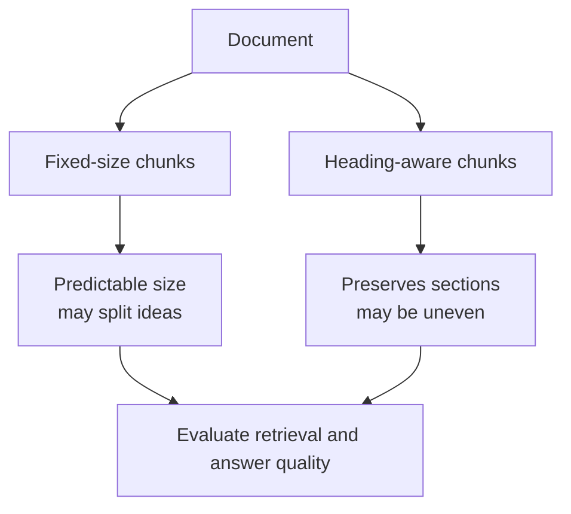

# 03 — Chunking lab

**Level:** Beginner  \
**Time:** 35 minutes  \
**Prerequisites:** [the first local baseline](../02-first-local-rag/README.md)

## Outcome

Compare fixed-size and structure-aware chunks, inspect their metadata, and choose a chunking strategy based on the questions your users ask.

## Run the experiment

```bash
PYTHONPATH=. python curriculum/beginner/03-chunking-lab/lab.py
```

Or import `fixed_size` and `by_heading` from [`lab.py`](lab.py) in a Python shell. The functions return a stable ID, source, text, and optional section for every chunk.

The guided companion notebook is [`02_chunking_lab.ipynb`](../../../notebooks/beginner/02_chunking_lab.ipynb).

## The trade-off



Fixed-size chunks are a useful baseline because their boundaries are predictable. Heading-aware chunks preserve author structure, which is often valuable for manuals and policies. Neither is universally best: tables, long sections, source format, query length, and model context limits all matter.

## Experiment

Run both strategies on the files in `examples/data/beginner-docs`. Compare the number of chunks, character-length distribution, whether a question’s answer stays in one chunk, and the source and section metadata preserved for citations.

## Failure modes

- A fixed boundary can separate a definition from its qualification.
- A section can exceed the model context window.
- Overlap can duplicate text and increase cost.
- Splitting tables or code as plain text can destroy meaning.

## Exercise

Add a long document with three headings. Choose a size and overlap, then write two questions whose answers cross a boundary. Explain which strategy retrieves the complete evidence and what you would try next: semantic splitting, parent-document retrieval, or a reranker.

## Next step

Continue to citations and abstention, then revisit this experiment after adding embeddings and a vector store.
