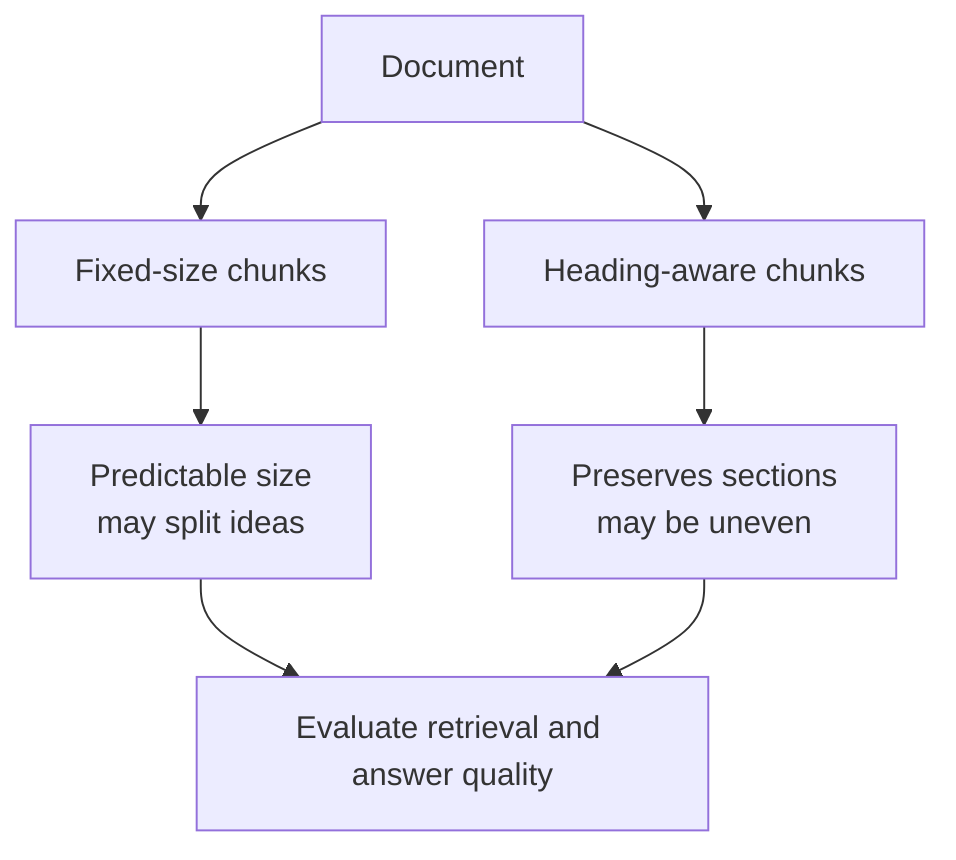

# 03 — Chunking lab: design the evidence a retriever can return

**Level:** Beginner  \
**Time:** 2–3 hours  \
**Prerequisites:** [the first local baseline](../02-first-local-rag/README.md)

## Outcome

Compare fixed-size, heading-aware, sentence-window, and parent/child chunks;
measure their metadata, coverage, and redundancy; and choose a strategy from
the questions your users ask rather than a global default.

## Run the experiment

```bash
PYTHONPATH=. python curriculum/beginner/03-chunking-lab/lab.py
```

Or import `fixed_size` and `by_heading` from [`lab.py`](lab.py) in a Python shell. The functions return a stable ID, source, text, and optional section for every chunk.

The guided companion notebook is [`02_chunking_lab.ipynb`](../../../notebooks/beginner/02_chunking_lab.ipynb).

## The trade-off



Fixed-size chunks are a useful baseline because their boundaries are predictable. Heading-aware chunks preserve author structure, which is often valuable for manuals and policies. Neither is universally best: tables, long sections, source format, query length, and model context limits all matter.

## Experiment

Run both strategies on the files in `examples/data/beginner-docs`. Compare the number of chunks, character-length distribution, whether a question’s answer stays in one chunk, and the source and section metadata preserved for citations.

## Failure modes

- A fixed boundary can separate a definition from its qualification.
- A section can exceed the model context window.
- Overlap can duplicate text and increase cost.
- Splitting tables or code as plain text can destroy meaning.

## Exercise

Add a long document with three headings. Choose a size and overlap, then write two questions whose answers cross a boundary. Explain which strategy retrieves the complete evidence and what you would try next: semantic splitting, parent-document retrieval, or a reranker.

## Build the evidence unit step by step

### 1. Start with the question, not a token count

A retriever returns a **unit**, not a document. That boundary decides what can
be embedded, authorized, reranked, cited, and fit into the context window. For
each question, write down the smallest evidence needed to support it:

| Question | Evidence that must stay together | First strategy to test |
| --- | --- | --- |
| “How often are enterprise customers updated?” | Customer segment + cadence | heading or sentence window |
| “Can support restart a service?” | Action + approval boundary | heading or parent/child |
| “Which SLA row was breached?” | Headers + row values | table-aware representation |
| “What does this function return?” | signature + relevant branch | symbol/AST-aware chunks |

The Harborline policy deliberately lets you reproduce an unsafe split: `restart`
and `approval` may land in different windows. A retrieved partial rule is more
dangerous than an empty result because it can look authoritative.

### 2. Establish a predictable baseline

Fixed windows make size and overlap explicit. They are useful as an experiment
baseline, but a character boundary does not understand a qualification, table
row, or code block. Increasing overlap can repair a split phrase but duplicates
index storage, retrieval candidates, and context tokens.

```python
from examples.beginner.chunking_lab import fixed_size, describe_chunks

chunks = fixed_size(policy_text, "harborline-support", size=180, overlap=35)
print(describe_chunks(chunks))
```

`describe_chunks` reports adjacent duplicate characters so the cost of overlap
is observable. Do not call overlap “free recall.”

### 3. Preserve source structure when it carries meaning

Headings often define the scope of a policy or manual. Heading-aware chunks make
citations readable, but a long heading section can be too broad for retrieval.
The lab’s `by_heading_bounded` strategy keeps a small child unit while retaining
the original section and `parent_id`:

```python
from examples.beginner.chunking_lab import by_heading_bounded

children = by_heading_bounded(policy_text, "harborline-support", max_characters=140, overlap=20)
for child in children:
    print(child.chunk_id, child.section, child.parent_id)
```

This parent/child pattern is useful for long manuals. A child is cheap to search;
a selected child can later expand to its parent section for a user-readable
citation or a bounded answer context.

### 4. Use sentence windows for narrative, not every format

Sentence windows avoid fragments that start in the middle of a sentence and
allow local overlap. They can lose title and hierarchy and should not be used to
flatten tables, source code, or layout-sensitive PDFs. Use a source-aware parser
when the source’s native structure is part of its meaning.

LlamaIndex’s node parsers illustrate sentence, metadata-aware, and semantic
splitters. A sentence-window node retains surrounding context; semantic
splitting uses embedding similarity to choose breaks. Both are options to test
against your corpus, not production defaults.

### 5. Measure coverage and cost together

The lab’s `coverage_result` asks whether the terms needed for a direct claim
co-occur in one chunk. `scorecard` combines that diagnostic with count, size,
metadata/parent preservation, and overlap redundancy:

```python
from examples.beginner.chunking_lab import scorecard

questions = {
    "approval boundary": {"restart", "approval"},
    "enterprise cadence": {"enterprise", "30", "minutes"},
}
print(scorecard(children, questions))
```

Term coverage is not relevance, and relevance is not faithful generation. It is
a transparent early signal that a boundary cannot possibly support the intended
claim. Later evaluation lessons measure retrieval rank, citations, and answer
faithfulness separately.

## The production chunk contract

| Field | Why preserve it |
| --- | --- |
| Stable `chunk_id` | Evaluation sets, traces, and citations survive re-runs. |
| Source, section, page/location | A human can navigate to the evidence. |
| `parent_id` | A small retrieved child retains source context. |
| Version/hash and timestamps | Freshness and rollback can be audited. |
| Tenant/ACL/classification | Filter before retrieval, never after a model sees text. |
| Parser and chunking config | A result can be reproduced and compared. |

Child chunks must inherit access, classification, retention, and version metadata
from their source. A vector database filter is useful only if those fields are
complete and correctly propagated during parsing.

## Experiment protocol

1. Freeze the corpus, golden questions, expected evidence locations, and budget.
2. Run a fixed-window baseline and record chunk count, size, overlap, coverage,
   retrieval rank, context size, citation, latency, and cost where applicable.
3. Change **one** variable: size, overlap, strategy, parser, or parent expansion.
4. Include direct, compound, paraphrased, no-answer, stale, and permission-
   restricted questions.
5. Inspect failures manually: source quality, extraction, boundary, retrieval,
   context selection, or generation are distinct causes.
6. Choose the smallest configuration that reliably improves the defined metric.
   Version it with the index and evaluation report.

## Failure map

| Symptom | Likely cause | Safe response |
| --- | --- | --- |
| Rule and exception split | fixed boundary is too small | test overlap, heading, or parent expansion |
| Near-duplicate context | overlap is too large | deduplicate or lower overlap; measure quality impact |
| Huge section ranks for every query | heading is too broad | bound children while retaining parent metadata |
| Header separated from row values | table was flattened | use row/key-value/table-aware parsing |
| Outdated source is cited | version/freshness missing | filter and expose index/source versions |
| Restricted child is retrieved | ACL did not propagate | enforce inherited metadata before retrieval |

## Production readiness checklist

- [ ] IDs, source/section locations, versions, and parser configuration persist.
- [ ] Parsing is inspected for tables, code, OCR, and reading order.
- [ ] Tenant/ACL/classification fields are inherited and filtered before search.
- [ ] Overlap, duplicate retrieval, and context budgets are measured.
- [ ] Golden questions cover qualifications, boundary crossings, no-answer, and
      access-boundary cases.
- [ ] Parent expansion and reranking are bounded, observable, and evaluated.

## Exercises and checkpoint

1. Reproduce the `restart`/`approval` split using fixed windows and no overlap.
2. Find the smallest overlap or parent/child configuration that repairs it; then
   quantify duplicated text.
3. Add a long “Exception” section. Compare heading-aware and bounded-heading
   chunks; which citation would a support user understand?
4. Design a row-aware representation for a customer-SLA table. Which header,
   row, version, location, and tenant fields must remain with the row?
5. Why should chunking be evaluated with the retriever and question distribution,
   rather than treated as static preprocessing?

## Next step

Continue to [citations and abstention](../04-citations-abstention/README.md),
then revisit the experiment after adding embeddings and a vector store.

## References

- Manning, Raghavan, and Schütze, [Introduction to Information Retrieval](https://nlp.stanford.edu/IR-book/)
- LlamaIndex, [Node parsers and ingestion](https://docs.llamaindex.ai/en/stable/module_guides/loading/node_parsers/)
- LlamaIndex, [Sentence-window node parser](https://docs.llamaindex.ai/en/v0.10.20/api/llama_index.core.node_parser.SentenceWindowNodeParser.html)
- LlamaIndex, [Semantic splitter](https://docs.llamaindex.ai/en/stable/api_reference/node_parsers/semantic_splitter/)
- [RAG lifecycle in this repository](../../../docs/what-is-rag.md)
