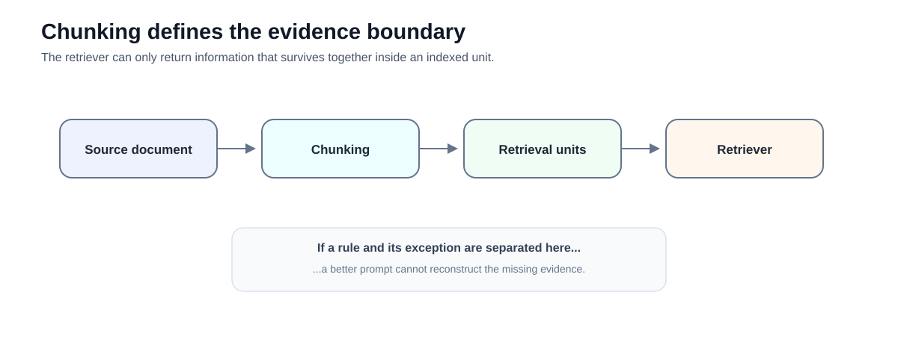
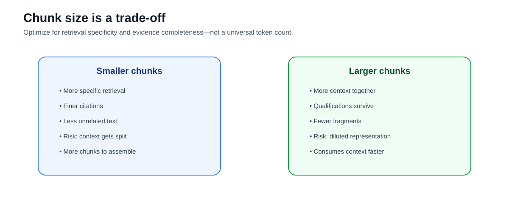
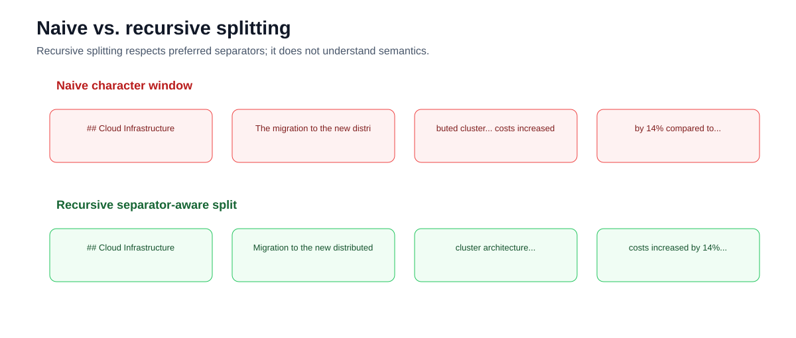
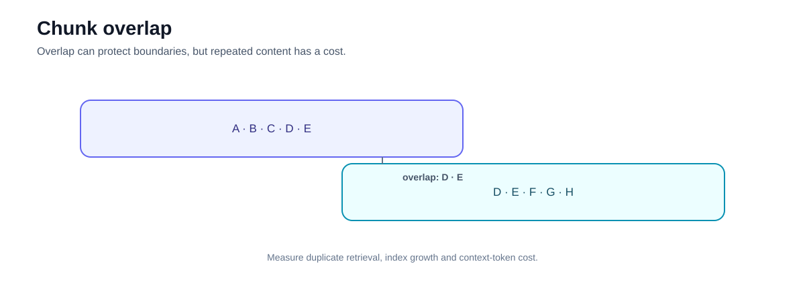
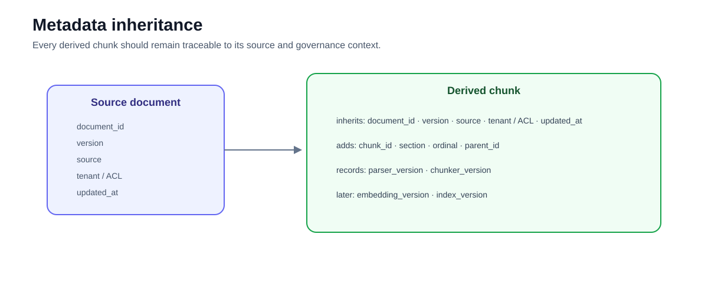
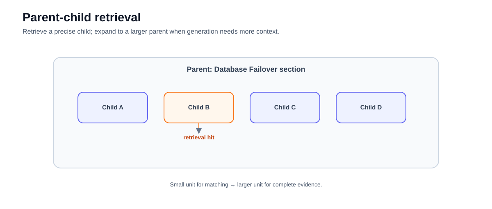
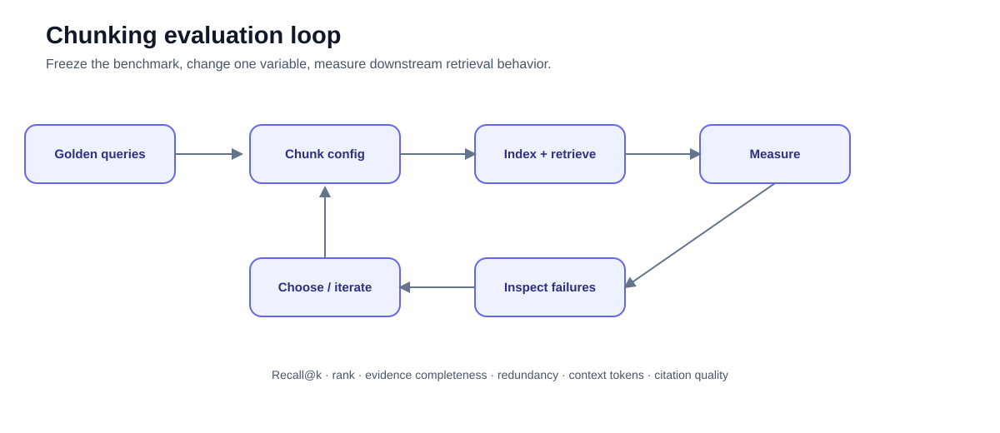

# 03 — Chunking Decisions: Design the Evidence Your Retriever Can Return

**Level:** Beginner  
**Estimated time:** 90–120 minutes  
**Scenario:** NovaTech Financial Review  
**Notebook:** [`03_chunking_lab.ipynb`](03_chunking_lab.ipynb)  
**Prerequisite:** [02 — First Local RAG](../02-first-local-rag/README.md)

---

## Why this lesson exists

In Course 02, the retrieval units were already prepared for you.

Real documents do not arrive as perfect RAG chunks.

They arrive as PDFs, Markdown, HTML, Office documents, tables, procedures, reports, source code, and other structures. Before retrieval can work, the system must decide:

> **What unit of evidence should be indexed and returned?**

That decision is **chunking**.

A poor chunk boundary can separate a number from its subject, a policy from its exception, a table row from its headers, or a function signature from its implementation.

No embedding model can recover information that your preprocessing has removed from the retrievable unit.



This lesson starts with the two strategies implemented in the notebook—naive character splitting and recursive splitting—and then gives you the design framework needed to understand the more advanced chunking patterns used later in production RAG systems.

---

## Learning objectives

After completing this lesson, you should be able to:

- explain why chunking is part of retrieval design rather than clerical preprocessing;
- describe the trade-off between retrieval specificity and evidence completeness;
- use LangChain's `CharacterTextSplitter` and `RecursiveCharacterTextSplitter`;
- explain what recursive splitting actually does—and what it does **not** do;
- reason about chunk size and overlap;
- inspect whether critical evidence survives a chunk boundary;
- preserve document metadata through splitting;
- distinguish structural, semantic, hierarchical, and context-enrichment approaches;
- select chunking strategies based on document structure and query patterns;
- explain why there is no universal "best chunk size"; and
- design an evaluation experiment for comparing chunking configurations.

---

# 1. The retrieval unit is a design decision

A retriever does not normally return an entire enterprise knowledge base.

It returns **retrieval units**.

For document RAG, those units are often chunks.

```text
Source document
      ↓
Parsing
      ↓
Chunking
      ↓
Retrievable units
      ↓
Embedding / indexing
      ↓
Retrieval
```

The chunk boundary determines what information can be represented and retrieved together.

That affects:

- retrieval precision;
- retrieval recall;
- evidence completeness;
- citation granularity;
- metadata filtering;
- context-window usage;
- reranking;
- authorization granularity; and
- generation quality.

Chunking therefore belongs to the **information architecture** of a RAG system.

---

# 2. The fundamental trade-off

Smaller and larger chunks create different advantages and failure modes.



### Smaller chunks

Potential advantages:

- more specific representations;
- less irrelevant text per result;
- finer citation granularity;
- potentially better matching for narrow questions.

Potential disadvantages:

- facts can lose surrounding context;
- rules can be separated from exceptions;
- more chunks must be indexed;
- more results may be needed to reconstruct complete evidence.

### Larger chunks

Potential advantages:

- more context stays together;
- qualifications and surrounding explanations survive;
- fewer fragments need to be assembled.

Potential disadvantages:

- embeddings represent more competing concepts;
- retrieval may become less specific;
- context budgets are consumed faster;
- citations become less precise.

There is no universal winner.

> The correct chunking strategy is the one that performs best for your corpus, query distribution, retrieval model, and application requirements.

---

# 3. The notebook's failure example

The notebook uses a small financial review:

```text
# Q2 2025 Financial Review

## Cloud Infrastructure

The migration to the new distributed cluster architecture was completed in May.

As a direct result of these redundant systems and cross-region backups,
costs increased by 14% compared to the previous quarter.

However, uptime improved to 99.999%.
```

Now imagine the user asks:

> What increased by 14%?

The required evidence is not merely:

```text
increased by 14%
```

The system must preserve enough surrounding information to determine **what** increased.

A bad split may create:

```text
Chunk A:
## Cloud Infrastructure
The migration to the new distributed...

Chunk B:
...costs increased by 14% compared to the previous quarter.
```

Chunk B contains the number but may have lost the section-level context.

This is a chunk-boundary failure.

---

# 4. Strategy 1 — Naive character splitting

The notebook first creates a deliberately naive baseline:

```python
from langchain_text_splitters import CharacterTextSplitter

naive_splitter = CharacterTextSplitter(
    separator="",
    chunk_size=100,
    chunk_overlap=0,
)
```

This is useful because the behavior is easy to understand.

Every chunk has approximately the configured size, regardless of meaning.



The baseline can split:

- sentences;
- headings from content;
- clauses;
- numbers from subjects;
- conditions from actions.

That does not make fixed-size splitting useless.

It makes it a **baseline**.

Simple baselines are valuable because they give you something measurable to improve.

---

# 5. Strategy 2 — Recursive character splitting

The notebook then uses:

```python
from langchain_text_splitters import RecursiveCharacterTextSplitter

recursive_splitter = RecursiveCharacterTextSplitter(
    chunk_size=150,
    chunk_overlap=20,
    separators=["\n\n", "\n", " ", ""],
)
```

The splitter attempts separators in priority order until the resulting pieces fit the configured chunk size.

Conceptually:

```text
try paragraph boundary
        ↓
if still too large
        ↓
try line boundary
        ↓
if still too large
        ↓
try whitespace
        ↓
if still too large
        ↓
split at character level
```

This usually preserves natural text boundaries better than blind character windows.

## Important terminology correction

`RecursiveCharacterTextSplitter` is **not semantic chunking**.

It does not use embeddings to detect topic changes.

It is a **separator-aware recursive text splitter**.

This distinction matters because "semantic chunking" refers to a different family of techniques that uses semantic representations or model-based signals to identify boundaries.

---

# 6. Chunk size

`chunk_size` controls the maximum target size under the splitter's length function.

For the notebook:

```python
chunk_size=150
```

means the splitter tries to keep chunks within that configured size.

Do not interpret `150` as a recommended production value.

The correct size depends on factors such as:

- document structure;
- question specificity;
- embedding model;
- expected answer granularity;
- retrieval method;
- reranker;
- context budget; and
- whether parent expansion is available.

Rules such as:

> "Always use 500 tokens"

are not reliable engineering guidance.

Chunk size should be evaluated.

---

# 7. Chunk overlap

The notebook uses:

```python
chunk_overlap=20
```

Overlap repeats some boundary content between adjacent chunks.

Conceptually:

```text
Chunk 1
[ A B C D E ]

Chunk 2
        [ D E F G H ]
          ↑ overlap
```



Overlap can reduce boundary failures, but it is not free.

More overlap can increase:

- index size;
- embedding cost;
- duplicate retrieval;
- redundant context;
- storage;
- context tokens.

Treat overlap as a tunable parameter—not a default safety mechanism.

---

# 8. Metadata must survive chunking

The notebook begins with:

```python
doc = Document(
    page_content=raw_text,
    metadata={"source": "q2_review.md"},
)
```

After splitting, inspect:

```python
for chunk in recursive_chunks:
    print(chunk.metadata)
```

The source metadata should remain attached to the derived chunks.

That is essential.

A production chunk usually needs substantially more metadata:

```text
document_id
document_version
chunk_id
source
section
page / location
parent_id
ordinal
updated_at
tenant
ACL / classification
parser_version
chunker_version
embedding_version
```



The chunk should inherit governance-relevant metadata from its source.

Do not attempt to reconstruct provenance after retrieval.

---

# 9. Recursive splitting is a baseline—not the end state

Recursive splitting works well as a general text baseline because it is:

- simple;
- deterministic;
- inexpensive;
- easy to inspect; and
- broadly applicable to prose.

But it does not understand:

- Markdown hierarchy;
- tables;
- code syntax;
- legal clause structure;
- slide layout;
- semantic topic changes;
- parent/child relationships;
- document-level context.

That leads to the next design question:

> Can the document's own structure provide better chunk boundaries?

---

# 10. Structure-aware chunking

For structured Markdown, headings often carry meaning.

Example:

```markdown
# Incident Response

## Database Failover

Tier 2 approval is required...

## Customer Communication

Enterprise customers receive updates...
```

A heading-aware splitter can preserve:

```text
section = Database Failover
```

as metadata for the text beneath it.

LangChain provides `MarkdownHeaderTextSplitter` for this pattern.

A structure-aware pipeline may look like:

```text
Markdown document
       ↓
Heading hierarchy
       ↓
Sections
       ↓
Bound oversized sections
       ↓
Child chunks with heading metadata
```

This is often more useful than treating Markdown as an arbitrary stream of characters.

---

# 11. Sentence and paragraph chunking

Narrative documents often have natural sentence or paragraph boundaries.

Advantages:

- readable evidence;
- fewer broken sentences;
- good fit for prose.

Limitations:

- sentences may be too small;
- paragraphs may be too large;
- headings may still be lost;
- tables and code do not map cleanly to sentences.

A useful variation is **sentence-window retrieval**:

```text
Index:
sentence 7

Retrieve:
sentence 7

Expand for context:
sentences 5–9
```

This separates:

> the unit optimized for retrieval

from:

> the unit optimized for generation.

That distinction becomes increasingly important in advanced RAG systems.

---

# 12. Parent-child / small-to-big retrieval

Another strategy is to index small units but return larger parents.

```text
Parent section
│
├── Child A
├── Child B  ← retrieved
├── Child C
└── Child D

retrieval hit: Child B
        ↓
context expansion
        ↓
Parent section
```



This attempts to combine:

**small retrieval units**

for precise matching

with:

**larger generation units**

for complete context.

It is useful when a narrow passage identifies the relevant section but the full section is needed to interpret the answer safely.

---

# 13. Semantic chunking

Semantic chunking uses semantic signals—often embeddings—to detect changes in topic or meaning.

A simplified approach:

```text
Sentence 1 ─┐
Sentence 2  │ similar
Sentence 3 ─┘
             ↓ similarity drop
Sentence 4 ─┐
Sentence 5  │ new semantic region
Sentence 6 ─┘
```

The chunks become variable-sized.

This can help when:

- documents contain weak formatting;
- topic boundaries do not align with headings;
- sections vary greatly in size.

But semantic chunking adds:

- preprocessing cost;
- additional model dependencies;
- threshold choices;
- another configuration that must be evaluated.

It is not automatically better than simpler splitters.

LlamaIndex provides a maintained `SemanticSplitterNodeParser` implementation.

---

# 14. Contextual retrieval / contextualized chunks

Sometimes a chunk is locally meaningful but ambiguous when removed from its document.

Example:

```text
The limit is 30 days.
```

What limit?

A contextualized representation might add:

```text
Context:
This passage is from the refund eligibility section
of Harborline's enterprise support policy.

Chunk:
The limit is 30 days.
```

Anthropic described a **Contextual Retrieval** approach that adds short chunk-specific context before embedding and BM25 indexing.

The important idea is broader than one implementation:

> retrieval representations can contain contextual information that is not necessarily shown verbatim to the user.

This is an advanced optimization and should be evaluated against simpler baselines.

---

# 15. Late chunking

Late chunking takes a different approach.

Instead of independently embedding each isolated chunk:

```text
split document
      ↓
embed each chunk independently
```

the model first processes a longer document context and chunk representations are derived afterward.

Conceptually:

```text
long document
      ↓
long-context embedding model
      ↓
contextual token representations
      ↓
pool by chunk boundaries
      ↓
chunk vectors
```

This can preserve more document-level context in each chunk representation.

It requires compatible embedding models and is best treated as an advanced retrieval optimization rather than a beginner default.

---

# 16. Content-aware chunking

Different content types need different boundaries.

## Tables

A table row without its headers may be meaningless.

Bad:

```text
Enterprise | 30 minutes | P1
```

Better:

```text
Customer tier: Enterprise
Update cadence: 30 minutes
Severity: P1
Source table: escalation SLA
```

Possible strategies include:

- whole-table retrieval;
- row-level chunks with repeated headers;
- structured serialization;
- separate structured-data retrieval.

## Code

Avoid splitting code arbitrarily in the middle of functions or classes.

Prefer boundaries such as:

```text
module
class
method
function
symbol
```

AST-aware or language-aware parsing is usually more appropriate than generic character windows.

## Procedures

Keep steps and their conditions together.

## Legal and policy text

Preserve:

- clause identifiers;
- definitions;
- exceptions;
- scope;
- references to adjacent clauses.

## PDFs

Before tuning chunk size, verify parsing quality.

A sophisticated chunker cannot repair:

- wrong reading order;
- missing columns;
- broken tables;
- OCR corruption.

---

# 17. A practical chunking taxonomy


| Strategy | Good starting point for | Main limitation |
|---|---|---|
| Fixed character/token | Baseline experiments | Arbitrary boundaries |
| Recursive separator | General prose | Limited structural understanding |
| Sentence/paragraph | Narrative text | Variable completeness |
| Heading-aware | Markdown, policies, manuals | Oversized sections |
| Parent-child | Precise retrieval + broad context | More storage/orchestration |
| Semantic | Weakly structured mixed-topic prose | Extra indexing cost/configuration |
| Contextualized chunks | Chunks needing document context | Added generation/indexing cost |
| Late chunking | Long-context embedding workflows | Model/infrastructure requirements |
| Table-aware | Tables | Content-specific implementation |
| AST/symbol-aware | Source code | Language-specific parsing |

Do not choose one strategy for every corpus.

Enterprise RAG systems often use **multiple chunkers by content type**.

---

# 18. How to evaluate chunking

Do not evaluate chunking by asking:

> Do these chunks look reasonable?

Evaluate the downstream behavior.

For each candidate configuration, measure at least:

### Retrieval recall

Did relevant evidence appear in top-k?

### Rank

How early did the first useful evidence appear?

Possible metrics include:

- Recall@k;
- MRR;
- nDCG.

### Evidence completeness

Does the returned unit contain enough information to support the intended claim?

### Redundancy

How much duplicated content does overlap introduce?

### Context cost

How many tokens are required to assemble useful evidence?

### Citation quality

Can a user navigate from the result to a meaningful source location?

### Index cost

How many chunks and embeddings are produced?

---

# 19. A better experiment than "try 500 tokens"

Create a small golden set:

| Query | Required evidence |
|---|---|
| What increased by 14%? | Cloud infrastructure costs + 14% |
| What uptime was achieved? | uptime + 99.999% |
| Why did costs increase? | distributed cluster / redundancy + cost increase |

Then compare configurations.

Example:

```text
A: 100 chars, 0 overlap
B: 150 chars, 20 overlap
C: 300 chars, 30 overlap
D: recursive, 150 chars, 20 overlap
E: heading-aware + bounded children
```

Keep everything else fixed:

```text
same corpus
same queries
same embedding model
same retriever
same k
same evaluation criteria
```

Change one chunking variable at a time.



This turns chunking from folklore into an engineering experiment.

---

# 20. Failure patterns

| Symptom | Possible chunking cause | Candidate experiment |
|---|---|---|
| Number retrieved without subject | Chunk too narrow / context lost | Larger chunk, overlap, heading context |
| Rule retrieved without exception | Boundary split | Parent-child or structure-aware split |
| Every result contains irrelevant text | Chunks too broad | Smaller child units |
| Duplicate passages dominate top-k | Excessive overlap | Reduce overlap / deduplicate |
| Table rows make no sense | Headers lost | Table-aware representation |
| Code result lacks definition | Arbitrary text split | Symbol-aware splitting |
| Citation opens a huge section | Retrieval unit too coarse | Smaller citable children |
| Correct section never ranks | Representation lacks local context | Contextualized or hierarchical strategy |

Notice that not every retrieval failure is an embedding failure.

---

# 21. Teaching implementation versus production implementation

The notebook intentionally covers only the first comparison.

| Notebook | Production extension |
|---|---|
| One short Markdown string | Real parser pipeline |
| Character splitter | Baseline only |
| Recursive splitter | General text baseline |
| Character length | Token-aware budgeting where needed |
| One chunk size | Evaluated configuration |
| One overlap | Evaluated overlap |
| Source metadata | Full provenance/version/ACL metadata |
| Visual inspection | Golden retrieval dataset |
| No retriever in this lab | End-to-end retrieval evaluation |
| No content routing | Format-specific chunkers |
| No parent expansion | Hierarchical retrieval |
| No semantic splitter | Optional semantic segmentation |
| No chunk versioning | Versioned ingestion/index configuration |

This distinction is important: the README explains the design space, while the notebook deliberately demonstrates the foundational mechanics.

---

# 22. Practical exercises

## Exercise 1 — Reproduce the boundary failure

Run the notebook's naive splitter.

Find the chunk containing:

```text
costs increased by 14%
```

Does the chunk independently answer:

> What increased by 14%?

Explain why or why not.

---

## Exercise 2 — Compare recursive splitting

Run the recursive splitter.

Compare:

- chunk count;
- chunk lengths;
- readability;
- retained section context;
- duplicated text.

Does recursive splitting repair the original failure?

---

## Exercise 3 — Vary chunk size

Test:

```python
chunk_size=80
chunk_size=150
chunk_size=300
```

Keep overlap constant.

Record which configuration preserves:

```text
Cloud Infrastructure
```

and:

```text
costs increased by 14%
```

together.

---

## Exercise 4 — Vary overlap

Try:

```python
chunk_overlap=0
chunk_overlap=20
chunk_overlap=50
```

Record:

- chunk count;
- duplicated characters;
- whether the key evidence survives;
- how much redundant context is created.

---

## Exercise 5 — Add heading-aware splitting

Use LangChain's `MarkdownHeaderTextSplitter`.

Preserve the `## Cloud Infrastructure` heading as metadata.

Compare the resulting evidence representation with the recursive baseline.

---

## Exercise 6 — Design a production chunk record

Define a chunk schema containing at least:

```text
chunk_id
document_id
source
section
ordinal
document_version
updated_at
tenant
acl
parser_version
chunker_version
```

Which fields are inherited?

Which are generated during chunking?

---

# 23. Checkpoint

Before moving on, you should be able to answer:

1. Why is chunking part of retrieval design?
2. What information can be lost through a bad boundary?
3. What trade-off exists between small and large chunks?
4. What does `chunk_overlap` do?
5. Why can excessive overlap hurt?
6. How does `RecursiveCharacterTextSplitter` work?
7. Why is recursive character splitting **not** semantic chunking?
8. Why should metadata survive splitting?
9. When is heading-aware chunking preferable?
10. What problem does parent-child retrieval address?
11. Why should tables and code use content-aware boundaries?
12. How would you experimentally choose a chunking configuration?

---

# 24. What comes next

### [04 — Citations and Abstention](../04-citations-abstention/README.md)

Once the system can retrieve meaningful evidence units, the next questions are:

> **Can we prove which evidence supports the answer?**

and:

> **What should the system do when the evidence is insufficient?**

Those are the foundations of trustworthy RAG behavior.

---

# References

## LangChain splitters

- LangChain — [Text splitters](https://docs.langchain.com/oss/python/integrations/splitters)
- LangChain — [RecursiveCharacterTextSplitter](https://docs.langchain.com/oss/python/integrations/splitters/recursive_text_splitter)
- LangChain — [MarkdownHeaderTextSplitter](https://python.langchain.com/api_reference/text_splitters/markdown/langchain_text_splitters.markdown.MarkdownHeaderTextSplitter.html)

## Semantic and contextual chunking

- LlamaIndex — [SemanticSplitterNodeParser](https://developers.llamaindex.ai/python/framework-api-reference/node_parsers/semantic_splitter/)
- Anthropic — [Introducing Contextual Retrieval](https://www.anthropic.com/news/contextual-retrieval)
- Jina AI — [Late Chunking: Contextual Chunk Embeddings Using Long-Context Embedding Models](https://arxiv.org/abs/2409.04701)

## Retrieval evaluation

- Manning, Raghavan & Schütze — [Introduction to Information Retrieval](https://nlp.stanford.edu/IR-book/)
- Thakur et al. — [BEIR](https://arxiv.org/abs/2104.08663)

---

# Key takeaway

Chunking determines the evidence your retriever is capable of returning.

A sophisticated model cannot compensate for evidence that preprocessing separated, stripped of context, or represented badly.

So do not begin with:

> **What chunk size is best?**

Begin with:

> **What information must remain together for my users' questions to be answered and cited correctly?**

Then measure it.

---

# Deep Dive — Chunking and Document Representation

Chunking is not a preprocessing detail. It defines the evidence units the retriever is allowed to find.

## 1. Why chunking exists

Documents are often longer than the useful retrieval unit. Searching an entire manual as one vector may blur many topics; splitting every sentence independently may destroy necessary context.

Chunking therefore balances:

```text
retrieval specificity
        ↕
context completeness
```

## 2. Chunk-size trade-off

Smaller chunks can improve precision because each representation covers fewer concepts.

But they can:

- lose definitions;
- separate conditions from exceptions;
- break tables;
- remove useful neighboring context.

Larger chunks preserve context but can dilute the signal and consume more prompt tokens.

There is no universal optimum such as “500 tokens.”

## 3. Overlap

Overlap tries to reduce boundary loss:

```text
chunk 1: A B C D
chunk 2:       C D E F
```

Benefits:

- preserves evidence near boundaries.

Costs:

- increases index size;
- creates duplicates;
- can cause multiple nearly identical results;
- increases downstream token usage.

Treat overlap as a parameter to evaluate, not a default ritual.

## 4. Fixed-size chunking

Fixed character/token windows are:

- simple;
- reproducible;
- fast.

They ignore document structure and can split headings, paragraphs, code, tables, or logical arguments.

They are useful as a baseline.

## 5. Recursive / structure-aware splitting

Recursive splitters try increasingly smaller separators such as sections, paragraphs, sentences, and then token limits.

Structure-aware splitting can use:

- Markdown headings;
- HTML elements;
- document sections;
- code syntax;
- PDF layout;
- semantic units.

The objective is not “smarter chunking” in the abstract; it is preserving useful evidence boundaries.

## 6. Semantic chunking

Semantic chunking attempts to detect topic shifts using embedding or model signals.

Potential benefit:

```text
boundaries follow meaning rather than fixed length
```

Potential problems:

- extra embedding/model cost;
- unstable boundaries;
- harder reproducibility;
- domain dependence;
- still requires maximum-size constraints.

Always compare it with a simpler structure-aware baseline.

## 7. Parent-child retrieval

A powerful pattern separates the retrieval unit from the context unit.

```text
small child chunk
      ↓ retrieve precisely
parent section/document
      ↓ return richer context
```

This can combine fine-grained retrieval with enough surrounding evidence for generation.

It also introduces deduplication and context-budget decisions.

## 8. Multi-representation retrieval

Another approach represents a document through several views:

```text
title
summary
section
chunk
generated question
```

The retriever searches the representation best suited to discovery, then maps the result back to the original evidence.

This is a more general idea than chunk-size tuning.

## 9. Tables, code, and structured content

Do not split all modalities like prose.

A table may require:

- header preservation;
- row grouping;
- table identity;
- surrounding caption.

Code may require:

- function/class boundaries;
- imports;
- signatures;
- module context.

Document representation should follow the semantics of the source.

## 10. Metadata belongs with chunks

Every chunk should preserve source-level and chunk-level metadata:

```text
document_id
chunk_id
section
page/span
title
version
classification
```

Chunking that destroys provenance makes citation and authorization harder later.

## 11. Lost-in-the-middle and context assembly

Even when retrieval succeeds, many large chunks can create long prompts where useful evidence is harder for the generator to use.

Chunking and context construction must therefore be evaluated together.

## 12. Evaluate chunking through downstream retrieval

Do not score chunking by visual neatness.

Create labelled questions and compare configurations.

Useful measures include:

```text
Recall@k
MRR
nDCG
duplicate rate
context tokens/query
answer support
```

Also inspect failure cases manually.

## 13. Experiment design

A useful experiment matrix:

| Strategy | Size | Overlap | Representation |
|---|---:|---:|---|
| fixed | 256 | 0 | chunk |
| fixed | 512 | 64 | chunk |
| recursive | 512 | 64 | structure-aware |
| parent-child | 256 child | — | parent returned |

Hold the embedding model and evaluation queries constant.

## 14. Query-aware chunking?

Be careful with terminology.

Most production ingestion pipelines chunk before a specific user query exists. Query-time techniques such as sentence-window expansion, parent retrieval, contextual compression, or dynamic context assembly are often more accurately described as **query-aware context selection** rather than ordinary static chunking.

Keeping these concepts separate makes architectures easier to reason about.

## 15. Common anti-patterns

Avoid:

- selecting chunk size from a blog post without evaluation;
- aggressive overlap that floods retrieval with duplicates;
- dropping headings;
- assigning new chunks no stable source identity;
- splitting tables as arbitrary text;
- changing chunking and embeddings simultaneously during an experiment;
- evaluating only final answer fluency.

## 16. Production decision rule

Choose the simplest representation that achieves acceptable retrieval and evidence completeness on the real question distribution.

Complex chunking should solve a measured failure mode.

## Further study

- LangChain/LlamaIndex text-splitting concepts as implementation examples
- parent-document retrieval patterns
- late chunking and contextualized document representation research
- retrieval evaluation literature and BEIR
