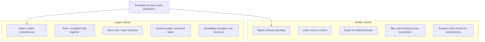

# 03 — Chunking lab: design the evidence a retriever can return

**Level:** Beginner  
**Time:** 2–3 hours  
**Prerequisites:** [the first local baseline](../02-first-local-rag/README.md)

## Learning objectives

After this lesson you will be able to:

- explain the retrieval unit contract and why it is a design choice, not a default;
- implement and compare at least five chunking strategies: fixed-size, heading-aware,
  sentence-window, parent/child, and semantic splitting;
- explain the core chunking trade-off between retrieval specificity and context completeness;
- select a chunking strategy from the question distribution rather than a global rule;
- design chunk metadata so authorization, freshness, and citations survive retrieval;
- evaluate chunking decisions with Recall@k, MRR, evidence completeness, redundancy,
  index size, and context token count; and
- diagnose which type of chunking failure caused a retrieval or answer problem.

## Run the experiment

```bash
PYTHONPATH=. python curriculum/beginner/03-chunking-lab/lab.py
```

Or import `fixed_size` and `by_heading` from [`lab.py`](lab.py) in a Python shell. The functions return a stable ID, source, text, and optional section for every chunk.

The guided companion notebook is [`02_chunking_lab.ipynb`](../../../notebooks/beginner/02_chunking_lab.ipynb).

## Why chunking matters

A retriever returns a **unit**, not a document. That unit boundary determines:

- what can be embedded (the representation contract);
- what can be authorized (access filter must apply to the unit);
- what can be reranked (the reranker sees this text paired with the query);
- what can be cited (the user navigates to this exact passage); and
- what fits in the context window (token budget applies to assembled units).

A chunking choice made before writing any retrieval code constrains every
downstream component. A poor boundary that splits a rule from its exception is
not fixable by a better ranker — it is a *source contract* failure that must
be fixed at the chunking stage.

## The fundamental trade-off



There is no universally correct chunk size. The right answer depends on:
- the typical query length and specificity;
- how the documents are structured (short procedures vs long legal text);
- the context window of the model you use;
- the embedding model's effective input length; and
- the authorization granularity required.

**Never set a chunk size without measuring retrieval recall and answer
quality on a representative query set.**

## Chunking strategy taxonomy

### 1. Character and token chunking

**Character chunking** splits at a fixed character count (e.g., every 500 characters).
Simple and predictable. Boundaries are arbitrary: a split can occur mid-sentence
or mid-word. Useful as a baseline because its behavior is exactly predictable.

**Token chunking** splits at a fixed token count. More semantically aware than
character splitting (tokens approximate words). Respects tokenizer boundaries but
not sentence or paragraph boundaries. Many production systems use 256–512 tokens
with 10–20% overlap.

```python
from examples.beginner.chunking_lab import fixed_size

chunks = fixed_size(policy_text, "harborline-support", size=180, overlap=35)
```

**Overlap:** adding overlap between adjacent chunks ensures content near a
boundary appears in at least one complete chunk. Overlap adds storage cost,
retrieval candidates, and context tokens — measure the duplicate content before
treating it as free recall.

### 2. Recursive splitting

A recursive splitter tries to split first at paragraph boundaries, then sentence
boundaries, then word boundaries, then characters — attempting to maintain
semantic coherence at each level. It is a more intelligent baseline than fixed
character splits. LangChain's `RecursiveCharacterTextSplitter` is a widely-used
implementation. Still does not understand document structure (headings, tables).

### 3. Sentence and paragraph splitting

Splits at detected sentence or paragraph boundaries. Preserves readable units.
Works well for narrative text, poorly for tables, code, and structured lists.
**Sentence-window chunking** keeps surrounding sentences as context without
expanding the retrieval unit — the surrounding sentences are attached at
retrieval time, not indexed separately.

```python
from examples.beginner.chunking_lab import fixed_size, describe_chunks
# sentence-window: retrieve small child, expand to surrounding sentences at context time
```

### 4. Heading-aware chunking

Uses document headings (H1, H2, H3 in Markdown; styles in DOCX) to define
semantic sections. Preserves author-defined structure — important for policies,
manuals, and procedures where a heading defines the scope of the content below it.

**Bounded heading chunks** add a maximum character limit so a long section is
divided into sub-chunks that retain the section heading in their metadata.

```python
from examples.beginner.chunking_lab import by_heading_bounded

children = by_heading_bounded(policy_text, "harborline-support", max_characters=140, overlap=20)
for child in children:
    print(child.chunk_id, child.section, child.parent_id)
```

### 5. Parent/child (small-to-big retrieval)

Index small child chunks for precise retrieval; store large parent chunks for
context completeness. When a child matches, retrieve its parent for generation.

```
[Parent: full section]
  [Child 1: first paragraph] → indexed for retrieval
  [Child 2: second paragraph] → indexed for retrieval
  [Child 3: third paragraph with exception] → indexed for retrieval
```

When the query matches Child 1, the system returns Parent to provide full context.
This pattern improves both retrieval specificity (small unit for embedding) and
generation completeness (large unit with full rule + exception).

### 6. Semantic chunking

Uses an embedding model to detect topic shifts within a document. Splits when
embedding similarity drops below a threshold. Results in variable-size chunks
that respect semantic boundaries rather than arbitrary character counts.

Practical status: **PRACTICAL / ESTABLISHED** but expensive at indexing time (requires
embedding every sentence). Useful when documents mix topics or sections vary
greatly in length. Not universally better — measure on your specific corpus.

LlamaIndex's `SemanticSplitterNodeParser` is a maintained implementation.

### 7. Proposition/atomic-fact indexing

Decomposes each passage into individual propositions (atomic factual claims) and
indexes those as retrieval units. Each proposition is short, self-contained, and
precisely citable. Improves retrieval precision for fact-lookup queries.

Trade-off: expensive to generate (requires LLM); loses narrative flow; may not
preserve qualifications and exceptions. Research status: **EMERGING**.

Chen et al., [Dense X Retrieval](https://arxiv.org/abs/2312.06648) introduced
the proposition retrieval concept.

### 8. Contextual chunking

Generates a brief context summary for each chunk and prepends it at indexing time,
so the chunk's meaning is less dependent on surrounding text. Addresses the
"out-of-context" problem where a passage only makes sense with its surrounding
section.

Anthropic's [Contextual Retrieval](https://www.anthropic.com/news/contextual-retrieval)
paper describes this approach with BM25 hybrid retrieval.

### 9. Late chunking

Embeds the full document, then pools token-level embeddings within a chunk boundary.
Captures document-level context in each chunk embedding without requiring a separate
context generation step. Requires a long-context embedding model.

Jina AI introduced late chunking for long-context embedding models. **EMERGING** —
useful when the embedding model supports it.

## Content-type considerations

### Tables

Tables should not be split across chunks. A row without its headers loses meaning.
Preserve: table title, all column headers, all row values, row identifier, source
and location.

**Strategies:**
- row-per-chunk with headers repeated in each chunk;
- table-as-context: full table in one chunk, retrieved as a unit;
- serialized key-value: `"Account: Acme Corp | Risk: $125,000 | As-of: 2024-01-15"`.

### Code

Code should be kept as a complete function or class wherever possible. A function
signature without the body, or a body without the signature, creates incomplete
evidence. If the codebase is large, consider symbol-aware splitting using AST
parsing rather than character/token splitting.

### Legal clauses and procedures

Numbered steps and legal clauses often have exceptions and conditions in the
same or adjacent clause. Splitting a procedure between steps 3 and 4 breaks the
evidence unit. Consider heading-aware or procedure-aware splitting that keeps all
steps of a numbered list together.

### Long documents

For documents exceeding 10K tokens:
1. Use hierarchical chunking: coarse-grained index for navigation, fine-grained
   index for retrieval.
2. Use parent/child with summary-based parents.
3. Use a table of contents or summary for high-level routing.

Never simply truncate at a fixed character count and index the result as if it
were complete.

## The chunk contract

Every chunk entering the retrieval system should carry:

| Field | Why preserve it |
|---|---|
| Stable `chunk_id` | Evaluation sets, traces, and citations survive re-runs. |
| Source, section, page/location | A human can navigate to the evidence. |
| `parent_id` | A small retrieved child retains source context. |
| Version/hash and timestamps | Freshness and rollback can be audited. |
| Tenant/ACL/classification | Filter before retrieval, never after a model sees text. |
| Parser and chunking config | A result can be reproduced and compared. |
| Ordinal within parent | Maintain document reading order for context assembly. |

Child chunks must inherit access, classification, retention, and version metadata
from their source. A vector database filter is useful only if those fields are
complete and correctly propagated during parsing.

## Evaluation: how to measure chunking quality

Chunking is not evaluated in isolation — it is evaluated through its effect on
the full retrieval pipeline. The right set of metrics:

| Metric | What it measures | How to compute |
|---|---|---|
| **Recall@k** | Does a top-k retrieval return at least one chunk containing the answer evidence? | Fraction of golden queries where any expected chunk ID appears in top-k |
| **MRR** | How early does the first relevant chunk appear? | Mean 1/rank of first relevant chunk across queries |
| **Evidence completeness** | Does a single returned chunk contain all information needed to support the claim? | Manual or automated coverage check against golden claim components |
| **Redundancy** | What fraction of context tokens are duplicated? | Character-overlap between retrieved chunks |
| **Index size** | How many chunks and how many total tokens does the strategy produce? | Direct count |
| **Context tokens** | How many tokens do the top-k chunks consume? | Token count of assembled context |
| **Answer support rate** | What fraction of answers are supported by the returned context? | Claim-citation audit on golden queries |

```python
from examples.beginner.chunking_lab import scorecard

questions = {
    "approval boundary": {"restart", "approval"},
    "enterprise cadence": {"enterprise", "30", "minutes"},
}
print(scorecard(children, questions))
```

Term coverage is not relevance, and relevance is not faithful generation. It is
a transparent early signal that a boundary cannot possibly support the intended
claim. Later evaluation lessons measure retrieval rank, citations, and answer
faithfulness separately.

**Important:** coverage does not prove retrieval rank. A term can appear in a
chunk that is never returned in the top-k because the embedding or BM25 score
is too low. Always run the full retrieval evaluation, not just the coverage check.

## Step-by-step build

### 1. Start with the question, not a token count

For each question type, write down the smallest evidence needed:

| Question | Evidence that must stay together | First strategy to test |
|---|---|---|
| "How often are enterprise customers updated?" | Customer segment + cadence | heading or sentence window |
| "Can support restart a service?" | Action + approval boundary | heading or parent/child |
| "Which SLA row was breached?" | Headers + row values | table-aware representation |
| "What does this function return?" | signature + relevant branch | symbol/AST-aware chunks |

### 2. Establish a predictable baseline

Fixed windows make size and overlap explicit. They are useful as an experiment
baseline, but a character boundary does not understand a qualification, table
row, or code block.

```python
from examples.beginner.chunking_lab import fixed_size, describe_chunks

chunks = fixed_size(policy_text, "harborline-support", size=180, overlap=35)
print(describe_chunks(chunks))
```

`describe_chunks` reports adjacent duplicate characters so the cost of overlap
is observable. Do not call overlap "free recall."

### 3. Preserve source structure when it carries meaning

```python
from examples.beginner.chunking_lab import by_heading_bounded

children = by_heading_bounded(policy_text, "harborline-support", max_characters=140, overlap=20)
for child in children:
    print(child.chunk_id, child.section, child.parent_id)
```

### 4. Use sentence windows for narrative, not every format

Sentence windows avoid fragments and allow local overlap. They can lose title
and hierarchy and should not be used to flatten tables, source code, or
layout-sensitive PDFs.

### 5. Measure coverage and cost together

```python
print(scorecard(children, questions))
```

## Experiment protocol

1. Freeze the corpus, golden questions, expected evidence locations, and budget.
2. Run a fixed-window baseline and record chunk count, size, overlap, coverage,
   retrieval rank, context size, citation, latency, and cost where applicable.
3. Change **one** variable: size, overlap, strategy, parser, or parent expansion.
4. Include direct, compound, paraphrased, no-answer, stale, and permission-
   restricted questions.
5. Inspect failures manually: source quality, extraction, boundary, retrieval,
   context selection, or generation are distinct causes.
6. Choose the smallest configuration that reliably improves the defined metric.
   Version it with the index and evaluation report.

## Failure map

| Symptom | Likely cause | Safe response |
|---|---|---|
| Rule and exception split | fixed boundary is too small | test overlap, heading, or parent expansion |
| Near-duplicate context | overlap is too large | deduplicate or lower overlap; measure quality impact |
| Huge section ranks for every query | heading is too broad | bound children while retaining parent metadata |
| Header separated from row values | table was flattened | use row/key-value/table-aware parsing |
| Outdated source is cited | version/freshness missing | filter and expose index/source versions |
| Restricted child is retrieved | ACL did not propagate | enforce inherited metadata before retrieval |
| High Recall@k but low answer support | Chunk is retrieved but incomplete | parent expansion or larger chunk size |
| Low Recall@k despite visible content | Chunk boundary hides key terms | smaller chunks, overlap, or semantic splitting |

## Production readiness checklist

- [ ] IDs, source/section locations, versions, and parser configuration persist.
- [ ] Parsing is inspected for tables, code, OCR, and reading order.
- [ ] Tenant/ACL/classification fields are inherited and filtered before search.
- [ ] Overlap, duplicate retrieval, and context budgets are measured.
- [ ] Golden questions cover qualifications, boundary crossings, no-answer, and
      access-boundary cases.
- [ ] Parent expansion and reranking are bounded, observable, and evaluated.
- [ ] Chunking config is versioned alongside the index and embedding model.
- [ ] Re-chunking procedure (when strategy changes) is documented and tested.

## Exercises and checkpoint

1. Reproduce the `restart`/`approval` split using fixed windows and no overlap.
2. Find the smallest overlap or parent/child configuration that repairs it; then
   quantify duplicated text.
3. Add a long "Exception" section. Compare heading-aware and bounded-heading
   chunks; which citation would a support user understand?
4. Design a row-aware representation for a customer-SLA table. Which header,
   row, version, location, and tenant fields must remain with the row?
5. Why should chunking be evaluated with the retriever and question distribution,
   rather than treated as static preprocessing?
6. For the Harborline policy corpus, compute Recall@3 for heading-aware vs
   fixed-size chunks across 10 golden questions. Which performs better and why?

## Next step

Continue to [citations and abstention](../04-citations-abstention/README.md),
then revisit the experiment after adding embeddings and a vector store.

## References

- Manning, Raghavan, and Schütze, [Introduction to Information Retrieval](https://nlp.stanford.edu/IR-book/)
- Chen et al., [Dense X Retrieval: What Retrieval Granularity Should We Use?](https://arxiv.org/abs/2312.06648) — proposition retrieval.
- Anthropic, [Contextual Retrieval](https://www.anthropic.com/news/contextual-retrieval) — chunk context prepending.
- LlamaIndex, [Node parsers and ingestion](https://docs.llamaindex.ai/en/stable/module_guides/loading/node_parsers/)
- LlamaIndex, [Sentence-window node parser](https://docs.llamaindex.ai/en/v0.10.20/api/llama_index.core.node_parser.SentenceWindowNodeParser.html)
- LlamaIndex, [Semantic splitter](https://docs.llamaindex.ai/en/stable/api_reference/node_parsers/semantic_splitter/)
- [RAG lifecycle in this repository](../../../docs/what-is-rag.md)
