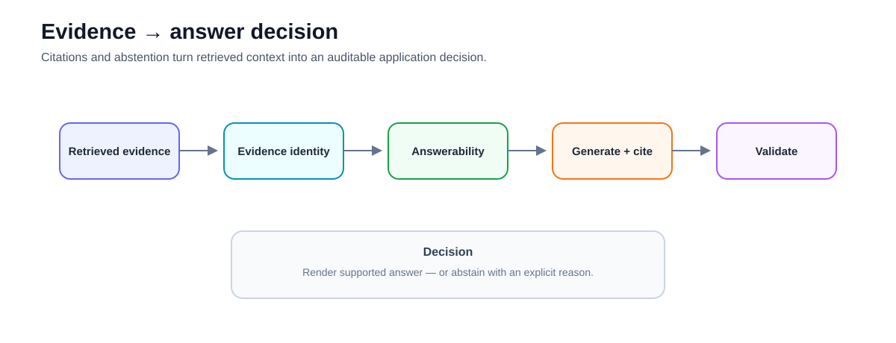
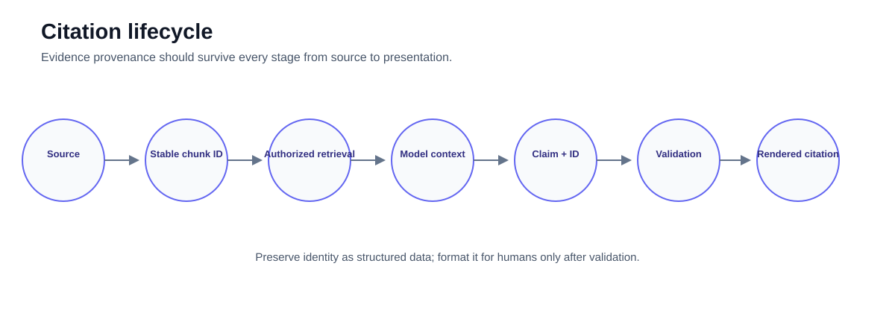
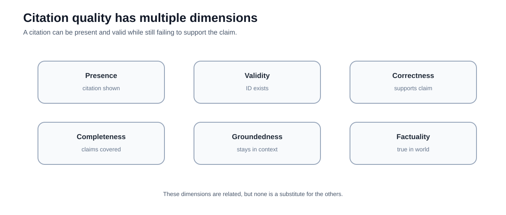
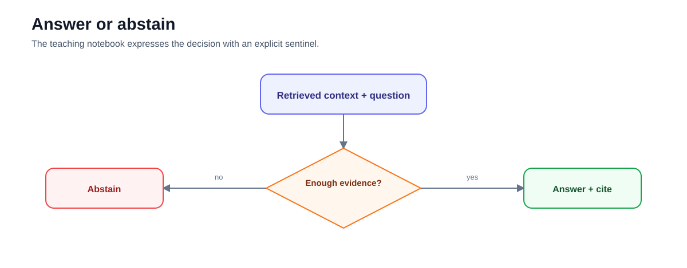
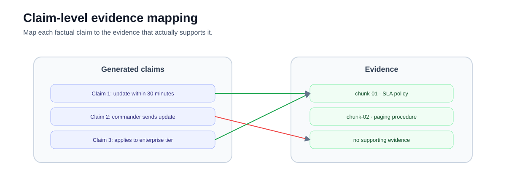
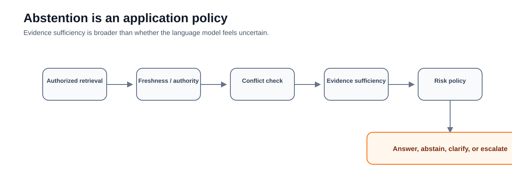
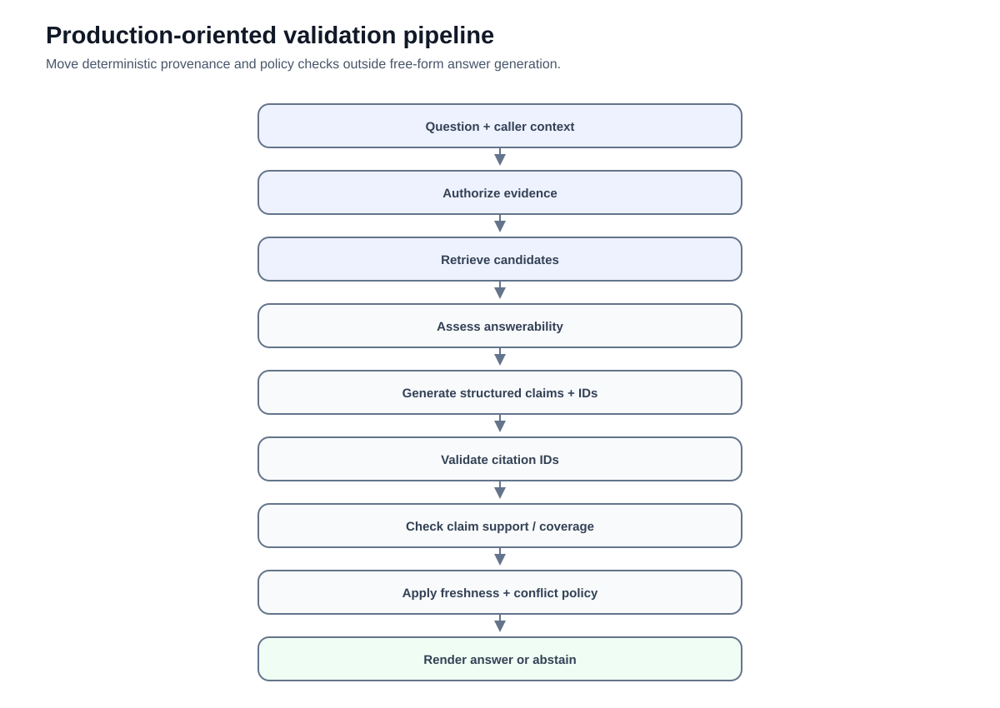

# 04 — Citations and Abstention: Make Evidence and Uncertainty Explicit

**Level:** Beginner  
**Estimated time:** 90–120 minutes  
**Scenario:** Enterprise Incident Support Assistant  
**Notebook:** [`04_citations_abstention.ipynb`](04_citations_abstention.ipynb)  
**Prerequisite:** [03 — Chunking Decisions](../03-chunking-lab/README.md)

---

## Why this lesson exists

The previous courses established three foundations:

1. RAG connects generation to external evidence.
2. Retrieval must be inspected independently from generation.
3. Chunking determines what evidence can be returned.

But retrieving a relevant passage is still not enough.

A production assistant also needs to answer two questions:

> **Which evidence supports this answer?**

and:

> **What should the system do when the available evidence is not sufficient?**

Those are the problems of **citation** and **abstention**.



This lesson starts with the simple mechanism implemented in the notebook: source labels in context, explicit citation instructions, and an `INSUFFICIENT_EVIDENCE` abstention signal. It then explains how this teaching pattern should evolve into structured, validated citation and answerability controls in production.

---

## Learning objectives

After completing this lesson, you should be able to:

- explain why a citation is more than a source name appended to an answer;
- preserve evidence identity from retrieved documents into model context;
- distinguish citation presence, validity, correctness, and completeness;
- explain the difference between groundedness and factual correctness;
- implement a simple prompt-level citation convention;
- implement a simple explicit abstention path;
- explain why string matching is only a teaching baseline;
- distinguish model-generated abstention from application-enforced answerability policy;
- identify invented, irrelevant, incomplete, stale, and conflicting citations;
- explain why retrieval score should not be treated as calibrated confidence;
- design structured citation and abstention outputs; and
- define deterministic validations that should run before an answer reaches a user.

---

# 1. A source label is not yet a citation system

The notebook formats retrieved documents like this:

```python
def format_docs_with_citations(docs):
    return "\n\n".join(
        f"[Source: {d.metadata['source']}] {d.page_content}"
        for d in docs
    )
```

This gives the model a source identifier it can copy into the answer.

For example:

```text
[Source: sla_policy.md]
Enterprise customers receive a status update within
30 minutes of a confirmed P1 incident.
```

The generated answer can then say:

```text
Enterprise customers must receive a status update
within 30 minutes [Source: sla_policy.md].
```

This is useful for learning because provenance remains visible.

But a production citation system must establish more than:

> the model printed a filename.

It should establish:

> the cited evidence actually exists, was available to this request, and supports the claim attached to it.

---

# 2. The citation lifecycle

Evidence identity should survive the entire RAG path.



```text
Source document
      ↓
Chunk with stable ID
      ↓
Authorized retrieval
      ↓
Context with evidence IDs
      ↓
Generated claim
      ↓
Claim → evidence mapping
      ↓
Validation
      ↓
Rendered citation
```

A robust architecture keeps citations as **structured data** until presentation.

Do not make the rendered `[Source: ...]` string the system of record.

---

# 3. Citation concepts that should not be collapsed

Several related properties are often called "citation quality."

They are different.

| Concept | Question |
|---|---|
| **Citation presence** | Did the answer display a citation? |
| **Citation validity** | Does the cited evidence ID actually exist in the evidence available to this response? |
| **Citation correctness** | Does the cited evidence support the specific claim? |
| **Citation completeness** | Are all material factual claims appropriately supported? |
| **Groundedness / faithfulness** | Does the answer stay within the supplied evidence? |
| **Factual correctness** | Is the claim actually true? |
| **Answer relevance** | Does the response answer the user's question? |
| **Answerability** | Is there sufficient authorized evidence to answer safely? |



These properties can disagree.

A response may be:

- factual but unsupported by retrieved evidence;
- grounded in a source that is itself outdated;
- fully cited but attached to irrelevant passages;
- correctly cited for one sentence but unsupported elsewhere.

Therefore:

> **Citation presence is the beginning of validation, not the end.**

---

# 4. The notebook's citation prompt

The notebook instructs the model:

```text
RULES:
1. If the context does not contain the information needed
   to answer the question, reply with exactly:
   INSUFFICIENT_EVIDENCE

2. If you can answer the question, cite the source in
   brackets at the end of the sentence.
```

This introduces two useful behaviors:

```text
supported
   ↓
answer + citation

unsupported
   ↓
abstain
```



This is a good teaching baseline.

It is not a complete production control.

Why?

Because the same model is being asked to:

1. determine whether evidence is sufficient;
2. generate the answer;
3. decide which source supports it; and
4. format the result correctly.

Any of those decisions can fail.

---

# 5. Prompt instructions are not deterministic controls

Suppose the prompt says:

```text
Only answer from the provided context.
```

A model can still:

- introduce unsupported information;
- cite the wrong source;
- invent a source label;
- ignore the abstention instruction;
- partially follow the output format;
- answer from prior model knowledge.

Prompting influences model behavior.

It does not establish a hard invariant.

Production systems should move critical checks outside free-form generation where possible.

For example:

```text
LLM output
   ↓
parse structured result
   ↓
validate evidence IDs
   ↓
validate answerability policy
   ↓
optional claim-support check
   ↓
render or block
```

---

# 6. The notebook's abstention guardrail

The notebook implements:

```python
class AbstentionGuardrail(StrOutputParser):
    def parse(self, text: str) -> str:
        cleaned = text.strip()

        if "INSUFFICIENT_EVIDENCE" in cleaned:
            return (
                "System Abstention: The retrieved context "
                "does not contain the answer. "
                "Please escalate to a human."
            )

        return cleaned
```

This demonstrates an important architectural pattern:

> generation can return a machine-recognizable decision that changes application behavior.

But string matching has limitations.

For example:

```text
"The evidence is not INSUFFICIENT_EVIDENCE..."
```

would still match the substring.

Likewise, a model may produce:

```text
INSUFFICIENT EVIDENCE
```

or:

```text
I do not have enough evidence.
```

and bypass the exact convention.

String sentinels are therefore appropriate for a small deterministic lab—not for a high-assurance interface.

---

# 7. Prefer structured decisions in production

A more robust result schema could look like:

```python
class RAGDecision(BaseModel):
    decision: Literal[
        "answer",
        "insufficient_evidence",
        "conflicting_evidence",
    ]
    answer: str | None
    citations: list[str]
    reason: str | None
```

Example:

```json
{
  "decision": "answer",
  "answer": "Enterprise customers receive a status update within 30 minutes.",
  "citations": ["chunk-01"],
  "reason": null
}
```

or:

```json
{
  "decision": "insufficient_evidence",
  "answer": null,
  "citations": [],
  "reason": "The retrieved evidence does not define the standard-tier update policy."
}
```

The exact schema depends on the application.

The architectural principle is:

> **Represent answerability as data, not as a phrase hidden inside prose.**

---

# 8. Stable evidence IDs matter

The notebook currently exposes the source filename:

```text
sla_policy.md
```

The document also contains:

```python
metadata={
    "source": "sla_policy.md",
    "id": "chunk-01",
}
```

For production citation validation, the stable chunk ID is more useful.

Prefer context such as:

```text
[Evidence ID: chunk-01]
[Source: sla_policy.md]

Enterprise customers receive a status update
within 30 minutes of a confirmed P1 incident.
```

Then the model can return:

```text
chunk-01
```

and the application can resolve that ID to:

- source;
- section;
- page;
- version;
- URL;
- title;
- access policy.

This separates **citation identity** from **citation presentation**.

---

# 9. Claim-level citations

Consider:

```text
Enterprise customers receive updates within 30 minutes.
The update must be sent by the incident commander.
```

Suppose only the first sentence appears in the retrieved evidence.

A source list such as:

```text
Sources:
- sla_policy.md
```

does not tell us which claim is supported.

A stronger representation maps claims to evidence.

```text
claim-1
"Enterprise customers receive updates within 30 minutes."
→ chunk-01

claim-2
"The update must be sent by the incident commander."
→ no supporting evidence
```



This makes unsupported claims much easier to detect.

---

# 10. Citation validity

A deterministic check can answer:

> Did the model cite evidence that was actually available?

For example:

```python
retrieved_ids = {"chunk-01", "chunk-02"}
model_citations = {"chunk-01", "chunk-99"}

invalid = model_citations - retrieved_ids

assert invalid == {"chunk-99"}
```

`chunk-99` is an invented or unavailable citation.

This check does not require another LLM.

It should happen before rendering.

---

# 11. Citation correctness

A citation can be valid but wrong.

Suppose:

```text
chunk-02:
To page the on-call engineer, use /page in #incidents.
```

and the model says:

```text
Enterprise customers must receive an update
within 30 minutes [chunk-02].
```

`chunk-02` is a real retrieved ID.

But it does not support the claim.

This is a **citation correctness / claim-support** problem.

Possible evaluation approaches include:

- human review;
- deterministic checks for narrow structured cases;
- natural-language inference / entailment models;
- LLM-based claim-support judges;
- combinations of automated and human evaluation.

No automated judge should be assumed perfect without evaluation on your domain.

---

# 12. Citation completeness

An answer may contain one correct citation and still have unsupported claims.

Example:

```text
Enterprise customers receive updates within 30 minutes [chunk-01].
The policy was introduced in 2024.
The incident commander must personally send the update.
```

Only the first claim is supported.

Citation completeness asks:

> Are all factual claims that require evidence appropriately supported?

This often requires decomposing an answer into claims.

---

# 13. Groundedness is not factual correctness

Suppose an outdated policy says:

```text
Enterprise customers receive an update within 60 minutes.
```

The model faithfully answers:

```text
Enterprise customers receive an update within 60 minutes.
```

The answer is grounded in the supplied context.

But if the current policy says 30 minutes, it is factually wrong for the current state.

This distinction matters:

```text
Groundedness:
Did the answer follow the supplied evidence?

Factual correctness:
Is the answer actually true?

Freshness:
Was the correct source version supplied?
```

Different failures require different fixes.

---

# 14. Abstention is an application decision

A model saying:

```text
"I don't know."
```

is not the same as an application having a reliable abstention policy.

A production answerability decision may consider:

```text
retrieval evidence
source authority
source freshness
authorization
conflicts
evidence completeness
application risk policy
```



The model can contribute to this decision.

It should not necessarily be the only component making it.

---

# 15. Do not use retrieval score as truth confidence

A tempting policy is:

```python
if similarity_score > 0.8:
    answer()
else:
    abstain()
```

That may be useful only after careful calibration for a specific retriever and dataset.

A retrieval score is not inherently:

```text
probability(answer is correct)
```

Different search systems expose different score semantics.

Even a highly similar passage may:

- discuss the wrong policy scope;
- be stale;
- be unauthorized;
- contradict another source;
- mention the same terms without answering the question.

Thresholds must be evaluated empirically.

---

# 16. Useful abstention states

Not every failure should become the same generic:

```text
I don't know.
```

Useful applications distinguish why they cannot answer.

| State | Meaning |
|---|---|
| `insufficient_evidence` | Available evidence does not support an answer |
| `conflicting_evidence` | Available sources disagree materially |
| `stale_evidence` | Relevant evidence exists but fails freshness policy |
| `unauthorized_scope` | Relevant evidence cannot be disclosed to this caller |
| `ambiguous_request` | The question needs clarification |
| `unsupported_domain` | The request is outside the system's supported knowledge scope |

Be careful with unauthorized evidence.

The response should not reveal:

> "I found the answer in a restricted executive document."

Even the existence of restricted content may be sensitive.

---

# 17. Conflicting evidence

Imagine retrieval returns:

```text
policy-v1:
P1 customers receive updates within 60 minutes.

policy-v2:
P1 customers receive updates within 30 minutes.
```

A naive RAG model may choose one.

A safer system first asks:

- Which version is active?
- Is one superseded?
- Are the policies scoped differently?
- Is there enough metadata to resolve the conflict?

Possible responses include:

```text
prefer authoritative active version
```

or:

```text
abstain because conflict cannot be resolved
```

Do not silently average contradictory evidence.

---

# 18. Citation freshness

A citation is not safe merely because it exists.

Useful provenance metadata may include:

```text
document_id
chunk_id
version
effective_from
effective_to
updated_at
superseded_by
owner
source_uri
```

This allows the application to distinguish:

```text
retrieved
```

from:

```text
retrieved and currently valid.
```

Freshness belongs upstream of generation whenever possible.

---

# 19. Authorization and citations

Citation architecture must respect the same access boundary as retrieval.

The safe order is:

```text
Authenticated caller
      ↓
Authorization constraints
      ↓
Eligible evidence
      ↓
Retrieval
      ↓
Generation
      ↓
Citation validation
```

Not:

```text
retrieve everything
      ↓
send everything to model
      ↓
hide restricted citations afterward
```

Once restricted content enters a prompt, trace, cache, or generated answer, post-processing may be too late.

---

# 20. A production-oriented validation pipeline

A more complete architecture looks like:



```text
Question + caller context
        ↓
Authorize searchable evidence
        ↓
Retrieve candidates
        ↓
Assess answerability
        ↓
Generate structured claims + evidence IDs
        ↓
Validate evidence IDs
        ↓
Validate claim coverage/support
        ↓
Apply freshness/conflict policy
        ↓
Render answer
        or
Abstain / escalate
```

The notebook implements only a small subset of this architecture.

That is intentional.

The purpose is to learn the contract before adding more machinery.

---

# 21. Teaching implementation versus production implementation

| Notebook | Production evolution |
|---|---|
| Source filename in prompt | Stable evidence IDs + resolvable provenance |
| Prompt asks for citations | Structured claim/evidence output |
| `INSUFFICIENT_EVIDENCE` string | Typed answerability decision |
| Substring parser | Schema validation |
| Fake LLM | Evaluated production model |
| Two pre-retrieved docs | Real authorized retrieval |
| No citation-ID validation | Deterministic evidence validation |
| No claim-support audit | Claim-level evaluation |
| No source freshness | Version/effective-date policy |
| No conflicts | Conflict detection/resolution |
| No ACL demonstration | Retrieval-time authorization |
| One abstention state | Explicit reason taxonomy |
| No evaluation set | Answerable + unanswerable benchmark |

---

# 22. Practical exercises

## Exercise 1 — Run the supported case

Use:

```text
How fast do we update enterprise customers?
```

Inspect:

- context;
- generated answer;
- displayed source.

Which exact evidence supports the answer?

---

## Exercise 2 — Run the unsupported case

Use:

```text
What is the policy for standard tier customers?
```

The supplied context does not answer this question.

Observe the `INSUFFICIENT_EVIDENCE` path.

Why is this better than allowing the model to infer a likely policy?

---

## Exercise 3 — Break the sentinel

Modify the fake response to:

```text
I have INSUFFICIENT_EVIDENCE to answer fully,
but enterprise customers...
```

What does the substring parser do?

This demonstrates why free-form sentinel parsing is brittle.

---

## Exercise 4 — Invent a citation

Use a fake model response:

```text
Enterprise customers receive an update within
30 minutes [Source: customer_policy.md].
```

But `customer_policy.md` was never provided.

Write a deterministic check that rejects citations not present in the retrieved evidence.

---

## Exercise 5 — Use chunk IDs

Change context formatting to include:

```text
[Evidence ID: chunk-01]
```

instead of relying only on filenames.

Have the model return evidence IDs.

Resolve them to source names only after validation.

---

## Exercise 6 — Design structured output

Define a Pydantic model containing:

```text
decision
answer
citations
reason
```

What fields should be required when:

```text
decision = answer
```

versus:

```text
decision = insufficient_evidence
```

---

## Exercise 7 — Add conflicting evidence

Add:

```python
Document(
    page_content=(
        "Enterprise customers receive a status update "
        "within 60 minutes of a confirmed P1 incident."
    ),
    metadata={
        "source": "old_sla_policy.md",
        "id": "chunk-03",
    },
)
```

What should the application do?

What additional metadata would let it resolve the conflict safely?

---

# 23. Evaluation plan

Build a benchmark containing several case types.

```text
answerable
unanswerable
paraphrased
partially supported
conflicting
stale
citation-invention
multi-claim
permission-restricted
```

Measure separately:

| Metric | What it asks |
|---|---|
| Retrieval recall | Did the needed evidence arrive? |
| Citation validity | Were cited IDs actually available? |
| Citation correctness | Does evidence support the attached claim? |
| Citation completeness | Are material factual claims supported? |
| Faithfulness / groundedness | Does the answer stay within context? |
| Answer correctness | Is the answer correct? |
| Abstention precision | When the system abstains, was abstention appropriate? |
| Abstention recall | Did it abstain on cases that should not be answered? |

A single "RAG accuracy" number hides too much.

---

# 24. Common mistakes

### "The answer has a citation, so it is grounded."

Not necessarily.

The citation may be invented or irrelevant.

### "The source exists, so the citation is correct."

No.

A real source can fail to support the attached claim.

### "A high vector score means we should answer."

Not without calibration and additional evidence policy.

### "The model said it is uncertain, so we should abstain."

Model self-reported uncertainty is not a complete answerability policy.

### "We can filter unauthorized citations after generation."

Too late if restricted content already entered the prompt.

### "If the answer is grounded, it is true."

Groundedness is relative to the supplied evidence.

The evidence itself can be stale or wrong.

---

# 25. Checkpoint

Before completing the beginner track, you should be able to answer:

1. Why is a rendered source label not a complete citation system?
2. What is citation validity?
3. How does citation correctness differ from validity?
4. What is citation completeness?
5. Why can a grounded answer still be factually wrong?
6. Why is a string sentinel a weak production interface?
7. Why are stable chunk IDs preferable to filenames as citation identity?
8. What should happen when a model cites an evidence ID that was not retrieved?
9. Why is similarity score not calibrated answer confidence?
10. What should happen when two authoritative sources conflict?
11. Why must authorization happen before restricted evidence enters model context?
12. How would you evaluate abstention behavior?

---

# 26. Beginner-track synthesis

You have now built the conceptual foundation of a RAG system:

```text
01 — RAG Foundations
Understand retrieval + generation

        ↓

02 — First Local RAG
Build and inspect semantic retrieval

        ↓

03 — Chunking Decisions
Design the retrievable evidence unit

        ↓

04 — Citations & Abstention
Make support and no-answer behavior explicit
```

The next stage of the curriculum can now deepen retrieval itself:

- lexical retrieval;
- dense retrieval;
- hybrid retrieval;
- metadata filtering;
- reranking;
- query transformation;
- evaluation;
- advanced and agentic RAG.

---

# References

## Citation and RAG evaluation

- Ragas — [Metrics](https://docs.ragas.io/en/stable/concepts/metrics/available_metrics/)
- Es et al. — [RAGAS: Automated Evaluation of Retrieval Augmented Generation](https://arxiv.org/abs/2309.15217)

## Grounded generation and attribution

- Gao et al. — [Retrieval-Augmented Generation for Large Language Models: A Survey](https://arxiv.org/abs/2312.10997)
- Liu et al. — [Evaluating Verifiability in Generative Search Engines](https://arxiv.org/abs/2304.09848)

## Structured output patterns

- LangChain — [Structured output](https://docs.langchain.com/oss/python/langchain/structured-output)
- Pydantic — [Models](https://docs.pydantic.dev/latest/concepts/models/)

---

# Key takeaway

A trustworthy RAG answer needs more than relevant text and fluent generation.

It needs an explicit chain:

```text
evidence
   ↓
identity
   ↓
claim
   ↓
validation
   ↓
citation
```

And when that chain cannot be established, the system needs a deliberate path to:

> **abstain rather than manufacture confidence.**
