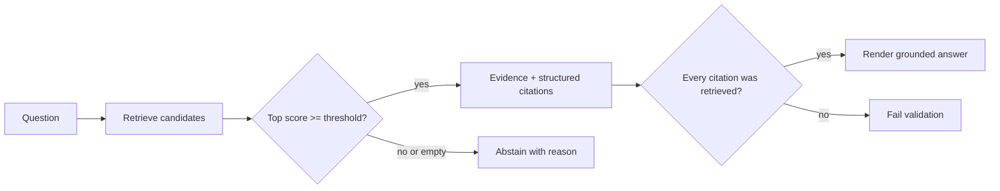

# 04 — Citations and abstention

**Level:** Beginner  \
**Time:** 30 minutes  \
**Prerequisites:** [the chunking lab](../03-chunking-lab/README.md)

## Outcome

Return evidence with structured provenance and abstain when retrieval is empty or below a documented confidence threshold.

## Run it

```bash
PYTHONPATH=. python -m examples.beginner.citations
```

Inspect [`citations.py`](../../../examples/beginner/citations.py). `Citation` is data, not formatting: it carries a chunk ID, source, and retrieval score. `CitedAnswer` makes the abstention state and reason explicit. `render_markdown` is only a presentation layer.

The guided companion notebook is [`03_citations_abstention.ipynb`](../../../notebooks/beginner/03_citations_abstention.ipynb).

## Architecture



## Why abstention matters

A fluent answer is not evidence that the corpus supports it. An abstention is safer than inventing a citation, but thresholds also create false abstentions. Evaluate both unsupported questions and answerable questions, and make the threshold a versioned policy decision.

## Experiment

Try `min_score=0.2`, `0.5`, and `0.8` on the same question set. Record:

- supported questions answered;
- unsupported questions rejected;
- citations shown;
- false abstentions and unsupported answers.

## Failure modes

- A citation can point to a real document without supporting the claim.
- A retrieved chunk can be relevant but unauthorized for the user.
- A threshold tuned on easy examples can fail on paraphrases.
- Formatting a citation string too early makes validation difficult.

## Exercise

Add a question that is answerable only by combining two chunks. Extend the response model with a `claim` field and require each claim to list its supporting chunk IDs. Add a test that rejects a citation ID not present in the retrieved set.
