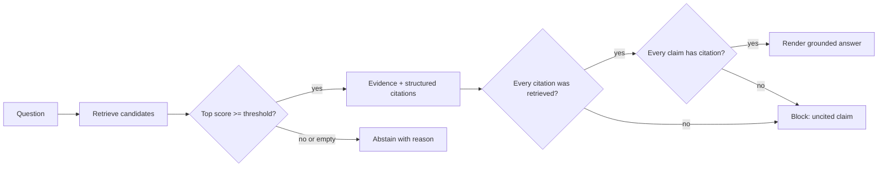
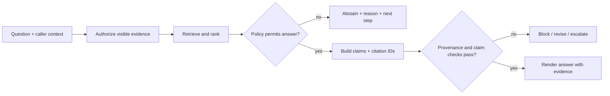

# 04 — Citations and abstention: make evidence and uncertainty explicit

**Level:** Beginner  
**Time:** 2–3 hours  
**Prerequisites:** [the chunking lab](../03-chunking-lab/README.md)

## Learning objectives

After this lesson you will be able to:

- distinguish citation presence, citation validity, citation correctness, citation
  completeness, claim support, groundedness, factual correctness, answer relevance,
  and answerability — and explain why they are not the same;
- implement claim-level citations (each claim maps to specific chunk IDs);
- verify that citations are real, retrieved, and authorized before an answer is returned;
- implement and evaluate multiple abstention states with reason codes and useful next steps;
- explain when a fully cited answer can still be factually wrong;
- diagnose citation failure modes: invented IDs, real-but-irrelevant, unsupported claim,
  partial support, and stale source; and
- design a claim-verification audit that runs before the answer reaches a user.

## Run it

```bash
PYTHONPATH=. python curriculum/beginner/04-citations-abstention/lab.py
```

Inspect [`lab.py`](lab.py). `Citation` is data, not formatting: it carries a chunk ID, source, and retrieval score. `CitedAnswer` makes the abstention state and reason explicit. `render_markdown` is only a presentation layer.

The guided companion notebook is [`03_citations_abstention.ipynb`](../../../notebooks/beginner/03_citations_abstention.ipynb).

## Why citations and abstention are harder than they look

It is tempting to treat citations as a formatting problem: just append `[Source: doc-7]`
to the end of an answer. That is not a citation system — it is decoration that creates
false confidence.

A genuine citation system answers: **can I trace every factual claim in this answer
back to a specific piece of evidence that was actually retrieved and authorized?**

Abstention is equally difficult. A system that abstains too aggressively is useless.
A system that abstains too conservatively invents answers. Tuning this requires
an explicit policy with measurable thresholds.

## The citation distinction matrix

These concepts are related but not interchangeable. Confusing them is a common
source of production failures.

| Concept | Definition | Can be true while others are false |
|---|---|---|
| **Citation presence** | An answer contains a source reference (e.g., `[doc-7]`) | Yes — the ID could be invented or irrelevant |
| **Citation validity** | The cited ID actually exists in the retrieved set | Yes — the source may not support the claim |
| **Citation correctness** | The cited source supports the specific claim it is attached to | Yes — another claim in the same answer may be uncited |
| **Citation completeness** | Every factual claim in the answer has at least one citation | Yes — cited claims may still be wrong or unsupported |
| **Claim support** | The claim follows logically from the cited evidence | Yes — the source may be correct but the claim overstates it |
| **Groundedness** | All claims in the answer are supported by the provided context | Yes — the context itself may be factually wrong |
| **Factual correctness** | Claims are true about the world | Yes — even if not supported by the provided evidence |
| **Answer relevance** | The answer addresses the question asked | Yes — an answer can be grounded but not responsive |
| **Answerability** | The question can be answered from the indexed corpus | No dependency — the question may simply not be in scope |

**Key insight:** a factual answer can be unsupported by the provided evidence. A fully
cited answer can cite irrelevant sources. A grounded answer (faithful to context) can
still be factually wrong if the source is wrong. These are four different failure modes
requiring four different fixes.

## Claim-level citation mechanics

The right citation architecture maps each individual claim to its supporting evidence:

```
Answer text:
"Support engineers may restart production services [doc-7].
 This requires incident-commander approval [doc-7, policy-12].
 Rotations completed within the maintenance window do not require approval [policy-12]."

Claim map:
  claim-1: "Support engineers may restart..." → {doc-7}
  claim-2: "requires incident-commander approval" → {doc-7, policy-12}
  claim-3: "Rotations within window do not require approval" → {policy-12}
```

A source list at the bottom of the page (`Sources: doc-7, policy-12`) does not
give this information. It conceals which source supports which sentence.

```python
Claim(
    claim_id="approval-boundary",
    text="Support cannot restart production services without incident-command approval.",
    citation_ids=("harborline-support-7",),
)
```

## Architecture



## Failure modes in citation systems

### Invented citation IDs

Language models can generate plausible-sounding but nonexistent source IDs
(`harborline-support-99`, `policy-v2-section-4.3`). These look authoritative
but cannot be traced to any retrieved evidence.

**Detection:** before rendering any answer, validate that every cited ID appears
in the retrieved set. This is a deterministic check that catches the failure
before the user sees it.

```python
def citations_valid(answer: CitedAnswer, retrieved_ids: set[str]) -> bool:
    return all(cid in retrieved_ids for c in answer.claims for cid in c.citation_ids)
```

### Real but irrelevant citation

The cited source exists and was retrieved, but it does not support the specific
claim it is attached to. Example: a claim about restart permissions cites a
password-reset policy paragraph that happens to use the word "authority."

**Detection:** claim-support audit. The lexical check in the lab catches obvious
vocabulary mismatches. Entailment models or LLM judges provide richer coverage.
Neither is perfect — human review remains necessary for high-risk claims.

### Partial support

A claim is partially supported: the cited evidence establishes the action is
permitted but does not capture the exception or scope limitation.

Example:
- Evidence: "Support engineers may restart checkout services."
- Claim: "Support engineers may restart any production service."
- Status: **partial support** — the evidence is real but the claim overstates its scope.

**Detection:** require claims to be narrowly scoped. Audit that the claim wording
stays within the exact assertions of the evidence, not implied generalizations.

### Conflicting sources

Two retrieved chunks make contradictory assertions (e.g., different versions of
a policy). A citation system must not silently average or ignore the conflict.

**Response options:**
- cite both sources and flag the conflict explicitly;
- prefer the more recent version with a freshness date;
- abstain and route to a human reviewer; or
- present both positions with their sources and confidence levels.

```python
if contradicts(claim, prior_evidence):
    return CitedAnswer(
        decision="conflicting-evidence",
        claims=all_claims,
        conflicts=[{...}],
    )
```

### Stale evidence

A cited source was valid at ingestion time but has since been superseded. The
citation is technically valid (the chunk was retrieved) but the content is
outdated.

**Prevention:** attach `valid_from`, `valid_to`, and `superseded_by` metadata
to chunks at ingestion. Filter or label stale sources before they enter the
context. A citation that correctly references a revoked policy is not a safe citation.

### Correct source, wrong claim

The cited evidence is real, retrieved, authorized, and current — but the generated
claim does not follow from it. This is a generation failure, not a retrieval failure.

Example:
- Evidence: "Service restart requires approval from the incident commander **or**
  a senior engineer."
- Claim: "Service restart requires approval from the incident commander."
- Status: **claim error** — the disjunction was dropped.

**Detection:** entailment scoring, LLM-as-judge faithfulness evaluation, or
human review. Fix the generation constraint or prompt, not the retrieval.

## Why abstention matters

A fluent answer is not evidence that the corpus supports it. An abstention is safer
than inventing a citation, but thresholds also create false abstentions. Evaluate
both unsupported questions and answerable questions, and make the threshold a
versioned policy decision.

The abstention decision answers: **given the retrieved evidence and the policy, is
it safe to answer?** It is not "does the model feel uncertain?" The decision should
be deterministic and auditable.

## Abstention states

| Decision | Meaning | Typical safe next step |
|---|---|---|
| `insufficient-evidence` | No visible result meets the minimum evidence bar. | Ask for a narrower request or verify another canonical source. |
| `ambiguous-evidence` | Competing candidates are too close for this policy. | Present options, request clarification, or route to an owner. |
| `insufficient-source-diversity` | A corroboration rule was not met. | Search an independent approved source or escalate. |
| `conflicting-evidence` | Sources contradict; cannot safely assert either claim. | Present the conflict, route to a human reviewer. |
| `stale-evidence` | Retrieved source is past its freshness window. | Trigger re-indexing or serve a labeled "dated" response. |
| `unauthorized-scope` | Evidence exists but caller lacks permission to receive it. | Acknowledge the policy boundary; do not reveal evidence content. |
| `grounded-evidence` | A policy permits an evidence-backed answer. | Show claim-level citations and retrieval metadata. |

Each abstention state should return: what was searched, why it failed, and the
safe next action. "I don't know" is not a useful abstention.

**Example useful abstention:**
```
"I could not find a policy authorizing support engineers to restart the
 payments service. The incident escalation runbook covers checkout and
 catalog services only. For payments, contact the Platform Engineering
 team at #platform-oncall or open a P0 incident ticket."
```

## Step-by-step training

### 1. Define a citation schema before generating text

The smallest useful citation has a stable chunk ID, source, retrieval score, and
section/location. In production, include document version, timestamp, source
owner, ACL/tenant context, parser/index version, and a human-navigable locator.

```python
@dataclass(frozen=True)
class Citation:
    chunk_id: str
    source: str
    score: float
    section: str | None = None
```

Formatting is intentionally deferred to `render_markdown`. Keep data structured
until all validation, policy, logging, and UI decisions are finished.

### 2. Link each claim to specific evidence

```python
Claim(
    claim_id="approval-boundary",
    text="Support cannot restart production services without incident-command approval.",
    citation_ids=("harborline-support-7",),
)
```

`audit_claim_support` adds a transparent lexical check that catches obvious
mismatches. It is **not** a proof of entailment: a production system should add
human review for high-risk claims and evaluate an entailment/faithfulness judge
on a held-out set rather than trusting any one automated metric.

### 3. Enforce access before ranking

An answer must not cite a document the caller is not allowed to read. The
example's `allowed_chunk_ids` parameter is a deterministic stand-in for a tenant
or ACL filter. It narrows candidates **before** retrieval. Filtering only after
building the context can expose restricted text in a prompt, trace, or log.

```python
answer = answer_with_citations(
    "Who may restart production services?",
    chunks,
    allowed_chunk_ids={"harborline-support-7"},
)
```

Real systems bind this filter to authenticated caller claims and propagate it to
the search backend. Never rely on a model prompt to choose what a user may see.

### 4. Validate citations before rendering



`audit_answer` reports whether citations were retrieved, whether source
diversity exists, the top-score margin, whether claims use known citation IDs,
and which claims pass or fail the lexical support diagnostic. Persist this trace
with the response in a real system; it is the foundation for evaluation, user
feedback, incident review, and source rollback.

### 5. Experiment with thresholds

Try `min_score=0.2`, `0.5`, and `0.8` on the same question set. Record:

- supported questions answered;
- unsupported questions rejected;
- citations shown;
- false abstentions and unsupported answers.

The score threshold is a retrieval-policy value, not a calibrated probability of
truth. Tune it on answerable, unsupported, ambiguous, paraphrased, stale, and
permission-restricted cases — not on one impressive answer.

## Evaluation plan

Keep retrieval, citation, and answer metrics separate:

| Metric | Question | Example failure |
|---|---|---|
| Context precision/recall | Did retrieval deliver the right evidence? | Correct source is absent or low-ranked. |
| Citation validity | Are citation IDs real, retrieved, and authorized? | Model invents a source or cites a hidden document. |
| Citation correctness | Does each cited source support the specific claim? | Citation is present but the source is irrelevant to the claim. |
| Citation completeness | Does every factual claim have at least one citation? | Only the first sentence is cited. |
| Claim support | Does each claim follow from cited evidence? | Citation is real but the claim overstates its scope. |
| Faithfulness/groundedness | Do all claims stay within the provided context? | Answer adds information not in any retrieved chunk. |
| Abstention accuracy | Did the system answer/decline appropriately? | Unsupported request gets a confident answer. |
| User outcome | Did the next step resolve the support task? | Safe abstention leaves the user stranded. |

The [Ragas metrics reference](https://docs.ragas.io/en/latest/concepts/metrics/available_metrics/)
includes context precision and faithfulness measures. Treat model-judged metrics
as evaluated instruments with their own error modes; use human-reviewed cases
and deterministic provenance invariants for high-risk releases.

## Failure drills

| Drill | Injected defect | Expected behavior |
|---|---|---|
| Invented citation | Claim cites `missing-policy-99`. | Validation blocks the answer. |
| Real but irrelevant citation | Claim cites a password-reset paragraph. | Claim-support audit flags it; reviewer investigates. |
| Hidden-source leak | Relevant chunk is not in the caller allow-list. | It is not retrieved, logged as context, or cited. |
| Ambiguous evidence | Top two candidates have a small margin. | Abstain or request clarification under policy. |
| Stale source | Citation names an older version. | Freshness/version policy blocks or labels it. |
| Over-wide claim | One citation supports an action but not its exception. | Split claims or retrieve the qualifying evidence. |
| Conflicting sources | Two chunks contradict each other. | System flags conflict; does not silently prefer one. |
| Partial support | Evidence establishes action but not full scope of claim. | Claim-support audit flags the over-generalization. |

## Production readiness checklist

- [ ] Every factual claim maps to one or more structured citation IDs.
- [ ] Citations include source version/location and inherit caller access rules.
- [ ] Retrieval, source freshness, and policy decisions are traceable.
- [ ] Abstentions have reason codes and useful next actions.
- [ ] Tests cover unsupported, ambiguous, cross-boundary, stale, conflicting-source,
      and permission-restricted questions.
- [ ] Citation validation (ID existence, claim support) runs before presentation
      and is monitored after deployment.
- [ ] High-impact answers have a human review or approval path.
- [ ] Invented citation IDs are caught by deterministic validation, not prompt instructions.

## Capstone exercise

Build a small "Harborline policy assistant" release gate. Given a question,
caller scope, and indexed corpus, return an answer only when retrieval passes
the policy, every claim maps to visible evidence, and the audit passes. For an
abstention, return the reason, evidence searched, and a safe next step. Compare
your deterministic checks with an optional LLM-as-judge evaluation; document
where they disagree.

## Checkpoint

1. Why is "citation came from a retrieved chunk" not enough to prove a claim?
2. At which stage must tenant/ACL filtering occur, and why is a prompt too late?
3. Which golden-set cases tune an abstention threshold responsibly?
4. What can a lexical claim-support check catch, and what can it not prove?
5. What information should an abstention return so it remains useful to a support user?
6. Give an example where an answer is grounded (faithful to context) but factually wrong.
7. Give an example where a citation is valid (real, retrieved) but incorrect (does not support the claim).
8. What is the correct response when two retrieved sources contradict each other?

## Continue to intermediate

- [Retrieval strategies](../../intermediate/01-retrieval-strategies/README.md) —
  extend retrieval to BM25, dense, and hybrid strategies with a measured baseline.
- [RAG evaluation](../../intermediate/04-evaluation/README.md) — build a full
  evaluation harness with citation, faithfulness, and abstention metrics.

## References

- Lewis et al., [Retrieval-Augmented Generation](https://arxiv.org/abs/2005.11401)
- Es et al., [Ragas: Automated Evaluation of Retrieval Augmented Generation](https://arxiv.org/abs/2309.15217)
- Ragas, [Available metrics](https://docs.ragas.io/en/latest/concepts/metrics/available_metrics/)
- NIST, [AI RMF: Generative AI Profile](https://nvlpubs.nist.gov/nistpubs/ai/NIST.AI.600-1.pdf)
- [RAG evaluation in this repository](../../../docs/evaluation.md)
