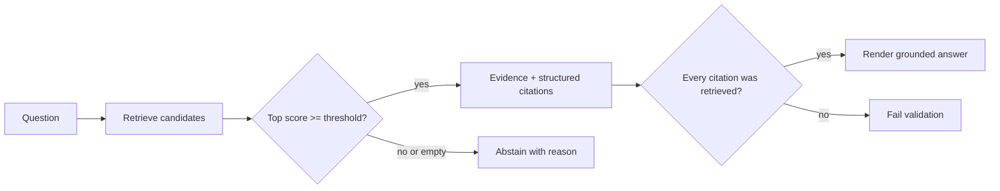
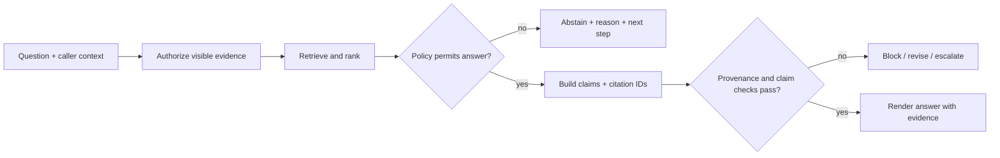

# 04 — Citations and abstention: make evidence and uncertainty explicit

**Level:** Beginner  \
**Time:** 2–3 hours  \
**Prerequisites:** [the chunking lab](../03-chunking-lab/README.md)

## Outcome

Return claims with structured provenance, audit their evidence boundaries, and
abstain when retrieval is empty, ambiguous, unauthorized, or below a documented
policy threshold.

## Run it

```bash
PYTHONPATH=. python -m examples.beginner.citations
```

Inspect [`citations.py`](../../../examples/beginner/citations.py). `Citation` is data, not formatting: it carries a chunk ID, source, and retrieval score. `CitedAnswer` makes the abstention state and reason explicit. `render_markdown` is only a presentation layer.

The guided companion notebook is [`03_citations_abstention.ipynb`](../../../notebooks/beginner/03_citations_abstention.ipynb).

## Architecture



## Why abstention matters

A fluent answer is not evidence that the corpus supports it. An abstention is safer than inventing a citation, but thresholds also create false abstentions. Evaluate both unsupported questions and answerable questions, and make the threshold a versioned policy decision.

## Experiment

Try `min_score=0.2`, `0.5`, and `0.8` on the same question set. Record:

- supported questions answered;
- unsupported questions rejected;
- citations shown;
- false abstentions and unsupported answers.

## Failure modes

- A citation can point to a real document without supporting the claim.
- A retrieved chunk can be relevant but unauthorized for the user.
- A threshold tuned on easy examples can fail on paraphrases.
- Formatting a citation string too early makes validation difficult.

## Exercise

Add a question that is answerable only by combining two chunks. Extend the response model with a `claim` field and require each claim to list its supporting chunk IDs. Add a test that rejects a citation ID not present in the retrieved set.

## The evidence contract

A citation is not decoration appended to a fluent paragraph. It is a data object
that makes a claim reviewable. A useful answer contract has three different
layers:

| Layer | Question it answers | What it cannot prove |
| --- | --- | --- |
| Retrieval provenance | Was this chunk actually retrieved and allowed? | That it supports every claim. |
| Citation correctness | Does this claim name the evidence used for it? | That the source is current or authoritative. |
| Claim support / faithfulness | Does the claim stay within the cited evidence? | That the evidence is factually correct in the world. |

The beginner implementation introduces `Citation`, `Claim`, `CitedAnswer`, and
`CitationAudit`. This separates structured evidence from Markdown rendering and
makes an unsupported claim or invented citation testable before users see it.

## Step-by-step training

### 1. Define a citation schema before generating text

The smallest useful citation has a stable chunk ID, source, retrieval score, and
section/location. In production, include document version, timestamp, source
owner, ACL/tenant context, parser/index version, and a human-navigable locator.

```python
@dataclass(frozen=True)
class Citation:
    chunk_id: str
    source: str
    score: float
    section: str | None = None
```

Formatting is intentionally deferred to `render_markdown`. Keep data structured
until all validation, policy, logging, and UI decisions are finished.

### 2. Link each claim to specific evidence

One paragraph may contain multiple factual claims. A source list at the bottom
can conceal which source supports which sentence. The lab uses a `Claim` with a
set of cited IDs and checks two baseline invariants:

1. every claim references at least one citation in the same answer; and
2. every cited ID is in the retrieved evidence set.

```python
Claim(
    claim_id="approval-boundary",
    text="Support cannot restart production services without incident-command approval.",
    citation_ids=("harborline-support-7",),
)
```

`audit_claim_support` adds a transparent lexical check that catches obvious
mismatches. It is **not** a proof of entailment: a production system should add
human review for high-risk claims and evaluate an entailment/faithfulness judge
on a held-out set rather than trusting any one automated metric.

### 3. Enforce access before ranking

An answer must not cite a document the caller is not allowed to read. The
example’s `allowed_chunk_ids` parameter is a deterministic stand-in for a tenant
or ACL filter. It narrows candidates **before** retrieval. Filtering only after
building the context can expose restricted text in a prompt, trace, or log.

```python
answer = answer_with_citations(
    "Who may restart production services?",
    chunks,
    allowed_chunk_ids={"harborline-support-7"},
)
```

Real systems bind this filter to authenticated caller claims and propagate it to
the search backend. Never rely on a model prompt to choose what a user may see.

### 4. Make abstention a useful terminal state

Abstention is not a failure string. It is a policy decision with a reason and a
safe next action. This lab distinguishes:

| Decision | Meaning | Typical safe next step |
| --- | --- | --- |
| `insufficient-evidence` | No visible result meets the minimum evidence bar. | Ask for a narrower request or verify another canonical source. |
| `ambiguous-evidence` | Competing candidates are too close for this policy. | Present options, request clarification, or route to an owner. |
| `insufficient-source-diversity` | A corroboration rule was not met. | Search an independent approved source or escalate. |
| `grounded-evidence` | A policy permits an evidence-backed answer. | Show claim-level citations and retrieval metadata. |

The score threshold is a retrieval-policy value, not a calibrated probability of
truth. Tune it on answerable, unsupported, ambiguous, paraphrased, stale, and
permission-restricted cases—not on one impressive answer.

### 5. Audit the response before you render it



`audit_answer` reports whether citations were retrieved, whether source
diversity exists, the top-score margin, whether claims use known citation IDs,
and which claims pass or fail the lexical support diagnostic. Persist this trace
with the response in a real system; it is the foundation for evaluation, user
feedback, incident review, and source rollback.

## Evaluation plan

Keep retrieval, citation, and answer metrics separate:

| Metric | Question | Example failure |
| --- | --- | --- |
| Context precision/recall | Did retrieval deliver the right evidence? | Correct source is absent or low-ranked. |
| Citation validity | Are citation IDs real, retrieved, and authorized? | Model invents a source or cites a hidden document. |
| Citation completeness | Does every factual claim have support? | Only the first sentence is cited. |
| Faithfulness | Does the answer follow the evidence? | Citation is real but the claim adds an exception. |
| Abstention accuracy | Did the system answer/decline appropriately? | Unsupported request gets a confident answer. |
| User outcome | Did the next step resolve the support task? | Safe abstention leaves the user stranded. |

The [Ragas metrics reference](https://docs.ragas.io/en/latest/concepts/metrics/available_metrics/)
includes context precision and faithfulness measures. Treat model-judged metrics
as evaluated instruments with their own error modes; use human-reviewed cases
and deterministic provenance invariants for high-risk releases.

## Failure drills

| Drill | Injected defect | Expected behavior |
| --- | --- | --- |
| Invented citation | Claim cites `missing-policy-99`. | Validation blocks the answer. |
| Real but irrelevant citation | Claim cites a password-reset paragraph. | Claim-support audit flags it; reviewer investigates. |
| Hidden-source leak | Relevant chunk is not in the caller allow-list. | It is not retrieved, logged as context, or cited. |
| Ambiguous evidence | Top two candidates have a small margin. | Abstain or request clarification under policy. |
| Stale source | Citation names an older version. | Freshness/version policy blocks or labels it. |
| Over-wide claim | One citation supports an action but not its exception. | Split claims or retrieve the qualifying evidence. |

## Production readiness checklist

- [ ] Every factual claim maps to one or more structured citation IDs.
- [ ] Citations include source version/location and inherit caller access rules.
- [ ] Retrieval, source freshness, and policy decisions are traceable.
- [ ] Abstentions have reason codes and useful next actions.
- [ ] Tests cover unsupported, ambiguous, cross-boundary, stale, and
      permission-restricted questions.
- [ ] Claim/citation validation runs before presentation and is monitored after
      deployment.
- [ ] High-impact answers have a human review or approval path.

## Capstone exercise

Build a small “Harborline policy assistant” release gate. Given a question,
caller scope, and indexed corpus, return an answer only when retrieval passes
the policy, every claim maps to visible evidence, and the audit passes. For an
abstention, return the reason, evidence searched, and a safe next step. Compare
your deterministic checks with an optional LLM-as-judge evaluation; document
where they disagree.

## Checkpoint

1. Why is “citation came from a retrieved chunk” not enough to prove a claim?
2. At which stage must tenant/ACL filtering occur, and why is a prompt too late?
3. Which golden-set cases tune an abstention threshold responsibly?
4. What can a lexical claim-support check catch, and what can it not prove?
5. What information should an abstention return so it remains useful to a support
   user?

## References

- Lewis et al., [Retrieval-Augmented Generation](https://arxiv.org/abs/2005.11401)
- Ragas, [Available metrics](https://docs.ragas.io/en/latest/concepts/metrics/available_metrics/)
- NIST, [AI RMF: Generative AI Profile](https://nvlpubs.nist.gov/nistpubs/ai/NIST.AI.600-1.pdf)
- [RAG evaluation in this repository](../../../docs/evaluation.md)
