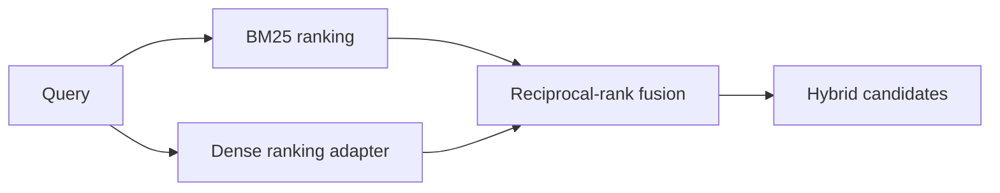
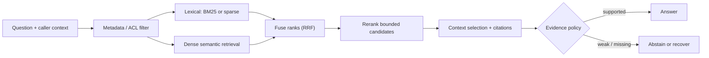

# 01 — Retrieval strategies: design, fuse, and evaluate evidence signals

**Level:** Intermediate  \
**Time:** 2–3 hours  \
**Prerequisites:** complete the [beginner path](../../beginner/README.md)

## Outcome

Compare lexical, dense, hybrid, metadata-filtered, and reranked retrieval; make
their candidate traces visible; and choose a production retrieval policy from a
labelled evaluation set rather than intuition.

## Guided notebook

Open [`retrieval_strategies.ipynb`](retrieval_strategies.ipynb). The reusable implementation is [`examples/intermediate/retrieval_strategies.py`](../../../examples/intermediate/retrieval_strategies.py).

## Concepts

- **Lexical retrieval:** rewards matching terms and is strong for names, error codes, and exact identifiers.
- **Dense retrieval:** compares embedding vectors and can match paraphrases; use a model such as Sentence Transformers in the next infrastructure lab.
- **Hybrid retrieval:** combines signals rather than assuming one retriever wins every query.
- **Reciprocal-rank fusion:** gives each result a score based on its position in each ranking, reducing sensitivity to incompatible raw scores.



## Exercise

Add a paraphrase query and a query containing an exact error code. Explain which ranking is stronger for each and what evaluation set you would need before choosing weights or `top_k`.

## Retrieval is a staged decision system

Retrieval is not “call a vector database.” It is a sequence of distinct
decisions: authorize the candidate space, retrieve broad candidates using one or
more signals, fuse or rerank a bounded set, select a context budget, and decide
whether evidence is sufficient to answer. Each stage has a different failure
mode and metric.



The critical constraint is ordering: metadata, tenant, and authorization filters
must restrict the candidate space **before** sparse or dense search. Filtering
only the final answer can leak protected content in a retrieval trace, model
context, cache, or log.

## What each signal is good at

| Signal | Usually strong for | Typical weakness | What to measure |
| --- | --- | --- | --- |
| Lexical / BM25 | error codes, names, exact clauses, rare identifiers | synonyms, paraphrases, misspellings | Recall@k for exact/identifier queries |
| Dense embeddings | paraphrases and semantic similarity | exact identifiers, domain shift, opaque scores | Recall/precision for paraphrase queries |
| Sparse learned retrieval | token-level expansion and exact-ish matching | model/index complexity | domain-specific retrieval quality |
| Hybrid fusion | mixed question distribution | more candidate paths and tuning | whether it improves the full golden set |
| Reranker | resolving top-k near misses | cost/latency; cannot retrieve absent evidence | MRR/nDCG and downstream support |
| Metadata filters | tenant, source, time, type, access boundaries | overly broad/incorrect metadata can hide evidence | filter correctness and zero leakage |

Sentence Transformers documents the distinction between short-query/long-passage
**asymmetric** retrieval and symmetric similarity. Qdrant documents hybrid
prefetch, rank fusion, and payload filtering. These technologies are valuable
when they address a measured failure; they are not a replacement for source
quality, metadata, or evaluation.

## Step-by-step implementation lab

### 1. Start with a labelled corpus and an authorization filter

The reusable module exposes `Document` with optional metadata and
`filter_documents`. Keep document IDs and source metadata stable. Filters must
be part of the retrieval query, not instructions to a generator.

```python
from examples.intermediate.retrieval_strategies import AttributedDocument, filter_documents

docs = [
    AttributedDocument("acme-runbook", "E401 requires token verification.", {"tenant": "acme", "kind": "runbook"}),
    AttributedDocument("globex-runbook", "E401 requires token verification.", {"tenant": "globex", "kind": "runbook"}),
]
visible = filter_documents(docs, {"tenant": "acme"})
assert [doc.doc_id for doc in visible] == ["acme-runbook"]
```

### 2. Establish a lexical baseline

BM25 rewards term frequency while discounting common terms and normalizing for
document length. It remains a high-value baseline for identifiers and exact
phrases. Before replacing it, inspect the query terms, matching documents,
scores, and behaviour on identifiers such as `E401`.

```python
from examples.intermediate.retrieval_strategies import BM25

hits = BM25(visible).search("E401 token verification", top_k=3)
print([(doc.doc_id, round(score, 3)) for doc, score in hits])
```

### 3. Keep the dense boundary explicit

The deterministic lab uses `static_dense_ranking`: it adapts externally computed
dense scores without pretending a hard-coded ranking is semantic search. In a
real version, calculate query/document embeddings with a retrieval-trained model
and keep the same document IDs, filters, top-k budget, trace, and evaluation
set.

```python
from examples.intermediate.retrieval_strategies import static_dense_ranking

dense = static_dense_ranking(visible, {"acme-runbook": 0.84})
print([doc.doc_id for doc in dense])
```

For asymmetric question-to-passage search, use the model’s query and document
encoding methods where available; do not treat arbitrary sentence-similarity
scores as comparable to BM25 scores.

### 4. Fuse ranks, not incompatible score scales

A BM25 score and cosine similarity have different distributions. A naive linear
blend (`0.7 * dense + 0.3 * BM25`) usually lacks a meaningful common scale.
Reciprocal-rank fusion (RRF) only uses positions:

\[
RRF(d) = \sum_{r \in rankings(d)} \frac{w_r}{k + rank_r(d)}
\]

RRF rewards a document that ranks well in either list and boosts consensus
without requiring raw-score calibration. Weights are still a policy: tune them
on labelled data, not a single query.

```python
from examples.intermediate.retrieval_strategies import weighted_reciprocal_rank_fusion

fused = weighted_reciprocal_rank_fusion([(lexical_docs, 1.0), (dense_docs, 1.0)], top_k=5)
```

### 5. Rerank only a bounded candidate set

A cross-encoder or late-interaction model can inspect the query and candidate
together and often improves precision. It is normally too expensive for a full
corpus scan. First retrieve a broad bounded candidate set; then rerank it. A
reranker cannot recover an evidence item that neither first-stage retriever
returned.

`rerank_by_query_coverage` is a transparent deterministic stand-in. Its purpose
is to teach the contract, not emulate a neural reranker.

### 6. Trace and evaluate the full route

`hybrid_retrieve` returns both final documents and a `RetrievalTrace` showing
filters, lexical IDs, dense IDs, fused IDs, and reranked IDs. When an answer
fails, use the trace to locate the boundary: absent source, filter, candidate
recall, fusion, reranking, context selection, or generation.

```python
results, trace = hybrid_retrieve(
    "E401 unauthorized request",
    docs,
    {"acme-runbook": 0.84},
    filters={"tenant": "acme"},
)
print(trace)
```

## Evaluation plan

Build a golden set that represents the distribution you actually serve:

| Query family | Example | Primary check |
| --- | --- | --- |
| Exact identifier | “What does E401 mean?” | lexical Recall@k |
| Paraphrase | “Why is my request rejected?” | dense/hybrid Recall@k |
| Compound | “What happened and what should support tell enterprise users?” | evidence coverage across multiple sources |
| Freshness | “What is the current rollback policy?” | version/time filter correctness |
| Restricted | “Show Globex incident details” from Acme | zero cross-tenant candidates |
| No answer | “Which planets have rings?” | abstention accuracy |

Use `ranking_metrics` for transparent Recall@k and MRR in the deterministic
lab. In a production evaluation, also track precision/nDCG, candidate count,
rerank cost, latency percentiles, context tokens, citation validity, faithfulness,
and cost per successful task. Compare the complete pipeline with its lexical
baseline; hybrid is only justified if it improves the outcome at an acceptable
operational cost.

## Failure map and recovery choices

| Symptom | Likely cause | First safe action |
| --- | --- | --- |
| Exact error code is missed | normalization/indexing/lexical defect | inspect tokens and source before adding dense retrieval |
| Paraphrase misses a policy | semantic candidate recall | test dense/hybrid against paraphrase cases |
| Correct document never appears | source, filter, or first-stage recall | reranking cannot fix it; inspect trace |
| Fused ranking is noisy | candidate limits or poor query signal | tune/evaluate retrievers; do not blindly change weights |
| Restricted document appears | filter placement or metadata defect | block release, audit caches/logs, test isolation |
| Reranking dominates latency | too many candidates/model too costly | lower bounded candidate count and compare quality loss |
| Good retrieval, weak answer | context/generation/citation boundary | move to citation/faithfulness evaluation |

## Technology review

| Technology | Use when | Notes |
| --- | --- | --- |
| BM25/search engine | identifiers and predictable term matching matter | keep as a baseline even in hybrid systems |
| Sentence Transformers | you need local/open semantic embeddings or rerankers | choose query/document encoders for asymmetric retrieval |
| Qdrant | you need vector + payload filters and hybrid query execution | apply ACL/tenant filters as payload constraints |
| Cross-encoder reranker | top-k precision matters and latency permits it | bound candidate set; measure end-to-end impact |
| ColBERT/late interaction | you need stronger interaction with scalable retrieval | add only after baseline/evaluation justify it |

## Production readiness checklist

- [ ] Source/tenant/ACL/freshness filters run before every retrieval signal.
- [ ] Candidate, fusion, rerank, and final-context IDs are traceable.
- [ ] Dense, sparse, hybrid, and rerank baselines share the same labelled set.
- [ ] Candidate limits, timeouts, context budgets, and fallback/abstention policy
      are explicit.
- [ ] A reranker is evaluated for quality *and* latency/cost.
- [ ] Index, embedding model, chunking, and fusion configuration are versioned.
- [ ] Regression tests include paraphrase, identifier, stale, no-answer, and
      cross-tenant cases.

## Checkpoint

1. Why should a vector similarity score not be linearly blended with BM25 by
   default?
2. Which stage must enforce tenant and ACL metadata, and what can leak if it is
   delayed?
3. Why cannot a reranker repair a candidate-recall failure?
4. Which query families would justify hybrid retrieval over lexical BM25 alone?
5. What trace fields would you inspect when a cited answer is unsupported?

## References

- Cormack, Clarke, and Büttcher, [Reciprocal Rank Fusion](https://cormack.uwaterloo.ca/cormacksigir09-rrf.pdf)
- Sentence Transformers, [Semantic Search](https://www.sbert.net/examples/sentence_transformer/applications/semantic-search/README.html)
- Qdrant, [Hybrid and multi-stage queries](https://qdrant.tech/documentation/search/hybrid-queries/)
- Qdrant, [Hybrid search with reranking](https://qdrant.tech/documentation/advanced-tutorials/reranking-hybrid-search/)
- Thakur et al., [BEIR](https://arxiv.org/abs/2104.08663)
