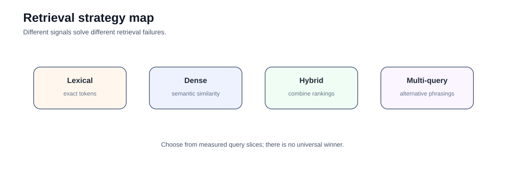
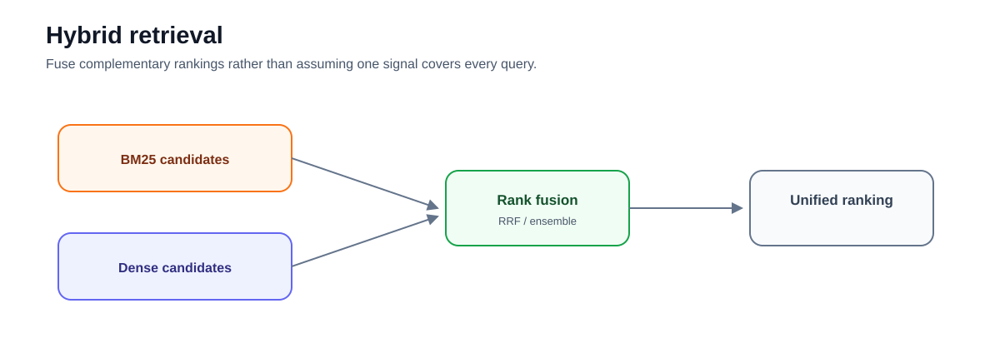
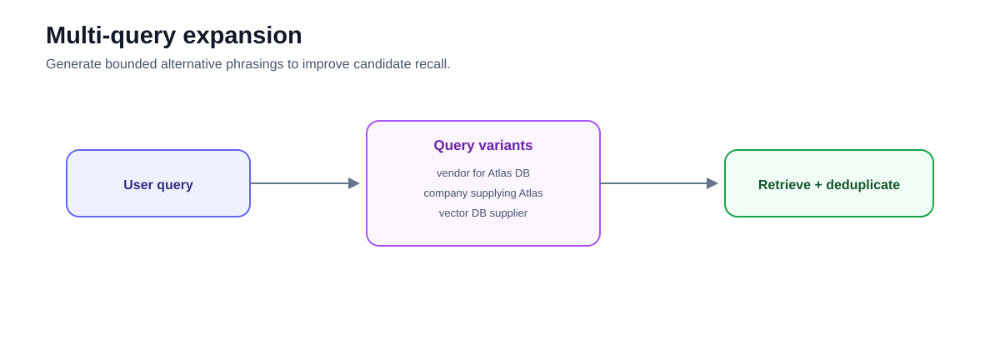

# Intermediate 01 — Retrieval Strategies: Lexical, Dense, Hybrid, and Query Expansion

**Level:** Intermediate  
**Estimated time:** 2–3 hours  
**Notebook:** [`01_retrieval_strategies.ipynb`](01_retrieval_strategies.ipynb)  
**Prerequisite:** complete the beginner path

---

## Why this lesson exists

The beginner track used dense retrieval to make the RAG pipeline concrete. Real enterprise corpora contain both **semantic questions** and **exact-match questions**. One retrieval signal rarely handles both well.

This lesson compares the mechanisms actually implemented in the notebook:

- dense semantic retrieval with local Hugging Face embeddings;
- lexical BM25 retrieval;
- hybrid fusion with LangChain's `EnsembleRetriever`;
- multi-query expansion with `MultiQueryRetriever`.



The goal is not to declare one retriever "best." It is to learn which failure each signal solves and how to evaluate combinations.

---

## Learning objectives

After this lesson you should be able to:

- explain the difference between lexical and dense retrieval;
- identify query types that favor exact lexical matching;
- identify query types that favor semantic matching;
- explain why hybrid retrieval is useful for mixed workloads;
- describe Reciprocal Rank Fusion at a high level;
- explain why raw BM25 and vector scores should not be naively added together;
- use query expansion to reduce dependence on one phrasing;
- recognize query-expansion cost and drift risk;
- inspect candidate sets before generation; and
- choose retrieval strategies from a labelled query set rather than intuition.

---

## 1. The retrieval problem is heterogeneous

Enterprise questions vary:

```text
"What power does AX-774-B require?"
```

This is dominated by an exact identifier.

Compare:

```text
"Who supplies our vector database?"
```

The source may say:

```text
DataStax is the primary supplier for the Atlas vector database ecosystem.
```

Dense semantic retrieval can bridge wording differences such as:

```text
supplies ↔ supplier
vector DB ↔ vector database
```

Lexical and dense retrieval therefore provide different signals.

---

## 2. Dense retrieval

The notebook uses:

```python
from langchain_huggingface import HuggingFaceEmbeddings
```

with:

```python
model_name="all-MiniLM-L6-v2"
```

and a Chroma vector store.

**Repository maintenance note:** current LangChain documentation uses the dedicated Chroma package:

```bash
pip install -U langchain-chroma
```

```python
from langchain_chroma import Chroma
```

The notebook should eventually replace:

```python
from langchain_community.vectorstores import Chroma
```

with the dedicated integration.

Dense retrieval is strong for paraphrases and conceptual similarity, but it can be unreliable for identifiers, version strings, error codes, and rare proper nouns.

---

## 3. BM25 retrieval

The notebook uses:

```python
from langchain_community.retrievers import BM25Retriever
```

BM25 ranks documents using lexical term statistics. It is especially useful for:

- error codes;
- SKUs;
- policy IDs;
- function names;
- exact product names;
- quoted phrases.

BM25 does not "understand meaning" in the same way a dense model does, but exact lexical evidence is often exactly what production retrieval needs.

---

## 4. Hybrid retrieval

Hybrid retrieval combines complementary candidate lists.



A common pattern is:

```text
query
 ├─→ lexical retriever
 └─→ dense retriever
       ↓
     fusion
       ↓
  combined ranking
```

The notebook uses LangChain's `EnsembleRetriever`.

LangChain v1 moved many retriever implementations into `langchain-classic`, so the notebook's `langchain_classic` imports are consistent with that migration path.

### Why rank fusion?

BM25 and dense scores live on different scales.

Avoid:

```python
0.5 * bm25_score + 0.5 * cosine_score
```

unless scores have been deliberately calibrated.

Rank-based fusion such as Reciprocal Rank Fusion avoids requiring comparable raw score scales.

Conceptually:

```text
RRF(document) = sum(1 / (k + rank))
```

Documents appearing high in multiple ranked lists receive more combined weight.

Modern search systems such as Qdrant also support server-side dense+sparse fusion, including RRF.

---

## 5. Multi-query expansion

The notebook uses `MultiQueryRetriever` with a mock LLM to generate alternative queries.

Example:

```text
Original:
Who supplies our vector DB?

Variants:
Who is the vendor for the Atlas vector database?
Which company supplies the Atlas ecosystem?
Atlas vector DB supplier information.
```



This can improve recall when one phrasing is weak.

But every variant adds retrieval work and may introduce **query drift**.

A generated variant must not:

- widen tenant or authorization scope;
- invent filters;
- change the user's intent;
- create unrestricted search paths.

Authorization remains fixed while the query wording changes.

---

## 6. What the notebook does not implement

The old README described several advanced mechanisms as though they were part of the lab. They are not.

The notebook does **not** implement:

- SPLADE;
- HNSW tuning;
- cross-encoder reranking;
- domain fine-tuning;
- hard-negative mining;
- multilingual evaluation;
- metadata authorization filters.

Those are important topics, but they should be taught as extensions rather than documented as runnable code in this lesson.

Cross-encoder reranking is intentionally handled in the next course.

---

## 7. Retrieval strategy decision guide

| Query pattern | First strategy to test |
|---|---|
| Exact identifier / error code | BM25 or lexical |
| Natural-language paraphrase | Dense |
| Mixed business + technical queries | Hybrid |
| User vocabulary differs from corpus | Dense + query expansion |
| Relevant result appears but ranks low | Reranking, not more query expansion |
| Evidence absent from candidates | Improve first-stage retrieval |
| Sensitive tenant-scoped content | Apply authorization filter before every retrieval path |

---

## 8. Evaluation

Build a labelled query set with slices such as:

```text
exact identifier
paraphrase
acronym
product name
ambiguous term
no-answer
```

Measure:

- Recall@k;
- MRR;
- unique candidates contributed by each retriever;
- latency;
- query-expansion call count;
- failure slices.

Do not evaluate hybrid retrieval only on a hand-picked query where hybrid obviously wins.

---

## 9. Exercises

1. Add two nearly identical identifiers such as `AX-774-A` and `AX-774-B`.
2. Compare dense and BM25 rankings.
3. Change hybrid weights and record rank changes.
4. Add a paraphrased query with no exact lexical overlap.
5. Generate three query variants and measure whether they add new relevant candidates.
6. Add a deliberately drifted query variant and explain why it should be rejected.
7. Replace the old Chroma import with `langchain_chroma.Chroma`.

---

## 10. Checkpoint

1. Why can BM25 outperform dense retrieval on an identifier?
2. Why can dense retrieval outperform BM25 on a paraphrase?
3. Why should raw BM25 and cosine scores not be blindly added?
4. What does RRF combine?
5. What can query expansion fix?
6. What is query drift?
7. Why must authorization remain unchanged during query rewriting?
8. When should you add a reranker instead of another retrieval variant?

---

## What comes next

### [Intermediate 02 — Metadata and Permissions](../02-metadata-permissions/README.md)

Before making retrieval more sophisticated, secure the candidate space.

### [Intermediate 03 — Query Planning and Reranking](../03-query-reranking/README.md)

Improve candidate ordering with a cross-encoder and separate first-stage recall from second-stage precision.

---

## References

- LangChain — [Retriever integrations](https://docs.langchain.com/oss/python/integrations/retrievers)
- LangChain — [Chroma integration](https://docs.langchain.com/oss/python/integrations/vectorstores/chroma)
- LangChain — [v1 migration guide](https://docs.langchain.com/oss/python/migrate/langchain-v1)
- Qdrant — [Hybrid search](https://qdrant.tech/documentation/search/text-search/hybrid-search/)
- Cormack, Clarke & Büttcher — [Reciprocal Rank Fusion](https://cormack.uwaterloo.ca/cormacksigir09-rrf.pdf)
- Karpukhin et al. — [Dense Passage Retrieval](https://arxiv.org/abs/2004.04906)

---

## Key takeaway

**First-stage retrieval is a recall problem.**

Use lexical, dense, hybrid, or query expansion because your evaluation data shows that the additional signal retrieves evidence the simpler baseline misses.


---

# Deep Dive — Modern Retrieval Strategies

The notebook is the lab; this chapter is the technical course material. Retrieval is best treated as **candidate generation under relevance, latency, cost, and authorization constraints**.

## Candidate generation vs final precision
First-stage retrieval should maximize the chance that required evidence enters a bounded candidate set. A later reranker can improve ordering, but cannot recover evidence that was never retrieved.

```text
authorized query → dense + lexical/sparse → fusion → candidates → reranker → context selection
```

## Lexical retrieval
BM25 remains important for identifiers, policy numbers, names, error codes, acronyms, and rare domain terms. It balances term frequency, inverse document frequency, and document-length normalization. Lexical retrieval is not obsolete; it captures a signal dense models often lose.

## Dense retrieval
Dense embeddings excel at paraphrase and semantic similarity. Common failures include exact identifiers, negation, rare terminology, domain mismatch, and fine-grained constraints. Vector similarity is a ranking signal, not calibrated confidence.

## Learned sparse retrieval
Learned sparse models retain lexical/token behavior while learning useful weights and expansion signals. They can complement BM25 and dense search, but should earn their additional indexing/model complexity through evaluation.

## Hybrid retrieval and fusion
Hybrid systems combine complementary candidate lists. Reciprocal Rank Fusion is robust because it combines ranks instead of incompatible raw score scales. Do not linearly mix BM25 and cosine scores without normalization and validation.

## Late interaction
ColBERT-style late interaction preserves token-level representations instead of compressing a passage into one vector. It can improve fine-grained relevance at higher storage and compute cost. A common cascade is dense+sparse retrieval followed by late-interaction reranking.

## Multi-representation retrieval
Titles, abstracts, sections, chunks, tags, and generated questions can be represented separately and fused. This is useful when one pooled document vector would erase important signals.

## Query expansion
Expansion can improve recall using synonyms, alternate phrasings, or decomposed probes, but may drift from intent and multiply cost. Preserve the original query and treat generated queries as search hypotheses—not evidence.

## Candidate budgets
`top_k` is a tunable budget. Too small harms recall; too large increases reranking cost, duplication, and context noise. Evaluate candidate diversity as well as count.

## Evaluation
Use Recall@k, Precision@k, MRR, and nDCG where relevance labels exist. Slice results by identifier lookup, semantic paraphrase, multi-evidence queries, and domain terminology. Aggregate averages can hide critical failures.

## Enterprise trade-offs
Measure relevance together with p50/p95 latency, index size, memory, update latency, embedding cost, reranking cost, and authorization filtering.

## Decision guide
```text
exact terms missed       → lexical/sparse
semantic paraphrase miss → dense
mixed population         → hybrid
poor candidate ordering  → reranker
single-vector weakness   → late interaction / multi-representation
```

### Further study
Robertson & Zaragoza on BM25; Karpukhin et al. on DPR; Khattab & Zaharia on ColBERT; BEIR; current Qdrant hybrid/multi-stage search documentation.
