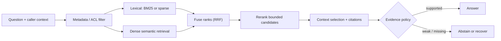

# 01 — Retrieval strategies: design, fuse, and evaluate evidence signals

**Level:** Intermediate  
**Time:** 2–3 hours  
**Prerequisites:** complete the [beginner path](../../beginner/README.md)

## Learning objectives

After this lesson you will be able to:

- explain BM25 mechanics (TF-IDF, document length normalization, and analyzers) and
  when lexical retrieval outperforms semantic retrieval;
- explain how dense embedding models represent queries and documents and why
  normalization, dimensions, and asymmetric encoding matter;
- explain sparse learned retrieval (SPLADE) and when it fills the gap between lexical
  and dense approaches;
- implement hybrid retrieval with Reciprocal Rank Fusion (RRF) and explain why rank
  fusion is safer than score blending;
- implement reranking on a bounded candidate set and explain why a reranker cannot
  recover absent evidence;
- configure ANN indexes (HNSW) and reason about the recall-latency trade-off;
- diagnose a retrieval failure at the correct stage using a retrieval trace;
- choose a retrieval strategy from a measured golden set rather than intuition; and
- integrate domain adaptation (synthetic queries, hard negatives) when simpler
  interventions are insufficient.

## Outcome

Compare lexical, dense, hybrid, metadata-filtered, and reranked retrieval; make
their candidate traces visible; and choose a production retrieval policy from a
labelled evaluation set rather than intuition.

## Guided notebook

Open [`retrieval_strategies.ipynb`](retrieval_strategies.ipynb). The reusable shared implementation is [`src/rag_core/retrieval.py`](../../../src/rag_core/retrieval.py), because several intermediate labs use the same retrieval contracts.

## Retrieval is a staged decision system

Retrieval is not "call a vector database." It is a sequence of distinct
decisions: authorize the candidate space, retrieve broad candidates using one or
more signals, fuse or rerank a bounded set, select a context budget, and decide
whether evidence is sufficient to answer. Each stage has a different failure
mode and metric.



The critical constraint is ordering: metadata, tenant, and authorization filters
must restrict the candidate space **before** sparse or dense search. Filtering
only the final answer can leak protected content in a retrieval trace, model
context, cache, or log.

## Lexical retrieval: BM25 mechanics

BM25 (Best Match 25) is the standard probabilistic retrieval model for lexical
search. Understanding its mechanics helps you know when it will and won't work.

**TF-IDF intuition:** a term is more informative if it appears often in a
document (high TF) and rarely across all documents (high IDF). "The" has low
IDF — appearing in every document — and contributes little to ranking. "E401"
has high IDF — appearing in few documents — and is highly discriminative.

**BM25 score:**

\[
BM25(D, Q) = \sum_{t \in Q} IDF(t) \cdot \frac{TF(t, D) \cdot (k_1 + 1)}{TF(t, D) + k_1 \cdot \left(1 - b + b \cdot \frac{|D|}{avgdl}\right)}
\]

- `k1` controls term-frequency saturation (typical: 1.2–2.0)
- `b` controls document-length normalization (typical: 0.75)
- `avgdl` is the average document length in the corpus

**Analyzers:** before indexing, text is passed through an analyzer chain:
tokenizer → lowercasing → stopword removal → stemming/lemmatization. The
analyzer applied at query time must match the analyzer used at index time.
A mismatch causes exact-term failures that look like retrieval failures but are
actually normalization failures.

**When BM25 excels:** exact identifiers (E401, SKU-8842, `checkout-service-v2`),
rare technical terms, quoted phrases, named entities. These exact tokens provide
high IDF signal that dense retrieval may dilute.

**When BM25 struggles:** synonyms ("reboot" vs "restart"), paraphrases, implicit
concepts, multi-lingual queries, and queries where the document vocabulary
differs from the query vocabulary.

## Dense retrieval: embeddings, similarity, and asymmetric encoding

Dense retrieval maps queries and documents into a shared vector space using a
neural encoder. Similarity in vector space approximates semantic relevance.

**Cosine similarity vs dot product:**

- **Cosine similarity**: angle between two vectors; invariant to magnitude. Most
  common for retrieval. Values range from -1 to 1.
- **Dot product**: cosine × product of magnitudes. Equivalent to cosine when
  vectors are L2-normalized. Some models are trained to use dot product directly.

Always check what similarity metric your embedding model was trained with and
use the same metric at retrieval time.

**Normalization:** L2-normalize embedding vectors so that dot product = cosine
similarity. This ensures fair comparison across different text lengths and is
required for correct HNSW-based retrieval with many vector stores.

**Embedding dimensions:** more dimensions can capture richer semantic structure
but increase storage and compute cost.

| Dimension | Example models | Use case |
|---|---|---|
| 384 | all-MiniLM-L6-v2 | Fast, small-footprint applications |
| 768 | all-mpnet-base-v2, E5-base | Balanced quality and cost |
| 1024 | E5-large, BGE-large | Higher quality, higher cost |
| 1536 | text-embedding-3-small (OpenAI) | API-based with high capacity |
| 3072 | text-embedding-3-large (OpenAI) | High-precision retrieval |

**Query/document asymmetry:** short queries and long passages are semantically
different. Models trained on symmetric sentence pairs (two similar sentences)
perform poorly on asymmetric retrieval. Use retrieval-specialized models:

- **E5 family** (Wang et al.): use `"query: ..."` prefix for queries and
  `"passage: ..."` prefix for documents.
- **BGE (BAAI)**: dedicated query and passage encoders.
- **GTE, mGTE**: multilingual retrieval-trained models.

Using the wrong encoder mode for a query is a silent failure: retrieval will
work but recall will be lower than expected.

**Domain shift:** a model trained on Wikipedia-style passages may perform poorly
on enterprise documentation, medical records, legal text, or code. Before
deploying an off-the-shelf embedding model:

1. Evaluate on a domain-specific golden set (see Evaluation section below).
2. Consider a domain-adapted model if recall is unacceptable.
3. Evaluate re-embedding cost and index migration before committing.

**MTEB benchmark:** the [Massive Text Embedding Benchmark](https://huggingface.co/spaces/mteb/leaderboard)
provides standardized evaluation across retrieval tasks. It is a useful comparison
tool but does not replace domain-specific evaluation.

## Sparse learned retrieval: SPLADE and beyond

Between exact BM25 and dense embeddings sits **sparse learned retrieval**.
Models like SPLADE (Formal et al., 2021) learn to expand query and document
representations into sparse high-dimensional vectors using vocabulary-space
activations.

**What SPLADE provides:**
- Token-level precision like BM25 (sparse, interpretable activations)
- Vocabulary expansion: "reboot" might activate "restart", "reset", "restart_service"
- Explicit term weighting through learned importance

**When SPLADE is useful:**
- Domain-specific terminology where dense models struggle
- Hybrid pipelines where you want a stronger sparse signal than BM25
- When exact term matching matters but synonym coverage is also needed

**Production status:** PRACTICAL/ESTABLISHED. Requires a trained SPLADE model
(SPLADE-v2, SPLADE++, etc.). Inference is slower than BM25 but faster than
cross-encoder reranking. Indexes are larger than BM25 indexes.

## Hybrid retrieval and Reciprocal Rank Fusion

Hybrid retrieval combines signals from multiple retrievers. The challenge:
different retrievers produce scores on incompatible scales (BM25 scores vs
cosine similarities vs SPLADE activations). Naive linear blending (`0.7 × dense + 0.3 × BM25`)
rarely works well because it requires calibrated, comparable scales.

**Reciprocal Rank Fusion (RRF):**

\[
RRF(d) = \sum_{r \in rankings(d)} \frac{w_r}{k + rank_r(d)}
\]

RRF uses only **positions** (ranks), not raw scores. A document that ranks 1st
in BM25 and 3rd in dense retrieval will score higher than one that ranks 20th in
both. The `k` parameter (typically 60) prevents early ranks from dominating. RRF
is robust and requires no calibration between systems.

**Score fusion vs rank fusion:**

| Approach | Requirement | Risk |
|---|---|---|
| Score fusion (linear blend) | Calibrated, comparable scores | Wrong weights → poor results |
| Rank fusion (RRF) | Only rankings needed | Slightly less nuanced than tuned score fusion |

**Hybrid retrieval in practice:** use RRF as the default. Tune weights on a
labeled golden set if you have sufficient data. Apply metadata filters before
any retrieval signal.

```python
from examples.intermediate.retrieval_strategies import weighted_reciprocal_rank_fusion

fused = weighted_reciprocal_rank_fusion([(lexical_docs, 1.0), (dense_docs, 1.0)], top_k=5)
```

## ANN indexing: HNSW mechanics and recall-latency trade-off

For corpora with more than ~100K chunks, exact nearest-neighbor search is too
slow. **Approximate Nearest Neighbor (ANN)** indexes trade a small amount of
recall for orders-of-magnitude speed improvement.

**HNSW (Hierarchical Navigable Small World):**

HNSW builds a multi-layer graph where each node connects to nearby nodes.
Search starts at the top (coarsest) layer and descends, each layer zooming in
on a smaller neighborhood. This gives logarithmic search complexity.

Key HNSW parameters:
- `m`: number of connections per node. Higher → better recall, more memory.
- `ef_construction`: size of dynamic candidate list during index build.
  Higher → better index quality, slower build.
- `ef_search` / `hnsw_ef`: size of candidate list during search.
  Higher → better recall, slower query.

**Recall-latency trade-off:**

```
ef_search=16  → fast (~1ms), recall@10 ≈ 94%
ef_search=64  → medium (~3ms), recall@10 ≈ 98%
ef_search=256 → slow (~12ms), recall@10 ≈ 99.5%
```

For most production RAG systems, recall@10 of 97–99% is sufficient. The
0.5–3% recall loss is usually acceptable; the latency difference matters greatly.

**Index choice:** Qdrant, pgvector, Elasticsearch, and others all use HNSW
or similar structures internally. The choice is usually driven by
operational requirements (Kubernetes deployment, existing stack, filtering
capabilities), not purely by ANN algorithm quality.

## Reranking: improving precision on a bounded candidate set

After first-stage retrieval, a reranker examines a smaller set of candidates
(typically 20–100) more carefully and reorders them.

**Bi-encoder vs cross-encoder:**

| Architecture | How it works | Speed | Quality |
|---|---|---|---|
| Bi-encoder | Query and document encoded separately; similarity computed | Fast (precomputed doc vectors) | Good for recall |
| Cross-encoder | Query and document encoded together with full attention | Slow (no precomputation) | Better for precision |
| Late interaction (ColBERT) | Per-token interactions at retrieval time | Between bi and cross | Strong for both |

Cross-encoders are too slow for full-corpus retrieval but excellent for reranking
20–100 first-stage candidates. The canonical pattern is:

```
bi-encoder → top-100 candidates → cross-encoder → top-5 final
```

**A reranker cannot recover evidence that was not retrieved.** If the correct chunk
is not in the top-100 from the first stage, no reranker can bring it back. Maximize
first-stage recall before adding reranking.

**LLM reranking:** use an LLM to score query-document pairs. Expensive but can
use richer relevance signals. Useful when standard cross-encoders lack domain
coverage.

**Listwise reranking:** pass the full candidate list to a model and ask it to
produce a ranked ordering. Can reason about relative relevance but is expensive
and harder to calibrate.

## What each signal is good at

| Signal | Usually strong for | Typical weakness | What to measure |
|---|---|---|---|
| Lexical / BM25 | error codes, names, exact clauses, rare identifiers | synonyms, paraphrases, misspellings | Recall@k for exact/identifier queries |
| Dense embeddings | paraphrases and semantic similarity | exact identifiers, domain shift, opaque scores | Recall/precision for paraphrase queries |
| Sparse learned (SPLADE) | token-level expansion and exact-ish matching | model/index complexity | domain-specific retrieval quality |
| Hybrid fusion | mixed question distribution | more candidate paths and tuning | whether it improves the full golden set |
| Reranker | resolving top-k near misses | cost/latency; cannot retrieve absent evidence | MRR/nDCG and downstream support |
| Metadata filters | tenant, source, time, type, access boundaries | overly broad/incorrect metadata can hide evidence | filter correctness and zero leakage |

## Domain adaptation

When off-the-shelf embedding models underperform on your domain:

1. **Evaluate first.** Measure Recall@10 and MRR on a golden set. If results
   are acceptable (typically Recall@10 > 0.9), stop here.
2. **Try simpler fixes.** Improve chunking, metadata, and query normalization.
   These often have more impact than fine-tuning.
3. **Generate synthetic training data.** Use an LLM to generate query-passage
   pairs from your corpus. Filter by quality. This provides domain-specific
   training signal without manual annotation.
4. **Mine hard negatives.** For each positive query-passage pair, find
   negatives that are close in embedding space but not relevant. Hard
   negatives improve model discrimination on difficult cases.
5. **Fine-tune the embedding model.** Use the synthetic data with a retrieval
   loss (e.g., contrastive loss, InfoNCE). Evaluate on a held-out set before
   promoting.
6. **Version the embedding model and re-index.** A new embedding model means
   a new index. Plan the migration before fine-tuning.

**Key principle:** do not fine-tune retrieval models until simpler interventions
have been evaluated and found insufficient.

## Multilingual retrieval

For corpora in multiple languages:

**Multilingual embedding models:**
- mE5, LaBSE, multilingual-e5: trained on multilingual parallel corpora
- mGTE: strong multilingual retrieval performance
- OpenAI text-embedding-3: multilingual by design

**Translation-first retrieval:** translate the query to the document language
before retrieval. Simple but adds latency and translation errors.

**Cross-lingual retrieval:** encode queries in one language and retrieve
documents in another. Requires a multilingual model trained for cross-lingual
tasks.

**Evaluation:** slice your evaluation set by language. A model that achieves
Recall@10 = 0.95 on English but 0.60 on Spanish is not multilingual — it is
English-only with degraded multilingual support.

**Citation language:** preserve original-language citations wherever possible.
Translating a citation can introduce errors and loses the exact source reference.

## Step-by-step implementation lab

### 1. Start with a labelled corpus and an authorization filter

```python
from examples.intermediate.retrieval_strategies import AttributedDocument, filter_documents

docs = [
    AttributedDocument("acme-runbook", "E401 requires token verification.", {"tenant": "acme", "kind": "runbook"}),
    AttributedDocument("globex-runbook", "E401 requires token verification.", {"tenant": "globex", "kind": "runbook"}),
]
visible = filter_documents(docs, {"tenant": "acme"})
assert [doc.doc_id for doc in visible] == ["acme-runbook"]
```

### 2. Establish a lexical baseline

```python
from examples.intermediate.retrieval_strategies import BM25

hits = BM25(visible).search("E401 token verification", top_k=3)
print([(doc.doc_id, round(score, 3)) for doc, score in hits])
```

### 3. Keep the dense boundary explicit

```python
from examples.intermediate.retrieval_strategies import static_dense_ranking

dense = static_dense_ranking(visible, {"acme-runbook": 0.84})
print([doc.doc_id for doc in dense])
```

### 4. Fuse ranks, not incompatible score scales

```python
fused = weighted_reciprocal_rank_fusion([(lexical_docs, 1.0), (dense_docs, 1.0)], top_k=5)
```

### 5. Rerank only a bounded candidate set

`rerank_by_query_coverage` is a transparent deterministic stand-in. Its purpose
is to teach the contract, not emulate a neural reranker.

### 6. Trace and evaluate the full route

```python
results, trace = hybrid_retrieve(
    "E401 unauthorized request",
    docs,
    {"acme-runbook": 0.84},
    filters={"tenant": "acme"},
)
print(trace)
```

## Evaluation plan

Build a golden set that represents the distribution you actually serve:

| Query family | Example | Primary check |
|---|---|---|
| Exact identifier | "What does E401 mean?" | lexical Recall@k |
| Paraphrase | "Why is my request rejected?" | dense/hybrid Recall@k |
| Compound | "What happened and what should support tell enterprise users?" | evidence coverage across multiple sources |
| Freshness | "What is the current rollback policy?" | version/time filter correctness |
| Restricted | "Show Globex incident details" from Acme | zero cross-tenant candidates |
| No answer | "Which planets have rings?" | abstention accuracy |
| Multilingual | Query in Spanish for English corpus | recall by language slice |

Use `ranking_metrics` for transparent Recall@k and MRR. In production, also track
precision/nDCG, candidate count, rerank cost, latency percentiles, context tokens,
citation validity, faithfulness, and cost per successful task. Compare the complete
pipeline with its lexical baseline; hybrid is only justified if it improves the
outcome at an acceptable operational cost.

## Failure map and recovery choices

| Symptom | Likely cause | First safe action |
|---|---|---|
| Exact error code is missed | normalization/indexing/lexical defect | inspect tokens and source before adding dense retrieval |
| Paraphrase misses a policy | semantic candidate recall | test dense/hybrid against paraphrase cases |
| Correct document never appears | source, filter, or first-stage recall | reranking cannot fix it; inspect trace |
| Fused ranking is noisy | candidate limits or poor query signal | tune/evaluate retrievers; do not blindly change weights |
| Restricted document appears | filter placement or metadata defect | block release, audit caches/logs, test isolation |
| Reranking dominates latency | too many candidates/model too costly | lower bounded candidate count and compare quality loss |
| Good retrieval, weak answer | context/generation/citation boundary | move to citation/faithfulness evaluation |
| Poor multilingual recall | wrong model choice or language slice | evaluate by language; try multilingual model |

## Technology review

| Technology | Use when | Notes |
|---|---|---|
| BM25/search engine | identifiers and predictable term matching matter | keep as a baseline even in hybrid systems |
| Sentence Transformers | you need local/open semantic embeddings or rerankers | choose query/document encoders for asymmetric retrieval |
| E5, BGE, GTE | retrieval-optimized dense embeddings | use query/passage prefixes; evaluate on domain |
| SPLADE | stronger sparse signal with vocabulary expansion | requires SPLADE model; larger index |
| Qdrant | you need vector + payload filters and hybrid query execution | apply ACL/tenant filters as payload constraints |
| Cross-encoder reranker | top-k precision matters and latency permits it | bound candidate set; measure end-to-end impact |
| ColBERT/late interaction | you need stronger interaction with scalable retrieval | add only after baseline/evaluation justify it |
| mE5, LaBSE, mGTE | multilingual retrieval | evaluate per-language slice |

## Production readiness checklist

- [ ] Source/tenant/ACL/freshness filters run before every retrieval signal.
- [ ] Candidate, fusion, rerank, and final-context IDs are traceable.
- [ ] Dense, sparse, hybrid, and rerank baselines share the same labelled set.
- [ ] Candidate limits, timeouts, context budgets, and fallback/abstention policy
      are explicit.
- [ ] A reranker is evaluated for quality *and* latency/cost.
- [ ] Index, embedding model, chunking, and fusion configuration are versioned.
- [ ] Regression tests include paraphrase, identifier, stale, no-answer, and
      cross-tenant cases.
- [ ] Multilingual slice metrics are tracked if corpus contains multiple languages.
- [ ] Domain adaptation is evaluated before embedding fine-tuning is attempted.

## Checkpoint

1. Why should a vector similarity score not be linearly blended with BM25 by
   default?
2. Which stage must enforce tenant and ACL metadata, and what can leak if it is
   delayed?
3. Why cannot a reranker repair a candidate-recall failure?
4. Which query families would justify hybrid retrieval over lexical BM25 alone?
5. What trace fields would you inspect when a cited answer is unsupported?
6. An embedding model that works well on general text performs poorly on medical
   reports. Before fine-tuning, what two simpler interventions should you try?
7. Why does query/document asymmetry matter, and how do retrieval-trained models
   address it?

## References

- Cormack, Clarke, and Büttcher, [Reciprocal Rank Fusion](https://cormack.uwaterloo.ca/cormacksigir09-rrf.pdf)
- Formal et al., [SPLADE: Sparse Lexical and Expansion Model for First Stage Retrieval](https://arxiv.org/abs/2107.05720)
- Wang et al., [Text Embeddings by Weakly-Supervised Contrastive Pre-training (E5)](https://arxiv.org/abs/2212.03533)
- Muennighoff et al., [MTEB: Massive Text Embedding Benchmark](https://arxiv.org/abs/2210.07316)
- Sentence Transformers, [Semantic Search](https://www.sbert.net/examples/sentence_transformer/applications/semantic-search/README.html)
- Sentence Transformers, [Asymmetric Semantic Search](https://www.sbert.net/examples/sentence_transformer/applications/semantic-search/README.html#asymmetric-semantic-search)
- Qdrant, [Hybrid and multi-stage queries](https://qdrant.tech/documentation/search/hybrid-queries/)
- Qdrant, [Hybrid search with reranking](https://qdrant.tech/documentation/advanced-tutorials/reranking-hybrid-search/)
- Nogueira and Cho, [Passage Re-ranking with BERT](https://arxiv.org/abs/1901.04085)
- Santhanam et al., [ColBERTv2](https://arxiv.org/abs/2112.01488)
- Thakur et al., [BEIR](https://arxiv.org/abs/2104.08663)


---

# Retrieval patterns and when to use them

Choose a retrieval pattern based on the shape of the question and corpus—not on novelty. Start with a simple baseline, measure it, then introduce complexity only where it fixes observed failures.

## Dense retrieval

Embed queries and chunks in the same vector space, then retrieve nearest chunks. It handles paraphrase and conceptual similarity well.

Use it when users express the same idea in many ways. Validate on rare terms and exact-match questions, which can be weak spots. [Sentence Transformers' semantic-search guide](https://www.sbert.net/examples/sentence_transformer/applications/semantic-search/README.html) explains the bi-encoder trade-off; [DPR](https://arxiv.org/abs/2004.04906) is a foundational reference.

## Lexical retrieval

Search for terms using algorithms such as BM25. It is fast, inspectable, and strong at product names, error strings, legal citations, code identifiers, and dates.

Use it as a baseline even when planning to use embeddings. The [Stanford IR book](https://nlp.stanford.edu/IR-book/) explains BM25 and ranking fundamentals.

## Hybrid retrieval

Combine dense and lexical candidates, then merge or rank them. This often improves robustness because semantic and term-based search fail differently.

Use it for documentation, enterprise content, support, and code—corpora that mix prose with identifiers. [OpenSearch hybrid search documentation](https://opensearch.org/docs/latest/search-plugins/hybrid-search/) offers an implementation-oriented reference.

## Reranking

Retrieve a broad candidate set cheaply, then score the question–chunk pairs with a stronger model. Cross-encoders usually offer high precision but are too expensive to run over every corpus item.

Use it when top-k candidates are plausible but poorly ordered. [Sentence Transformers' retrieve-and-rerank guide](https://www.sbert.net/examples/sentence_transformer/applications/retrieve_rerank/README.html) explains this two-stage architecture.

## Query rewriting and multi-query retrieval

Generate a clearer search query, several paraphrases, or decomposed subquestions before retrieval. This helps with conversational follow-ups, ambiguous wording, and multi-hop questions.

Use only when evaluation shows the original query is the failure point; generated queries can add latency and drift. The [RAG from scratch examples](https://github.com/langchain-ai/rag-from-scratch) include query transformation patterns.

## Metadata-filtered retrieval

Restrict candidate documents by fields such as tenant, team, region, document type, date, language, or classification. Permission filtering belongs here and must happen before evidence reaches the model.

Use this for any multi-user or regulated application. Treat access control as a security boundary, not as prompt text.

## Parent–child retrieval

Index small child chunks for precise matching, but return a larger parent section for generation. This balances precise retrieval with enough context to interpret the match.

Use it when chunks either retrieve well but lack context, or have enough context but retrieve too broadly. [LlamaIndex's node parsers](https://docs.llamaindex.ai/en/stable/module_guides/loading/node_parsers/) are useful implementation references for structured chunking.

## Graph retrieval

Use entities and relationships to retrieve connected evidence, sometimes alongside vector or lexical retrieval. Graph approaches can help when questions require connecting facts across the corpus or summarizing themes rather than finding one passage.

Use only after validating that relationship-aware/global questions are important. Start with [Microsoft GraphRAG](https://github.com/microsoft/graphrag) and its [paper](https://arxiv.org/abs/2404.16130).
