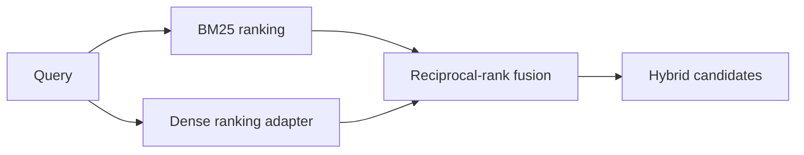

# 01 — Retrieval strategies

**Level:** Intermediate  \
**Time:** 45 minutes  \
**Prerequisites:** complete the [beginner path](../../beginner/README.md)

## Outcome

Compare exact-term retrieval with semantic retrieval, understand why BM25 remains useful for identifiers and exact phrases, and combine independent rankings with reciprocal-rank fusion.

## Guided notebook

Open [`retrieval_strategies.ipynb`](retrieval_strategies.ipynb). The reusable implementation is [`examples/intermediate/retrieval_strategies.py`](../../../examples/intermediate/retrieval_strategies.py).

## Concepts

- **Lexical retrieval:** rewards matching terms and is strong for names, error codes, and exact identifiers.
- **Dense retrieval:** compares embedding vectors and can match paraphrases; use a model such as Sentence Transformers in the next infrastructure lab.
- **Hybrid retrieval:** combines signals rather than assuming one retriever wins every query.
- **Reciprocal-rank fusion:** gives each result a score based on its position in each ranking, reducing sensitivity to incompatible raw scores.

## Exercise

Add a paraphrase query and a query containing an exact error code. Explain which ranking is stronger for each and what evaluation set you would need before choosing weights or `top_k`.
