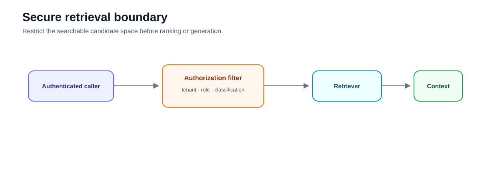
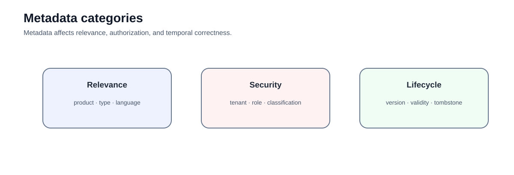

# Intermediate 02 — Metadata and Permissions: Secure the Retrieval Boundary

**Level:** Intermediate  
**Estimated time:** 2–3 hours  
**Notebook:** [`02_metadata_permissions.ipynb`](02_metadata_permissions.ipynb)  
**Prerequisite:** [Retrieval Strategies](../01-retrieval-strategies/README.md)

---

## Why this lesson exists

Retrieval quality is irrelevant if the retriever is allowed to search data the caller must not see.

The notebook demonstrates the core principle correctly:

> **authorization belongs in the search constraint, before retrieved text reaches the model.**

It builds a multi-tenant Chroma collection and compares naive search with tenant/classification metadata filters.



---

## Learning objectives

After this lesson you should be able to:

- distinguish relevance metadata from security metadata;
- enforce tenant isolation before generation;
- build metadata filters from authenticated identity claims;
- explain why prompt instructions are not access controls;
- identify leakage paths beyond the final answer;
- reason about RBAC and attribute-based filters;
- preserve authorization metadata through chunking;
- design negative tests for cross-tenant retrieval;
- understand freshness/version metadata as a retrieval constraint; and
- design tenant-safe cache keys.

---

## 1. Metadata categories

### Relevance metadata

Examples:

```text
product
document_type
language
date
region
```

These help retrieval narrow the search space.

### Security metadata

Examples:

```text
tenant
classification
required_role
project_id
```

These determine whether content may become a candidate.

### Lifecycle metadata

Examples:

```text
version
valid_from
valid_to
is_deleted
superseded_by
```

These determine whether evidence is current and eligible.



---

## 2. What the notebook implements

The notebook creates documents such as:

```python
metadata={
    "source": "globex_plan.md",
    "tenant": "globex",
    "level": "restricted",
}
```

It first runs an unsafe search:

```python
vectorstore.similarity_search(question, k=3)
```

Then applies:

```python
filter=security_filter
```

derived from the active user's tenant and allowed classification levels.

This is the correct teaching sequence because it makes the leak visible before showing the control.

---

## 3. Current LangChain maintenance note

The notebook still imports:

```python
from langchain_community.vectorstores import Chroma
```

Current LangChain documentation uses:

```python
from langchain_chroma import Chroma
```

with the `langchain-chroma` package.

The notebook should be refreshed to use the dedicated integration when you update executable code.

---

## 4. Authorization must precede retrieval

Safe order:

```text
authenticated identity
        ↓
authorization policy
        ↓
server-side search filter
        ↓
eligible candidate space
        ↓
retrieval
        ↓
context
```

Unsafe order:

```text
retrieve everything
        ↓
send to model
        ↓
ask model to hide restricted content
```

Once restricted content enters a prompt, trace, cache, or intermediate model call, the boundary has already failed.

---

## 5. Leakage paths

Unauthorized content can leak through:

- retrieved text;
- generated paraphrases;
- citation IDs;
- retrieval traces;
- logs;
- caches;
- debugging UIs;
- evaluation exports;
- timing and result-count behavior.

A good security test checks the entire evidence path, not only the final response string.

---

## 6. Build filters from trusted claims

The notebook uses a Python dictionary representing a user.

In production, filter values must come from verified identity and policy systems.

Do not trust:

```text
user query: "search tenant globex"
```

as authorization evidence.

The user can request a scope; the application decides whether that scope is allowed.

---

## 7. RBAC, ABAC, and relationship-aware access

| Model | Good for |
|---|---|
| RBAC | stable roles such as support/admin |
| ABAC | tenant, classification, region, purpose, time |
| ReBAC | ownership, project membership, sharing relationships |

Enterprise RAG often uses multiple dimensions:

```text
tenant == caller.tenant
AND classification <= caller.clearance
AND project_id IN caller.projects
AND valid_now == true
```

---

## 8. Freshness is also a filter

A user may be authorized to read a document that is no longer valid.

Useful fields include:

```text
valid_from
valid_to
superseded_by
is_deleted
version
```

A current-policy query should not retrieve superseded content unless the application explicitly asks for historical evidence.

---

## 9. Cache isolation

Dangerous:

```python
cache_key = hash(query)
```

Safer:

```python
cache_key = hash(
    query,
    tenant_id,
    roles,
    policy_version,
    index_version,
)
```

If authorization-relevant dimensions are absent from a cache key, retrieval can be correct while the cache still leaks another tenant's result.

---

## 10. Negative-path tests

Test:

```text
Acme query → Acme evidence only
Acme exact query for Globex text → no Globex evidence
Non-admin → no restricted evidence
Admin at NovaTech → NovaTech restricted allowed, Acme still denied
Expired evidence → excluded
Same query across tenants → isolated cache entries
```

The strongest test is not "the expected document appears."

It is:

> **the forbidden document cannot appear anywhere in the retrieval path.**

---

## 11. Important correction to the old README

The old README described `lab.py`, custom authorization classes, cache implementations, and extensive temporal logic as runnable artifacts. They do not exist in this course folder.

The updated lesson keeps those concepts as production design guidance while making it clear that the notebook's executable scope is:

- Chroma metadata filtering;
- tenant isolation;
- classification filtering;
- role-dependent allowed levels.

---

## 12. Exercises

1. Add another Acme restricted document and verify a non-admin never retrieves it.
2. Use the same text in Acme and Globex documents; verify the filter still isolates tenants.
3. Add `valid_to` metadata and design a current-only filter.
4. Change the user tenant in Python and verify the filter changes without changing the query.
5. Update the notebook to `langchain_chroma.Chroma`.
6. Design a cache key that cannot cross tenant or role boundaries.

---

## 13. Checkpoint

1. Why is post-generation filtering too late?
2. What metadata is security-critical?
3. Why must security metadata come from trusted ingestion/identity systems?
4. What is the difference between RBAC and ABAC?
5. Why does freshness belong in retrieval policy?
6. How can a cache violate authorization even when retrieval is correct?
7. What negative test proves tenant isolation?

---

## What comes next

### [Intermediate 03 — Query Planning and Reranking](../03-query-reranking/README.md)

Once the candidate space is authorized, improve ranking within that safe candidate space.

---

## References

- LangChain — [Chroma integration](https://docs.langchain.com/oss/python/integrations/vectorstores/chroma)
- Qdrant — [Filtering](https://qdrant.tech/documentation/concepts/filtering/)
- Open Policy Agent — [Policy language and authorization](https://www.openpolicyagent.org/docs/latest/)
- OWASP — [Top 10 for LLM Applications](https://owasp.org/www-project-top-10-for-large-language-model-applications/)
- NIST — [AI RMF Generative AI Profile](https://nvlpubs.nist.gov/nistpubs/ai/NIST.AI.600-1.pdf)

---

## Key takeaway

**Authorization is a deterministic retrieval constraint, not a prompt instruction.**


---

# Deep Dive — Metadata, Filtering, and Permissions

The central enterprise rule is: **authorization defines the candidate space before relevance ranking begins.**

## Metadata as retrieval contract
Tenant, source, classification, effective dates, region, language, owner, document type, and version are not merely prompt context. They determine evidence eligibility.

## Filter before rank
Prefer:
```text
authenticated identity → policy → trusted scope → filtered retrieval → ranking
```
over retrieving broadly and removing unauthorized candidates later. Unauthorized data should not enter model-visible intermediate stages.

## Tenant isolation
Tenant scope must be derived from authenticated application state, never from model-generated arguments. High-risk systems may combine physical/collection isolation with metadata filters.

## RBAC, ABAC, and relationships
RBAC maps roles to permissions; ABAC evaluates subject/resource/action/environment attributes; relationship-aware systems model ownership and membership. Enterprise retrieval often combines them. The LLM may interpret intent but must not grant access.

## Classification
Define classification semantics and precedence. Missing classification must not default to public. Chunks, summaries, embeddings, and cached contexts inherit source security obligations.

## Temporal validity
Track effective-from/to, superseded state, source version, ingestion time, and index time. “Newest” and “currently effective” are different concepts.

## Metadata schema design
Use stable IDs, controlled vocabularies, explicit null semantics, normalized values, and versioned schemas for security-critical fields.

## Filter selectivity
Restrictive filters can change ANN behavior and latency. Benchmark realistic tenant/classification filters, not only unfiltered search.

## Authorization-aware caching
Cache keys may need query, tenant, authorization scope, policy version, index version, and temporal state. Never reuse retrieved context across principals simply because their natural-language query matches.

## Adversarial tests
Include same-name documents in different tenants, revoked access, stale permission caches, missing metadata, downgraded clearance, cross-tenant prompt attempts, and superseded policies. Cross-tenant leakage is a hard release failure.

## Auditability
Record principal, policy version, authorized scope, filters, evidence IDs, and source versions. Avoid unnecessary sensitive text and hidden reasoning.

## Reference architecture
```text
authenticate → resolve attributes → policy engine → trusted filter → authorized retrieval → ranking → generation/citations
```

The notebook implements only a subset of this architecture. Policy engines, sophisticated caches, and temporal governance should remain clearly labelled production extensions unless implemented.

### Further study
NIST ABAC guidance; OWASP access-control guidance; Qdrant filtering/multitenancy; PostgreSQL Row Security; NIST AI RMF.
