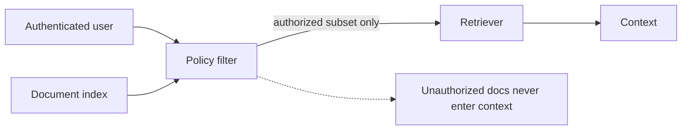
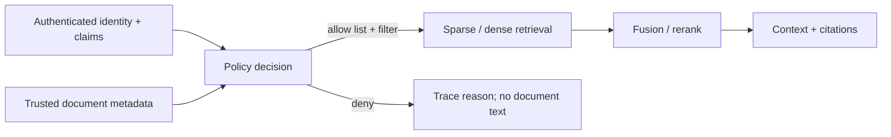

# 02 — Metadata filters and permissions: secure the retrieval boundary

**Level:** Intermediate  
**Time:** 2–3 hours  
**Prerequisites:** [retrieval strategies](../01-retrieval-strategies/README.md)

## Learning objectives

After this lesson you will be able to:

- distinguish relevance metadata, security metadata, and lifecycle metadata and
  explain what fails when any category is absent or incorrect;
- implement pre-retrieval authorization that restricts the candidate space before
  any ranking signal runs;
- explain why filtering after retrieval is too late and name the exposure paths;
- design lifecycle metadata (valid-from, valid-to, superseded, tombstones) for
  temporal and freshness RAG;
- explain how ANN/vector engines implement filtered search and the trade-offs of
  pre-filter vs post-filter modes;
- identify cache key tenant safety risks and log/trace leakage paths;
- choose between RBAC, ABAC, and ReBAC for a given authorization scenario; and
- write negative-path tests that prove cross-tenant evidence is impossible to retrieve.

## Outcome

Design metadata and authorization policies that restrict every retrieval signal
before ranking, preserve allow/deny traces, reject stale sources, and prove that
cross-tenant evidence never becomes candidate context.

## Guided notebook

Open [`metadata_permissions.ipynb`](metadata_permissions.ipynb). The implementation is [`lab.py`](lab.py).



Filtering after retrieval is too late: an unauthorized chunk may already influence ranking, prompt construction, logs, caches, or an intermediate model call. Enforce access at the document query boundary and test the boundary directly.

## Why this is a security boundary

RAG inherits the access-control obligations of every source system. A vector
index must not reveal private facts through retrieval, model context, caches,
logs, score distributions, or citations. Authorization is a deterministic
application policy evaluated from authenticated identity and trusted metadata;
it is never a request made in a model prompt.



**Authorization is not a prompt instruction.** A prompt that says "only return
results for tenant Acme" is not an authorization control — it is a suggestion to
a probabilistic model. A database filter is a hard constraint enforced at the
storage layer.

## The three categories of metadata

Every chunk in your index should carry metadata in three categories:

### 1. Relevance metadata

Used by retrieval to improve precision and recall:

| Field | Example | Purpose |
|---|---|---|
| `document_type` | runbook, policy, reference, FAQ | Filter to content type relevant to query |
| `product` | checkout, payments, catalog | Narrow to the product area |
| `jurisdiction` | EU, US, CA | Legal/regulatory scoping |
| `date` / `year` | 2024-Q1 | Temporal relevance |
| `language` | en, es, fr | Route to correct language index |
| `source_quality` | official, community, draft | Weight or filter by authority |

### 2. Security metadata

Used by authorization to restrict the candidate space:

| Field | Example | Failure if absent |
|---|---|---|
| `tenant_id` | acme, globex | Cross-tenant document disclosure |
| `required_roles` | support, engineer, admin | Lower-privilege user sees restricted content |
| `classification` | public, internal, confidential, restricted | Sensitive text reaches context or log |
| `access_policy_id` | policy-v3-healthcare | Cannot evaluate correct policy version |
| `data_residency` | EU, US | Regulatory violation if data crosses regions |

### 3. Lifecycle metadata

Used to enforce freshness, versioning, and deletion:

| Field | Example | Failure if absent |
|---|---|---|
| `valid_from` | 2024-01-15 | Cannot determine when document became authoritative |
| `valid_to` | 2024-12-31 | Cannot expire outdated content automatically |
| `superseded_by` | policy-v4 | Old version served alongside new version |
| `is_deleted` | true/false (tombstone) | Deleted content remains retrievable |
| `version` | 3 | Cannot determine which version was cited |
| `index_freshness_lag` | seconds since last sync | Cannot evaluate staleness at query time |
| `source_checksum` | sha256:... | Cannot verify content integrity |

## Temporal and freshness RAG

Metadata is not only about access control — it is also about time correctness.

**The freshness problem:** a document that was true 6 months ago may be harmful
today. A runbook that was superseded by a new procedure should not be retrievable
in current-context queries.

**Temporal metadata design:**

```
valid_from: 2024-01-15    ← when this document became authoritative
valid_to: 2024-06-30      ← when this document expires
superseded_by: policy-v4  ← which document replaced it
is_deleted: false         ← tombstone flag (set to true when revoked)
version: 3                ← monotonically increasing version number
```

**At query time**, apply a freshness filter:

```python
# Current-context query: only documents valid now
filter = {
    "valid_from": {"lte": today},
    "valid_to": {"gte": today},
    "is_deleted": {"eq": False},
}

# Historical query: documents valid at a specific past date
filter = {
    "valid_from": {"lte": query_date},
    "valid_to": {"gte": query_date},
}
```

**Tombstones:** when a document is revoked, do not simply delete it from the index.
Mark it with `is_deleted: true` and preserve the record for audit. A hard delete
makes it impossible to investigate what was retrievable at a given point in time.

**Index freshness lag:** even with correct metadata, there is a lag between when
a source system updates and when the change propagates to the index. Monitor
and expose this lag. Do not claim "current" without knowing the last sync time.

## Pre-filter vs post-filter in ANN vector search

Vector database engines have two modes for combining filters with ANN search:

### Pre-filter (filter then search)

1. Apply the filter to build a restricted candidate set
2. Run ANN search only within that set

**Advantage:** guarantees zero unauthorized documents in results.  
**Disadvantage:** if the filtered set is very small, ANN recall degrades (the
graph structure is optimized for the full index, not a small subset).

**Qdrant behavior:** Qdrant automatically detects small filtered sets and switches
to exact search to maintain recall. This is usually what you want. Configure payload
indexes on frequently filtered fields (tenant_id, classification) for performance.

### Post-filter (search then filter)

1. Run ANN search against the full index
2. Apply filter to remove unauthorized results

**Advantage:** better ANN recall (graph structure is intact).  
**Disadvantage:** unauthorized documents are retrieved internally; must not
be exposed in scores, logs, or timing responses. **Security risk.**

**Recommendation:** always use pre-filter for security-critical fields. Post-filter
is appropriate only for relevance metadata (e.g., date ranges) where the risk of
exposure is limited to non-sensitive filtering.

## Step-by-step implementation

### 1. Evaluate trusted identity against trusted metadata

```python
from datetime import date
from examples.intermediate.permission_filter import SecureDocument, User, access_decision, authorize, secure_search

user = User("support-17", "acme", frozenset({"support"}))
doc = SecureDocument("runbook-7", "Checkout runbook", "acme", frozenset({"support"}), expires_on=date(2026, 12, 31))
assert access_decision(user, doc, today=date(2026, 8, 9)).allowed
```

### 2. Authorize before building a retriever

```python
trace = authorize(user, documents)
hits = secure_search(user, "checkout runbook", documents)
assert all(doc.doc_id in trace.allowed_ids for doc, _ in hits)
```

### 3. Treat freshness as a policy condition

An operational document can be harmful when stale even if the caller may read
it. The lab models `expires_on`; production systems commonly add effective time,
superseded version, index time, and source checksum. Decide whether an expired
document is denied, labelled, or historical-only — then write a regression test.

### 4. Design cache keys for tenant safety

Every caching layer in a RAG system is a potential authorization violation:

```python
# Dangerous: query alone as cache key
cache_key = hash(query)  # Acme and Globex get the same cached result

# Correct: include all authorization-relevant dimensions
cache_key = hash(
    query,
    user.tenant_id,
    frozenset(user.roles),
    index_version,
    policy_version,
    corpus_timestamp,
)
```

**Cache leakage scenarios:**
- Tenant A's answer is cached and served to Tenant B (wrong tenant in key)
- Stale result served because index version is not in the key
- A cache entry from before a document revocation continues to be served

Test cache isolation explicitly: make the same query as two different tenants
and prove the responses and cache entries are fully independent.

## Exposure paths if authorization is delayed

If authorization is applied after retrieval (or not at all), unauthorized
content can leak through:

1. **Retrieval scores**: a cross-tenant document with a high similarity score
   signals the content exists even if not returned
2. **Prompt context**: unauthorized text enters the model's context window
3. **Model generation**: the model may paraphrase or reproduce restricted content
4. **Retrieval traces/logs**: candidate IDs or snippets appear in telemetry
5. **Response timing**: timing attacks reveal whether a cross-tenant document exists
6. **Caches**: a cached response from one tenant is served to another
7. **Evaluation datasets**: test queries can reveal what documents exist

## Negative-path test matrix

| Case | Expected result |
|---|---|
| Acme user / Acme support runbook | allowed candidate |
| Acme user / Globex exact text | no Globex candidate or context |
| Acme support / Acme HR document | denied for missing tag |
| Entitled user / expired runbook | denied with `expired-source` |
| Revoked source in cache | cache miss or purge, never old result |
| Prompt-injected document content | content is data; policy result unchanged |
| Same query, two tenants | fully independent cache entries and results |
| Query for document valid only in past | denied for `valid_to` expired |
| Malicious source claiming its own tenant | metadata validated at ingestion, not trusted from content |

The meaningful proof is the negative path: an exact cross-tenant query must not
return a cross-tenant ID, score, snippet, context, cache entry, or timing signal.

## Malicious metadata threat

A source document should never be allowed to declare its own classification,
tenant, or access policy. If your ingestion pipeline accepts metadata embedded
in document content (frontmatter, headers, comments), an attacker can supply
a document that claims to be `tenant: admin` or `classification: public`.

**Defense:** validate and assign security metadata at ingestion time from
*trusted sources* (source system, ingestion service, human review) — not from
document content. Document content is untrusted data.

## Technology and policy choices

| Pattern | Good fit | RAG use |
|---|---|---|
| RBAC | stable organizational roles | coarse collections and tools |
| ABAC | tenant, classification, time, region, purpose | document/chunk filters |
| ReBAC | user-resource relationships | shared projects and ownership |
| Policy-as-code (OPA) | centralized, testable decisions | one policy across retrievers and APIs |

Open Policy Agent provides declarative, context-aware authorization decisions.
Qdrant payload filters can enforce matching metadata inside search queries. Keep
the policy decision separate from the search backend; never duplicate a permissive
policy in a prompt or client UI.

**Key principle:** every authorization check must be derived from *authenticated
identity* and *trusted metadata* — never from a model-generated claim or
user-supplied parameter.

## Production checklist

- [ ] Verify identity claims before policy evaluation; never trust user-supplied metadata.
- [ ] Validate and version metadata at ingestion; inherit to every child chunk.
- [ ] Apply tenant/ACL/freshness/tombstone filters before every retrieval signal (pre-filter).
- [ ] Store allow/deny traces with IDs, policy version, and reason — not document text.
- [ ] Test index deletion, revocation, stale sources, and cross-tenant exact matches.
- [ ] Include tenant_id, policy_version, index_version, and corpus_timestamp in all cache keys.
- [ ] Monitor authorization denials as a security signal; alert on anomalous patterns.
- [ ] Ensure high-impact retrievals have monitoring, rollback, and a kill switch.
- [ ] Malicious source metadata is rejected at ingestion, not at query time.

## Checkpoint

1. Why is filtering after retrieval too late? Name three exposure paths beyond
   just "the document reaches the prompt."
2. Which metadata must children inherit from a parent document?
3. When is ABAC more appropriate than a simple role collection?
4. What belongs in an authorization trace, and what must it avoid logging?
5. How would you prove cache keys cannot mix two tenant scopes?
6. What is the difference between `valid_to` (expiry) and `is_deleted` (tombstone)?
   Why does a system need both?
7. A runbook is superseded by a new version. Should the old version be deleted
   from the index, or marked with `superseded_by`? Defend your answer.

## References

- OWASP, [Top 10 for LLM Applications 2025](https://owasp.org/www-project-top-10-for-large-language-model-applications/assets/PDF/OWASP-Top-10-for-LLMs-v2025.pdf)
- Open Policy Agent, [Authorization policies](https://www.openpolicyagent.org/docs/http-api-authorization.html)
- Open Policy Agent, [Security guidance](https://www.openpolicyagent.org/docs/security)
- Qdrant, [Payload and filtering](https://qdrant.tech/documentation/concepts/payload/)
- Qdrant, [Filtering and pre-/post-filter behavior](https://qdrant.tech/documentation/search/filtering/)
- NIST, [Generative AI Profile](https://nvlpubs.nist.gov/nistpubs/ai/NIST.AI.600-1.pdf)
