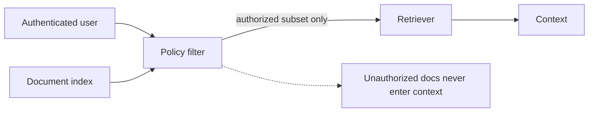
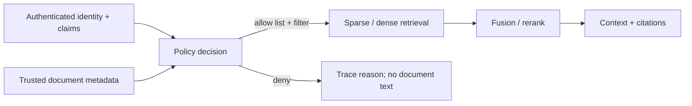

# 02 — Metadata filters and permissions: secure the retrieval boundary

**Level:** Intermediate  \
**Time:** 2–3 hours  \
**Prerequisites:** [retrieval strategies](../01-retrieval-strategies/README.md)

## Outcome

Design metadata and authorization policies that restrict every retrieval signal
before ranking, preserve allow/deny traces, reject stale sources, and prove that
cross-tenant evidence never becomes candidate context.

## Guided notebook

Open [`metadata_permissions.ipynb`](metadata_permissions.ipynb). The implementation is [`lab.py`](lab.py).



Filtering after retrieval is too late: an unauthorized chunk may already influence ranking, prompt construction, logs, caches, or an intermediate model call. Enforce access at the document query boundary and test the boundary directly.

## Exercise

Add a role requirement or document expiration timestamp. Write a test proving that a user cannot retrieve a document from another tenant even when the query exactly matches its text.

## Why this is a security boundary

RAG inherits the access-control obligations of every source system. A vector
index must not reveal private facts through retrieval, model context, caches,
logs, score distributions, or citations. Authorization is a deterministic
application policy evaluated from authenticated identity and trusted metadata;
it is never a request made in a model prompt.



Tenant, roles, classification, and freshness must restrict candidates before
every lexical, dense, hybrid, and reranking path. Filtering after a candidate
has been retrieved is too late.

## Metadata contract

| Field | Purpose | Failure if absent or wrong |
| --- | --- | --- |
| Tenant / organization | hard isolation boundary | cross-tenant disclosure |
| Required roles/tags | least-privilege scope | support user sees HR content |
| Classification | sensitivity and handling policy | sensitive text reaches context |
| Source version/freshness | operational correctness | stale runbook is cited as current |
| Retention/expiry | legal and lifecycle policy | revoked content stays searchable |
| Source/parent/chunk ID | auditable provenance | result cannot be investigated |
| Parser/index configuration | reproducibility | index drift cannot be explained |

Validate this metadata at ingestion, inherit it into child chunks, and bind the
search filter to verified caller claims. Do not allow an untrusted source to
declare its own tenant or classification without validation.

## Step-by-step implementation

### 1. Evaluate trusted identity against trusted metadata

`User` represents verified caller claims. `SecureDocument` holds source metadata.
`access_decision` returns `allowed`, `cross-tenant`, `missing-required-tag`, or
`expired-source` without exposing the document text.

```python
from datetime import date
from examples.intermediate.permission_filter import SecureDocument, User, access_decision, authorize, secure_search

user = User("support-17", "acme", frozenset({"support"}))
doc = SecureDocument("runbook-7", "Checkout runbook", "acme", frozenset({"support"}), expires_on=date(2026, 12, 31))
assert access_decision(user, doc, today=date(2026, 8, 9)).allowed
```

### 2. Authorize before building a retriever

`authorize` creates an `AuthorizationTrace`; `authorized_documents` uses its
allow-list before constructing BM25. Apply the equivalent filter to dense search,
hybrid fusion, reranking, cache keys, analytics, and context construction.

```python
trace = authorize(user, documents)
hits = secure_search(user, "checkout runbook", documents)
assert all(doc.doc_id in trace.allowed_ids for doc, _ in hits)
```

### 3. Treat freshness as a policy condition

An operational document can be harmful when stale even if the caller may read
it. The lab models `expires_on`; production systems commonly add effective time,
superseded version, index time, and source checksum. Decide whether an expired
document is denied, labelled, or historical-only—then write a regression test.

## Negative-path test matrix

| Case | Expected result |
| --- | --- |
| Acme user / Acme support runbook | allowed candidate |
| Acme user / Globex exact text | no Globex candidate or context |
| Acme support / Acme HR document | denied for missing tag |
| Entitled user / expired runbook | denied with `expired-source` |
| Revoked source in cache | cache miss or purge, never old result |
| Prompt-injected document content | content is data; policy result unchanged |

The meaningful proof is the negative path: an exact cross-tenant query must not
return a cross-tenant ID, score, snippet, context, or cache entry.

## Technology and policy choices

| Pattern | Good fit | RAG use |
| --- | --- | --- |
| RBAC | stable organizational roles | coarse collections and tools |
| ABAC | tenant, classification, time, region, purpose | document/chunk filters |
| ReBAC | user-resource relationships | shared projects and ownership |
| Policy-as-code | centralized, testable decisions | one policy across retrievers and APIs |

Open Policy Agent provides declarative, context-aware authorization decisions.
Qdrant payload filters can enforce matching metadata inside search queries. Keep
the policy decision separate from the search backend; never duplicate a permissive
policy in a prompt or client UI.

## Production checklist

- [ ] Verify identity claims before policy evaluation.
- [ ] Validate and version metadata; inherit it to every child chunk.
- [ ] Apply tenant/ACL/freshness filters in retrievers, rerankers, and cache keys.
- [ ] Store allow/deny traces with IDs, policy version, and reason—not document text.
- [ ] Test index deletion, revocation, stale sources, and cross-tenant exact matches.
- [ ] Ensure high-impact retrievals have monitoring, rollback, and a kill switch.

## Checkpoint

1. Why is filtering after retrieval too late? Name two exposure paths.
2. Which metadata must children inherit from a parent document?
3. When is ABAC more appropriate than a simple role collection?
4. What belongs in an authorization trace, and what must it avoid logging?
5. How would you prove cache keys cannot mix two tenant scopes?

## References

- OWASP, [Top 10 for LLM Applications 2025](https://owasp.org/www-project-top-10-for-large-language-model-applications/assets/PDF/OWASP-Top-10-for-LLMs-v2025.pdf)
- Open Policy Agent, [Authorization policies](https://www.openpolicyagent.org/docs/http-api-authorization.html)
- Open Policy Agent, [Security guidance](https://www.openpolicyagent.org/docs/security)
- Qdrant, [Payload and filtering](https://qdrant.tech/documentation/concepts/payload/)
- NIST, [Generative AI Profile](https://nvlpubs.nist.gov/nistpubs/ai/NIST.AI.600-1.pdf)
