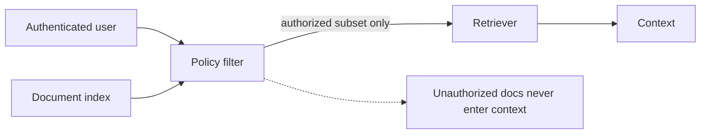

# 02 — Metadata filters and permissions

**Level:** Intermediate  \
**Time:** 40 minutes  \
**Prerequisites:** [retrieval strategies](../01-retrieval-strategies/README.md)

## Outcome

Apply tenant and tag authorization before retrieval so unauthorized documents never become candidate context.

## Guided notebook

Open [`metadata_permissions.ipynb`](metadata_permissions.ipynb). The implementation is [`permission_filter.py`](../../../examples/intermediate/permission_filter.py).

Filtering after retrieval is too late: an unauthorized chunk may already influence ranking, prompt construction, logs, caches, or an intermediate model call. Enforce access at the document query boundary and test the boundary directly.

## Exercise

Add a role requirement or document expiration timestamp. Write a test proving that a user cannot retrieve a document from another tenant even when the query exactly matches its text.
