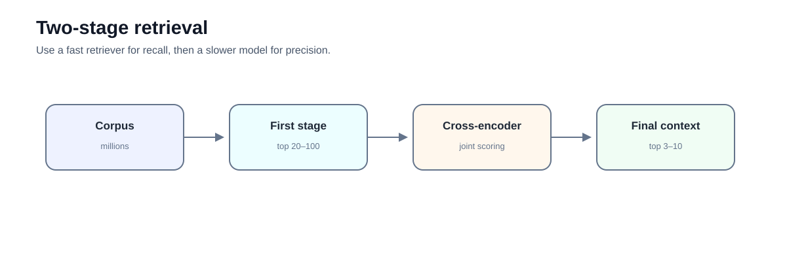
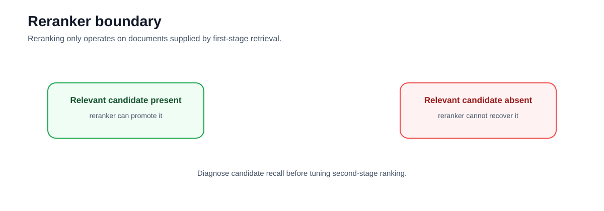

# Intermediate 03 — Two-Stage Retrieval: Cross-Encoder Reranking

**Level:** Intermediate  
**Estimated time:** 90–120 minutes  
**Notebook:** [`03_query_reranking.ipynb`](03_query_reranking.ipynb)  
**Prerequisites:** Retrieval Strategies; Metadata and Permissions

---

## Why this lesson exists

First-stage retrieval is optimized to search a large corpus quickly and achieve high candidate recall.

That does not mean the best evidence will be ranked first.

This notebook demonstrates the classic two-stage architecture:

```text
fast retriever
     ↓
candidate set
     ↓
cross-encoder reranker
     ↓
smaller, higher-precision result set
```



The old README mixed query rewriting, decomposition, HyDE, metadata extraction, RRF, and reranking into one course. The actual notebook is specifically a **cross-encoder reranking lab**. This update narrows the runnable lesson to that purpose and treats query planning as related but separate design guidance.

---

## Learning objectives

After this lesson you should be able to:

- distinguish first-stage recall from second-stage precision;
- explain bi-encoder vs cross-encoder scoring;
- rerank a bounded candidate set;
- explain why rerankers cannot recover missing candidates;
- understand the latency/cost trade-off of reranking;
- avoid using reranker scores as calibrated truth probabilities;
- keep authorization filters upstream of reranking; and
- evaluate whether reranking improves MRR/nDCG and downstream evidence quality.

---

## 1. Bi-encoder retrieval

Dense first-stage retrieval independently embeds:

```text
query
document
```

and compares their vectors.

This allows document vectors to be precomputed, which makes search efficient.

The trade-off is limited token-level interaction between the query and candidate at scoring time.

---

## 2. Cross-encoder reranking

A cross-encoder scores:

```text
[query, document]
```

jointly.

That allows attention across both sequences and typically produces a more precise relevance judgement.

The notebook uses:

```python
HuggingFaceCrossEncoder(
    model_name="cross-encoder/ms-marco-MiniLM-L-6-v2"
)
```

wrapped by LangChain's `CrossEncoderReranker`.

---

## 3. Candidate recall comes first

Suppose the relevant document ranks 3rd.

A reranker can move it to rank 1.

Suppose the relevant document is not returned at all.

A reranker cannot help.



Therefore measure:

```text
Recall@candidate_k
```

before deciding the reranker is the problem.

---

## 4. Bound the reranker input

Do not rerank the entire corpus.

Typical architecture:

```text
millions of chunks
      ↓
first-stage retrieval
      ↓
20–100 candidates
      ↓
cross-encoder
      ↓
3–10 final passages
```

The exact numbers should come from evaluation and latency budgets.

The notebook uses only three documents for visibility; do not treat that tiny candidate count as production guidance.

---

## 5. Current integration note

The notebook uses:

```python
from langchain_community.vectorstores import Chroma
```

Current LangChain documentation uses:

```python
from langchain_chroma import Chroma
```

The cross-encoder and contextual-compression classes remain in classic/community integrations in the notebook's current style.

When refreshing executable code, update the Chroma package independently.

---

## 6. Do not treat reranker logits as calibrated confidence

The notebook reflection says the cross-encoder outputs a relevance score and suggests it can be used for abstention.

That needs a qualification.

Cross-encoder scores are useful ranking signals, but are not automatically:

```text
P(answer is correct)
```

If you want to use a score threshold for abstention:

1. evaluate the score distribution on answerable and unanswerable cases;
2. tune on a validation set;
3. test on held-out data;
4. monitor false-answer and false-abstention rates.

---

## 7. Authorization order

Safe:

```text
authorization filter
      ↓
first-stage retrieval
      ↓
reranker
      ↓
context
```

Unsafe:

```text
retrieve unauthorized candidates
      ↓
rerank
      ↓
filter afterward
```

The reranker itself receives document text, so it must only see authorized candidates.

---

## 8. Reranking evaluation

Compare baseline vs reranked results on the same cases.

Useful metrics:

- Recall@candidate_k — should remain high;
- MRR — did the first relevant result move up?;
- nDCG@k — did the ranked list improve?;
- top-context support rate;
- p50/p95 reranking latency;
- cost per successful supported answer.

Do not celebrate a better example ranking without measuring a representative set.

---

## 9. Related query-transformation techniques

Query rewriting, multi-query expansion, HyDE, and decomposition are useful when the correct evidence is **missing from the candidate set**.

Reranking is useful when the evidence is **present but poorly ordered**.

That diagnostic distinction should remain explicit:

| Failure | First intervention |
|---|---|
| Relevant evidence absent | improve retrieval/query representation |
| Relevant evidence present but low-ranked | rerank |
| Wrong tenant/source present | authorization/filtering |
| Correct evidence reaches model but answer is wrong | generation/evaluation |

---

## 10. Exercises

1. Increase first-stage `k` and inspect candidate recall.
2. Compare base rank and reranked rank.
3. Add a hard negative with overlapping terms.
4. Change `top_n` and measure context size.
5. Time base retrieval vs reranked retrieval.
6. Add a score threshold, then design a validation set to test whether it is actually useful.
7. Update Chroma to `langchain_chroma`.

---

## 11. Checkpoint

1. Why is first-stage retrieval optimized differently from reranking?
2. Why is a cross-encoder slower than a bi-encoder?
3. What happens if the correct evidence is outside the candidate set?
4. Why must authorization happen before reranking?
5. Why should a cross-encoder logit not be treated as truth confidence?
6. Which metric shows whether reranking moved relevant evidence earlier?
7. When should you use query transformation instead?

---

## What comes next

### [Intermediate 04 — Evaluation](../04-evaluation/README.md)

Measure retrieval and answer behavior separately and build release gates.

---

## References

- Nogueira & Cho — [Passage Re-ranking with BERT](https://arxiv.org/abs/1901.04085)
- Sentence Transformers — [Cross-Encoder documentation](https://www.sbert.net/docs/cross_encoder/usage/usage.html)
- LangChain — [Retriever integrations](https://docs.langchain.com/oss/python/integrations/retrievers)
- LangChain — [Chroma integration](https://docs.langchain.com/oss/python/integrations/vectorstores/chroma)

---

## Key takeaway

**A reranker improves ordering; it does not create missing evidence.**


---

# Deep Dive — Query Planning and Reranking

Planning improves **what is searched**. Reranking improves **the ordering of candidates already retrieved**.

## Retrieval cascade
```text
query → optional rewrite/decomposition → candidate retrieval → fusion → reranking → context selection
```
A reranker cannot fix missing candidate recall.

## Query decomposition
Decompose comparisons, multi-part questions, and multi-hop information needs into bounded structured retrieval intents. Preserve the original objective and map subqueries back to it. Over-decomposition increases latency and semantic drift.

## Rewriting and expansion
Rewriting can normalize vocabulary or expose implicit constraints. Expansion creates alternate probes. Retain the original query and evaluate incremental retrieval value.

## HyDE
Hypothetical Document Embeddings use generated hypothetical content as a retrieval representation. It can bridge vocabulary gaps, but generated content is not evidence and must never be cited as corpus fact.

## Cross-encoders
Bi-encoders independently encode query/document and support efficient ANN search. Cross-encoders jointly process pairs and usually provide stronger relevance at higher cost, motivating retrieve-then-rerank.

## Late interaction
ColBERT-style models retain token-level embeddings and offer fine-grained matching. They can act as retrievers or second-stage rerankers.

## Multi-stage cascades
```text
BM25 + dense → RRF → 100 candidates → cross-encoder/ColBERT → 20 → context selection
```
Every stage should demonstrate incremental benefit in an ablation.

## Context selection
Highest-ranked chunks are not automatically the best prompt context. Consider duplication, source diversity, neighboring context, token budgets, and evidence completeness.

## Budgets
Bound subqueries, candidates, rerank pairs, elapsed time, and cost. Parallelize independent retrieval calls where safe.

## Failure modes
Watch for redundant subqueries, lost constraints, recursive decomposition, semantic drift, scope mixing, and answering a generated subquestion instead of the user's question.

## Evaluation
Measure candidate recall before reranking, MRR/nDCG afterward, then downstream claim support, latency, and cost. Compare dense → hybrid → hybrid+reranker → planner+hybrid+reranker.

### Further study
Nogueira & Cho on BERT reranking; Khattab & Zaharia on ColBERT; BEIR; current Qdrant hybrid/reranking documentation.
