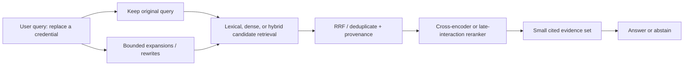

# 03 — Query planning, fusion, and reranking

**Level:** Intermediate  \
**Time:** 2–3 hours  \
**Prerequisites:** [metadata permissions](../02-metadata-permissions/README.md)

## Outcome

Design a measurable two-stage retrieval system that preserves the original user
intent, expands recall with bounded query variants, fuses candidate rankings,
reranks a small authorized set, and makes a latency/cost decision from evidence.

## Guided notebook

Open [`query_reranking.ipynb`](query_reranking.ipynb). The reusable implementation is [`query_reranking.py`](../../../examples/intermediate/query_reranking.py).

Query rewriting can improve recall but may introduce irrelevant candidates, change
intent, and add latency. Reranking is more expensive than first-stage retrieval,
so use it only on a bounded, authorized candidate set. A production reranker may
be a cross-encoder, a late-interaction model, or a provider API; validate input
length, latency, score calibration, and performance on difficult slices.

## Exercise

Add a paraphrase that the original query misses. Compare recall before and after
rewriting, then measure whether reranking improves the first relevant document’s
position without exceeding the candidate and latency budget.

## The retrieval problem, precisely

First-stage retrieval must be fast enough to scan a large corpus and broad
enough not to discard evidence. It can use lexical search, embeddings, or both.
The second stage sees only the top candidates and can model richer query-document
interactions to improve ordering. This makes **candidate recall** and **final
precision** separate measurements—not competing score values.

Do not use a generated rewrite as an authority. Retain the original query,
preserve exact identifiers, bound the number of variants, and log the plan.
Rewrites must obey the same authorization and source-selection policy as the
original request.

## Step-by-step training

### 1. Diagnose the query before adding complexity

Classify the failure mode first. A literal error code or product SKU often needs
lexical retrieval; a conversational paraphrase often benefits from semantic
retrieval or a controlled expansion; a compound question may need decomposition;
and an underspecified query may need clarification rather than more search.

| Query signal | Useful first action | Avoid |
| --- | --- | --- |
| Exact ID, error code, quoted phrase | preserve it; lexical/hybrid search | rewriting it away |
| Synonym or user phrasing mismatch | add one or two constrained variants | unlimited synthetic questions |
| Multiple independent asks | decompose and trace each sub-query | mixing all evidence into one score |
| Missing key constraint | ask/route/abstain | guessing the constraint |
| Good candidates in wrong order | rerank bounded candidates | raising `top_k` forever |

### 2. Generate a bounded query plan

The included helper keeps the original query and creates deterministic synonym
variants. A production LLM rewriter should return a schema such as
`{"variants": [...], "intent": "...", "must_keep": [...]}`. Validate the
count, length, tenant scope, and preserved entities before retrieval. Set a per
request rewrite budget and fall back to the original query when the rewriter
fails.

### 3. Fuse candidate rankings instead of score scales

Different query variants, sparse search, and dense search produce scores that
are usually not calibrated to one another. Reciprocal Rank Fusion (RRF) combines
*positions*, which makes it a dependable baseline for heterogeneous rankings.
Keep source-query provenance so a reviewer can see why a candidate entered the
pool.

### 4. Rerank narrow, using the original question

Cross-encoders jointly score a query-document pair and can capture interactions
that independent embeddings miss. They are too slow for an entire corpus. Start
with a measured candidate budget (for example 20–100 based on corpus and
latency), use a timeout, and preserve a safe fallback ranking. The notebook uses
a transparent deterministic proxy; replace only that adapter when you adopt a
model.

### 5. Evaluate both the trajectory and result

For each labeled query record original/rewritten variants, candidate IDs, fusion
rank, reranker score, final IDs, latency, model/version, and cost. Measure
candidate recall@N, final recall@K, MRR/nDCG, no-answer behavior, p50/p95
latency, and rerank cost. Slice by exact identifiers, paraphrases, long queries,
languages, permissions, and fresh content. A quality gain that fails p95 or
cross-tenant tests is not a release candidate.

## Production patterns and anti-patterns

| Pattern | Why it helps | Guardrail |
| --- | --- | --- |
| Original + small variant set | recall without losing user wording | cap count and retain entities |
| Hybrid retrieval + RRF | complements exact and semantic signals | apply metadata filters before fusion |
| Cross-encoder reranking | stronger local relevance ordering | rerank a bounded, authorized pool |
| Query/result cache | reduces repeated work | key by tenant, policy, index, model, and query version |
| Offline release gate | catches regressions | include adversarial and no-answer queries |

Avoid retrying rewrites until a desired answer appears, comparing raw scores from
unrelated models, reranking globally, and treating reranker scores as calibrated
probabilities. Never let query rewriting weaken access controls or resurrect
documents removed by a filter.

## Technology choices

| Component | Practical options | When it fits |
| --- | --- | --- |
| First stage | BM25/OpenSearch, embeddings, hybrid retrieval | large corpora and high recall |
| Fusion | RRF or calibrated learned fusion | multiple rankers/variants |
| Reranking | Sentence Transformers CrossEncoder, BGE reranker, ColBERT, provider rerank API | final ordering of a bounded set |
| Orchestration | explicit application pipeline, Haystack, LlamaIndex, LangChain | adapters and observability—not authorization |
| Evaluation | golden dataset plus retrieval metrics | every configuration change |

## Checkpoint

1. Why must the original query remain in a rewrite plan?
2. When is RRF safer than directly adding two retriever scores?
3. Why does a cross-encoder belong after first-stage retrieval?
4. Which metrics distinguish “relevant evidence was found” from “it was placed
   in the usable context window”?
5. Name three values that belong in a reranking trace.

## References

- Sentence Transformers, [Retrieve & Re-Rank](https://www.sbert.net/examples/sentence_transformer/applications/retrieve_rerank/README.html) — bi-encoder candidate retrieval and cross-encoder reranking.
- Cormack, Clarke, and Buettcher, [Reciprocal Rank Fusion outperforms Condorcet and individual Rank Learning Methods](https://dl.acm.org/doi/10.1145/1571941.1572114) — original RRF paper.
- Nogueira and Cho, [Passage Re-ranking with BERT](https://arxiv.org/abs/1901.04085) — early neural cross-encoder reranking work.
- Santhanam et al., [ColBERTv2](https://arxiv.org/abs/2112.01488) — late-interaction retrieval.
- Cohere, [Rerank overview](https://docs.cohere.com/docs/rerank-overview) — provider API example; evaluate independently for your workload.
