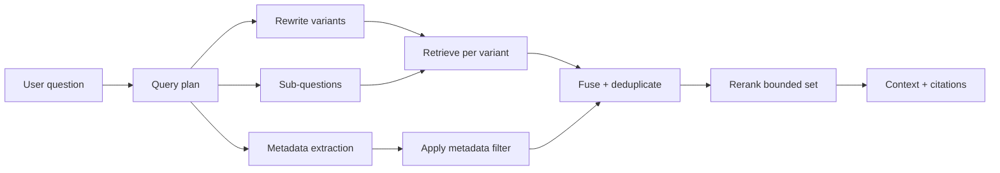

# 03 — Query transformation and reranking: improve what is searched and how it is ordered

**Level:** Intermediate  
**Time:** 2–3 hours  
**Prerequisites:** [retrieval strategies](../01-retrieval-strategies/README.md), [metadata and permissions](../02-metadata-permissions/README.md)

## Learning objectives

After this lesson you will be able to:

- distinguish query transformation (changes *what* is searched) from reranking (changes *how candidates are ordered*) and explain why conflating them creates wrong diagnoses;
- implement query rewriting, multi-query expansion, sub-question decomposition, HyDE, step-back prompting, and metadata extraction from query text;
- explain Reciprocal Rank Fusion and when to prefer it over score blending;
- implement cross-encoder reranking on a bounded candidate set and explain the latency trade-off;
- explain LLM-based and listwise reranking and when each is appropriate;
- define the query drift risk and implement a guard against it;
- trace a transformation plan as a first-class artifact with versioned configuration; and
- choose transformations from a measured golden set, not from intuition.

## Outcome

Design a query planning stage that improves candidate recall by transforming the question, then improve precision by reranking a bounded set — keeping authorization unaltered throughout.

## Guided notebook

Open [`query_reranking.ipynb`](query_reranking.ipynb). Reusable implementation is in [`lab.py`](lab.py).



## Two distinct problems, two distinct solutions

One of the most common mistakes in RAG engineering is treating query transformation
and reranking as a single "query improvement" step. They solve different failures:

| Dimension | Query Transformation | Reranking |
|---|---|---|
| **What it changes** | *What* is searched: query text, vocabulary, scope | *How* results are ordered: ranking of retrieved candidates |
| **When it runs** | Before retrieval | After first-stage retrieval |
| **What it can fix** | Missing evidence due to vocabulary mismatch, underspecified query, single-framing bias | Evidence that is present but ranked too low |
| **What it cannot fix** | Evidence that was not retrieved at all | Evidence that was not in the first-stage candidates |
| **Failure risk** | Query drift, scope inflation, access boundary violation | Latency, cost, reranker domain mismatch |

**Diagnostic rule:** if the correct evidence is *not in the top-K*, query transformation
(or retrieval architecture) is the problem. If the correct evidence *is in top-K* but
not at top-1, reranking is the solution.

---

## Part A: Query Transformation

### Why single-query retrieval fails

A user question is one framing of an information need. That framing may:
- use vocabulary that differs from the indexed documents;
- be ambiguous (the same phrase means different things in different contexts);
- underspecify a multi-part information need;
- assume background knowledge the model does not have without retrieval;
- be in a different language than the corpus.

Query transformation addresses these failures *before* retrieval runs.

### Query rewriting

Rewrite the user's query to better match the expected vocabulary of relevant documents.

**Simple normalization:** expand abbreviations, correct typos, standardize terminology.

**LLM-assisted rewriting:** use a language model to produce a more retrieval-friendly
version of the query. The rewritten query must:
- preserve the original user intent;
- not expand scope to unauthorized sources;
- not change the inferred access scope (no elevation of privilege through rewriting);
- be deterministic and traceable (log the original and rewritten forms).

```python
original: "Why is checkout so slow right now?"
rewritten: "checkout service latency degradation root cause recent deployment"
```

**Guard:** the rewriter must not produce a query that widens a tenant boundary.
A query rewriter is not an authorization authority. Test that the rewritten query
never retrieves documents the original would not have, given the same authorization filter.

### Multi-query expansion

Generate several independently phrased queries and retrieve candidates for each.
This reduces dependence on a single query framing and exposes evidence that
responds to a synonym or rephrasing the user did not use.

```python
queries = [
    "checkout service performance issue",       # operational vocabulary
    "payment gateway latency degradation",       # technical vocabulary
    "slow transactions after deploy 842",        # incident vocabulary
]
```

**Fusion:** combine results with RRF (Reciprocal Rank Fusion). Do not blend raw
scores from independent runs — the scales are not comparable.

**Cost guardrail:** K independent retrieval calls cost K times as much as a
single call. Cap the number of query variants. Do not expand endlessly.

### Sub-question decomposition

Break a complex compound question into simpler sub-questions, retrieve evidence
for each, then synthesize.

```
Complex: "Which services were affected by the EU deployment that caused
          checkout degradation, and who is the on-call owner?"

Sub-questions:
  1. "Which deployment affected EU checkout?"
  2. "Which services depend on that component?"
  3. "Who is the on-call owner for checkout?"
```

Each sub-question retrieves from its own evidence view. The synthesizer
combines sub-answers into a single response while preserving per-claim citations.

**Risk:** sub-questions can amplify cost and latency multiplicatively. Use only
when a single-query baseline fails on compound questions in the golden set.

### HyDE — Hypothetical Document Embeddings

Generate a hypothetical document that *would* answer the query, then use that
document as the retrieval query instead of the original question.

**Intuition:** a model can write "The checkout service slows down when the
EU-US replication buffer overflows due to..." This text uses the vocabulary
and structure of real runbooks — closer to the document space than the short
user question.

```python
hypothetical = llm.complete(
    f"Write a brief technical explanation that answers: '{query}'"
)
dense_results = embed_and_search(hypothetical, index)
```

**When HyDE helps:** significant vocabulary mismatch between short queries and
long technical documents. Short queries produce embedding vectors that sit in a
different part of the space than long detailed passages.

**Risks:**
- the hypothetical may introduce hallucinated terminology that biases retrieval;
- the hypothetical is generated without access to the actual corpus;
- retrieval based on a hallucinated document may miss real evidence.

**Mitigation:** combine HyDE results with a direct-query baseline using RRF.
Do not use HyDE alone for high-stakes retrieval.

Reference: Gao et al., [Precise Zero-Shot Dense Retrieval without Relevance Labels](https://arxiv.org/abs/2212.10496).

### Step-back prompting

Before retrieving on the specific question, generate a more general "step-back"
question that retrieves foundational context, then proceed with the specific query.

```
Specific: "Why did deploy 842 cause the EU checkout degradation?"
Step-back: "What are the common causes of payment gateway latency spikes?"
```

The step-back retrieval provides background context; the specific retrieval
provides incident-specific evidence. Both are used in generation.

**When step-back helps:** questions that require domain background to answer
correctly, where the model would benefit from retrieving foundational concepts
alongside specific evidence.

Reference: Zheng et al., [Take a Step Back: Evoking Reasoning in LLMs by Encouraging Abstract Thinking](https://arxiv.org/abs/2310.06117).

### Metadata extraction from query text

Extract structured metadata from the query to apply as retrieval filters.

```python
query: "Show me Acme's checkout runbooks from Q1 2024"

extracted_filters = {
    "tenant": "acme",
    "document_type": "runbook",
    "product": "checkout",
    "date_range": {"gte": "2024-01-01", "lte": "2024-03-31"},
}
```

**Security constraint:** extracted metadata must be validated against the
authenticated user's authorized scope before being used as a filter. A user
cannot extract a tenant value that widens their access. Treat the extraction
output as a *proposal* to filter by — validate it against verified identity
claims before applying.

### Query drift

Query drift occurs when transformation changes the *semantic scope* of the
search in ways the user did not intend.

```
Original: "Can support restart the checkout service?"
Drifted:  "What are all the restart procedures for all services?"
```

The drifted query retrieves more, but retrieves evidence outside the specific
context the user needed. This can increase context noise, retrieve documents
from other tenants' scopes, or produce overconfident answers.

**Guard:** measure the semantic similarity between the original query and
generated variants. Reject variants that have diverged beyond a threshold.
Log original and transformed queries side by side for human review.

---

## Part B: Reranking

### Why first-stage ranking is imprecise

First-stage retrievers (BM25, bi-encoder dense, hybrid) are optimized for
*candidate recall* — getting the right document into the top-K, quickly,
across a large corpus. They are not optimized for *precision* — correctly
ordering those K candidates.

A cross-encoder reranker can examine each (query, document) pair jointly,
with full attention, producing a more precise relevance score. The trade-off:
cross-encoders are too slow for full-corpus retrieval but fast enough to
rerank a bounded candidate set.

### Cross-encoder reranking

```
bi-encoder → top-100 candidates → cross-encoder reranker → top-5 final
```

The cross-encoder reads the query and document simultaneously (not as independent
vectors). This allows full attention between query and document tokens, producing
richer relevance signals.

**Key rule:** bound the candidate set that enters the reranker. Reranking 1000
documents is expensive and slow. Reranking 20–100 documents is fast and effective.

```python
from examples.intermediate.query_reranking import rerank_candidates

reranked = rerank_candidates(
    query="E401 token verification for checkout API",
    candidates=fused_candidates[:50],   # bounded input
    top_k=5,
)
```

### LLM-based reranking

Use a language model to score each (query, document) pair with a relevance
judgement. This can capture nuanced relevance signals beyond semantic similarity.

**When to use:** when standard cross-encoders lack domain coverage or when
the relevance criteria require multi-step reasoning.

**Trade-offs:** expensive (LLM inference cost per candidate × candidate count);
slower; harder to calibrate. The model judge has its own error modes — it may
prefer fluent or verbose passages over short precise ones.

**Cost mitigation:** limit to top-20 or top-30 candidates. Cache stable results
with careful key design (include model version, prompt version, corpus version).

### Listwise reranking

Present the full candidate list to a model and ask it to produce a ranked
ordering, rather than scoring each pair independently.

```
"Given the query '...' and these 20 passages, rank them from most to least
relevant and return their IDs in order."
```

**Advantages:** the model can reason about relative relevance across candidates,
not just independent scores.

**Disadvantages:** expensive; harder to reproduce; output format is fragile;
difficult to calibrate. Use only after pointwise cross-encoder reranking fails
to improve a measured metric.

### Reranking contract

The reranker must operate on an already-authorized candidate set:


A reranker must never see unauthorized documents. Even if it does not return them,
the joint cross-attention may leak information. Apply authorization filters before
the reranker receives its input — not after.

### RRF: rank fusion over score fusion

When combining candidates from multiple queries or retrievers:

\[
RRF(d) = \sum_{r \in rankings} \frac{1}{k + rank_r(d)}
\]

RRF uses rank positions, not raw scores. A document that ranks 1st in one
retriever and 3rd in another gets a stronger combined signal than one that
ranks 20th in both.

**Why not score blending?** BM25 scores (integer-scale, corpus-dependent) and
cosine similarities (float, 0–1) are on incompatible scales. Linear blending
requires careful calibration. RRF requires only ordering, which is always
comparable. Use RRF as the default; justify score blending only with evidence
from your evaluation set.

---

## The query plan as a traceable artifact

Every transformation and reranking step should produce a traceable query plan:

```python
QueryPlan(
    original_query="European checkout is degraded after deploy-842",
    rewritten_query="EU checkout service latency degradation deployment 842",
    sub_questions=["Which deployment affected EU checkout?", "Which services depend on payments?"],
    hyde_hypothetical="...",
    extracted_filters={"tenant": "northstar", "product": "checkout"},
    retrieval_variants=3,
    reranker="cross-encoder-v2",
    policy_version="v3",
    timestamp=...,
)
```

Store this with the response trace. When a retrieval or answer failure is
investigated, the query plan tells you exactly what was searched and how.

---

## Evaluation

### For query transformation

| Metric | What it tells you |
|---|---|
| Candidate recall (before reranking) | Did transformation find new evidence? |
| Variant overlap | Are additional queries adding unique candidates or duplicates? |
| Drift score | How far did transformed queries deviate semantically? |
| Cost increase | How many more retrieval calls did transformation require? |

### For reranking

| Metric | What it tells you |
|---|---|
| MRR improvement | Did the first relevant result move higher? |
| nDCG improvement | Did the overall ranking quality improve? |
| Answer support rate | Did better ranking produce more grounded answers? |
| Latency increase | What is the p95 cost of reranking? |

**Measurement protocol:** always compare transformation+reranking against a
simple single-query lexical baseline on the same golden set. A technique is
justified only if it produces a measurable improvement at acceptable cost.

## Anti-patterns

- Using query rewriting to compensate for poor source quality.
- Generating 10+ query variants without a cost cap.
- Treating a reranker as a privacy filter: the reranker receives all candidates, including any that slip through a missing authorization filter.
- Using score blending (BM25 score + cosine similarity) without calibration.
- Logging both the original and rewritten query as separate user queries, inflating usage telemetry.
- Applying HyDE alone without a direct-query baseline comparison.

## Checkpoint

1. A question about "rebooting" a service fails to retrieve the runbook that
   uses "restarting." Is this a transformation problem or a reranking problem?
2. Why must authorization run before — not after — query expansion?
3. When would you use HyDE over simple multi-query expansion?
4. What does query drift mean, and how do you detect it?
5. Why is a listwise reranker more expensive than a cross-encoder?
6. The golden set shows that multi-query expansion improves Recall@10 by 8%
   but increases cost by 3×. How do you decide whether this is justified?
7. What information must a query plan trace contain for incident investigation?

## References

- Cormack, Clarke, and Büttcher, [Reciprocal Rank Fusion outperforms Condorcet and Individual Rank Learning Methods](https://cormack.uwaterloo.ca/cormacksigir09-rrf.pdf)
- Gao et al., [Precise Zero-Shot Dense Retrieval without Relevance Labels (HyDE)](https://arxiv.org/abs/2212.10496)
- Zheng et al., [Take a Step Back: Evoking Reasoning in LLMs by Encouraging Abstract Thinking](https://arxiv.org/abs/2310.06117)
- Nogueira and Cho, [Passage Re-ranking with BERT](https://arxiv.org/abs/1901.04085)
- Santhanam et al., [ColBERTv2: Effective and Efficient Retrieval via Lightweight Late Interaction](https://arxiv.org/abs/2112.01488)
- LlamaIndex, [Query transforms and sub-question queries](https://docs.llamaindex.ai/en/stable/module_guides/querying/pipeline/)
- Qdrant, [Hybrid search and reranking](https://qdrant.tech/documentation/advanced-tutorials/reranking-hybrid-search/)
