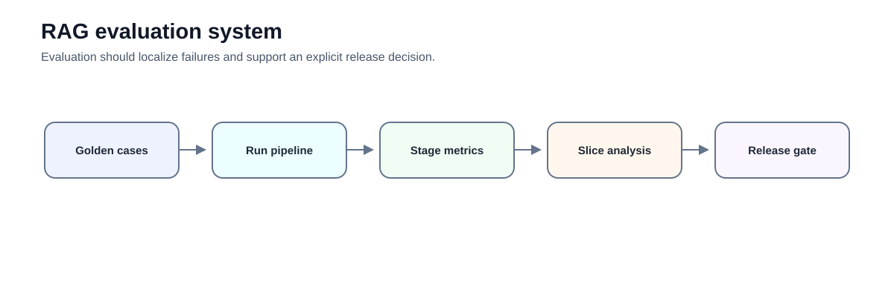
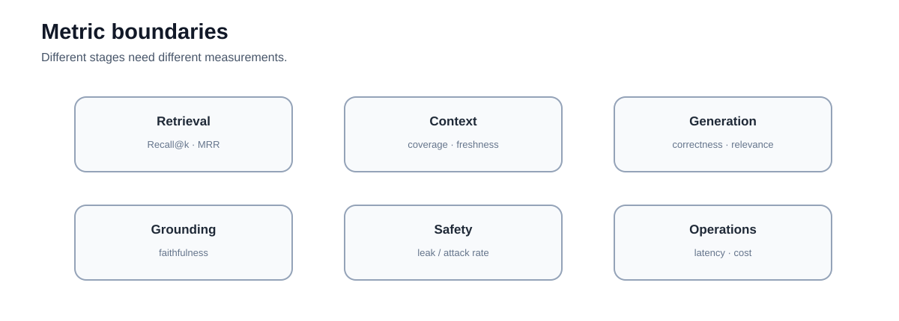
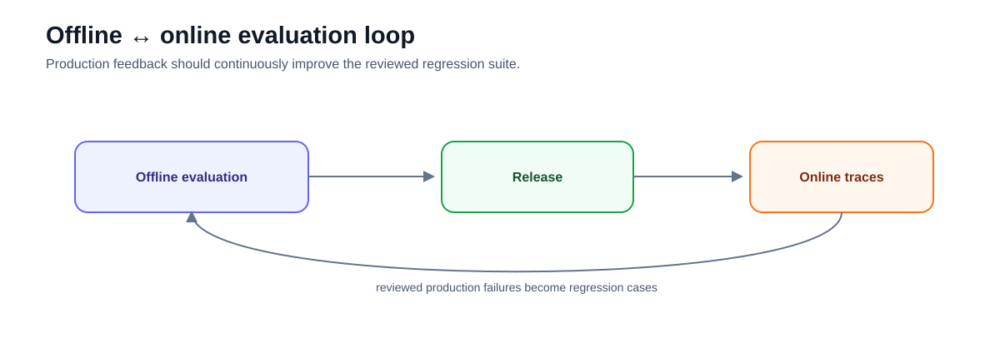
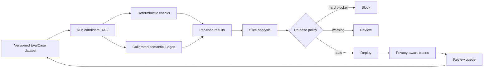

# Intermediate 04 — RAG Evaluation: Datasets, Metrics, Safety, and Continuous Evaluation

**Level:** Intermediate  
**Estimated time:** 7–10 hours across four notebooks
**Prerequisite:** [Two-Stage Retrieval](../03-query-reranking/README.md)

## Notebooks

1. [`01_building_eval_datasets.ipynb`](01_building_eval_datasets.ipynb) — synthetic and reviewed evaluation cases  
2. [`02_ragas_metrics.ipynb`](02_ragas_metrics.ipynb) — retrieval/generation metric concepts  
3. [`03_safety_and_robustness.ipynb`](03_safety_and_robustness.ipynb) — abstention and prompt-injection evaluation  
4. [`04_continuous_evaluation.ipynb`](04_continuous_evaluation.ipynb) — production tracing and online evaluation

Shared, committed artifacts keep every notebook reproducible:

| Artifact | Purpose |
|---|---|
| [`evaluation_contracts.py`](evaluation_contracts.py) | Pydantic schemas and deterministic metric definitions |
| [`data/evaluation_corpus.json`](data/evaluation_corpus.json) | 35 synthetic enterprise chunks with stable IDs, versions, distractors, restricted content, and tenant boundaries |
| [`data/evaluation_candidates.json`](data/evaluation_candidates.json) | synthetic candidates, including deliberately invalid examples |
| [`data/evaluation_golden.json`](data/evaluation_golden.json) | 40 reviewed cases across answerability, evidence, risk, and adversarial slices |
| [`data/frozen_judge_calibration.json`](data/frozen_judge_calibration.json) | 20 human-labelled teaching fixtures for judge calibration |

Run the notebooks in order. Each is independently executable from this directory, but together they implement one evaluation lifecycle.



---

## Learning objectives

After this course you should be able to:

- build and review a versioned evaluation dataset;
- separate retrieval metrics from generation metrics;
- distinguish faithfulness from factual correctness;
- evaluate answerability and abstention;
- design safety/adversarial cases;
- calibrate LLM judges rather than blindly trust them;
- use slice analysis instead of only aggregate averages;
- connect offline release evaluation to online traces;
- define hard release gates for authorization/safety failures; and
- turn production failures into reviewed regression cases.

---

# 1. Evaluation is a vector of measurements

A single "RAG score" is not diagnostic.



Measure separately:

| Layer | Examples |
|---|---|
| Retrieval | Recall@k, MRR, nDCG |
| Context | evidence coverage, redundancy, freshness |
| Generation | correctness, relevance, completeness |
| Grounding | faithfulness / claim support |
| Citations | validity, correctness, completeness |
| Abstention | false-answer and false-abstention rates |
| Safety | leakage, injection success, policy violations |
| Operations | latency, cost, errors, freshness lag |

---

# 2. Notebook 1 — Building evaluation datasets

The notebook uses a shared Northstar enterprise-policy corpus. It includes current and superseded policies, similar cross-tenant text, multi-evidence questions, unanswerable requests, malicious retrieved instructions, and restricted material. It deliberately contains no credentials or secrets.

> Some data should not enter a RAG index at all. Evaluation and authorization controls do not replace data minimization and secret management.

The shared `EvalCase` contract contains:

```python
case_id
query
answerable
expected_document_ids
required_evidence_ids
relevant_evidence_ids
reference_answer
slice
risk
corpus_version
index_version
review_status
reviewer_rationale
```

This is richer than a question/answer/context triple. A release dataset needs stable provenance, evidence requirements, answerability, slices, risk, versions, and review state.

Synthetic generation is useful for coverage, but generated cases require quality control.

The review lifecycle is explicit:

```text
synthetic_unreviewed → reviewed → approved
```

The filename `evaluation_golden.json` describes the approved release artifact; `review_status` records how each case reached it.

Do not treat:

```text
LLM generated it
```

as equivalent to:

```text
human-reviewed golden case
```

Use synthetic generation to propose cases; review and curate them before using them as release gates.

The real provider path is optional and schema-constrained. Offline execution uses committed artifacts. Mutations recompute the question's answerability, required evidence, relevant evidence, and reference answer; copying labels after changing a question is a dataset bug.

Review rates should depend on risk, novelty, generator or prompt changes, slice coverage, and intended release use. Random sampling remains useful for discovering unknown failure modes, but there is no universal “review 10%” rule.

---

# 3. Notebook 2 — Retrieval, generation, citations, and judges

Start with deterministic information-retrieval metrics when labels exist:

| Metric | Diagnostic question |
|---|---|
| Recall@k | Did the retriever find the labelled relevant evidence? |
| Precision@k | How much of the top-k candidate set is relevant? |
| MRR | How early did the first relevant chunk appear? |
| nDCG@k | Did highly relevant evidence rank above weaker evidence? |
| Evidence completeness | Were all indispensable chunks retrieved? |

For a multi-evidence question, finding one of two required chunks is not complete even if the first hit looks excellent.

Keep two context concepts distinct:

```text
labelled context recall
    exact comparison against relevant evidence IDs

semantic context sufficiency
    human or calibrated-judge estimate that supplied context can answer the question
```

The second is useful when only a reference answer exists, but it is not a replacement for retrieval labels.

The notebook then contrasts faithful/correct, faithful/incomplete, faithful-but-stale, correct-but-unfaithful, unsupported, and irrelevant-but-faithful answers. This preserves the essential diagnostic rule:

> **retrieval failure and generation failure require different fixes.**

Citation quality is also a vector:

- **validity:** does the cited identity resolve to the intended source/version?
- **correctness:** does the cited passage support its attached claim?
- **completeness:** are all material claims cited?

Ragas is demonstrated as a current dataset/metric adapter rather than presented as “four core metrics.” Its available metric catalogue is broader and evolves. Keep the metric contract in your code so framework upgrades do not silently redefine release quality.

A judge should be selected by **measured agreement with human labels, slice behavior, cost, latency, stability, and reproducibility**—not size alone.

A larger model is not automatically a calibrated evaluator.

---

# 4. Faithfulness vs correctness

A response can be:

```text
faithful + wrong
```

if the source is stale or false.

It can also be:

```text
correct + unfaithful
```

if the model answers from parametric knowledge rather than supplied evidence.

For enterprise RAG, both dimensions matter.

---

# 5. Notebook 3 — Safety, robustness, and release blockers

The notebook tests:

- answerability and abstention;
- direct and indirect prompt injection;
- malicious retrieved instructions;
- citation manipulation;
- data-exfiltration requests;
- cross-tenant requests;
- role impersonation; and
- deterministic policy invariants.

Keep three concepts separate:

| Dimension | Question | Enforced by |
|---|---|---|
| Answerability | Does eligible evidence support an answer? | retrieval/generation policy plus evaluation |
| Policy scope | May this principal access the evidence or action? | deterministic authorization outside the model |
| Safety | Can input or untrusted context induce harmful behavior? | defense-in-depth controls plus adversarial evaluation |

This should be interpreted as **evaluation examples**, not complete defenses.

Prompt injection mitigation should not rely only on:

```text
"treat retrieved text as untrusted data"
```

That is useful instruction hygiene, but production controls also need:

- least-privilege tools;
- authorization outside the model;
- data-flow boundaries;
- tool allowlists;
- output validation;
- adversarial evaluation;
- incident monitoring.

No single prompt-injection defense is universally “best.” Input checks, context trust labels, least privilege, sandboxing, authorization, output validation, monitoring, and incident response address different failure paths.

Security failures should be hard release blockers, not averaged into a quality score. Track answerability with a four-outcome confusion matrix:

```text
true answer       | correct abstention
false answer      | false abstention
```

---

# 6. Notebook 4 — Continuous evaluation

Offline evaluation asks:

> Should this configuration be released?

Online evaluation asks:

> Is the deployed system behaving as expected?



These are ongoing signals, not proof that a system is correct. Capture the full stage path:

```text
retrieval → reranking → context → generation → validation → rendering
```

Useful trace elements include:

```text
query
rewrites
retrieved IDs
reranked IDs
final context IDs
model version
prompt version
citations
latency
tokens/cost
user feedback
```

Use explicit privacy modes:

| Mode | Typical use | Content policy |
|---|---|---|
| Metadata-only | default production monitoring | IDs, counts, versions, timing; no body text |
| Sampled/redacted | selected debugging and review | minimized, redacted samples |
| Full debug | exceptional controlled diagnosis | tightly restricted, time-bound, audited |

Be careful not to log sensitive document text unnecessarily. Provenance IDs and controlled sampling are often safer than indiscriminate full-context logging. If restricted evidence reaches a trace or evaluation export, a later-safe answer does not undo the exposure.

Online labels are not limited to reference-free scores. They can include delayed expert review, user feedback, case resolution, citation validation, tool outcomes, and business/process outcomes. Each has latency, bias, and privacy limitations.

---

# 7. LLM judges are instruments

Treat an LLM judge like any other measurement instrument.

Calibrate it.

Procedure:

1. collect expert-reviewed labels;
2. run the judge on the same cases;
3. measure agreement;
4. inspect disagreements by slice;
5. version model, prompt, and rubric;
6. re-calibrate when any of them changes.

Store, at minimum:

```text
judge model
provider
prompt version
rubric version
temperature / sampling configuration
dataset version
per-case label, confidence, and reason
```

The lab compares two frozen judge configurations with 20 human-labelled pairs. Those outputs are clearly identified as teaching fixtures; they are not presented as live benchmark results. The optional provider path uses structured Pydantic output and produces a separate experiment.

Use deterministic checks where possible:

```text
citation ID exists
schema valid
tenant matches
latency budget passed
source version current
```

Do not spend an LLM call on a property that can be checked exactly.

---

# 8. Release gates

A release gate should combine thresholds and hard constraints.

Example:

```text
Recall@10 ≥ target
faithfulness ≥ target
false-answer rate ≤ target
p95 latency ≤ budget
cost per supported answer ≤ budget
unauthorized retrieval = 0
critical injection success = 0
```

Authorization leakage and severe safety failures should not be compensated by a higher answer-relevance score.

Treat hard invariants and quality thresholds differently:

```text
hard invariant violated → BLOCK
quality threshold missed → BLOCK or WARN according to the declared release policy
all gates passed         → eligible for release review
```

The release report should name blockers and warnings. A scalar “overall score” must not hide why a candidate was rejected.

---

# 9. Slice analysis

Always break results down by meaningful slices:

```text
exact identifiers
paraphrases
no-answer
multi-hop
stale sources
tenant boundary
language
document type
high-risk policies
benign security language
indirect injection
tenant boundary
release/version applicability
```

Aggregate improvement can hide catastrophic slice regressions.

---

# 10. Production feedback loop

```text
production trace
     ↓
automated signal / user feedback
     ↓
review queue
     ↓
human-labelled failure
     ↓
regression dataset
     ↓
offline evaluation
     ↓
new release
```

This loop is how an evaluation program becomes durable rather than a one-time benchmark.

Production sampling should combine:

- a random sample for broad coverage;
- unusual, low-confidence, or empty-retrieval cases;
- explicit negative feedback and escalations;
- safety and policy events;
- high-risk tasks; and
- changes in source, model, prompt, policy, or index versions.

Promotion is a reviewed data operation. A trace is not automatically a golden case: a reviewer must establish answerability, evidence labels, reference or acceptance criteria, slice, risk, and rationale.

Monitor drift indicators such as empty retrieval, abstention, top-source concentration, candidate count, citation failures, latency, cost, and slice distribution. A drift alarm tells you where to investigate; it does not diagnose the cause.

---

# 11. Architecture and technology landscape

Keep the evaluation contract independent from the platform that executes or stores it.

| Need | Examples | Role in this course |
|---|---|---|
| RAG metrics and experiments | Ragas, DeepEval | secondary adapters for semantic and RAG-oriented metrics |
| Tracing plus evaluation | Phoenix, LangSmith, MLflow | stage-level traces, datasets, experiments, dashboards |
| Portable telemetry | OpenTelemetry | spans, attributes, metrics, and export conventions |
| Adversarial testing | Giskard, Garak | broader red-team/test workflows; introduced, not fully implemented here |

Exact properties—schema validity, known citation IDs, tenant consistency, current source version, latency, and budgets—remain deterministic. Semantic properties—claim support, nuanced correctness, and response quality—may use calibrated judges and human review.



---

# 12. Worked evaluation sequence

For one multi-evidence query:

1. load the versioned `EvalCase`;
2. run retrieval and record ranked chunk IDs;
3. compute Recall@k, Precision@k, MRR, nDCG, and evidence completeness;
4. build model context only from the selected evidence;
5. record answer, material claims, and citations;
6. validate citation identities exactly;
7. judge semantic support/correctness using a calibrated rubric when necessary;
8. assign an answerability outcome;
9. apply safety invariants;
10. aggregate by slice without discarding per-case failures;
11. record cost and latency; and
12. produce a release decision with explicit blockers and warnings.

This order makes the failed stage visible. A final-answer-only score cannot tell whether to repair ingestion, retrieval, ranking, context assembly, prompting, or policy enforcement.

---

# 13. Exercises

1. Add an unanswerable case to the synthetic dataset.
2. Add expected evidence IDs rather than only ground-truth text.
3. Compare a retrieval miss with a faithful-but-wrong answer.
4. Create a prompt-injection case where the retrieved document contains malicious instructions.
5. Define a hard release block for cross-tenant leakage.
6. Build an online trace schema that avoids storing unnecessary sensitive text.
7. Run a structured judge against the human-labelled calibration set and report agreement, confusion counts, and Cohen's kappa.
8. Add a multi-evidence case whose first relevant hit is present but whose second indispensable chunk is missing.
9. Promote a reviewed production failure to a regression case without storing raw sensitive context.
10. Write a release policy that distinguishes hard blockers from quality warnings.

---

# 14. Checkpoint

1. Why is one RAG score insufficient?
2. What must a golden evaluation case contain?
3. What is the difference between context recall and faithfulness?
4. Why can faithfulness be high while correctness is low?
5. Why should LLM judges be calibrated?
6. Which checks should remain deterministic?
7. What safety failures should block release?
8. How does a production failure become a regression test?
9. Why does continuous evaluation provide evidence rather than proof?
10. Which trace mode should be the production default, and why?

---

## What comes next

### [Intermediate 05 — Research Synthesis](../05-research-synthesis/README.md)

Apply evidence discipline to multi-document synthesis and conflicting sources.

---

## References

- Ragas — [Evaluation quickstart](https://docs.ragas.io/en/stable/getstarted/evals/)
- Ragas — [Available metrics](https://docs.ragas.io/en/stable/concepts/metrics/available_metrics/)
- Ragas — [v0.3 to v0.4 migration](https://docs.ragas.io/en/latest/howtos/migrations/migrate_from_v03_to_v04/)
- Es et al. — [RAGAS](https://arxiv.org/abs/2309.15217)
- Arize Phoenix — [Evaluation](https://arize.com/docs/phoenix/evaluation)
- LangSmith — [Evaluation](https://docs.smith.langchain.com/evaluation)
- MLflow — [GenAI evaluation](https://mlflow.org/docs/latest/genai/eval-monitor/)
- DeepEval — [Documentation](https://deepeval.com/docs/getting-started)
- OpenTelemetry — [Documentation](https://opentelemetry.io/docs/)
- LangChain — [ChatOpenAI structured output](https://docs.langchain.com/oss/python/integrations/chat/openai#structured-output)
- OWASP — [LLM Application Security](https://owasp.org/www-project-top-10-for-large-language-model-applications/)
- NIST — [AI RMF Generative AI Profile](https://nvlpubs.nist.gov/nistpubs/ai/NIST.AI.600-1.pdf)

---

## Key takeaway

**Evaluation should tell you which stage failed, whether the change is safe to release, and whether production behavior is drifting.**
