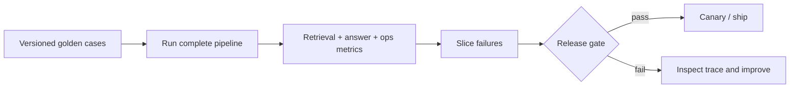
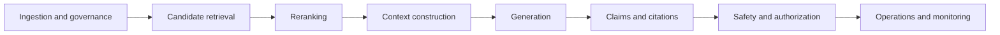

# 04 — RAG evaluation and release gates

**Level:** Intermediate  
**Time:** 2–3 hours  
**Prerequisites:** [query planning and reranking](../03-query-reranking/README.md)

## Learning objectives

After this lesson you will be able to:

- explain why RAG evaluation must be stratified by pipeline stage and not collapsed to a single score;
- design a versioned golden dataset with representative slices, including dev, validation, held-out, regression, adversarial, and production feedback sets;
- measure retrieval quality independently of answer quality;
- apply key metrics: Recall@K, Precision@K, MRR, nDCG, context precision, context recall, faithfulness, answer relevance, citation validity, and abstention accuracy;
- explain confidence intervals and paired statistical comparisons for RAG evaluation;
- calibrate and audit LLM-based judges against human labels;
- perform slice analysis to find regressions masked by aggregate improvements;
- build a release gate that blocks ship on retrieval, answer, safety, latency, and cost failures;
- compute cost per successful supported answer; and
- connect offline evaluation to online monitoring and production feedback.

## Outcome

Build an evaluation harness that separates retrieval quality, answer support, abstention, operational behavior, and safety. Define a versioned golden dataset, inspect failure slices, and make an explicit ship/no-ship decision.

## Guided notebook

Open [`evaluation.ipynb`](evaluation.ipynb). The reusable implementation is [`lab.py`](lab.py).



## Evaluation is a diagnostic system of measurements

RAG evaluation is not one final-answer score. A fluent answer can hide a retriever that missed the authoritative source, a context builder that removed the needed passage, a citation that does not support its claim, an authorization leak, or latency that makes the product impractical. 

The six promises are separate: **answer** (useful and correct), **evidence** (grounded), **retrieval** (finds relevant material), **citation** (verifiable), **safety** (bounded and permission-aware), and **operations** (fresh, observable, fast, and affordable). A change can improve one promise while harming another, so report a metric vector and failure slices rather than a single “RAG score.”

**The most common evaluation mistake** is reporting one "RAG score" that hides failures in specific layers, slices, or safety dimensions.



## The evaluation dataset lifecycle

### Dataset types

A mature evaluation system maintains several distinct datasets, each serving a different purpose:

| Dataset | Purpose | Who maintains it | Update frequency |
|---|---|---|---|
| **Dev set** | Fast feedback during active development | Engineering | Frequently |
| **Validation set** | Tune thresholds and make design choices | Engineering | As needed |
| **Held-out test set** | Measure final quality; never tune against | Engineering + product | Rarely |
| **Regression set** | Detect improvements that break existing behavior | Engineering | Each release |
| **Adversarial set** | Test robustness and safety under attack | Security/red team | Periodically |
| **Production feedback set** | Review real failures and high-value interactions | Operations | Continuously |

**Critical rule:** once a test set is used to make a decision, it has been "contaminated" for that decision. Evaluating multiple configurations against the same held-out set inflates apparent quality. Periodically refresh held-out sets with newly reviewed production cases.

### What a golden case must contain

```python
EvalCase(
    query="European checkout is slow after the release",
    relevant_ids=frozenset({"incident-eu", "deployment-842"}),
    slice="paraphrase",
    answerable=True,
    expected_abstain=False,
    failure_mode="freshness",       # what failure type this tests
    corpus_version="2024-Q1",
    policy_version="v3",
    reviewer="alice@northstar.io",
    rationale="Tests whether hybrid retrieval finds the deployment that caused EU slowdown",
)
```

Every evaluation record should carry a question, reference answer or acceptance criteria, relevant documents and passages, expected citations, question type, difficulty, freshness requirements, authorization constraints, business severity, and expected behavior. Include factual, synthesis, multi-hop, temporal, conflicting, unanswerable, permission-boundary, and adversarial questions. Add **impossible-without-corpus** cases so the foundation model cannot mask a broken retriever with general knowledge. Do not add cases without a reviewer rationale — anonymous cases obscure the intent when debugging.

## Metrics by failure boundary

Measure retrieval quality before measuring answer quality. A retrieval failure cannot be repaired by generation. 

| Boundary | Measure | Diagnostic question |
| --- | --- | --- |
| **Candidate retrieval** | Recall@K, Precision@K, hit rate, MRR | Did the correct evidence appear and how early? |
| **Reranking** | nDCG@K, reranked recall | Did the strongest evidence move into the usable range? |
| **Context** | Context recall, precision, freshness, ordering | Did the model actually see sufficient, authorized evidence? |
| **Generation** | Correctness, relevance, completeness, faithfulness | Is the answer right, useful, complete, and supported? |
| **Citations** | Validity, correctness, completeness, precision | Does each factual claim map to supporting evidence? |
| **Safety** | Refusal/abstention accuracy, leak rate, attack success rate | Does the system remain inside evidence and policy boundaries? |
| **Operations** | P50/P95 latency, cost/query, no-result rate, drift | Can the system sustain the workflow after release? |

**Retrieval is not ranking, and ranking is not context.** Measure candidate recall, reranked top-K quality, and useful evidence in the final context separately. A relevant chunk can be retrieved at rank 37, promoted by a reranker, then dropped by a context budget or metadata filter. 

Store retrieval trace IDs at every stage (after retrieval, after reranking, after context generation) to localize exactly where evidence was lost.

### Slice metrics

Always compute metrics by slice, not only in aggregate. An aggregate Recall@10 improvement of 3% may hide a 15% regression on no-answer cases or a cross-tenant isolation failure. Examples of slices include: query type (direct/paraphrase), source age (fresh/stale), tenant boundary, and language.

## Correctness and grounding can disagree

Does every claim in the answer follow from the retrieved context?

- **Faithfulness = 1.0**: every claim is supported by the provided context
- **Faithfulness = 0.5**: half the claims are supported; half are not

A system can have perfect faithfulness and still be factually wrong (if the source is wrong). A system can have 0.5 faithfulness with perfectly accurate facts (if the model drew on parametric knowledge, not context). Measure faithfulness separately from factual correctness.

| | Grounded | Ungrounded |
| --- | --- | --- |
| **Correct** | Ideal RAG behavior | Lucky answer from parametric knowledge |
| **Incorrect** | Faithful use of stale or low-authority evidence | Hallucination or unsupported assertion |

For high-impact answers, move from answer-level review to claim-level review: extract material claims, resolve citations, test support/entailment, label severity, and aggregate citation completeness. A mostly supported answer can still contain one critical unsupported policy claim.

### Citation validity and correctness

- **Citation validity**: Cited IDs exist in the retrieved set (Deterministic set lookup)
- **Citation correctness**: Cited source actually supports the specific claim (Entailment or LLM judge)
- **Citation completeness**: Every factual claim has at least one citation (Coverage audit)

Citation validity is a **deterministic check** that should run before every answer is returned. Citation correctness requires more expensive evaluation.

### Abstention accuracy

Two-sided accuracy:
- **False answer rate**: answers given when the question is not answerable
- **False abstention rate**: abstentions on questions the corpus can answer

Both failures have real costs. False answers create incorrect beliefs. False abstentions make the system useless for supported queries. Tune thresholds on the validation set; measure on the held-out set.

## LLM judges: calibration and audit

LLM-as-a-judge can scale nuanced assessments (like faithfulness or answer relevance), but evaluate the judge itself against expert labels. 

### What a judge can do well
- Assess nuanced claim support (better than pure lexical matching)
- Evaluate helpfulness and answer relevance
- Scale to large evaluation sets

### What a judge cannot do
- Self-justify truth: a judge score is not a calibrated probability
- Replace human review for high-stakes decisions
- Evaluate its own failures reliably

**Judge failure modes:**
- **Length bias**: favors longer answers regardless of quality
- **Authority bias**: prefers formal-sounding language
- **Position bias**: in listwise evaluation, prefers answers shown first
- **Self-consistency failure**: same query produces different scores on different runs

### Calibration methodology

1. **Collect human labels** for a representative set of 100–500 cases. Human labels are the ground truth.
2. **Run the judge** on the same cases.
3. **Measure agreement**: Cohen's kappa, Pearson correlation, or AUC depending on the judgment type.
4. **Inspect disagreements**: find systematic biases. Send high-severity or uncertain disagreements to human review.
5. **Version the judge**: record model version, prompt version, rubric version alongside every judge score. A score without versioning is unreproducible.
6. **Re-calibrate** when the judge model, prompt, or rubric changes.

Deterministic checks should remain deterministic where possible: source IDs, authorization filters, exact policy versions, schema validity, and latency budgets do not need an LLM judge.

## Statistical confidence in evaluation

A 2% improvement in MRR on a 50-question golden set is almost certainly noise. Use statistical methods before acting on evaluation results.

For Recall@K with N examples, proportion p: `95% CI = p ± 1.96 × sqrt(p × (1-p) / N)`

A 50-question set has wide confidence intervals. A 500-question set provides tighter bounds. Know your sample size before making release decisions.

When comparing configuration A vs B, **always compare on the same held-out cases**. Comparing A on one set and B on another conflates configuration effect with data variance. Use a Sign test or paired t-test to ensure the mean difference is significantly nonzero.

## Operational and security evaluation

Retrieval and answer quality are necessary but not sufficient for a release gate.

### Operational metrics

- **End-to-end p95 latency:** < 3s
- **Per-stage p95 latency:** Retrieval < 200ms, reranking < 400ms
- **Cost per successful supported answer:** < $0.10 per grounded cited answer
- **Cache hit rate:** > 30% for stable corpora
- **Corpus freshness lag:** < 4 hours for operational corpora

**Cost per successful supported answer** is the most important economic metric. It accounts for the quality of the answers, not just the throughput. A configuration that is 20% cheaper but produces 40% fewer grounded answers is not a cost reduction — it is a quality failure.

### Stress testing and release gates

Deliberately inject noise, bury evidence, add conflicting versions, remove required evidence, paraphrase queries, and embed malicious instructions in retrieved documents. Treat retrieved text as **data**, never as instructions. 

Security test failures are **hard release blocks** — not metrics to average with quality scores. Enforce authorization before retrieval and context construction, then measure unauthorized-retrieval rate, sensitive-context exposure, refusal correctness, unsupported-answer rate, and attack success rate.

## Connecting offline evaluation to online monitoring

Offline evaluation (the release gate) tells you whether a configuration *should* be promoted. Online monitoring (the operating layer) tells you whether it *is* performing as expected in production.

Traces should connect query, rewrites, retrieved chunks, reranker scores, final context, model calls, citations, judge scores, latency, tokens, cost, user feedback, and escalation. 

**Alert triggers:** empty-retrieval spikes, route distribution shifts, faithfulness regression, authorization denial anomalies, p99 latency SLO breach, and cost-per-success degradation. Each alert should have an owner, a runbook, and a rollback plan.

## Step-by-step evaluation build

### Step 1 — Build a representative golden set
Use real, anonymized failures and carefully reviewed scenarios — not only easy FAQ questions. 

### Step 2 — Measure retrieval before answer quality
Store retrieval trace IDs at every stage: after first-stage retrieval, after reranking, and after context construction. A failure is diagnosable only if you know where the evidence was lost.

### Step 3 — Evaluate answer behavior with evidence
Measure whether claims are supported by final context, citations identify that context, the answer addresses the request, and the system abstains when evidence is absent. 

### Step 4 — Add operational and security release gates
Track stage latency, cost per case, retries, cache behavior, and corpus versions. Add authorization and adversarial cases as hard constraints. A configuration that improves an average but leaks tenant data, lacks citations, or exceeds p95 budget must fail.

### Step 5 — Diagnose, change one variable, repeat
Inspect the trace. Change one controlled variable, rerun a held-out suite, and compare slices. Do not tune repeatedly against the same holdout; periodically refresh with reviewed production failures.

## Checkpoint

1. Why can 100% candidate recall still produce an unsupported answer?
2. What is the difference between candidate recall and context recall, and which stage failure explains each?
3. A judge gives your system faithfulness = 0.85. What do you need to know before trusting that number?
4. Why do slice metrics matter when aggregate MRR improved?
5. Which of your evaluation conditions should be a hard release block rather than an averaged metric?
6. What is cost per successful supported answer, and why is it a better metric than cost per request?
7. Your evaluation set has 30 cases. Your configuration improves Recall@10 by 4%. Should you ship? Why or why not?
8. What does a security test failure mean for your release gate?

## References

- [One+i: Evaluating RAG systems beyond the demo](https://oneplusi.io/blog/article/evaluating-rag-systems/) — course conceptual framework and practical evaluation playbook.
- Es et al., [Ragas: Automated Evaluation of Retrieval Augmented Generation](https://arxiv.org/abs/2309.15217)
- Ragas, [Available metrics](https://docs.ragas.io/en/stable/concepts/metrics/available_metrics/) — maintained metric catalog
- DeepEval, [Metrics documentation](https://docs.confident-ai.com/docs/metrics-introduction)
- TruLens, [RAG Triad](https://www.trulens.org/getting_started/core_concepts/rag_triad/)
- NIST, [Generative AI Profile](https://nvlpubs.nist.gov/nistpubs/ai/NIST.AI.600-1.pdf) — governance context
- Gao et al., [Retrieval-Augmented Generation for Large Language Models: A Survey](https://arxiv.org/abs/2312.10997) — research overview
- Arize Phoenix, [RAG tracing and evaluation](https://docs.arize.com/phoenix)
- LangSmith, [Evaluation and tracing documentation](https://docs.smith.langchain.com/evaluation)
- OpenTelemetry, [Observability specification](https://opentelemetry.io/docs/)
- Liu et al., [G-Eval: NLG Evaluation using GPT-4 with Better Human Alignment](https://arxiv.org/abs/2303.16634)
- RAGBench, [Explainable RAG Evaluation Research](https://arxiv.org/abs/2407.11005)
- RAGChecker, [Fine-grained RAG Framework](https://arxiv.org/abs/2408.08067)
