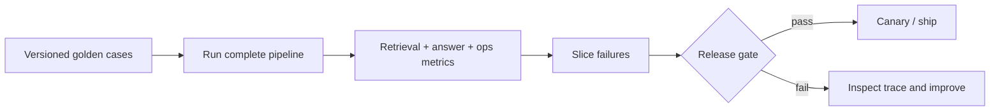

# 04 — RAG evaluation and release gates

**Level:** Intermediate<br>
**Time:** 2–3 hours<br>
**Prerequisites:** [query planning and reranking](../03-query-reranking/README.md)

## Outcome

Build an evaluation harness that separates retrieval quality, answer support,
abstention, operational behavior, and safety. Define a versioned golden dataset,
inspect failure slices, and make an explicit ship/no-ship decision.

## Guided notebook

Open [`evaluation.ipynb`](evaluation.ipynb). The reusable, credential-free
implementation is [`lab.py`](lab.py).



## Evaluation is a system of measurements

RAG can fail before generation (wrong, stale, unauthorized, or missing
evidence), at generation (unsupported or unhelpful answer), or in operation
(slow, expensive, unstable, or unsafe behavior). Evaluate each layer separately
and connect them through one trace. Retrieval metrics do not prove answer
faithfulness; they answer the narrower question of whether labeled evidence was
returned.

## Step-by-step training

### 1. Define a representative golden set

Use real, anonymized failures and carefully reviewed scenarios—not only easy
FAQ questions. Each case needs a query, relevant source IDs, answerability,
failure-mode slice, corpus/policy version, and reviewer rationale. Include exact
identifiers, paraphrases, multi-hop requests, no-answer cases, fresh/stale
content, permission boundaries, prompt-injection content, and high-impact
business workflows.

### 2. Measure retrieval before answer quality

| Metric | Question it answers | Common misuse |
| --- | --- | --- |
| Recall@K | Did the candidate/context include labeled evidence? | treating it as answer correctness |
| Precision@K | How much visible evidence is relevant? | penalizing legitimate multi-source context blindly |
| MRR | How early is the first relevant result? | ignoring other required evidence |
| nDCG@K | Is ordering useful across several labels? | using unreviewed labels |
| Slice metrics | Which query type regressed? | publishing only an average |

Candidate recall and final-context recall are distinct. Store source IDs after
retrieval, filtering, reranking, and context construction so a failure is
diagnosable.

### 3. Evaluate answer behavior with evidence

Measure whether claims are supported by final context, citations identify that
context, the answer addresses the request, and the system abstains when evidence
is absent. Deterministic validators check citation IDs, schemas, and policy
constraints. Human review and calibrated model judges assess nuanced support and
helpfulness. A model judge is not self-justifying truth: calibrate it against
human labels, inspect disagreements, and version its model and rubric.

### 4. Add operational and security release gates

Track stage/end-to-end latency, cost per case, retries, cache behavior, and
source versions. Add authorization and adversarial cases as hard constraints. A
configuration that improves an average but leaks tenant data, lacks citations,
or exceeds p95 budget must fail.

### 5. Diagnose, change one variable, repeat

Inspect the trace—query plan, filters, retrieved IDs, reranker scores, context
IDs, citations, evaluator version, and timings. Change one controlled variable,
rerun a held-out suite, and compare slices. Do not tune repeatedly against the
same holdout; periodically refresh with reviewed production failures.

## Dataset and trace contract

```python
EvalCase(
    query="European checkout is slow after the release",
    relevant_ids=frozenset({"incident-eu", "deployment-842"}),
    slice="paraphrase",
    answerable=True,
)

EvalObservation(
    query="European checkout is slow after the release",
    retrieved_ids=("incident-eu", "deployment-842"),
    cited_ids=("incident-eu", "deployment-842"),
    answered=True,
    supported=True,
    latency_ms=840,
    estimated_cost=0.012,
)
```

The lab’s `release_report` exposes retrieval recall and MRR, citation coverage,
abstention accuracy, p95 latency, and average cost. Thresholds are product-risk
policy, not universal constants.

## Tools and techniques

| Need | Practical choice | Notes |
| --- | --- | --- |
| Deterministic regression tests | Python/pytest + versioned fixtures | fast CI baseline |
| RAG metrics | Ragas, DeepEval, custom metrics | validate judges on your corpus |
| Traces/experiments | OpenTelemetry, LangSmith, Phoenix, provider tracing | retain IDs/versions; protect data |
| Human evaluation | rubric, double review, disagreement analysis | essential for high-impact quality |
| Online feedback | explicit feedback plus sampled review | watch selection bias and drift |

## Anti-patterns

- Reporting one “RAG score” while hiding retrieval, support, and safety failures.
- Evaluating only answer text and never the retrieved/cited evidence.
- Using production traffic or synthetic-only prompts as the whole test set.
- Treating a judge score as a calibrated probability.
- Shipping an average gain that regresses tenant-isolation, no-answer, or
  high-value slices.

## Checkpoint

1. Why can 100% retrieval recall still produce an unsupported answer?
2. Which trace IDs distinguish retrieval failure from context truncation?
3. When should a no-answer case be successful?
4. Why do slice metrics matter if aggregate MRR improved?
5. Which of your conditions is a hard release block rather than an average?

## References

- Es et al., [Ragas: Automated Evaluation of Retrieval Augmented Generation](https://arxiv.org/abs/2309.15217).
- Ragas, [available metrics](https://docs.ragas.io/en/stable/concepts/metrics/available_metrics/) — maintained metric catalog.
- NIST, [Generative AI Profile](https://nvlpubs.nist.gov/nistpubs/ai/NIST.AI.600-1.pdf) — governance context.
- Gao et al., [Retrieval-Augmented Generation for Large Language Models: A Survey](https://arxiv.org/abs/2312.10997) — research overview.
