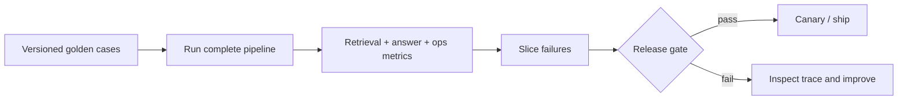

# 04 — RAG evaluation and release gates

**Level:** Intermediate  
**Time:** 2–3 hours  
**Prerequisites:** [query planning and reranking](../03-query-reranking/README.md)

## Learning objectives

After this lesson you will be able to:

- explain why RAG evaluation must be stratified by pipeline stage and not collapsed to a single score;
- design a versioned golden dataset with representative slices, including dev, validation, held-out, regression, adversarial, and production feedback sets;
- measure retrieval quality independently of answer quality;
- apply key metrics: Recall@K, Precision@K, MRR, nDCG, context precision, context recall, faithfulness, answer relevance, citation validity, and abstention accuracy;
- explain confidence intervals and paired statistical comparisons for RAG evaluation;
- calibrate and audit LLM-based judges against human labels;
- perform slice analysis to find regressions masked by aggregate improvements;
- build a release gate that blocks ship on retrieval, answer, safety, latency, and cost failures;
- compute cost per successful supported answer; and
- connect offline evaluation to online monitoring and production feedback.

## Outcome

Build an evaluation harness that separates retrieval quality, answer support, abstention, operational behavior, and safety. Define a versioned golden dataset, inspect failure slices, and make an explicit ship/no-ship decision.

## Guided notebook

Open [`evaluation.ipynb`](evaluation.ipynb). The reusable implementation is [`lab.py`](lab.py).



## Evaluation is a system of measurements

RAG can fail before generation (wrong, stale, unauthorized, or missing evidence),
at generation (unsupported or unhelpful answer), or in operation (slow, expensive,
unstable, or unsafe behavior). Evaluate each layer separately and connect them through
one trace. Retrieval metrics do not prove answer faithfulness; they answer the narrower
question of whether labeled evidence was returned.

**The most common evaluation mistake** is reporting one "RAG score" that hides
failures in specific layers, slices, or safety dimensions.

---

## The evaluation dataset lifecycle

### Dataset types

A mature evaluation system maintains several distinct datasets, each serving a
different purpose:

| Dataset | Purpose | Who maintains it | Update frequency |
|---|---|---|---|
| **Dev set** | Fast feedback during active development | Engineering | Frequently |
| **Validation set** | Tune thresholds and make design choices | Engineering | As needed |
| **Held-out test set** | Measure final quality; never tune against | Engineering + product | Rarely |
| **Regression set** | Detect improvements that break existing behavior | Engineering | Each release |
| **Adversarial set** | Test robustness and safety under attack | Security/red team | Periodically |
| **Production feedback set** | Review real failures and high-value interactions | Operations | Continuously |

**Critical rule:** once a test set is used to make a decision, it has been
"contaminated" for that decision. Evaluating multiple configurations against the
same held-out set inflates apparent quality. Periodically refresh held-out sets
with newly reviewed production cases.

### What a golden case must contain

```python
EvalCase(
    query="European checkout is slow after the release",
    relevant_ids=frozenset({"incident-eu", "deployment-842"}),
    slice="paraphrase",
    answerable=True,
    expected_abstain=False,
    failure_mode="freshness",       # what failure type this tests
    corpus_version="2024-Q1",
    policy_version="v3",
    reviewer="alice@northstar.io",
    rationale="Tests whether hybrid retrieval finds the deployment that caused EU slowdown",
)
```

Every case needs: query, relevant source IDs, answerability, failure-mode slice,
corpus/policy version, reviewer identity, and rationale. Do not add cases without
a reviewer rationale — anonymous cases obscure the intent when debugging.

### Query distribution in the golden set

Include:
- **Direct lookup**: query vocabulary closely matches document vocabulary
- **Paraphrase**: synonyms or rephrasing; semantic not lexical match needed
- **Multi-hop**: requires connecting evidence from multiple documents
- **No-answer**: correct behavior is abstention
- **Stale / superseded**: tests freshness filtering
- **Permission boundary**: authorized for one tenant, not another
- **Adversarial / injection**: tests robustness against prompt injection in retrieved content
- **High-impact business workflows**: failures here are most costly

Aggregate metrics over the full set can look good while failing catastrophically
on one of these slices.

---

## Retrieval metrics

Measure retrieval quality before measuring answer quality. A retrieval failure
cannot be repaired by generation. Retrieval metrics answer the narrower question:
*was labeled evidence returned?*

### Core metrics

| Metric | Formula | Question answered | Common misuse |
|---|---|---|---|
| **Recall@K** | (relevant retrieved in top-K) / (total relevant) | Did the candidate set include labeled evidence? | Treating it as answer correctness |
| **Precision@K** | (relevant in top-K) / K | How much of the returned set is relevant? | Penalizing legitimate multi-source context |
| **MRR** | mean of 1/rank of first relevant result | How early is the first relevant result? | Ignoring other required evidence for multi-hop |
| **nDCG@K** | Normalized Discounted Cumulative Gain at K | Is ordering useful across several graded labels? | Using unreviewed or coarse relevance labels |

### Candidate vs context recall

Two distinct measurements, often conflated:

**Candidate recall**: does the correct chunk appear anywhere in the first-stage
retrieval output (before reranking and context trimming)?

**Context recall**: does the correct chunk appear in the final context sent to
the model?

A system can have high candidate recall but low context recall if reranking
pushed relevant evidence below the context budget, or if deduplication removed
it. Store source IDs after retrieval, after reranking, and after context
construction so you can localize the failure.

```python
EvalObservation(
    query="European checkout is slow after the release",
    retrieved_ids=("incident-eu", "deployment-842"),
    reranked_ids=("incident-eu", "deployment-842"),     # did reranking preserve them?
    context_ids=("incident-eu",),                       # was deployment-842 truncated?
    cited_ids=("incident-eu", "deployment-842"),
    answered=True,
    supported=True,
    latency_ms=840,
    estimated_cost=0.012,
)
```

### Slice metrics

Always compute metrics by slice, not only in aggregate. An aggregate Recall@10
improvement of 3% may hide a 15% regression on no-answer cases or a cross-tenant
isolation failure.

| Slice | What it detects |
|---|---|
| by query type (direct / paraphrase / multi-hop) | Which retrieval strategy handles which query type |
| by source age (fresh / stale) | Freshness filter behavior |
| by tenant boundary | Isolation failures |
| by failure mode (synonym / compound / injection) | Which failure mode is still present |
| by document type (runbook / policy / FAQ) | Strategy performance by content type |
| by language | Multilingual coverage |

---

## Answer quality metrics

### Faithfulness / groundedness

Does every claim in the answer follow from the retrieved context?

- **Faithfulness = 1.0**: every claim is supported by the provided context
- **Faithfulness = 0.5**: half the claims are supported; half are not

A system can have perfect faithfulness and still be factually wrong (if the source
is wrong). A system can have 0.5 faithfulness with perfectly accurate facts (if the
model drew on parametric knowledge, not context).

Measure faithfulness separately from factual correctness. They are different
failure modes.

### Answer relevance

Does the answer address the question asked? An answer can be grounded and faithful
to context while not answering the actual question. Measure this with:
- semantic similarity between question and answer (coarse)
- LLM judge with a rubric (richer but requires calibration)
- human review (ground truth for high-stakes decisions)

### Citation validity and correctness

| Check | What it validates | How to implement |
|---|---|---|
| Citation presence | Answer contains source references | Parse citation syntax |
| Citation validity | Cited IDs exist in the retrieved set | Deterministic set lookup |
| Citation correctness | Cited source actually supports the specific claim | Entailment or LLM judge |
| Citation completeness | Every factual claim has at least one citation | Coverage audit |

Citation validity is a **deterministic check** that should run before every
answer is returned. Citation correctness requires more expensive evaluation.

### Abstention accuracy

Two-sided accuracy:

- **False answer rate**: answers given when the question is not answerable
- **False abstention rate**: abstentions on questions the corpus can answer

Both failures have real costs. False answers create incorrect beliefs. False
abstentions make the system useless for supported queries. Tune thresholds
on the validation set; measure on the held-out set.

---

## LLM judges: calibration and audit

An LLM judge is useful but requires careful treatment.

### What a judge can do well
- Assess nuanced claim support (better than pure lexical matching)
- Evaluate helpfulness and answer relevance
- Scale to large evaluation sets

### What a judge cannot do
- Self-justify truth: a judge score is not a calibrated probability
- Replace human review for high-stakes decisions
- Evaluate its own failures reliably

### Calibration methodology

1. **Collect human labels** for a representative set of 100–500 cases. Human
   labels are the ground truth.
2. **Run the judge** on the same cases.
3. **Measure agreement**: Cohen's kappa, Pearson correlation, or AUC depending
   on the judgment type.
4. **Inspect disagreements**: find systematic biases (judge prefers longer answers,
   verbose citations, etc.).
5. **Version the judge**: record model version, prompt version, rubric version
   alongside every judge score. A score without versioning is unreproducible.
6. **Re-calibrate** when the judge model, prompt, or rubric changes.

**Judge failure modes:**
- **Length bias**: favors longer answers regardless of quality
- **Authority bias**: prefers formal-sounding language
- **Position bias**: in listwise evaluation, prefers answers shown first
- **Self-consistency failure**: same query produces different scores on different runs

Mitigate with averaging over multiple prompts, position shuffling, and calibration
against human labels.

---

## Statistical confidence in evaluation

A 2% improvement in MRR on a 50-question golden set is almost certainly noise.
Use statistical methods before acting on evaluation results.

### Confidence intervals

For Recall@K with N examples, proportion p:

```
95% CI = p ± 1.96 × sqrt(p × (1-p) / N)
```

A 50-question set has wide confidence intervals. A 500-question set provides
tighter bounds. Know your sample size before making release decisions.

### Bootstrap estimates

For complex metrics (nDCG, composite scores):

1. Sample N cases with replacement B times (B = 1000 typical)
2. Compute the metric for each bootstrap sample
3. Report the 2.5th and 97.5th percentiles as the 95% CI

### Paired comparisons

When comparing configuration A vs B on the same cases:

- **Sign test**: does A beat B on more than half the cases?
- **Paired t-test**: is the mean difference significantly nonzero? (requires normality)
- **Wilcoxon signed-rank test**: non-parametric paired comparison

**Always compare on the same held-out cases**. Comparing A on one set and B on
another conflates configuration effect with data variance.

---

## Operational and security evaluation

Retrieval and answer quality are necessary but not sufficient for a release gate.

### Operational metrics

| Signal | Threshold type | Example |
|---|---|---|
| End-to-end p95 latency | Hard SLO | p95 < 3s |
| Per-stage p95 latency | Diagnostic | Retrieval < 200ms, reranking < 400ms |
| Cost per request | Budget | < $0.015 per request |
| **Cost per successful supported answer** | Quality-adjusted economics | < $0.10 per grounded cited answer |
| Cache hit rate | Efficiency | > 30% for stable corpora |
| Retry rate | Stability | < 5% |
| Corpus freshness lag | Recency | < 4 hours for operational corpora |

**Cost per successful supported answer** is the most important economic metric.
It accounts for the quality of the answers, not just the throughput. A
configuration that is 20% cheaper but produces 40% fewer grounded answers is
not a cost reduction — it is a quality failure.

```python
cost_per_success = total_cost / (n_answered × faithfulness_rate × citation_valid_rate)
```

### Security evaluation

| Test | What it proves |
|---|---|
| Cross-tenant retrieval | No authorized content from Tenant B reaches Tenant A |
| Prompt injection in retrieved documents | Injected instructions are treated as data, not executed |
| Citation of unauthorized sources | Filters block unauthorized content from citations |
| Adversarial queries | System abstains or routes safely under attack |
| Stale source after revocation | Revoked content is not retrieved after tombstone propagation |
| Cache isolation | Two tenants with the same query get independent cache entries |

Security test failures are **hard release blocks** — not metrics to average with
quality scores.

---

## Tools and techniques

| Need | Practical choice | Notes |
|---|---|---|
| Deterministic regression tests | Python/pytest + versioned fixtures | Fast CI baseline; run on every PR |
| RAG metrics framework | Ragas, DeepEval | Validate judges on your corpus; do not use defaults blindly |
| Traces and experiments | OpenTelemetry, LangSmith, Phoenix, Arize | Retain IDs/versions; apply data redaction and retention policy |
| Human evaluation | Rubric + double review + disagreement analysis | Essential for high-impact quality gates |
| Online feedback | Explicit ratings + sampled review | Watch selection bias and feedback drift |
| Statistical testing | scipy.stats, bootstrap libraries | Compute CIs before reporting improvements |

### Ragas metric reference

Core Ragas metrics (validate these on your corpus before reporting):

| Metric | Measures | Notes |
|---|---|---|
| `context_precision` | Fraction of retrieved context that is relevant | Requires relevance labels |
| `context_recall` | Fraction of relevant evidence retrieved | Requires reference answers |
| `faithfulness` | Fraction of claims supported by context | LLM-judged; calibrate against human labels |
| `answer_relevance` | How well the answer addresses the question | LLM-judged |
| `answer_correctness` | Factual agreement with a reference answer | Requires reference; LLM-judged |

### DeepEval metrics

DeepEval provides additional metrics including G-Eval (LLM-as-judge with
custom criteria), hallucination detection, and contextual precision/recall.
Use multiple frameworks to cross-check: different implementations may give
different results on the same data.

---

## The release report contract

```python
EvalObservation(
    query="European checkout is slow after the release",
    retrieved_ids=("incident-eu", "deployment-842"),
    cited_ids=("incident-eu", "deployment-842"),
    answered=True,
    supported=True,
    latency_ms=840,
    estimated_cost=0.012,
)
```

The lab's `release_report` exposes:
- retrieval recall and MRR
- context precision and recall
- citation coverage and validity
- faithfulness and abstention accuracy
- p95 latency by stage
- average cost and cost per successful supported answer

**Thresholds are product-risk policy, not universal constants.** A medical
diagnostic assistant requires higher faithfulness and citation completeness than
a FAQ chatbot. Set thresholds based on the consequences of failure in your domain.

---

## Anti-patterns

- Reporting one "RAG score" while hiding retrieval, support, and safety failures.
- Evaluating only answer text and never the retrieved/cited evidence.
- Using production traffic or synthetic-only prompts as the entire test set.
- Treating a judge score as a calibrated probability without calibration.
- Shipping an average gain that regresses tenant-isolation, no-answer, or
  high-value slices.
- Evaluating on the tuning set (test set contamination).
- Reporting aggregate metrics without confidence intervals on small sets.
- Treating security test failures as metrics to trade off against quality metrics.
- Using cost reduction as a justification when quality-adjusted cost increased.

---

## Connecting offline evaluation to online monitoring

Offline evaluation tells you whether a configuration *should* be promoted.
Online monitoring tells you whether it *is* performing as expected in production.

| Signal | Offline (golden set) | Online (production) |
|---|---|---|
| Retrieval recall | Measured on labeled cases | Estimated via sampled review |
| Faithfulness | Judge on labeled cases | Sampled judge + user feedback |
| Abstention rate | Counted on no-answer cases | Route distribution monitoring |
| Latency | Measured over golden runs | P50/P95/P99 on live traffic |
| Cost | Computed for golden runs | Accumulated per tenant, per hour |
| Citation validity | Deterministic on all cases | Deterministic on production responses |

**Alert triggers:** empty-retrieval spikes, route distribution shifts,
faithfulness regression, authorization denial anomalies, p99 latency SLO breach,
and cost-per-success degradation. Each alert should have an owner, a runbook,
and a rollback plan.

---

## Step-by-step evaluation build

### Step 1 — Build a representative golden set

Use real, anonymized failures and carefully reviewed scenarios — not only easy
FAQ questions. Each case needs a query, relevant source IDs, answerability, failure-mode
slice, corpus/policy version, and reviewer rationale. Include exact identifiers,
paraphrases, multi-hop requests, no-answer cases, fresh/stale content, permission
boundaries, adversarial content, and high-impact business workflows.

### Step 2 — Measure retrieval before answer quality

Store retrieval trace IDs at every stage: after first-stage retrieval, after
reranking, and after context construction. A failure is diagnosable only if you
know where the evidence was lost.

### Step 3 — Evaluate answer behavior with evidence

Measure whether claims are supported by final context, citations identify that
context, the answer addresses the request, and the system abstains when evidence
is absent. Deterministic validators check citation IDs, schemas, and policy
constraints. Human review and calibrated model judges assess nuanced support.

### Step 4 — Add operational and security release gates

Track stage latency, cost per case, retries, cache behavior, and corpus versions.
Add authorization and adversarial cases as hard constraints. A configuration that
improves an average but leaks tenant data, lacks citations, or exceeds p95 budget
must fail.

### Step 5 — Diagnose, change one variable, repeat

Inspect the trace: query plan, filters, retrieved IDs, reranker scores, context
IDs, citations, evaluator version, and timings. Change one controlled variable,
rerun a held-out suite, and compare slices. Do not tune repeatedly against the
same holdout; periodically refresh with reviewed production failures.

---

## Checkpoint

1. Why can 100% candidate recall still produce an unsupported answer?
2. What is the difference between candidate recall and context recall, and which
   stage failure explains each?
3. A judge gives your system faithfulness = 0.85. What do you need to know before
   trusting that number?
4. Why do slice metrics matter when aggregate MRR improved?
5. Which of your evaluation conditions should be a hard release block rather than
   an averaged metric?
6. What is cost per successful supported answer, and why is it a better metric
   than cost per request?
7. Your evaluation set has 30 cases. Your configuration improves Recall@10 by 4%.
   Should you ship? Why or why not?
8. What does a security test failure mean for your release gate?

## References

- Es et al., [Ragas: Automated Evaluation of Retrieval Augmented Generation](https://arxiv.org/abs/2309.15217)
- Ragas, [Available metrics](https://docs.ragas.io/en/stable/concepts/metrics/available_metrics/) — maintained metric catalog
- NIST, [Generative AI Profile](https://nvlpubs.nist.gov/nistpubs/ai/NIST.AI.600-1.pdf) — governance context
- Gao et al., [Retrieval-Augmented Generation for Large Language Models: A Survey](https://arxiv.org/abs/2312.10997) — research overview
- DeepEval, [Metrics documentation](https://docs.confident-ai.com/docs/metrics-introduction)
- Arize Phoenix, [RAG tracing and evaluation](https://docs.arize.com/phoenix)
- LangSmith, [Evaluation and tracing documentation](https://docs.smith.langchain.com/evaluation)
- OpenTelemetry, [Observability specification](https://opentelemetry.io/docs/)
- Liu et al., [G-Eval: NLG Evaluation using GPT-4 with Better Human Alignment](https://arxiv.org/abs/2303.16634)
