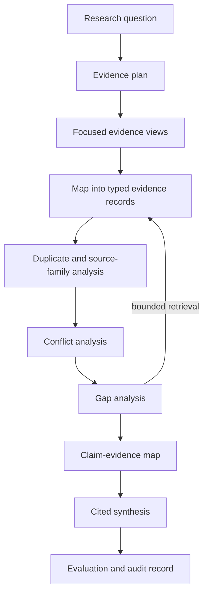

# Intermediate 05 — Research Synthesis: Map, Reduce, Refine, and Preserve Disagreement

**Level:** Intermediate

**Estimated time:** 3–4 hours

**Notebook:** [`05_research_synthesis.ipynb`](05_research_synthesis.ipynb)

**Prerequisite:** [RAG Evaluation](../04-evaluation/README.md)

**Next:** [Local Qdrant](../06-qdrant-local/README.md)

> **Central rule:** Research synthesis is evidence integration, not “retrieve many documents and summarize.”

This lesson preserves the Atlas database-migration scenario, Map-Reduce, Refine, and the original Engineering-versus-QA disagreement. It expands them into an inspectable research workflow in which every material statement remains connected to stable evidence.

## Learning outcomes

After completing the chapter and notebook, you can:

- turn a broad research question into a bounded evidence plan;
- extract typed evidence while preserving application-assigned provenance;
- distinguish citations, sources, and independent source families;
- classify direct, temporal, scope, definition, and unresolved conflicts;
- build a claim-evidence map before generating prose;
- implement Map-Reduce and a deterministic structured-Refine state simulation;
- identify gaps and perform a bounded gap-filling pass;
- evaluate support, citation coverage, conflict coverage, temporal qualification, and source independence; and
- explain how the teaching design should change for production research systems.

## Scenario, success criteria, and boundaries

Atlas is a proposed database platform migration. Engineering, QA, Finance, Security, Operations, Compliance, Architecture, Support, and the vendor have produced reports with different scopes, dates, and incentives. The decision question is:

> What are the benefits, risks, and unresolved concerns of migrating to Atlas?

A successful synthesis must cover cost, performance, security, and operational readiness; expose material disagreements; cite stable evidence IDs; distinguish repeated claims from independent confirmation; qualify changing results by date and scope; and state missing evidence explicitly.

This is not an autonomous web-research agent or a systematic-review automation course. The notebook uses a local synthetic corpus, one bounded gap-filling round, deterministic checks, and an optional live model. Human review remains necessary for consequential decisions.


## 1. Mental model: evidence first, prose last



The invariant is:

```text
source → evidence record → claim-evidence map → cited sentence
```

Do not generate a conclusion first and reconstruct citations afterward. Provenance lost during mapping, compression, or refinement cannot reliably be restored by a polished final prompt.

## 2. Evidence planning

The question is broader than a single retrieval query. Decompose it into a small, inspectable plan:

```python
research_plan = {
    "benefits": ["cost", "latency/performance", "operational efficiency"],
    "risks": ["performance under load", "security", "migration operations"],
    "decision_questions": [
        "Is Atlas ready for production?",
        "Which claims remain disputed?",
    ],
}
```

This is not an agentic planner. It is a coverage contract used to build focused evidence views and later detect omissions. Production plans should also record jurisdiction, time horizon, definitions, inclusion rules, and the point at which evidence collection stops.

## 3. Evidence identity and typed records

Filenames are presentation details, not stable provenance. Give each source and extracted item explicit identity:

```python
{
    "source_id": "qa-load-test-2026",
    "document_id": "qa-load-test",
    "evidence_id": "qa-load-test-2026#latency",
    "title": "Atlas Load Test",
    "source_type": "internal_test",
    "authority": "primary_internal_measurement",
    "date": "2026-06-12",
    "source_family": "qa-load-test",
    "version": "2",
}
```

The notebook maps selected items into a typed `EvidenceRecord` containing the claim, claim type, date, scope, authority, question relevance, and extraction status. The model may propose claim text, but the application attaches and validates `evidence_id`, `source_id`, `source_family`, and source metadata. A structured-output schema prevents malformed shapes; it does not prove the extracted claim is faithful.

Deterministic validation checks that:

- evidence and source IDs exist in the corpus;
- the record still belongs to its originating source;
- source family, date, and authority match trusted metadata;
- irrelevant evidence is marked rather than forced into a claim; and
- duplicate evidence IDs fail closed.

## 4. Focused evidence views

Even when many documents technically fit within a long context window, sending an entire corpus directly to the generator may be inefficient and does not solve evidence selection, provenance, duplication, source authority, conflict handling, or attention-allocation problems.

```text
long context ≠ evidence management
```

The lab creates bounded views for cost, performance, security, and operational readiness using transparent metadata and keyword rules. This is deliberately simpler than the retrieval techniques in [Intermediate 01](../01-retrieval-strategies/README.md): the point is to prevent every synthesis call from receiving every source, not to optimize a retriever.

Focused views may still contain irrelevant material. The Map stage must be allowed to emit `supports_question = false`; otherwise a model is pressured to manufacture relevance.

## 5. Map-Reduce inside the evidence workflow

### Map

```text
selected source
      ↓
structured claim extraction
      ↓
validated EvidenceRecord
```


Map calls are naturally parallelizable and keep per-source extraction inspectable. They also multiply calls, can extract duplicates, and can propagate errors at scale. A real system needs concurrency limits, retry policy, schema validation, source-level error records, and traceable model/prompt versions.

### Reduce

The reducer must not receive an unstructured pile of document summaries. It receives:

```text
research question
claim-evidence map
conflict records
evidence gaps
```

The notebook supports a real configurable reducer when credentials are present and a committed frozen output otherwise. Both use evidence aliases assigned by the application. The model never invents filenames or source URLs.

## 6. Refine as evidence-state refinement

Narrative Refine repeatedly rewrites prose:

```text
previous prose + next source → rewritten prose
```

That design is difficult to audit and vulnerable to recency effects. This lesson instead maintains typed running state:

```text
previous evidence state + next EvidenceRecord → updated evidence state
```

Structured Refine can retain claims, conflicts, gaps, and evidence IDs explicitly. It still introduces sequential dependencies, which can increase wall-clock latency compared with parallelizable map stages. It can also be order-sensitive when state is compressed or capped. The notebook runs the same evidence in two orders and measures retained claims, conflicts, evidence IDs, and final coverage.

The executable Refine path is deterministic state refinement so order and capacity effects remain reproducible. It is not a live-model benchmark: the optional live model path applies to Map extraction and Reduce output only. A schema-constrained model-based state updater is a production extension that needs its own faithfulness, latency, and cost evaluation.

Neither strategy is universally superior:

| Dimension | Map-Reduce | Structured Refine |
|---|---|---|
| Parallelism | Map stage can be parallel | Sequential dependency |
| Global comparison | Strong in reduce step | Emerges incrementally |
| Incremental updates | Usually remap/reduce affected scope | Natural state update |
| Order sensitivity | Mostly reducer/input-order effects | Stronger under bounded state |
| Provenance | Must survive mapping and reduction | Must survive every state update |
| Failure isolation | Per-map failure can be isolated | One failed update can block later evidence |

## 7. Source independence and citation laundering

Three citations are not three confirmations when all derive from one benchmark:

```text
primary benchmark ─┬─> executive memo
                   └─> migration slide deck
```

Track at least:

- `source_id`: the individual artifact;
- `source_family`: the underlying evidence lineage;
- `source_type`: test, audit, memo, vendor claim, and so on;
- date, version, scope, and methodology where available.

For each final claim, report citation count, unique source count, and independent source-family count. A high duplicate-source rate warns that repeated wording may be inflating apparent consensus.

## 8. Authority is contextual, not a truth score

The Atlas lab uses a teaching taxonomy:

```text
primary_internal_measurement
independent_audit
official_policy
vendor_claim
secondary_summary
```

This is not a universal numeric ranking. An independent audit may be authoritative for control effectiveness, an operations log for an incident, and an official policy for requirements. Lower-authority evidence should not be silently discarded; its role and limitations should be visible.

The notebook makes this concrete by comparing the vendor's 40 ms synthetic performance claim with QA's July 120 ms measurement at a defined 4x customer load. Both remain relevant, but the vendor claim is not treated as equivalent independent measurement for the production workload. Authority changes interpretation and follow-up—not truth through a universal numeric weight.

## 9. Conflict analysis before generation

Different statements are not automatically contradictions.

| Conflict type | Atlas example | Interpretation |
|---|---|---|
| Direct | Engineering says production-ready; QA says not ready | Competing conclusions under apparently shared decision scope |
| Scope | 45 ms at normal load; 800 ms under stress | Both may be true under different conditions |
| Temporal | 800 ms in May; 120 ms after July optimization | Later measurement may update, not erase, history |
| Definition | 30% compute-only reduction; 12% total monthly reduction | Different cost boundaries |
| Unresolved | Vendor SLA versus missing customer workload evidence | Available evidence cannot settle the question |


The notebook builds typed `ConflictRecord` objects before prose generation. A conflict can be resolved, partially resolved, or unresolved. Source authority informs interpretation but never authorizes the system to discard an inconvenient result automatically.

## 10. Claim-evidence map

The central pre-generation artifact looks like this:

```python
{
    "claim": "Atlas performance depends on workload and test date.",
    "supporting_evidence": [
        "eng-normal-load-2026#latency",
        "qa-stress-may-2026#latency",
        "qa-stress-july-2026#latency",
    ],
    "contradicting_evidence": [],
    "source_families": ["engineering-benchmark", "qa-load-test"],
    "status": "scope-and-time-qualified",
}
```

The map separates evidence eligibility and interpretation from prose style. It makes unsupported connective reasoning, missing citations, unresolved conflict, and correlated evidence observable before the report sounds convincing.

## 11. Gap analysis and bounded gap filling

Compare the evidence map with the research plan:

```text
Cost                         → evidence found
Performance                  → conflicting, time-qualified evidence
Security                     → evidence found
Rollback procedure           → initially missing
Customer communication plan  → no evidence
```

The notebook performs one targeted local search for rollback evidence, then stops. If the corpus still contains no support, the report must say so. It must not fill the gap from model parametric knowledge.

Bounded gap filling prevents a research loop from becoming an unobservable, unlimited agent. A production policy should define maximum rounds, cost/time budgets, acceptable source types, and escalation conditions.

## 12. Evaluation: polished prose is not the objective

The lab computes deterministic checks where labels exist:

| Metric | Question |
|---|---|
| Claim-evidence link validity | Does every material claim point to known evidence IDs? |
| Citation validity | Does every cited alias resolve to an evidence record? |
| Claim-level citation completeness | Does each structured final claim carry at least one citation? |
| Required-topic coverage | Does the map address the research plan? |
| Detected-conflict coverage | Did the labelled teaching detector find expected conflicts before generation? |
| Report-conflict disclosure | Did the structured synthesis output disclose those conflicts? |
| Source-family diversity | How many independent evidence lineages support claims? |
| Duplicate-source rate | How much citation volume repeats the same lineage? |
| Temporal qualification | Are changing measurements represented with dates/versions? |
| Gap reporting | Are unsupported questions explicitly disclosed? |

Keep relevance and authority separate. Keep citation validity, correctness, and completeness separate. `claim_evidence_link_validity` proves only that a claim points to known evidence IDs; it does not prove semantic entailment. Semantic support requires gold support labels, a calibrated judge, or human review. Likewise, attaching a valid citation to a structured final claim does not by itself prove the evidence supports the wording.

## 13. Cost, latency, and observability

For `N` mapped documents, a basic Map-Reduce workflow uses roughly `N` map calls plus one reduce call. Refine uses approximately `N` sequential update calls. Real wall-clock latency depends on concurrency, rate limits, batching, retries, model latency, and document length.

The notebook measures actual local teaching-runtime latency and records call counts and input characters. Its token values are explicitly estimates in offline mode. Live integrations should capture provider-reported usage, retry counts, queue time, model/version, prompt version, and per-stage latency instead of treating conceptual arithmetic as a benchmark.

## 14. Failure modes and mitigations

| Failure | Why it happens | Control |
|---|---|---|
| Forced relevance | Extractor must emit a claim for every source | Permit explicit irrelevant status |
| Invented provenance | Model creates IDs or filenames | Assign and validate IDs application-side |
| Citation laundering | Derivative reports look independent | Track source families and lineage |
| False contradiction | Scope/date/definition omitted | Preserve qualifiers; classify conflict type |
| Silent consensus | Reducer optimizes for smooth prose | Pass explicit conflict records; test coverage |
| Recency loss in Refine | Later documents dominate bounded state | Typed state, deterministic retention, order tests |
| Gap hallucination | Model wants a complete answer | Pass explicit gaps and require disclosure |
| Long-context omission | Relevant evidence receives weak attention | Focused views, claim map, position/order tests |
| Stale synthesis | New source version is not propagated | Version sources, maps, prompts, and outputs |

## 15. Technology landscape

| Approach | Strength | Limitation | Best fit |
|---|---|---|---|
| Plain Python + Pydantic | Maximum inspectability and deterministic contracts | You build orchestration and tracing | Teaching, prototypes, regulated pipelines |
| LangChain structured output and runnables | Provider integrations and composable calls | Abstractions can hide evidence-state mistakes | Application teams already using LangChain |
| Long-context direct synthesis | Simple for small, curated evidence packets | Does not solve evidence management or reliable attention | Bounded, reviewed packets |
| Hierarchical retrieval/summarization | Scales large corpora and multi-resolution access | Compression can lose provenance | Large repositories with layered summaries |
| Systematic-review tooling | Explicit screening and review workflow | Domain-specific and often human-intensive | High-stakes literature synthesis |

The notebook teaches the provider-neutral primitive in Python first. Optional `ChatOpenAI.with_structured_output(...)` is one implementation example showing how a mainstream integration packages schema-constrained extraction and reduction without making paid APIs mandatory. Live mode requires an explicitly configured `SYNTHESIS_MODEL`; the course does not embed a model name that will age with provider catalogues.

## 16. Production upgrade path

Move from the local lab to production by adding:

1. immutable source snapshots, content hashes, and lineage;
2. document-level authorization before evidence becomes eligible;
3. queue-backed map execution with bounded concurrency and idempotency;
4. schema and semantic extraction validation with quarantine;
5. source/version-aware cache keys and invalidation;
6. durable claim/conflict/gap records rather than prompt-only state;
7. stage-level traces, usage, latency, exclusion reasons, and reviewer actions;
8. a versioned evaluation set with expected claims and conflicts;
9. release gates for unsupported claims, missing conflicts, or invalid citations; and
10. expert review for consequential recommendations.

An audit trail should retain the question and plan versions, selected/excluded source IDs, extraction model and prompt versions, evidence records, conflict decisions, gap-search rounds, claim map, synthesis version, evaluation results, and reviewer actions—without unnecessarily logging sensitive source content.

## 17. State of the art and open problems

**Established practice:** structured evidence records, stable provenance, bounded retrieval, deduplication, explicit conflict handling, and human review for consequential synthesis.

**Emerging practice:** schema-constrained extraction, hierarchical indexing/summarization, automated citation evaluation, and evaluation datasets that score attribution separately from fluency.

**Research frontier:** reliable multi-source reasoning over long contexts, calibration of conflicting evidence, source-lineage recovery, faithful compression, and evaluation of whether citations truly entail each generated claim. Longer context windows improve capacity, but research such as *Lost in the Middle* shows that usable attention and evidence placement remain empirical concerns.

## 18. Exercises

1. Add a derivative vendor slide and show why citation count changes while source-family count does not.
2. Add a newer QA report. Classify whether it resolves or merely narrows the earlier conflict.
3. Corrupt one frozen evidence record’s source ID and confirm validation fails.
4. Change Refine ordering and state capacity; explain every lost record.
5. Add a second gap-filling round and define a defensible stopping policy.
6. Add one material claim without evidence and make the evaluation gate fail.
7. Design an authorization boundary for confidential Finance and Security evidence.
8. Decide when a direct long-context packet is preferable to retrieval plus synthesis.

## 19. Checkpoint

1. Why is research synthesis different from lookup RAG?
2. Why must provenance survive intermediate summaries?
3. When do three citations represent only one independent confirmation?
4. How do scope, time, and definition differences change conflict interpretation?
5. Why is evidence-state Refine easier to audit than narrative Refine?
6. Why must conflict detection and final-report conflict disclosure be measured separately?
7. Why must unresolved gaps appear in the final report?
8. Which metrics are deterministic in this lab, and which require semantic or expert review?

## References

- Lewis et al. — [Retrieval-Augmented Generation for Knowledge-Intensive NLP Tasks](https://arxiv.org/abs/2005.11401)
- Gao et al. — [Retrieval-Augmented Generation for Large Language Models: A Survey](https://arxiv.org/abs/2312.10997)
- Liu et al. — [Lost in the Middle: How Language Models Use Long Contexts](https://arxiv.org/abs/2307.03172)
- Gao et al. — [Enabling Large Language Models to Generate Text with Citations (ALCE)](https://arxiv.org/abs/2305.14627)
- Sarthi et al. — [RAPTOR: Recursive Abstractive Processing for Tree-Organized Retrieval](https://arxiv.org/abs/2401.18059)
- Page et al. — [PRISMA 2020 Statement](https://www.bmj.com/content/372/bmj.n71)
- NIST — [AI RMF Generative AI Profile](https://nvlpubs.nist.gov/nistpubs/ai/NIST.AI.600-1.pdf)
- OpenAI — [Structured Outputs](https://platform.openai.com/docs/guides/structured-outputs)
- LangChain — [ChatOpenAI structured output integration](https://docs.langchain.com/oss/python/integrations/chat/openai#structured-output)

## Key takeaway

**A trustworthy synthesis exposes the structure of the evidence—including duplication, disagreement, and absence—before it produces polished prose.**
