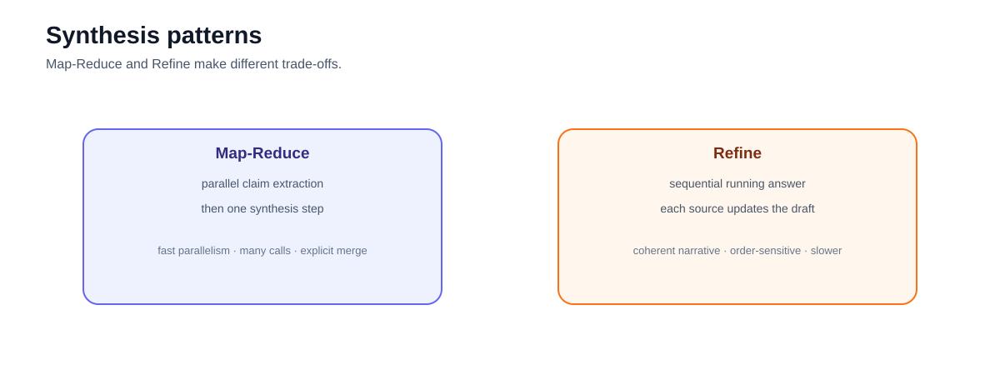
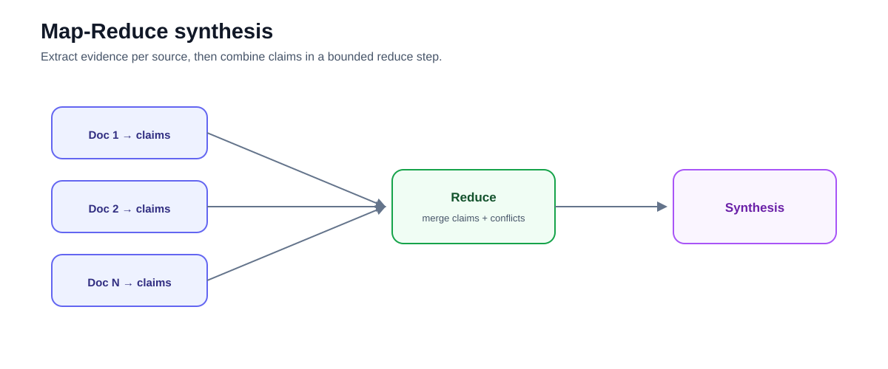
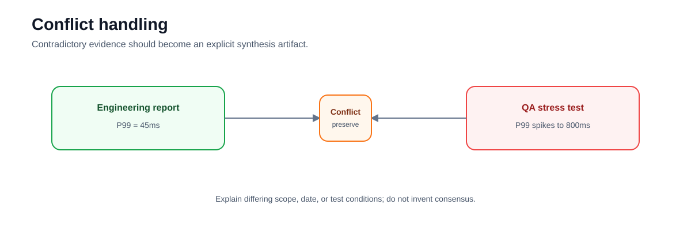

# Intermediate 05 — Research Synthesis: Map, Reduce, Refine, and Preserve Disagreement

**Level:** Intermediate  
**Estimated time:** 2–3 hours  
**Notebook:** [`05_research_synthesis.ipynb`](05_research_synthesis.ipynb)  
**Prerequisite:** [RAG Evaluation](../04-evaluation/README.md)

---

## Why this lesson exists

Lookup RAG asks for one answer from a small evidence set.

Research synthesis asks a broader question across many sources, often with:

- multiple claims;
- duplicate evidence;
- different source authority;
- contradictory findings;
- temporal differences;
- incomplete coverage.

The actual notebook teaches two synthesis patterns:

- **Map-Reduce**;
- **Refine**;

and intentionally includes conflicting evidence.



The old README documented a much larger research workflow and referenced `research_synthesis.ipynb` and `lab.py`, neither of which matches the folder. This README aligns the runnable material with `05_research_synthesis.ipynb` while preserving the production design lessons.

---

## Learning objectives

After this lesson you should be able to:

- explain when synthesis differs from lookup RAG;
- implement the conceptual Map-Reduce pattern;
- explain the Refine pattern;
- compare parallel and sequential synthesis costs;
- preserve source IDs through intermediate claims;
- detect conflicting evidence rather than forcing consensus;
- explain why claim-level provenance matters;
- recognize citation laundering and duplicated source evidence; and
- evaluate synthesis for support, conflict coverage, and evidence gaps.

---

# 1. Map-Reduce

Map:

```text
document 1 → relevant claims
document 2 → relevant claims
document 3 → relevant claims
...
```

Reduce:

```text
all mapped claims
      ↓
synthesis
```



Advantages:

- map calls can run in parallel;
- irrelevant documents can be filtered during mapping;
- per-source claims remain visible.

Risks:

- many model calls;
- reduce step may lose provenance;
- duplicates can appear as false consensus;
- conflicts may be silently collapsed.

---

# 2. Refine

Refine is sequential:

```text
doc 1 → draft
doc 2 + draft → updated draft
doc 3 + draft → updated draft
...
```

Advantages:

- coherent running narrative;
- each document can update prior conclusions.

Risks:

- sequential latency;
- order sensitivity;
- earlier evidence may be forgotten;
- later documents can dominate.

Refine is not automatically "better" because it is sequential.

---

# 3. The notebook's conflict example

Engineering says:

```text
P99 latency = 45ms
```

QA says:

```text
P99 latency spikes to 800ms under load
```

A good synthesis should not choose one without explanation.

It should represent:

```text
Engineering reports 45ms under its conditions.
QA observed 800ms under stress.
The sources conflict because test conditions differ or require further review.
```



---

# 4. Claim-evidence map before prose

A stronger production pattern is:

```text
claim
supporting sources
contradicting sources
scope
date
confidence / review status
```

Example:

```text
Claim: Atlas reduces AWS cost by 30%
Supporting: finance_memo.md
Contradicting: none
Status: single-source finding
```

Do this before writing polished prose.

That reduces the temptation to generate a conclusion first and backfill citations afterward.

---

# 5. Source independence

Ten citations do not mean ten independent confirmations.

If nine secondary sources all cite one benchmark, the synthesis still has one underlying evidence source.

Track:

- primary source;
- derivative sources;
- publication/update date;
- methodology;
- scope.

This prevents **citation laundering** and source-count voting.

---

# 6. Temporal disagreement

Two sources may disagree because they describe different time periods.

Preserve dates.

A safe synthesis can say:

```text
The 2024 test reported X, while the 2026 production report found Y.
```

Do not present the older result as current without qualification.

---

# 7. Map-Reduce cost correction

The notebook reflection gives a simplified latency example where 50 parallel map calls take one second total.

That is a conceptual illustration, not a production guarantee.

Actual latency depends on:

- concurrency limits;
- provider rate limits;
- batch scheduling;
- token lengths;
- retries;
- reduce input size.

Parallelism reduces wall-clock latency only within infrastructure limits.

---

# 8. Modern synthesis design

For large corpora, avoid simply sending every source through an LLM.

Use:

```text
question planning
      ↓
focused retrieval views
      ↓
deduplication
      ↓
claim extraction
      ↓
conflict / gap analysis
      ↓
synthesis
```

Synthesis is an evidence-management workflow, not merely a long summarization prompt.

---

# 9. Evaluation

Measure:

- claim support;
- citation completeness;
- conflict coverage;
- source diversity;
- duplicate-source rate;
- temporal qualification;
- evidence-gap reporting;
- cost and latency.

A polished report that hides a material conflict is a failure even if every sentence sounds reasonable.

---

# 10. Exercises

1. Change the order of documents in a refine workflow; predict order effects.
2. Add a second finance source that merely repeats the same original claim.
3. Add a newer QA report and identify temporal vs logical conflict.
4. Preserve source IDs in mapped claims.
5. Create a reducer that must output `conflicts` separately from `findings`.
6. Compare Map-Reduce and Refine on latency, cost, provenance, and conflict handling.

---

# 11. Checkpoint

1. Why is synthesis different from lookup RAG?
2. What is the Map phase?
3. What is the Reduce phase?
4. Why can Refine be order-sensitive?
5. What should happen when sources conflict?
6. What is citation laundering?
7. Why is source count not the same as evidence strength?
8. What must be preserved before prose generation?

---

## What comes next

### [Intermediate 06 — Local Qdrant](../06-qdrant-local/README.md)

Move from framework-level retrieval to a vector database with explicit collection and payload semantics.

---

## References

- Lewis et al. — [RAG](https://arxiv.org/abs/2005.11401)
- Gao et al. — [RAG Survey](https://arxiv.org/abs/2312.10997)
- NIST — [AI RMF Generative AI Profile](https://nvlpubs.nist.gov/nistpubs/ai/NIST.AI.600-1.pdf)

---

## Key takeaway

**A synthesis should expose the structure of the evidence—including disagreement—before it produces polished prose.**


---

# Deep Dive — Evidence-Based Research Synthesis

Research synthesis is **evidence integration**, not “retrieve many documents and summarize.”

## Evidence planning
Decompose the question into claims, comparisons, quantitative facts, exceptions, timeline needs, and counterevidence. This becomes a bounded research plan.

## Evidence records
Normalize findings into records containing evidence ID, fact/claim, source ID/span, date/version, authority, retrieval route, and verification status. An evidence table exposes gaps before generation.

## Source authority
Relevance does not establish authority. Define domain-specific source tiers and prefer primary/authoritative sources for material factual claims where available.

## Diversity and correlated sources
Multiple pages may repeat one original report. Track source families and provenance so syndicated copies do not create false confidence.

## Freshness
Freshness requirements are claim-dependent. Preserve publication/effective date and source version.

## Deduplication
Deduplicate at chunk, document, source, and source-family levels to prevent repeated evidence from dominating synthesis.

## Contradiction handling
Do not silently average conflicting claims. Identify the conflict, compare dates/scope/definitions, assess authority, resolve only when justified, and preserve uncertainty otherwise.

## Claim-evidence mapping
Before final synthesis, identify material claims and require:
```text
claim → evidence IDs
```
This reduces unsupported connective reasoning.

## Citation-preserving synthesis
Preserve mappings through intermediate summaries and compression. Do not generate prose first and reconstruct citations afterward.

## Long context vs retrieval
Long context can help with a bounded evidence set but does not eliminate authorization, provenance, freshness, authority, attention, or cost concerns. A strong pattern is retrieval → bounded evidence → long-context synthesis.

## Iterative gap filling
Identify required claims without support and perform targeted retrieval. Bound iterations. If evidence remains unavailable, report uncertainty.

## Evaluation
Measure evidence coverage, citation correctness, source diversity, contradiction handling, unsupported claims, completeness, latency, and cost. Citation count alone is not a quality metric.

## Audit trail
For consequential research retain plan version, source IDs/versions, evidence records, conflict decisions, exclusion reasons, synthesis version, and reviewer actions.

## Reference workflow
```text
question → evidence plan → retrieval → evidence table → authority/duplicate/conflict checks → gap filling → claim-evidence map → cited synthesis
```

### Further study
Lewis et al. on RAG; RAG survey literature; attribution/citation research; IR diversity literature; NIST AI RMF.
