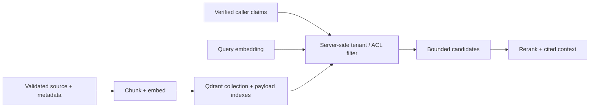

# 06 — Local Qdrant, embeddings, and payload filters

**Level:** Intermediate<br>
**Time:** 2–3 hours<br>
**Prerequisites:** [metadata and permissions](../02-metadata-permissions/README.md), [query planning and reranking](../03-query-reranking/README.md), and [evaluation](../04-evaluation/README.md)

## Outcome

Move from an inspectable local retriever to a vector-service contract: design a
collection, validate payload/provenance, ingest embeddings idempotently, apply
tenant filters inside vector search, evaluate results, and prepare for hybrid
retrieval and operational change.

## Guided notebook

Open [`qdrant_local.ipynb`](qdrant_local.ipynb). The optional adapter is
[`lab.py`](lab.py). The core
notebook runs without Docker; the final section gives an optional local Qdrant
and Sentence Transformers path.



## 1. Local environment and security boundary

Install optional dependencies and run Qdrant locally:

```bash
pip install -e '.[qdrant]'
docker compose up -d qdrant
curl http://localhost:6333/healthz
```

Qdrant’s local quickstart uses REST on `6333`, gRPC on `6334`, and a local
dashboard. A default local instance has no authentication or encryption, so it
is for trusted local development—not a publicly reachable production service.
Persist storage deliberately, keep secrets out of notebooks, and destroy test
data when finished.

## 2. Collection and payload contract

A collection defines vector size and distance; it is not merely a bucket of
text. The embedding model, chunking scheme, normalization assumptions, distance
metric, payload schema, index configuration, and corpus revision form one
versioned retrieval contract. Do not add vectors from incompatible embedding
models into one unnamed vector field.

| Payload field | Purpose | Why it matters |
| --- | --- | --- |
| `text` | retrievable chunk | context/citation rendering |
| `source`, `chunk_id` | stable provenance | audit and exact citation |
| `tenant_id`, `tags` | authorization filter inputs | cross-tenant/role isolation |
| `source_version` | freshness/reproducibility | explain and roll back results |
| optional title/date/type | ranking/filtering | query-specific relevance |

Validate required metadata at ingestion and inherit it to each chunk. The lab
fails closed when tenant, provenance, or version fields are absent.

## 3. Ingest idempotently and index filter fields

Use stable point IDs derived from source/chunk identity. Upsert batches with a
recorded corpus revision and wait for completion when a lab/test needs read-after-
write behavior. Create payload indexes for fields frequently used in filters,
such as tenant and tags. Do not put raw credentials or unrestricted sensitive
source data into payload simply because it is convenient to return with a hit.

## 4. Filter inside search, then verify again

Build a server-side `Filter` from verified caller claims; never accept a tenant
identifier chosen by the query text or model. Apply equivalent authorization to
lexical, dense, hybrid, reranking, cache, and citation paths. The adapter
requires `tenant_id` so an unfiltered search is not a convenient default.

```python
filter_contract = payload_filter("acme", required_tags={"support"})
# {"must": [{"key": "tenant_id", ...}, {"key": "tags", ...}]}
```

## 5. Evolve toward hybrid retrieval and reranking

Dense vectors improve semantic/paraphrase matching but can miss exact IDs and
rare terms. Maintain a lexical/hybrid baseline and evaluate candidate recall.
Qdrant supports dense, sparse, hybrid, multi-vector, and reranking-oriented
patterns; introduce one representation at a time and measure quality, p95,
memory, indexing time, and cost. Rerank only a bounded authorized candidate set.

## 6. Production readiness checklist

- [ ] Model/chunking/corpus/payload/index versions are traceable together.
- [ ] Tenant and ACL filters are generated from authenticated identity.
- [ ] Payload indexes match frequent filter fields and are load-tested.
- [ ] Upserts, deletes, source revocation, and embedding migrations are tested.
- [ ] Snapshot/restore, monitoring, capacity limits, and rollback procedures exist.
- [ ] Evaluation includes exact IDs, paraphrases, no-answer, freshness, and tenant-isolation slices.
- [ ] Network authentication, TLS, backups, and least-privilege service access are configured before production.

## Exercises

1. Add Acme and Globex documents with nearly identical wording. Prove an Acme
   search never returns a Globex point—even for exact text.
2. Add `effective_until` and exclude stale chunks before vector search.
3. Compare local BM25 against vectors for an error code and a paraphrase; record
   recall@K, p95 latency, and index/memory cost.
4. Version a second embedding model in a new collection and design a blue/green
   migration with a rollback test.

## References

- Qdrant, [local quickstart](https://qdrant.tech/documentation/quickstart/).
- Qdrant, [collections](https://qdrant.tech/documentation/manage-data/collections/), [filtering](https://qdrant.tech/documentation/search/filtering/), and [hybrid queries](https://qdrant.tech/documentation/search/hybrid-queries/).
- Sentence Transformers, [semantic search](https://www.sbert.net/examples/sentence_transformer/applications/semantic-search/README.html).
- OWASP, [Top 10 for LLM Applications 2025](https://owasp.org/www-project-top-10-for-large-language-model-applications/assets/PDF/OWASP-Top-10-for-LLMs-v2025.pdf) — vector/embedding weakness considerations.
